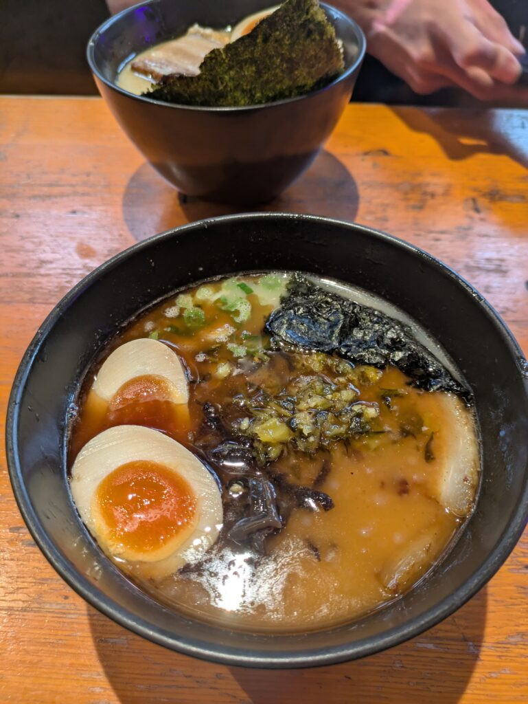
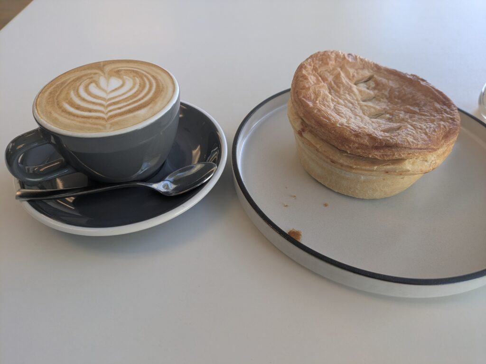
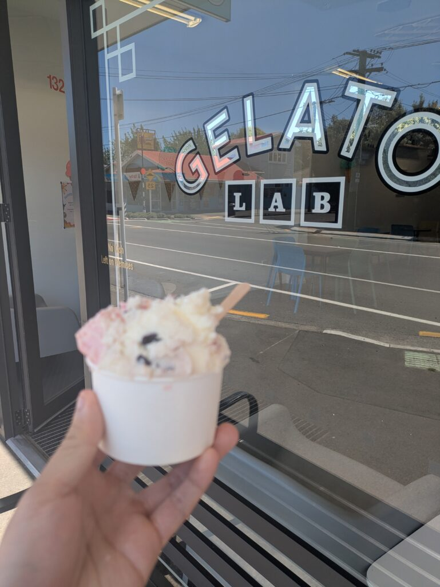

## English\_Practice

I work in peony farm so I can not play video games. I will introduce about some shops in Christchurch.

### Ramen Ria

Firstly, it is a ramen. To be honest, I wanted to eat a ramen in other shop which was closed. However, I went to this ramen shop. This called "Ramen Ria" is combined to ramen and bar literally.

I heard about its reviews from my boss and he said that noodle texture is like rubber so it is not tasty. Actually, I ate it and it is a little bad noodle, but it is good. I chose a black tonkotsu. It is inspired by Hakata and I was curious.

### Pies and Coffee

Secondly, it is Pies and Coffee. I ate snacks there. I chose steak&cheese pie and flat white. I think NZ's local pie is better than other food. There is Latte art in coffee so it was delicious visually as well.

### The Gelato Lab

Thirdly, it is The Gelato Lab. We can enjoy kind of 20 flavors there. I chose amarena and like-raspberry ice cream. Both is berry-sh ice cream, but a staff recommended me. To be honest, I wanted to eat chocolate flavor.

There is a few ice cream shop to taste except Baskin-Robbins in Japan. Nevertheless, we can taste it in New Zealand. If you are interested in some flavor, you should taste and buy them. We must not taste too much because we do not buy them.

### Pak'nsave Moorhouse

Finally, it is a supermarket. My alomost of all colleagues recommend Pak'nsave, especially Moorhouse. I feel it is bigger than other one because it is not in mall and easy to park. I guess there are more variety of goods.

I introduced like that where I went recently. When I am going to write this article, my WOF will finish updating so that I will write about it. See you later.

## 日本語版

[芍薬農園](/posts/2025/11/peony-farm-job-picking/)で働いていて特にゲームできる暇もなく働いているので、お茶濁しでChristchurch内で言ったお店を少し紹介してみようと思います。

### Ramen Ria

1つ目はラーメンですね。本来食べてみたかった御店が閉まってたので別候補として言ったお店になります。[Ramen Ria](https://www.ramenria.co.nz/)という名前でその名前の通りラーメンとバーが合わさったような店です。

この店について聞いたとき麺がゴムのような感じで美味しくないとは聞きました（笑）実際食べてみると確かに麺は微妙でしたが味自体は良かったですね。私が頼んだのはblack tonkotsuになります。博多にインスパイアされたみたいなので気になって選びました。

### Pies and Coffee

2つ目は[Pies and Coffee](https://findchch.com/places/4620-pies-and-coffee)というお店ですね。軽食がてら寄った場所になります。頼んだのはsteak&cheeseとフラットホワイトになります。ニュージーランドの地元のパイは外れが少ないので割と良いと思いますね。コーヒーもラテアートがあり、視覚的にも美味しく頂きました。

### The Gelato Lab

3つ目は[ジェラートラボ](https://www.facebook.com/TheGelatoLabNZ/)というお店です。アイスクリーム店で20種類近くの味を楽しむことができます。私が頼んだのはアマレーナとラズベリー系のアイスでした。どちらもベリー系のアイスになったのですが、店員さんがおすすめしてくれたので頂きました。チョコが食べたかったのは内緒です。

日本だとサーティーワン以外で試食できる場所は少ないかと思いますが、ニュージーランドでは試食をすることができます。気になった味があれば試してみて購入するのもよいと思います。試食のし過ぎで購入しないとかはやらないほうが良いと思います。

### Pak'nsave Moorhouse

最後にスーパーですね。職場の同僚のほとんどはPak'nsaveをお勧めしています。特にMoorhouseという場所ですね。モール内ではないので車も止めやすく大き目に感じます。そのせいか気持ち商品の種類も多い気がしますね。

といった感じで最近行った場所の紹介でした。この記事を書いているタイミングでWOFの更新が終わるので次回はそれについて書いていくと思います。ではでは。

## AI採点

以下はIELTS Writing Task 2基準（Task Achievement / Coherence & Cohesion / Lexical Resource / Grammatical Range & Accuracy）に基づく採点と詳細フィードバックです。  
全体としては内容が面白く、個人的な体験がしっかり描かれていますが、IELTS的にはエッセイとしての構成・文法精度に課題があります。

* * *

## 🧮 **IELTS採点（目安）**

| 項目 | スコア | コメント |
| --- | --- | --- |
| Task Achievement | 6.0 | 内容は具体的ですが、説明がやや日記的で論理展開に弱さがあります。読者に明確な目的や要約が見えにくいです。 |
| Coherence & Cohesion | 6.0 | “Firstly / Secondly / Finally” の構成は良いですが、文間のつながりがやや不自然（例: “However, I went to this ramen shop.”の後に理由を補足するとより自然）。 |
| Lexical Resource | 6.5 | “visually delicious”などの語彙の工夫は見られますが、誤用や直訳的表現が多いです。より自然なコロケーションを意識すると良いです。 |
| Grammatical Range & Accuracy | 5.5 | 時制・冠詞・複数形・前置詞の誤りが頻発。文のつなぎ方が単調。複文を増やすとスコア向上が見込めます。 |

**総合バンドスコア：6.0（CEFR B2相当）**

* * *

## 🔍 **文法・語彙の詳細指摘**

### ✅ 冒頭文

**原文:**

> I work in peony farm so I can not play video games. I will introduce about some shops in Christchurch.

**修正:**

> I work at a peony farm, so I don’t have much time to play video games. Instead, I’d like to introduce some shops I’ve visited in Christchurch.

**理由:**

- “work **at** a farm” が正しい前置詞。

- “can not play” は文法的には可だが、自然な英語では “don’t have time to play” の方が流暢。

- “introduce **about**” は誤り。“introduce some shops” が正しい。

* * *

### 🍜 **Ramen Ria**

**原文:**

> This called "Ramen Ria" is combined to ramen and bar literally.  
> **修正:**  
> This place, called “Ramen Ria,” is literally a combination of a ramen shop and a bar.

**理由:**

- “combined to” は誤り。“combined **with**” か “a combination of” を使う。

- “This called” は “This place, called…” が自然。

**原文:**

> Actually, I ate it and it is a little bad noodle, but it is good.  
> **修正:**  
> Actually, the noodles were a bit chewy, but the flavor was quite good.

**理由:**

- “a little bad noodle” は不自然。形容詞＋名詞の一致エラー。

- “chewy” は「ゴムのような」食感に自然な表現。

* * *

### ☕ **Pies and Coffee**

**原文:**

> There is Latte art in coffee so it was delicious visually as well.  
> **修正:**  
> The coffee had beautiful latte art, which made it visually appealing.

**理由:**

- “There is Latte art in coffee” は直訳的。

- “visually delicious” は意味は通じるが英語では使わない。→ “visually appealing” / “looked beautiful” などが自然。

* * *

### 🍨 **The Gelato Lab**

**原文:**

> Both is berry-sh ice cream, but a staff recommended me.  
> **修正:**  
> Both were berry-flavored ice creams, and a staff member recommended them to me.

**理由:**

- “is” → “were”（複数）

- “berry-sh” は造語的で誤り。“berry-flavored” が自然。

- “recommended me” は誤り。“recommended them to me” が正しい。

**原文:**

> We must not taste too much because we do not buy them.  
> **修正:**  
> You shouldn’t taste too many samples without buying anything.

**理由:**

- “must not” は強すぎる印象で日常的な注意には不自然。→ “shouldn’t” が自然。

- “we do not buy them” → “without buying anything” が滑らか。

* * *

### 🛒 **Pak’nSave Moorhouse**

**原文:**

> My alomost of all colleagues recommend Pak'nsave, especially Moorhouse.  
> **修正:**  
> Almost all of my colleagues recommend Pak’nSave, especially the one in Moorhouse.

**理由:**

- “My almost of all colleagues” は語順誤り。

- “the one in Moorhouse” が自然。

**原文:**

> I feel it is bigger than other one because it is not in mall and easy to park.  
> **修正:**  
> I feel it’s bigger than other branches because it’s not inside a mall, and parking is easy.

**理由:**

- “other one” → “other branches”（複数の店舗を想定）

- “in mall” → “inside a mall”。冠詞 “a” が必要。

* * *

### 📝 **最後のまとめ**

**原文:**

> I introduced like that where I went recently. When I am going to write this article, my WOF will finish updating so that I will write about it.  
> **修正:**  
> That’s a short introduction of the places I’ve recently visited. By the time I post this article, my WOF update will be done, so I’ll probably write about that next time.

**理由:**

- “I introduced like that” は直訳的で不自然。

- “will finish updating” → “will be done” の方が自然。

- 時制と副詞句を整理。

* * *

## 🧭 **全体的なアドバイス**

1. **冠詞 (a/the) の使用**  
    　→ “in peony farm” “in mall” “other one” などの箇所で抜けが多い。

3. **自然なコロケーション**  
    　→ “introduce about,” “delicious visually,” “recommend me” は不自然。ネイティブ表現を意識。

5. **文の構造を多様化**  
    　→ “and” や “but” で単純に繋ぐ文が多いため、**関係詞 / 分詞構文 / 接続副詞 (however, therefore)** を使うとスコア向上。

7. **日記的トーンを軽く整える**  
    　→ IELTS Writingでは「説明的・客観的」なトーンが高評価。カジュアルな部分を少し整理。

## ✍️ **Improved Version (Band 7.5–8 level)**

### Exploring Christchurch: My Favorite Spots

Since I’ve been working at a peony farm, I haven’t had much time to play video games. So instead, I decided to introduce a few of my favorite places I’ve visited in Christchurch recently.

#### 🍜 Ramen Ria

The first place is **Ramen Ria**, a ramen restaurant that’s also a bar. I originally wanted to visit another ramen shop, but it was closed, so I came here instead. I’d heard that the noodles were a bit rubbery and not so tasty, and that turned out to be somewhat true—the texture wasn’t great, but the flavor itself was really good. I ordered the **Black Tonkotsu**, which was inspired by Hakata-style ramen, so I was curious to try it.

#### ☕ Pies and Coffee

The second place is **Pies and Coffee**, where I stopped by for a light meal. I ordered a **steak and cheese pie** and a **flat white**. Local pies in New Zealand rarely disappoint, and this one was no exception. The coffee even had beautiful **latte art**, which made it not only delicious but also visually appealing.

#### 🍨 The Gelato Lab

Next is **The Gelato Lab**, an ice cream shop offering around 20 different flavors. I chose **Amarena** and **raspberry**—both berry-flavored, recommended by the staff. To be honest, I wanted to try chocolate, but I went with their suggestion.  
Unlike in Japan, where it’s uncommon to sample ice cream before buying (except maybe at Baskin Robbins), in New Zealand you can taste a few flavors first. It’s a fun experience, as long as you don’t overdo it and walk away without buying anything!

#### 🛒 Pak’nSave Moorhouse

Finally, there’s **Pak’nSave Moorhouse**, a supermarket most of my colleagues recommend. Since it’s not inside a mall, parking is easy, and the store feels more spacious. I also think they have a slightly wider range of products compared to other branches.

That’s a quick introduction to some of the places I’ve recently been to. By the time I finish writing this article, my WOF renewal should be done, so I’ll probably write about that next time. See you then!

* * *

## 💬 **評価（IELTS Writing観点）**

| 項目 | 予想スコア | コメント |
| --- | --- | --- |
| **Task Achievement** | 8.0 | 目的が明確で、読者を意識した自然な説明構成。段落展開とまとめが効果的。 |
| **Coherence & Cohesion** | 8.0 | 適切な接続詞（so instead, however, unlike, finallyなど）を使い、スムーズな流れ。 |
| **Lexical Resource** | 8.0 | “rubbery texture,” “visually appealing,” “light meal,” “walk away without buying” など自然で幅のある語彙。 |
| **Grammatical Range & Accuracy** | 7.5〜8.0 | 文構造に多様性あり（関係節、比較、付加情報句）。文法ミスなし。冠詞・時制も適切。 |

**推定バンドスコア：8.0（CEFR C1相当）**
