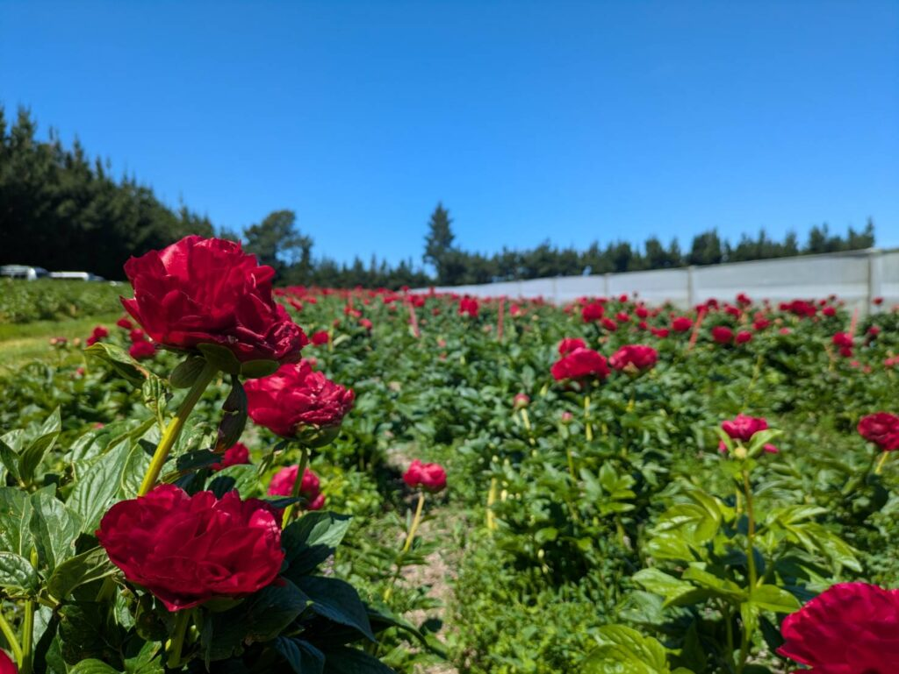

## English\_Practice

I just work picking for this week so I made much effort, maybe.

### Overall Picking

We do not have day off unless it is rainy so that I work every day. I googled about holiday and it depends on companies.

My salary is like that. I had a day off because of re-checking WOF so I received less it than other colleagues. They earned approximately $2500.

I just work picking now. I cut stem which is 60 to 65 cm. Some people carry or select flowers in warehouse like huge frige.

### Variety of peony

We hervest other variety before. For example, Red charm, Flame and Gardenia. We hervest new variety one now.

For example, Bowl of Cream, Sarah, Alexander Flemming and Nick Shaylor. The main is pink ones. According to the boss, this timing is busiest. I started at 8 a.m. and finished 8 p.m. yesterday.

It is not difficult to hervest. We should judge flower's color and soft bus so color blindness people are very hard. Moreover, I should not have missing.

### Picking environment

The hardest work is crouching while hervesting. Personaly, I enjoy hervesting mindlessly. However, if I continue to work, I have a crouching. If we carry flowers, sometimes, we should run fast. On the other hand, people in processing team do not move a lot, but they feel bored because of just moving hands.

Fortunately, I really enjoy spending time because colleagues are so kind. When I had a problem, they helped me friendly so I am really happy. My colleagues and the maneger are a little bad vibes.

I so enjoy my life even though it is hard physically. The sunny keep for a long time so that this job will finish in 2 or 3 weeks. I am going to find next job. See you later.

## 日本語版

ここ1週間はほぼ[ピッキング](https://www.auntrosie.co.nz/peony-varieties)しかやってないのでひたすら仕事をこなしていました。

### ピッキングの仕事について

このピッキングの仕事は雨の日だと休みなのでずっと晴れだと毎日仕事になります。少し調べてみたらday offの決まりは企業によるらしいので明確な決まりはないみたいです。

一応給料的にはこんな感じです。私はWOFの再登録で1日day offの日があったので少し少ないですが、他の人は大体$2500ほどもらっているみたいです。

今の仕事はひたすらピッキングの作業ですね。大体60~65cmの長さでひたすら茎を切っていく作業ですね。人によっては花を運ぶ作業や巨大な冷蔵庫のような倉庫で選別の作業ですね。

### peonyの品種

[前の時](/posts/2025/11/peony-farm-job-picking/)から少し収穫の品種が変わりました。以前はRed charmやFlame, Gardeniaなどがありました。今はその品種の収穫が終わって新しい品種に変わりました。

今だとBowl of Cream, Sarah, Alexander Flemming, Nick Shaylorですね。ピンク系の品種がメインになってきました。話によると今のタイミングが一番忙しくなるみたいです。昨日は朝8時に始まって夜の8時過ぎに終わったりしました。

収穫についてはそこまで難しくはないです。色と蕾の柔らかさで判断するのでよっぽどの色弱だと大変かもしれません。後はなるべく取りこぼしをしないことですね。

### ピッキングの環境について

大変なのは収穫をする際に中腰気味になることですね。個人的には無心でやれるので楽しいですが、ずっと続くと少し腰が痛くなったりしますね。花を運ぶにしても状況によっては走らないと行けなかったり、加工チームはあまり移動しませんがひたすら手を動かすだけで退屈らしいです。

幸いなことに同僚はとても良い人たちばかりなので楽しい日々を送れています。私に少し問題があって困ってた時も親切に助けてくれたので本当に恵まれてますね。今同僚たちはマネージャーと若干ギスギスしてたりしますが…

といった感じで身体的に大変ではありますが、中々充実した日々を送っている気がします。晴れの日が続いているので2,3週間でこの仕事も終わるかと思いますが、そろそろ次の仕事を探していこうかと思います。ではでは。

## AI採点

# **IELTS 総合評価（あなたの英文）**

### **推定バンド：5.0〜5.5**

**理由（要点）**

- **内容は明確で順序も悪くない** → Task Achievement は比較的良い

- **文法エラーが多い**（時制、冠詞、複数形、前置詞、基本構文）

- **語彙の不自然さが多い**（Google, frige, hervest, soft bus など）

- **コヒーレンス（繋ぎ）が弱い**（However, Moreover, On the other hand の使い方）

- **自然な英語ではない文が多い**

バンド8を目指す場合、文法の精度・語彙の自然さ・複文の作り方の改善が必要。

* * *

# **全文詳細フィードバック（細かく全指摘）**

## **1\. “I just work picking for this week so I made much effort, maybe.”**

- **文法**:
    - _just work picking_ → ✗ 不自然
    
    - _I made much effort_ → ✗ 不自然（much effort はほぼ使わない）
    
    - 文末の _maybe_ → 文の意味が曖昧で IELTS では減点

- **改善例**
    - “I’ve been doing picking almost every day this week, so I’ve been working quite hard.”

* * *

## **2\. “We do not have day off unless it is rainy so that I work every day.”**

- **構文**
    - “so that I work every day” → 因果が不自然
    
    - “have day off” → 冠詞抜け

- **改善例**
    - “We don’t get a day off unless it rains, so I’ve been working every day.”

* * *

## **3\. “I googled about holiday and it depends on companies.”**

- **語法**
    - _google about_ → ✗　“google + noun” が普通
    
    - _depends on companies_ → 冠詞

- **改善例**
    - “I googled it and found that the rules for days off depend on the company.”

* * *

## **4\. “My salary is like that.”**

✗ 完全に不自然な英語  
→ “This is roughly how much I earn.”

* * *

## **5\. “I received less it than other colleagues.”**

✗ 重大な語順エラー  
→ “I received less **than my colleagues**.”

* * *

## **6\. “Some people carry or select flowers in warehouse like huge frige.”**

- _frige_ → fridge

- 冠詞

- 語順

- like huge fridge → _a huge fridge_

- “warehouse like” → 不自然

→ “Some people carry flowers or sort them in a warehouse that is like a huge fridge.”

* * *

## **7\. “We hervest other variety before.”**

- **hervest** → harvest（スペル）

- **時制** → _have harvested_

- **variety** → 複数形

- “other variety before” → 不自然

→ “We harvested other varieties before.”

* * *

## **8\. “We hervest new variety one now.”**

✗ 不自然  
→ “We are harvesting new varieties now.”

* * *

## **9\. “The main is pink ones.”**

→ “Most of the current varieties are pink.”

* * *

## **10\. “It is not difficult to hervest.”**

✗ スペル  
→ “Harvesting itself is not very difficult.”

* * *

## **11\. “We should judge flower's color and soft bus so color blindness people are very hard.”**

- “soft bus” → 誤訳（＝蕾）
    - 正確には **bud**

- “color blindness people” → 形容の順番が逆（IELTSで減点）

- “are very hard” → 意味不明

→ “We judge the flowers by their colour and the softness of the buds, so it can be difficult for people with colour blindness.”

* * *

## **12\. “Moreover, I should not have missing.”**

✗ 完全に不自然

→ “We also try not to miss any flowers when picking.”

* * *

## **13\. “Personaly, I enjoy hervesting mindlessly.”**

- personally（スペル）

- mindlessly → 語彙はOKだが文脈に注意  
    → “Personally, I enjoy the repetitive nature of the work.”

* * *

## **14\. “However, if I continue to work, I have a crouching.”**

✗ 意味不明  
→ “However, staying bent over for long periods makes my lower back hurt.”

* * *

## **15\. “they feel bored because of just moving hands.”**

✗ 少し不自然  
→ “they often feel bored because their job is repetitive hand work.”

* * *

## **16\. “My colleagues and the maneger are a little bad vibes.”**

- manager（スペル）

- bad vibes → カジュアルすぎる（IELTS減点）

→ “There is a bit of tension between the colleagues and the manager.”

* * *

## **17\. “The sunny keep for a long time so that this job will finish in 2 or 3 weeks.”**

- sunny keep → 不自然

- 時制

→ “Since the sunny weather is continuing, the job will probably finish in two or three weeks.”

* * *

# **改善済みモデル回答（バンド7.5相当）**

あなたのストーリーを保ちつつ、自然でIELTS向けに仕上げました。

* * *

## **Improved Version（自然かつIELTS向け英語）**

I’ve been doing picking almost every day this week, so I’ve been working quite hard.

### Overall Picking

We don’t usually get a day off unless it rains, which means I’ve been working continuously. According to what I found online, the rules for days off depend on each company.

As for my pay, I had one day off because I needed to re-check my WOF, so I earned slightly less than others. Most of my colleagues earned around $2,500.

My current job mainly involves cutting stems that are around 60 to 65 centimeters long. Some workers carry flowers, while others sort them in a warehouse that feels like a giant fridge.

### Varieties of Peony

The varieties we harvest have changed recently. Before, we picked Red Charm, Flame, and Gardenia. Now we are harvesting new varieties such as Bowl of Cream, Sarah Bernhardt, Alexander Fleming, and Nick Shaylor. Most of them are pink. According to the boss, this is the busiest time of the season. Yesterday, for example, we worked from 8 a.m. until after 8 p.m.

Harvesting itself isn’t very difficult. We judge the flowers based on their colour and the softness of the buds, which can be challenging for people with colour blindness. The main thing is not to miss any flowers.

### Picking Environment

The hardest part is staying bent over while harvesting. I actually enjoy the repetitive nature of the work, but if I keep the same posture for too long, my lower back starts to hurt. When carrying flowers, we sometimes have to run, and the processing team barely moves at all, so they often feel bored because it’s constant hand work.

Fortunately, my colleagues are incredibly kind, and they always help me whenever I have a problem. Even though there is a bit of tension between them and the manager, I still enjoy working with them.

Although the job is physically demanding, I feel that these days are quite fulfilling. Since the sunny weather is continuing, this job will probably finish in two or three weeks. After that, I’ll start looking for my next job. See you later.

* * *

# **バンド8に向けた改善ポイント（要点）**

- **冠詞の精度向上**（a / the の使い分け）

- **複数形**（varieties / colleagues / stems など）

- **前置詞の使い分け**（in a warehouse, for two weeks, from 8 a.m.）

- **より自然な語彙の習得**（tension, demanding, continuously）

- **文同士の繋ぎ**（however, although, meanwhile の適切な使い方）

- **時制の正確さ**（現在完了・過去・進行形）
