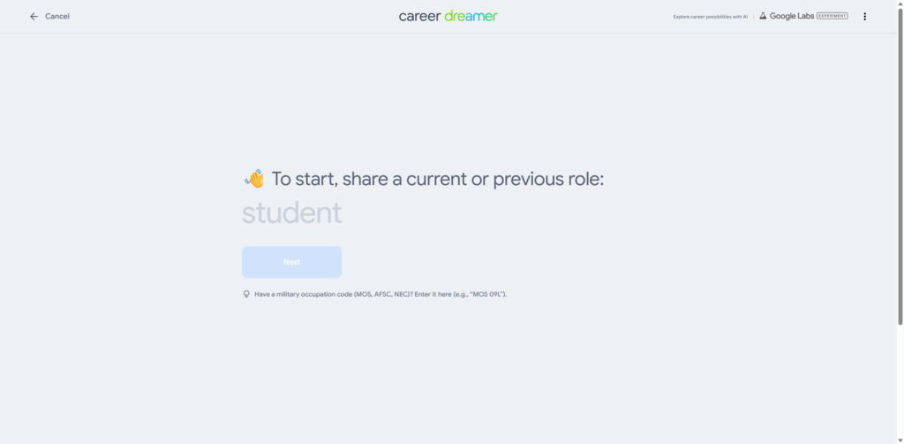
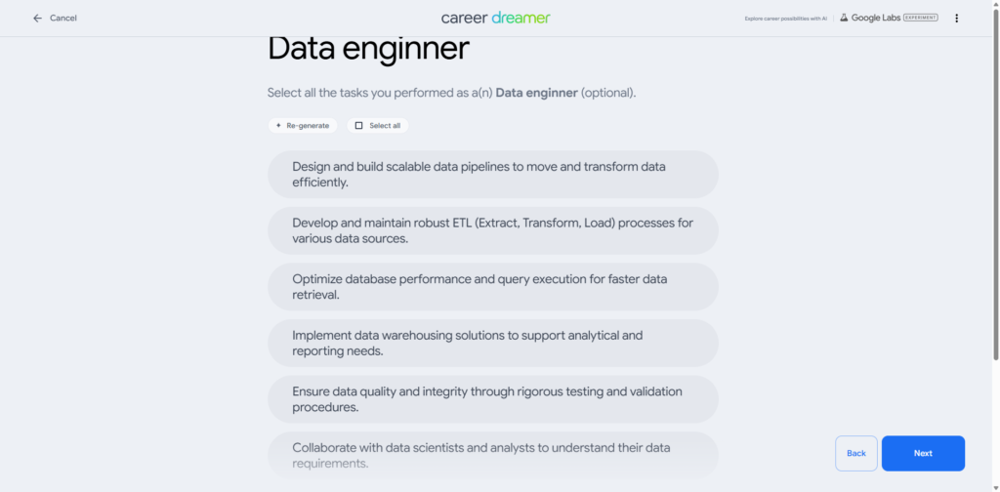
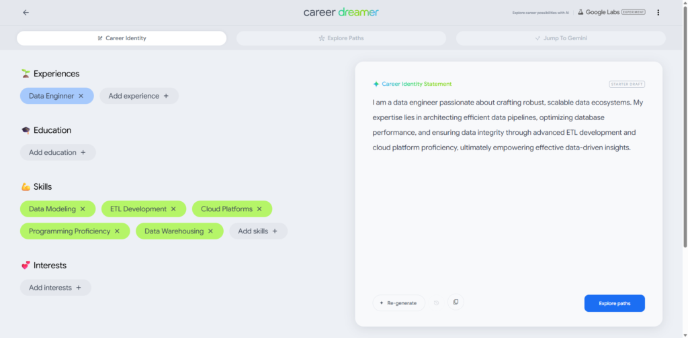
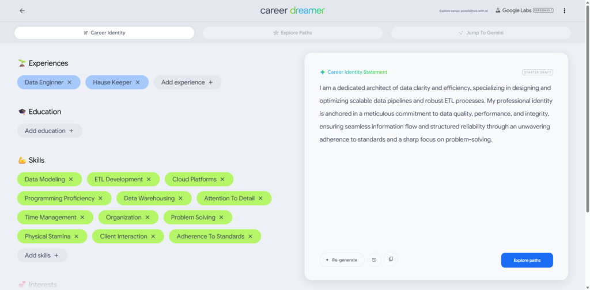
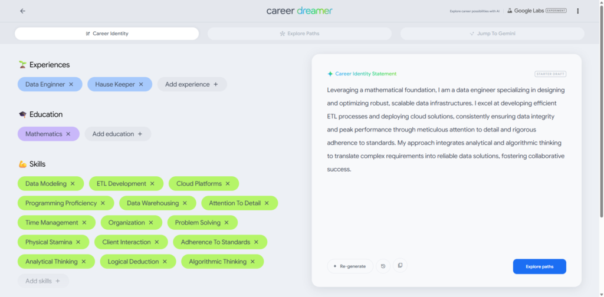
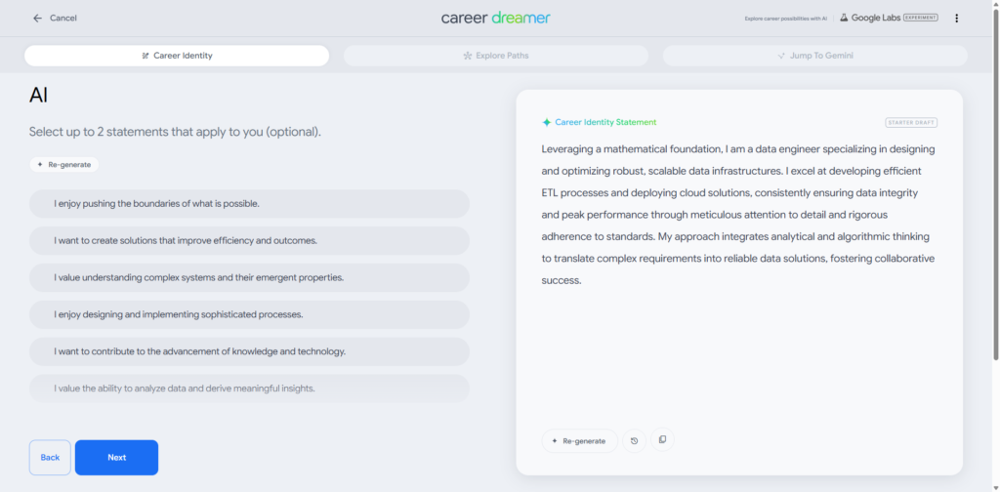
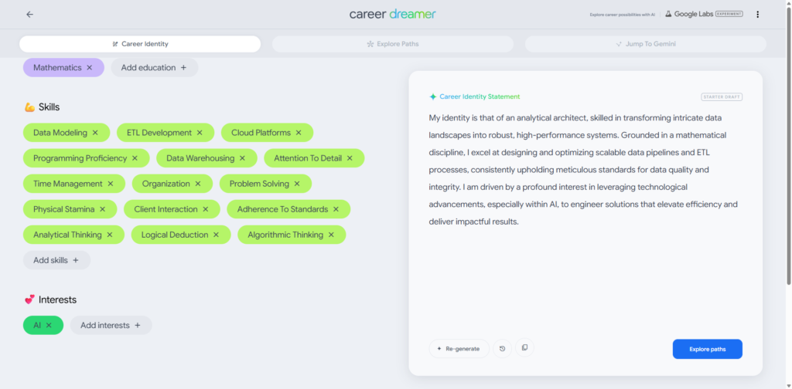
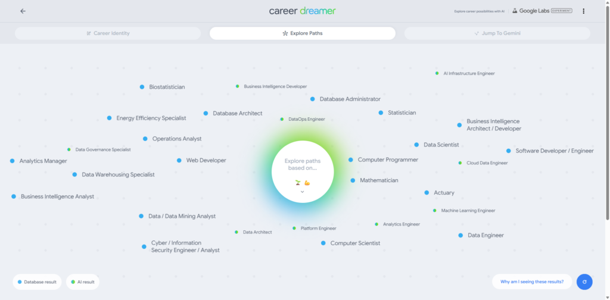
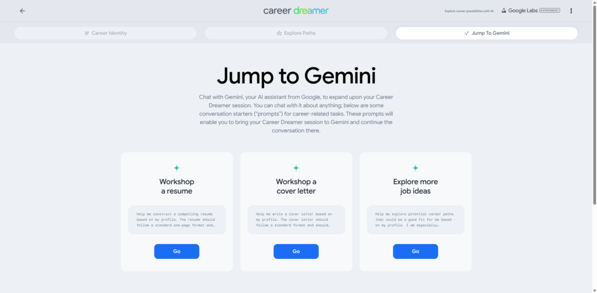

## English\_Practice

I finished learning the course of cybersecurity and I am going to introduce it which is interesting. However, it can not use Japanese so I used English with a translation.

### How to use Career Dreamer

We can start this link. Firstly, I wrote what I was doing. I do not need to fill in the organizatino and industry next. Secondly, I chose experience whish I did. Finally, I selected my skills. This is my base introduction.

### Add other job, Education and interests in Career Dreamer

I added other jobs. I am going to work as a house keeper so I filled in it. I chose as a data enginner.

I selected the education. I wrote a mathematics bachelor. After that, I chose some skilles as same as before.

Finally, I added interests. I am most keen on AI. These choices are what I want to do.

This was my final indtoduction. I was going to see other career and create a resume based on it.

### Find related jobs in Career Dreamer

I clicked "Explore Paths" next. This page illustrated my similar occupation. Nevertheless, you should except experience, education, skills and interests if you do not need them. You select your curious career.

This page also showed what they do in this position or I need some skills. When I saw it, I was curious about a aspect of job.

### Create resume with Gemini

Finally, I consulted Gemini. This page created prompting so Gemini creates a resume and cover letter and seek other idea of career based on prompting. The prompt is English, but Gemini can use Japanese. Moreover, the cover letter is written my enthusiasm and how usefull my experience. I have never seen it in Japan, but I always write it in NZ

I tried Career Dreamer like that. I am going to add and look for other jobs. My main job was IT so I wonder if I choose other industry. See you later.

## 日本語版

[Cybersecurity](/posts/2025/12/google-cybersecurity-coursera-study/)のコースが終わって最後に学んだレッスンで面白そうなものがあったので紹介してみようと思います。ちなみに日本語は使えないので英語で適宜翻訳を使いながらやることになります。

### Career Dreamerの使い方

[ここ](https://grow.google/career-dreamer/home/)から始めることができます。まずはどんなことをやっているかを書いてみましょう。次に出る組織や業界は入力しなくても大丈夫です。次は経験を聞かれるので自身がやってきた経験と照らし合わせて選択しましょう。最後にスキルを選択して終了です。これでベースのができたという感じですね。

### Career Dreamerで他の職歴や学歴、興味を追加してみる

せっかくなので他にも追加してみようと思います。次の仕事はハウスキーパーなのでそれを入れてみようと思います。data enginnerと同じような選択をしてこんな感じですね。

次は学歴ですね。私は数学科の大卒なのでそちらを入力します。後は同じようにスキルを選択します。

最後に興味があることを追加してみます。やっぱりAIが一番ですかね。ここの選択は興味があることに対してどのようなことをやりたいかということですね。

これが最終的な文になりました。これを元に他の職業の選択肢を見たり、履歴書の作成などをしていったりします。

### Career Dreamerで関連する仕事を探してみる

次はExplore Pathsを選択しましょう。ここでは似たような職業でどんなものがあるかを提示してくれます。ただ、今までの経験や学歴、スキル、興味を元に選択されているので不要であれば外したほうがいいと思います。気になった職業があれば選択してみましょう。

この職業ではどのような日常が送られているのか？必要なスキルはどんなものがあるかを提示してくれたりします。もし興味があれば気になった職業を見てみると面白い一面が見られるかもしれません。

### Geminiと相談して履歴書を作ってみる

最後にGeminiと相談ですね。プロンプトを作ってくれるのでそれを元に履歴書やカバーレター、他の職業のアイデアを探してくれます。プロンプトは英語ですがGeminiは日本語に対応してますので指示は日本語でも十分だと思います。ちなみにカバーレターは熱意や自身の経験がどう生かせるかを書くものになります。日本だとないですが海外ではよくあるみたいです。

といった感じでCareer Dreamerを試してみました。他にもいろんな経歴を試してみたりどんな仕事に活かせるか探してみるのもよいかと思います。私はITがメインだったのですが他の職業がメインだとどうなるか気になりますね。ではでは。

## AI採点

## 総合評価（推定）

**Overall Band: 5.0**

| 評価基準 | Band | 理由（要点） |
| --- | --- | --- |
| Task Response | 5 | 内容は伝わるが、目的・要点が曖昧 |
| Coherence & Cohesion | 5 | 構成はあるが接続が不自然 |
| Lexical Resource | 4.5 | 語彙の選択ミス・綴りミスが多い |
| Grammatical Range & Accuracy | 4.5 | 文法エラーが頻発し意味が曖昧 |

👉 **IELTS 8 を目指すには**：

- 文法の正確性（特にSV構造・前置詞・冠詞）

- 不自然な直訳英語の排除

- 語彙の精度  
    が大きな課題です。

* * *

## 重大な減点ポイント（優先度高）

### 1\. 文法的に成立していない文（頻発）

**例①**

> I finished learning the course of cybersecurity and I am going to introduce it which is interesting.

❌ 問題点

- 関係代名詞 _which_ の指す対象が不明

- 時制と目的が混乱

✅ 改善例

> I have finished a cybersecurity course, and I would like to introduce one lesson that I found interesting.

* * *

### 2\. 不自然・誤用の動詞表現

**例②**

> it can not use Japanese

❌ 英語として不自然（主語不明）  
✅

> Japanese cannot be used in the tool.

* * *

### 3\. 語彙の誤り・綴りミス（Lexical Resource に大きく影響）

頻出ミス（**かなり減点されます**）

| 誤り | 正 | コメント |
| --- | --- | --- |
| organizatino | organization | 綴り |
| whish | which | 綴り |
| enginner | engineer | 綴り |
| skilles | skills | 綴り |
| indtoduction | introduction | 綴り |
| except experience | exclude experience | 語彙誤用 |
| prompting | prompts / instructions | 名詞誤用 |
| usefull | useful | 綴り |

👉 **IELTS 6以上でも致命的**  
👉 **Band 7–8では許容されません**

* * *

### 4\. 不自然な直訳表現（日本語影響が強い）

**例③**

> This page illustrated my similar occupation.

❌ 不自然  
✅

> This page shows careers that are similar to mine.

* * *

**例④**

> I wrote a mathematics bachelor.

❌ 不明瞭  
✅

> I entered a bachelor's degree in mathematics.

* * *

### 5\. 冠詞・単数複数の誤り（IELTS頻出減点）

**例⑤**

> a aspect of job

❌

- _a_ → _an_

- _job_ → _the job_

✅

> an aspect of the job

* * *

## Coherence & Cohesion（構成面）

### 問題点

- 「何の文章か（レビュー？使い方説明？感想？）」が曖昧

- パラグラフの目的が弱い

- 接続語が単調（Finally / Next の多用）

### 改善例（接続語）

- Instead of / In addition / As a result / For example

- Overall / In conclusion

* * *

## 内容面（Task Response）

✔ 内容自体は十分  
❌ \*\*「なぜ役に立つか」「誰向けか」\*\*が弱い

**Band 7+ なら必要**

- This tool is useful for people who…

- One advantage of Career Dreamer is that…

* * *

## IELTS 8 を目指すための具体的改善指示

### ① 文は必ず「S + V」を明確に

- ❌ it can not use Japanese

- ✅ Japanese cannot be used

* * *

### ② 動詞は「自然なコロケーション」を使う

- ❌ do a job

- ✅ work as a housekeeper

- ❌ create prompting

- ✅ generate prompts

* * *

### ③ 語彙は「簡単でも正確」を優先

- illustrated ❌ → showed ✅

- curious ❌ → interested in ✅

* * *

### ④ 文法ミスがある文は短く分割

長文にするとミスが増えています。

## Band 7.5 相当・全面リライト英文

### Introduction

I recently completed a cybersecurity course, and in the final lesson, I encountered an interesting tool called **Career Dreamer**. Since the tool does not support Japanese, I used it in English with the help of translation tools.

* * *

### How to Use Career Dreamer

To begin, users can access Career Dreamer through the provided link. The first step is to describe what you are currently doing. It is not necessary to fill in the organization or industry sections, as these are optional. Next, you are asked to select your past experiences based on what you have done. Finally, you choose relevant skills. After completing these steps, a basic career profile is created.

* * *

### Adding Work Experience, Education, and Interests

To make the profile more detailed, I added additional information. Since I am planning to work as a housekeeper, I included this role in my work experience. I also selected options similar to those used for a data engineer position.

Regarding education, I entered my background as a bachelor’s degree graduate in mathematics. After that, I selected relevant skills in the same way as before.

Lastly, I added my interests. Among them, artificial intelligence was my primary focus. This section allows users to specify what they would like to do based on their interests.

Once all the information was entered, the final profile was completed. Using this profile, users can explore other career options and even create a résumé.

* * *

### Exploring Related Career Paths

Next, I selected the “Explore Paths” option. This feature suggests careers that are similar to the user’s background. Since these suggestions are based on experience, education, skills, and interests, unnecessary options can be removed if they are not relevant.

For each suggested career, the platform explains what daily tasks are involved and what skills are required. Exploring these roles can provide new insights and help users discover aspects of jobs they may not have previously considered.

* * *

### Creating a Résumé with Gemini

Finally, I used Gemini to assist with résumé creation. Career Dreamer generates prompts that Gemini uses to create résumés, cover letters, and even alternative career ideas. Although the prompts are written in English, Gemini supports Japanese, so instructions can be given in Japanese if needed.

A cover letter, in particular, focuses on expressing motivation and explaining how past experience can be applied to a new role. While this is not commonly required in Japan, it is widely used overseas, including in New Zealand.

* * *

### Conclusion

Overall, trying Career Dreamer was a valuable experience. By experimenting with different backgrounds, users can explore how their skills and interests may apply to various careers. Although my main background is in IT, I am curious to see how the results would change if I focused on a different industry.

* * *

## 最終評価（この英文）

- **推定 Band：7.5**

- 文法ミス：ほぼなし

- 語彙：正確・自然

- 構成：明確

- 日本語的直訳：解消済み

次におすすめなのは👇  
1️⃣ **この英文を元に自分で再現できるか練習（Writing強化）**  
2️⃣ **Task 2 用に「意見文」に書き換える練習**
