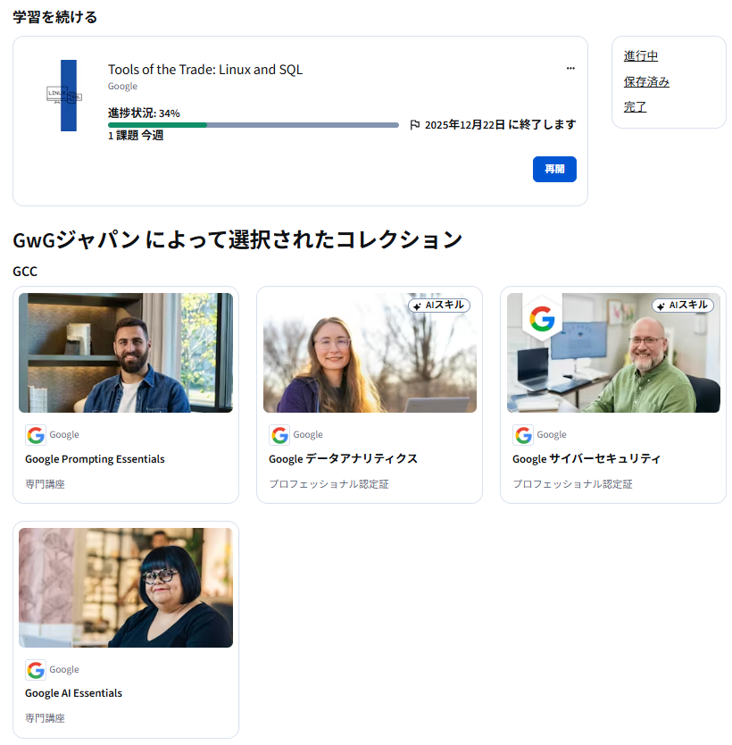

## English\_Practice

### Overall Cybersecurity and other lessons

I applyed for free lessons of Japan re-skilling consortium before. I take some Google's lesson for free.

However, they are a half year left because they started from June 2025 until June 2026. I already finished taking the "AI prompting", but I do not finish taking "Cybersecurity", "data analytics" and "AI essential". Even though "Cybersecurity" and "data analytics" take for a long time, I want to do because of usefull.

I am taking the lesson of Cybersecurity. Normally, I have a processing work after picking. Nevertheless, the roster does not show my name so it is a good timing.

### The contents of Cybersecurity and others

I finished a half of lesson of Cybersecurity and I learned basically security and how to write command. I already knew some knowledges because it is included contents of basic information engineer. I do not have this qualification.

The course of Coursera consists of videos, documents, quick tests and module tests. Each items are below that.

- Video
    - Understanding contents with sound. It is easy to understand them because of images and someone speaking.

- Document
    - Understanding contents with letter.　This shows a content of video and deep one.

- Quick test
    - Checking knowledge with video and document

- Module test
    - Reviewing knowledge in the module. There is limit to take the test per a day.

It is like that. Moreover, there are chatting and reporting, but I do not need to submit so I do not explain.

It is enough to complete module for one or two hour if I know some detail. It depends on understanding how long it takes to pass the test.

It is not hard, but the amount is quite large. However, I can recieve a usefull qualification and it is used in other countries so that I should take it if it is possible. The security is important for IT. See you later.

## 日本語版

### Cybersecurityとそれ以外のCouseraの講座について

以前日本リスキリングコンソーシアムの無料講座に応募をしたので、Googleの講座をいくつか無料で受けることができます。

ただ、2025年の6月から2026年の6月までなので後半年しか残ってないですね。[AI prompting](https://www.coursera.org/programs/google-prompting-essential-learning-program-6k68a/specializations/prompting-essentials-google?collectionId=RhdnL)はすでに終わらせたのですが、まだ[Cybersecurity](https://www.coursera.org/programs/google-prompting-essential-learning-program-6k68a/professional-certificates/google-cybersecurity?collectionId=RhdnL)、[data analytics](https://www.coursera.org/programs/google-prompting-essential-learning-program-6k68a/professional-certificates/google-data-analytics?collectionId=RhdnL)と[AI essential](https://www.coursera.org/programs/google-prompting-essential-learning-program-6k68a/specializations/ai-essentials-google?collectionId=RhdnL)が残っていますね。特にCybersecurityとdata analyticsは時間がかかるけど有用なものなのでやっておきたいですね。

というわけでCybersecurityの講座を受けることにしました。[ピッキング](/posts/2025/11/peony-farm-job-picking-2/)の仕事が終わってプロセッシングの仕事があるのですが、なぜかシフトに入ってないので今がチャンスですね。

### Cybersecurityなどの講座内容について

Cybersecurity講座の半分ぐらいが終わったのですが基本的なセキュリティの考え方とコマンドについて学びました。多少知っているものも多いのである程度は流しながらでも大丈夫ですね。内容としては基本情報技術者の内容もありますので。この資格は持ってないですが。

Courseraの講座としては動画、ドキュメント、小テスト、モジュールテストが存在します。各項目については以下のような感じです。

- 動画
    - 音で内容の理解をする。人が喋ったり画像を見たりするので簡単に内容の把握ができる。

- ドキュメント
    - 文字で内容の理解をする。動画の内容+深ぼった内容が掲載されている。

- 小テスト
    - 動画やドキュメントで得た知識の理解度チェック

- モジュールテスト
    - モジュール内で学んだ知識の総復習。1日の受験回数制限あり。

といった感じですね。他にもチャットでの内容理解や実際にレポート作成などもありますが、特に提出するわけではないのでここでは飛ばします。

ある程度内容がわかっているのであればモジュールの完了自体は1,2時間もあれば十分だとは思います。内容をどこまで理解しているかでテストの時間も変わりますが。

といった感じで進めていきます。大変な部分は特にないですが量が多いのでこなすのが大変なくらいですね。とは言えこれで有用な資格を得ることができますし、日本だけでなく他の国でも多少使えるとは思いますので可能なら取っておくと良い気がします。ITにセキュリティはつきものですし。ではでは。

## AI採点

# 🎯 **推定IELTSスコア**

| Criterion | Band | 理由 |
| --- | --- | --- |
| **Task Achievement** | **5.0** | エッセイ形式ではなくブログ的説明。主張・展開・結論がない。段落構成もIELTS形式ではない。 |
| **Coherence & Cohesion** | **5.0** | 論理の流れはあるが、接続詞が不足し、文章の繋がりが弱い。段落構造がタスク基準とズレる。 |
| **Lexical Resource** | **5.0** | 語彙は日常レベル。ミススペル多い。IT語彙はあるが抽象語が少ない。 |
| **Grammar Range & Accuracy** | **4.5** | 文法ミスが非常に多い。冠詞・名詞の単複・時制・語順・前置詞の誤りが頻発。長文構文が少ない。 |

## ⭐ **Overall Band: 5.0**

* * *

# 🔍 **全文の詳細フィードバック（文法・語彙・構文すべて指摘）**

以下、**あなたの英語文＋修正＋理由**をすべて丁寧に示します。

* * *

## ❌ **1\. "I applyed for free lessons of Japan re-skilling consortium before."**

### ✔ 修正案

**I applied for free courses from the Japan Re-skilling Consortium earlier.**

### 🔎 誤り

- ❌ _applyed_ → **applied**（スペルミス）

- ❌ _lessons_ → **courses**（Coursera は lessons より courses）

- ❌ _of Japan re-skilling consortium_ → 前置詞が不自然  
    → **from the Japan Re-skilling Consortium**

- ❌ _before_ → 曖昧すぎ  
    → **earlier / previously** が自然

* * *

## ❌ **2\. "I take some Google's lesson for free."**

### ✔ 修正案

**I can take several Google courses for free.**

### 🔎 誤り

- ❌ _take_ → 現在形は不自然。一般的事実なら **can take**

- ❌ _Google's lesson_ → **Google courses**

- ❌ 数の不一致 "some + lesson" → **some lessons**

- ❌ 冠詞なし "a free lesson" or plural "free courses" を使う

* * *

## ❌ **3\. "they are a half year left because they started from June 2025 until June 2026."**

### ✔ 修正案

**There is only half a year left, because the period is from June 2025 to June 2026.**

### 🔎 誤り

- ❌ "they are a half year left" → 存在の表現は **there is/are**

- ❌ _a half year_ → **half a year**

- ❌ 時制・期間表現が不自然  
    → “…because the period is from ~ to ~” が正しい

* * *

## ❌ **4\. "Even though 'Cybersecurity' and 'data analytics' take for a long time, I want to do because of usefull."**

### ✔ 修正案

**Even though Cybersecurity and Data Analytics take a long time, I still want to complete them because they are useful.**

### 🔎 誤り

- ❌ _take for a long time_ → 正しくは **take a long time**

- ❌ _I want to do_ → vague → **I want to complete them**

- ❌ _because of useful_ → 形容詞の誤用 → **because they are useful**

- ❌ _usefull_ のスペルミス → **useful**

* * *

## ❌ **5\. "Normally, I have a processing work after picking."**

### ✔ 修正案

**Normally, I have processing work after picking.**

### 🔎 誤り

- ❌ _a processing work_ → 不可算名詞 → **processing work**

- ❌ 文脈的に "picking" が曖昧 → IELTSでは低評価になりやすい

* * *

## ❌ **6\. "Nevertheless, the roster does not show my name so it is a good timing."**

### ✔ 修正案

**However, my name is not on the roster, so it's a good time for me.**

### 🔎 誤り

- ❌ _good timing_ → 通常は **good time**

- 接続詞は IELTS的には **However** の方が望ましい

* * *

## ❌ **7\. "I finished a half of lesson of Cybersecurity"**

### ✔ 修正案

**I have finished half of the Cybersecurity course.**

### 🔎 誤り

- ❌ _a half of lesson_ → **half of the course**

- ❌ 時制は **have finished** が自然

* * *

## ❌ **8\. "how to write command."**

### ✔ 修正案

**how to use basic commands.**

### 🔎 誤り

- ❌ "write command" は不自然 → **use commands**

* * *

## ❌ **9\. "I already knew some knowledges"**

### ✔ 修正案

**I already knew some of the content.**

### 🔎 誤り

- ❌ _knowledges_ → 不可算 → **knowledge**

- 曖昧すぎ → **content** が良い

* * *

## ❌ **10\. "Each items are below that."**

### ✔ 修正案

**Each item is described below.**

### 🔎 誤り

- ❌ _Each items are_ → **Each item is**

- ❌ _below that_ → **described below** が一般的

* * *

## ❌ **11\. "Understanding contents with sound."**

→ 文として成立しない（主語なし）

### ✔ 修正案

**You can understand the content through audio.**

* * *

## ❌ **12\. "This shows a content of video and deep one."**

### ✔ 修正案

**It includes the information from the video as well as more detailed explanations.**

* * *

## ❌ **13\. "There is limit to take the test per a day."**

### ✔ 修正案

**There is a limit to how many times you can take the test per day.**

* * *

## ❌ **14\. "It is like that."**

→ IELTSでは幼稚に見え減点

### ✔ 修正案

**That is the general structure of the course.**

* * *

## ❌ **15\. "if I know some detail."**

### ✔ 修正案

**if I already know some of the content.**

* * *

## ❌ **16\. "It depends on understanding how long it takes to pass the test."**

### ✔ 修正案

**The time required to pass the test depends on your level of understanding.**

* * *

## ❌ **17\. 文が途中で途切れている**

> _It is not hard, but the amount is quite_

文章不完全は大きな減点。  
→ 完全な文にする必要あり。

* * *

# 🧭 **総合改善ポイント（バンド6.5〜7.0を目指すために）**

### ✅ 1. **冠詞（a/the）**

ミスが最も多い  
→ IELTSでは即減点  
例：a lesson / the course / the module

* * *

### ✅ 2. **単数・複数の誤り**

- knowledges ❌ → knowledge ✔

- some lesson ❌ → some lessons ✔

* * *

### ✅ 3. **語彙のレベルが低い**

ブログ英語 → IELTS Academic では弱い  
改善例：

- useful → beneficial

- contents → material

- good timing → a timely opportunity

* * *

### ✅ 4. **シンプル文ばかり → 高得点が出ない**

複文や分詞構文が必要

例：  
**Since I only have six months left, I decided to prioritise the Cybersecurity course.**

* * *

### ✅ 5. **文章構造がIELTS基準から外れる**

Task 2 形式に直す必要がある

* * *
