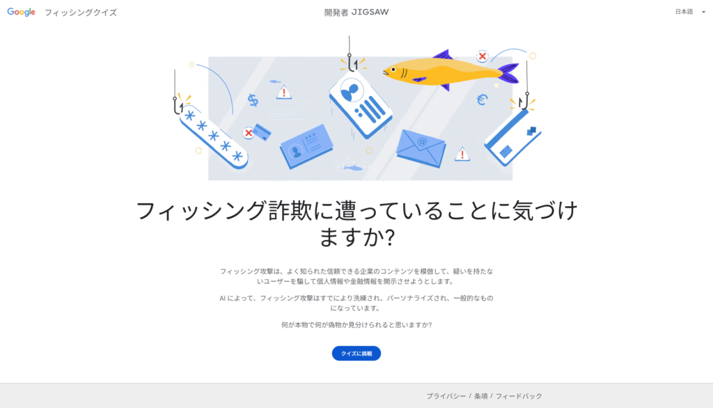
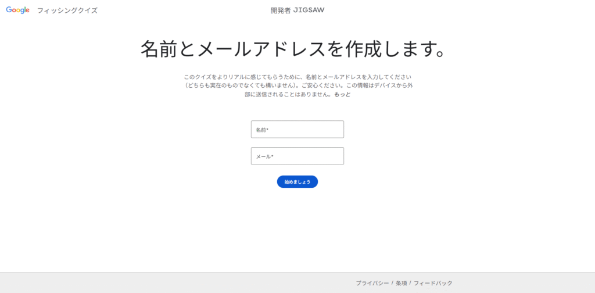
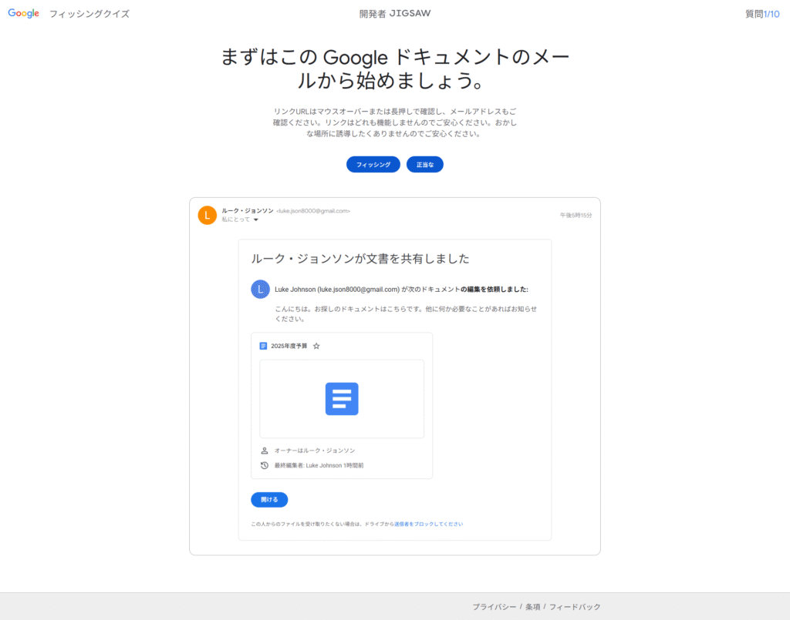
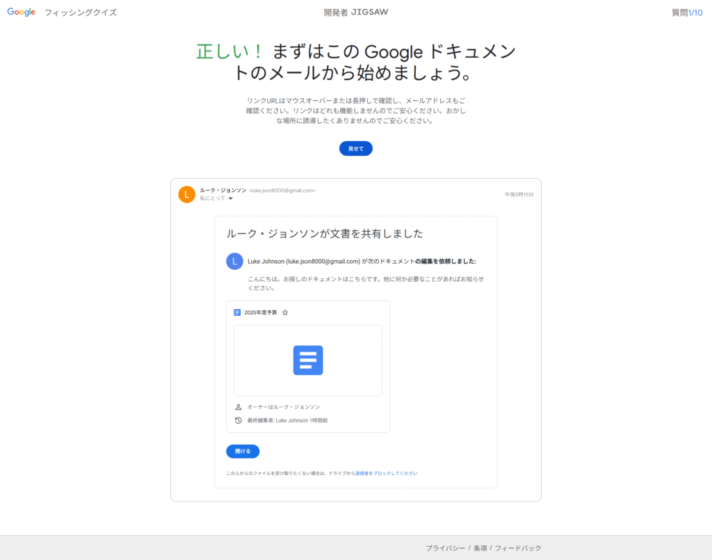
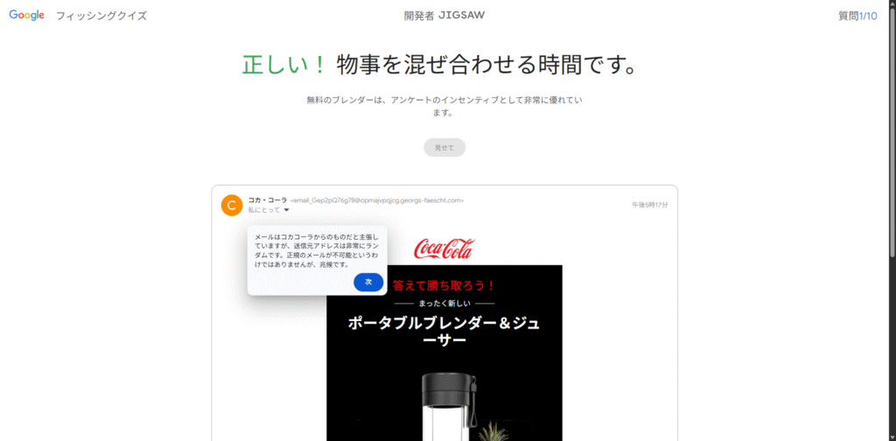
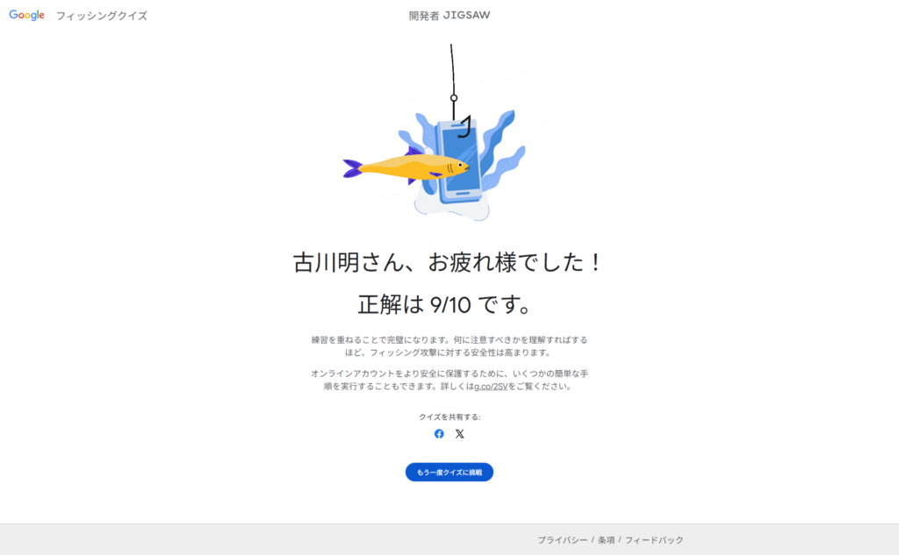

## English\_Practice

I am learning cybersecurity in Coursera and I knew about phishing scams. I also understand malware and ransomware. Moreover, I will introduce the quiz of phishing scams by Google.

### The link of quiz of phising scams

The link is this. It is japanese one but we can use English one also.

I filled in my name and mail address. I did not have to write my name and mail address. It is no problem that you use your real one. They were just used on view.

### The quiz of phising scams

There were two options which are correct or phising mail. In addition, Links did not work. However, I judged they were phising or not so that I moused over on the like sometimes.

When it is correct, the view showed green correct. In Japanese one, the number of right side questions were not changed from 1 per 10, but I did not care about that.

Therefore, If you wonder what is incorrect, you can make sure.

Finally, my correct number wes 9 per 10. I was tricked a question. I guess it was not wrong whenI checked a mail address, sentence and link.

This site is like that. I have never been scamed, but I wonder if I woluld use mail in a company. I keep studying the cybersecurity. There are still some interestiong links. See you later.

## 日本語版

Courseraにある[サイバーセキュリティ](/posts/2025/12/google-cybersecurity-coursera-study/)を学んでいるのですがそこでフィッシング詐欺についての話がありました。もちろんマルウェアやランサムウェアなどもありましたが、Googleが出してるフィッシング詐欺のクイズがあったので紹介してみようと思います。

### フィッシング詐欺クイズのリンク

リンクは[こちら](https://phishingquiz.withgoogle.com/?hl=ja)からですね。日本語版ですが英語版でも楽しむことはできます。

名前とメールアドレスを入力します。こちらは実際の名前やアドレスじゃなくても大丈夫みたいです。もちろん本物を使っても問題ないです。画面の表示に使われるだけですので。

### フィッシング詐欺のクイズ

始まると2択が出てきます。フィッシングか正しいメールかですね。リンクは特に遷移するわけではないので問題ありません。ただ、フィッシングかどうかの判定に使うこともあるので、マウスをリンクの上に載せて確認することもあると思います。

正しければ緑で正解と出ます。日本語版だと右側の質問が1/10から変わらなかったのですが気にせず先に進んでいきましょう。

一応どこが間違っているか正しいのかを確認できますので気になったのであれば確認すると良いと思います。

私は最終的に9/10の正解数でした。1問だけ引っかかりましたが他は特に問題なかったですね。メールアドレスの確認や文章、リンクをよく見れば間違えることは少ないかと思います。

といった感じで実際にありそうなフィッシング詐欺をクイズ形式で回答するサイトでした。引っかかったことはないですが、会社で頻繁にメールを使うとこんな感じのメールが届くのかなと感じました。引き続きサイバーセキュリティの勉強を進めていきたいと思います。面白そうなリンクもまだありましたし。ではでは。

## AI採点

## 📊 **IELTS 推定評価**

| 評価項目 | 推定スコア | コメント |
| --- | --- | --- |
| Task Response | **5.0** | 内容は説明できているが、文章の目的が曖昧で主張・展開不足。段落ごとの論理的なつながりが弱い。 |
| Coherence & Cohesion | **5.0** | 接続詞不足、アイデア展開が単調。段落構成はあるが論理の流れが弱い。 |
| Lexical Resource | **5.5** | 語彙は基礎中心。重複が多く、より高度な表現が使える箇所で平易な語彙にとどまっている。タイポ・スペルミス多数。 |
| Grammatical Range & Accuracy | **5.0** | 文法ミスが頻発し、自然でない表現も多い。単文の並列が多く複雑構文が少ない。 |

### 🔥 **総合推定スコア：5.0〜5.5**

* * *

# ❗減点対象となる主な問題点（全て指摘）

## ① 文法・語彙の誤り

該当箇所と**正しい例**を示します。

| 誤り | 修正例 | 指摘内容 |
| --- | --- | --- |
| I am learning cybersecurity **in Coursera** | on Coursera / through Coursera | on が正しい前置詞 |
| and I **knew** about phishing scams | and I learned / came across... | knew は過去の知識に適していない |
| malware and ransomware. Moreover, I will introduce… | …ransomware. **In addition**, I would like to introduce… | 文脈に合う接続詞ではない |
| The link of quiz of phishing scams | **A phishing-quiz by Google** / **Google’s phishing quiz** | 冗長・不自然・語順誤り |
| It is japanese one but we can use English one also. | It is available in Japanese, and there's also an English version. | one の多用・自然さに欠ける |
| I filled in my name and mail address. | I entered my name and email address. | mail address → email address が自然 |
| It is no problem that you use your real one. | You may use your real information if you prefer. | 文型不自然・oneが曖昧 |
| I judged they were phising or not so that I moused over… | I checked whether the email was phishing by hovering over the link. | phising→phishing / moused over 不自然 |
| my correct number wes 9 per 10 | My score was 9 out of 10. | wes→was / per 10 不自然 |
| I was tricked a question. | One question misled me. / I got one question wrong. | 文型誤り |
| I woluld use mail in a company | I _would_ receive such emails at work. | typo & 意味が曖昧 |
| There are still some interestiong links. | There are still some interesting links left to try. | interestiongスペル誤り・表現が弱い |

> 誤字（wes, woluld, phising など）が多数 → **IELTSでは大きく減点**

* * *

## ② 論理展開の弱さ（Coherence & Cohesion）

- 接続詞が少なく、文章が _列挙_ になっている

- 各段落が「紹介 → 説明 → 感想」だが、因果や論点展開が弱い

- 結論のメッセージ性が曖昧

改善例：

> Instead of only describing the quiz, you could add  
> ・why it is useful  
> ・what you learned from it  
> ・companies should be cautious because…

* * *

## ③ 語彙がシンプル・繰り返しが多い

phishing scam / quiz / link / correct… が繰り返し多用  
→ **Synonyms・Paraphrase** を入れるとスコアUP

例）

| 代替表現 |
| --- |
| fraudulent email attempt |
| malicious message |
| accuracy rate instead of "correct number" |
| hover to preview the URL instead of "moused over" |

* * *

# 📝 IELTSバンド7を目指す改善例（短い添削版）

> I have been studying cybersecurity through Coursera, and recently I encountered Google's phishing-email quiz. It presents ten realistic email samples, and users decide whether each one is legitimate or malicious.
> 
> Before taking the quiz, you may enter your name and email address, though real information is not required. During the test, links cannot be opened, but hovering over them allows you to inspect the URL — a key technique for identifying phishing attempts.
> 
> I scored nine out of ten. Only one message misled me, which made me realise how convincing fraudulent emails can be in real workplaces. The quiz helped me understand not only phishing patterns but also the importance of verifying senders and URLs carefully.
> 
> As I continue studying cybersecurity, I hope to explore more resources like this, as interactive learning makes security awareness much more engaging.
