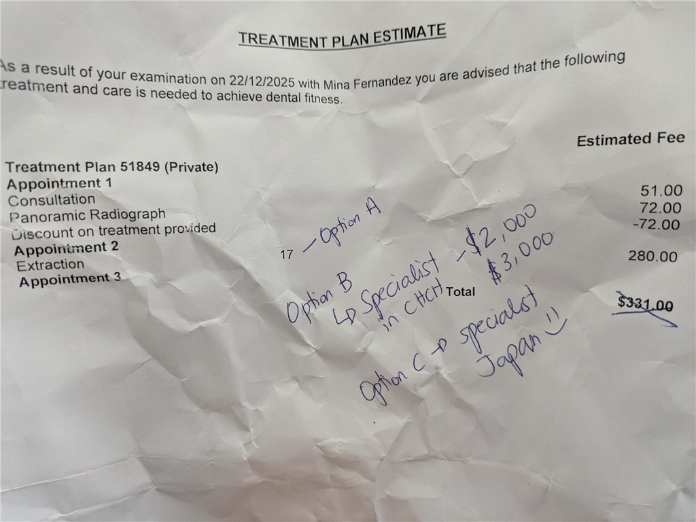

## English\_Practice

I have had a teeth problem when I was a university student and my teeth were getting worse so I went to the dentist in New Zealand.

I went to Stafford dental in Timaru below Christchurch. There is no dentist near Tekapo so I went there.

### The counsultaion fee of dentist

It is so expensive to be investigated my teeth as you know because there is no insurance. It is difficult to go to the dentist and clean my teeth,

It cost $50 as same as ¥4500. If I clean my teeth or remove a cavity, it cost a couple of hundred dollars or more. We should be careful our teeth exactly.

The top person of my company is Taiwanese. He said it cost $27 when he fix his teeth in Taiwan. It is better than Japan.

### The counsultation contents of dentist

I wrote a questionnaire as same as Japan and was taken with X-Ray. This showed general questions. For example, disease and allergic. I was taken by moving camera around me.

After that, the dentist descriped my sick. I need to fix my coverd teeth including nerves because of swelling. Moreover, they can not recover it so I have to go to the speciallist in Christchurch.

Additionally, I need to book appointment there on February or March. My teeth may be getting worse. I may not be able to cure my theeth when I am checked them.

### How to fix by dentist

I have another option which I take out my theeth. It cost $300 so it is cheap, but I think it is bad idea. Therefore, I am going back to Japan temporarily. Nevertheless, I stay there on first February.

I do not use my pained teeth if it is possible. I should go to the dentist again because I can recieve antibiotic and pain relief.

I do not use complexed English there. It is no problem if you have a listening skill. In addition, the dentist is Asian so it is easy to listen to her speaking. See you later.

## 日本語版

大学生のころから歯に関する問題があって久しぶりに悪化したので歯医者に行くことになりました。しかもニュージーランドで。

私が行った場所は[stafford dental](https://stafforddental.co.nz/)という場所でTimaruというChristchurchの下の方の街にあります。Tekapoには歯医者がないので近場の歯医者はこの辺になりがちですね。

### 歯医者の診察金額

ご存じの通り海外の歯医者は基本的に高くつきます。日本のように保険などはほぼないですからね。そういった意味では気軽に歯を見てもらったり、きれいにしてもらうのはハードルが高いかもしれません。

金額はざっくり$50で日本円だと4500円くらいですね。そこから歯をきれいにしたり虫歯を除去したりすると更に数百ドルかかると思います。そういった意味でなるべく歯を大事にするよう気を使う必要がある感じですね。

私の会社のトップが台湾の人だったと思います。彼が香港で歯を直すと$27と言ってましたね。日本よりももう少しやすく見てくれると思うといいものですね。

### 歯医者の診察内容

日本の診察と同じように最初は問診票を書いてレントゲンの写真となります。問診票は一般的な内容で病気やアレルギーがあるかを聞いてました。レントゲンでは日本のやり方は覚えてないですが私の周りをカメラのようなものが周って撮ってるみたいでした。

それが終わったら症状の説明がありました。どうやら昔カバーをした部分が腫れてしまって神経周りも含めて治す必要があるみたいです。さらにそこの人たちでは治すことが出来ずChristchurchの専門家に行かないと治すことができないみたいです。ここでの費用は$2000-3000のようです。

https://stafforddental.co.nz/

更に残念なことにこの専門家の人の予約をする場合はおそらく2月3月くらいになりそうというところですね。この場合徐々に歯が悪化していく可能性があります。見てもらうときには治すことができない状況になるかもしれないということですね。

### 歯医者での対症療法

他の選択肢としては歯を抜くというのもありました。$300で住むので安い方ではありますが、今後を考えるとこれはなしですね。というわけで一時的に日本に帰宅することになりました。とは言っても2月の初週の間だけですが。

それまではなるべく痛い部分の歯を使わず、1月のでもう一度見てもらったほうが良いかもしれませんね。抗生剤や痛み止めをもらえると思いますので。

ちなみに英語に関しては複雑な英語はそれほど使われなかったです。人と会話できる程度のリスニング力があれば特に問題はなかったですね。歯科医の方もアジア系の人だったので聞き取りやすかったですし。ではでは。

## AI採点

## 🔴 総合評価（推定バンドスコア）

**Overall Band：5.0 前後**

| 評価項目 | 推定Band | 理由（要約） |
| --- | --- | --- |
| Task Response | 6.0 | 内容は伝わるが不正確・不自然 |
| Coherence & Cohesion | 5.0 | 見出し・段落はあるが論理が弱い |
| Lexical Resource | 4.5 | 語彙ミス・不自然表現が非常に多い |
| Grammatical Range & Accuracy | 4.0 | 文法エラーが頻発・基礎レベル |

👉 **IELTS 8には大きな差**があります。特に  
**語彙の正確性・文法の安定性**が致命的な減点要因です。

* * *

## ❌ 全体的に大きな減点ポイント（重要）

### 1\. **英語として不自然・誤用が多すぎる**

- 直訳思考が強く、日本語構文を英語にそのまま移している

- IELTSでは「意味が分かる」だけでは不十分

### 2\. **名詞の単数・複数、冠詞の壊滅**

- _teeth / tooth_

- _a dentist / the dentist_

- _my teeth / my tooth_  
    👉 IELTSでは**致命的な減点対象**

### 3\. **動詞の時制・形が不安定**

- 過去・現在が混在

- 動詞の原形・過去形の誤りが多い

* * *

## 🔍 文ごとの詳細フィードバック（全指摘）

### ❌ 文1

> I have had a teeth problem when I was a university student and my teeth were getting worse so I went to the dentist in New Zealand.

**問題点**

- ❌ _a teeth problem_ → **a dental problem / teeth problems**

- ❌ 時制が混在（have had / was / were getting）

- ❌ when の使い方が不自然

**改善例**  
✅ _I have had dental problems since I was a university student, and recently my condition worsened, so I went to a dentist in New Zealand._

* * *

### ❌ 文2

> I went to Stafford dental in Timaru below Christchurch.

**問題点**

- ❌ 固有名詞は大文字：_Stafford Dental_

- ❌ _below Christchurch_ → 地理的に不自然

**改善**  
✅ _I visited Stafford Dental in Timaru, a town south of Christchurch._

* * *

### ❌ 見出し

> The counsultaion fee of dentist

**問題点**

- ❌ spelling：_counsultaion → consultation_

- ❌ of の使い方が不自然

**改善**  
✅ _Dental consultation fees_

* * *

### ❌

> It is so expensive to be investigated my teeth as you know because there is no insurance.

**問題点（重い）**

- ❌ _to be investigated my teeth_（文法崩壊）

- ❌ _as you know_ はIELTSでは口語すぎ

- ❌ 主語が不明瞭

**改善**  
✅ _Dental treatment is very expensive because there is almost no insurance coverage._

* * *

### ❌

> It cost $50 as same as ¥4500.

**問題点**

- ❌ _as same as_ → **the same as**

- ❌ 時制が不安定

**改善**  
✅ _The consultation cost about $50, which is roughly the same as ¥4,500._

* * *

### ❌

> We should be careful our teeth exactly.

**問題点**

- ❌ _be careful our teeth_ → 前置詞 missing

- ❌ _exactly_ 不自然

**改善**  
✅ _We should take good care of our teeth._

* * *

### ❌

> The top person of my company is Taiwanese.

**問題点**

- ❌ _top person_ → 不自然・低評価語彙

**改善**  
✅ _The head of my company is Taiwanese._

* * *

### ❌

> He said it cost $27 when he fix his teeth in Taiwan.

**問題点**

- ❌ 時制ミス：_fix → fixed_

- ❌ _it cost_ → _it cost him_

**改善**  
✅ _He said it cost him $27 to fix his teeth in Taiwan._

* * *

### ❌

> The counsultation contents of dentist

**問題点**

- ❌ spelling

- ❌ 不自然な名詞構造

**改善**  
✅ _Details of the dental consultation_

* * *

### ❌

> I wrote a questionnaire as same as Japan and was taken with X-Ray.

**問題点**

- ❌ _as same as_

- ❌ _was taken with X-Ray_ 不自然

**改善**  
✅ _I filled out a questionnaire, similar to the process in Japan, and had an X-ray taken._

* * *

### ❌

> After that, the dentist descriped my sick.

**問題点**

- ❌ _descriped_ → **described**

- ❌ _my sick_ → **my condition**

**改善**  
✅ _After that, the dentist explained my condition._

* * *

### ❌

> I need to fix my coverd teeth including nerves

**問題点**

- ❌ _coverd_ → **covered**

- ❌ _fix teeth_ → 不自然

**改善**  
✅ _I need treatment for a previously covered tooth, including the nerve._

* * *

### ❌

> I may not be able to cure my theeth

**問題点**

- ❌ _theeth_ → **teeth**

- ❌ _cure teeth_ → 不自然

**改善**  
✅ _I may not be able to receive proper treatment._

* * *

### ❌

> I have another option which I take out my theeth.

**問題点**

- ❌ _take out teeth_ → **have my tooth extracted**

- ❌ 文法不成立

**改善**  
✅ _Another option was to have the tooth extracted._

* * *

### ❌

> Nevertheless, I stay there on first February.

**問題点**

- ❌ _on first February_ → **in early February**

- ❌ 時制ミス

**改善**  
✅ _However, I will stay there only in early February._

* * *

### ❌ 最終段落

> I do not use complexed English there.

**問題点**

- ❌ _complexed_ → **complex**

- ❌ 不自然な表現

**改善**  
✅ _I did not need to use complex English._

* * *

## 🎯 IELTS 8を目指すための致命的課題

1. **冠詞・単数複数を徹底**

3. **動詞の時制を安定させる**

5. **直訳をやめ、英語の定型表現を使う**

7. **スペルミスは即アウト（Band 6以下）**

9. **口語表現を排除**
