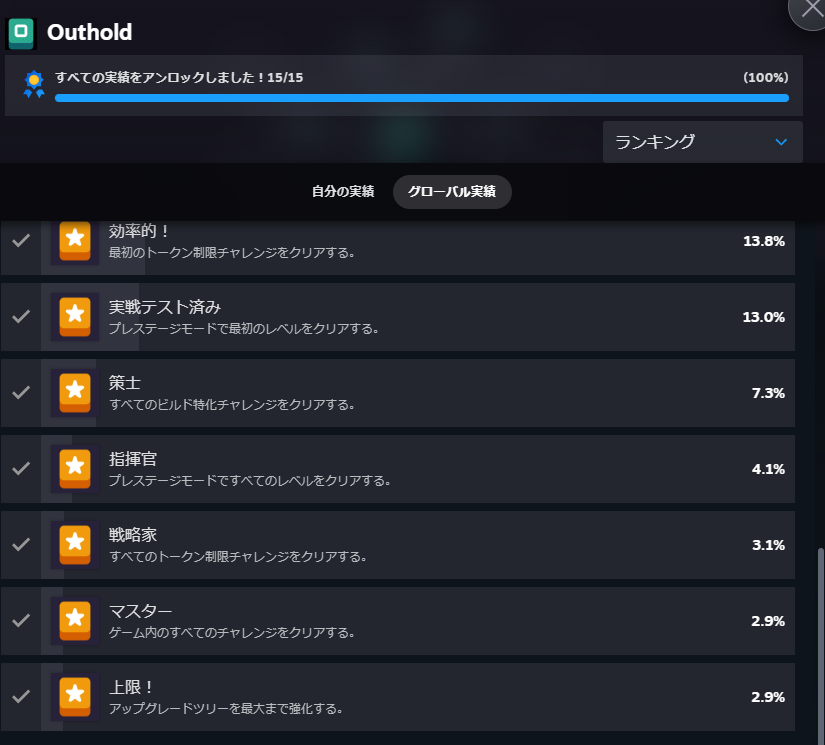
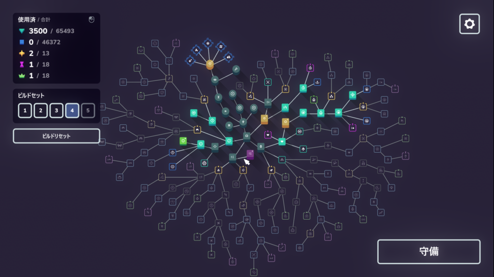
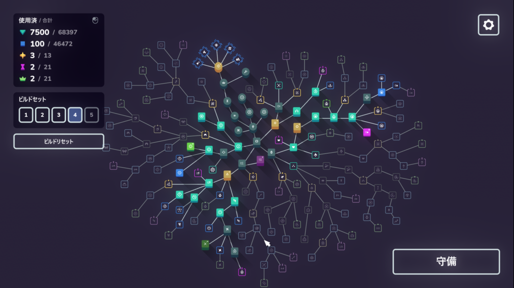
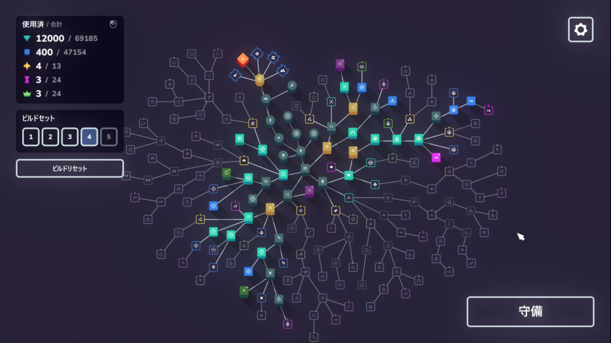
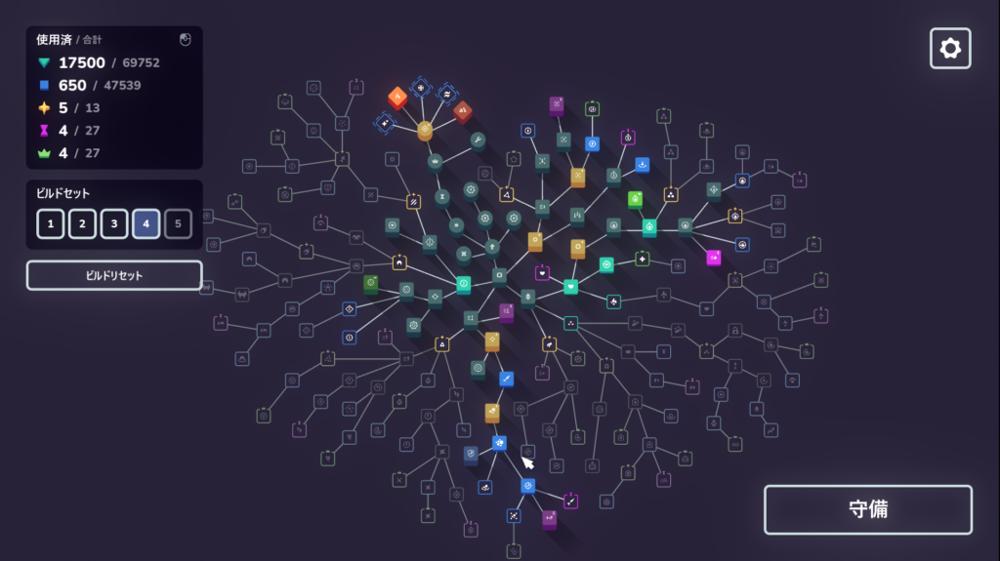
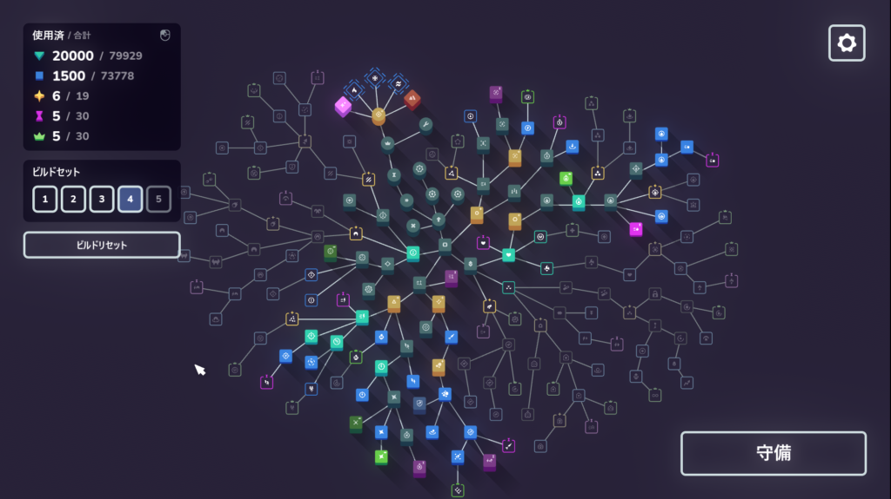
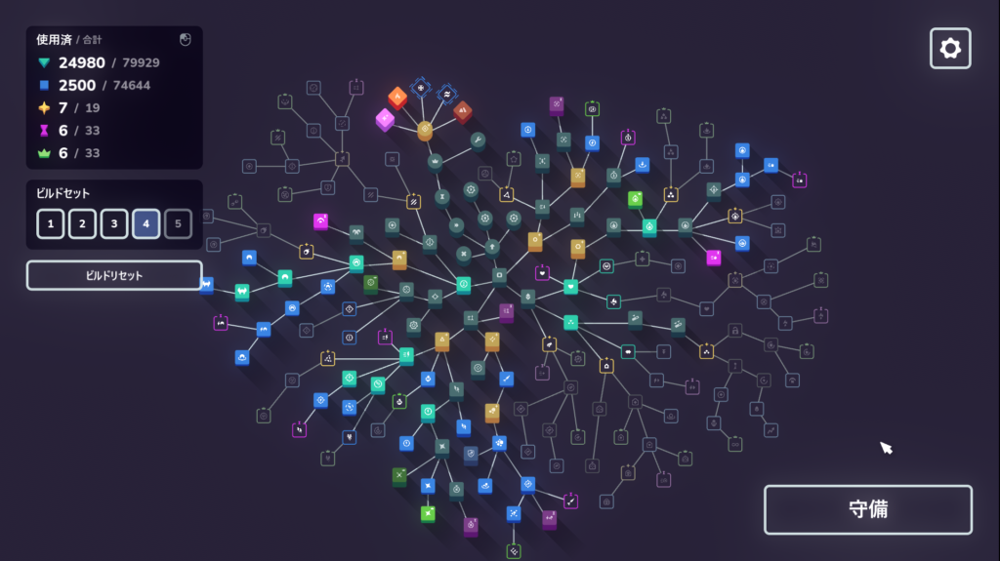
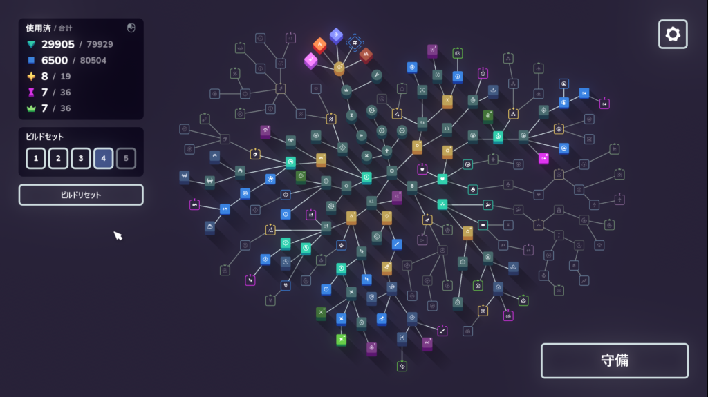
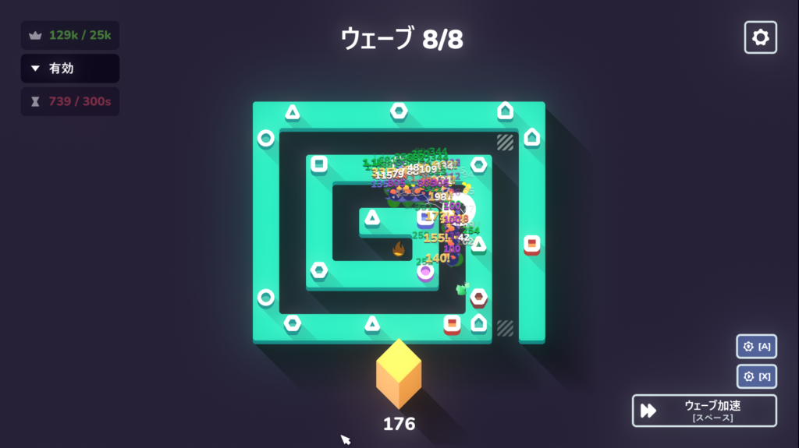

## Outhold

最近出た[Outhold](https://store.steampowered.com/app/3767740/Outhold/)というタワーディフェンスの実績をコンプしました。多少歯ごたえはありましたが10時間程度で終わるので気軽にできるゲームだと思います。

### Outhold ゲーム概要について

このゲームはタワーディフェンスとなっており最初はレベル1すらクリアできないと思います。その代わりにもらえる報酬を元にタワーを強化して再度挑むという流れですね。

どんどん強化してレベルをクリアすると新しいタワーや状態異常、コイン系の強化が出てくると思います。新しい戦術を試してみたり、どんな効果があるか見たり、組み合わせと配置次第で楽に突破できたりと試行錯誤する過程がとても楽しいですね。

### Outhold 実績について

実績については特に難しくなく全(10)レベルクリアと全てのチャレンジをクリアと全ての状態異常を敵一体にかければ達成できると思いもます。全状態異常に関してはチャレンジを全て終わらせたころにはできてると思うので気にしなくて大丈夫だと思います。

### Outhold 攻略について

このゲームはクリアできなさそうならとりあえずやり続けて強化を目指せばクリアできるとは思います。強化できるスキルの数に制限はありますが、自分なりの最強のコンボやペアを探せば意外とスムーズに行けると思います。

例えば群れで来るような敵には雷が有効ですし、スロウ系のタワーは充電機能を持てるので攻撃速度が上がったりします。雷と炎が同時になった時に威力を発揮するものもあればひたすらコインを稼ぐ用の強化もあります。いろいろ試行錯誤して強化を考えてみるといい効果が出てきたりします。

### Outhold チャレンジについて

全てのレベルをクリアするとプレステージモードと制限チャレンジが出てきます。この2つを各レベルで全てクリアすると全てのスキルツリーを強化することができますね。

プレステージモードについては自身の全ての力をもってレベル1からやり直します。敵の体力が大幅に増えてるのでレベル1でも気は抜けないですね。ただ、レベル4以降は割と楽に感じると思います。というのもここまで行けば大体のスキルツリーを開放できるので楽に突破できると思います。

問題は制限チャレンジのほうですね。使えるトークンに限りがあるのでうまいことやりくりしながら進めていくことになると思います。ここで何を選択して何を強化するかが重要になってきます。

### Outhold 制限チャレンジ

というわけで以下のように私は強化をしてクリアしました。レベル1と2は特に書くことはなかったので省きます。

#### レベル3

スロウと炎を解禁。慎重な配置と微妙な加速を使ってギリギリクリアだったので他のやり方が良いと思われる。

#### レベル4

スロウ、炎、雷を解禁。トークンが低いところを強化すればそれほど苦労はしなかった。

#### レベル5

レベル4から充電を解禁。攻撃速度が上がるのでこちらもそれほど苦労はしない。アーティファクトは炎でアローに火傷を付与。ここも苦戦はしなかった。

#### レベル6

雷を消し、毒を解禁。このあたりからシールドが出てくるので毒か重めの矢が必要になってくる。個人的な好みは毒。アーティファクトは毒付与の大地を選択。ここも苦戦はしなかった。

#### レベル7

レベル6から雷を解禁。個人的には雷のほうにある火傷とショックのコンボスキルが好み。充電範囲を広げるためアーティファクトを電気に変更。ここも苦戦はしなかった。

#### レベル8

レベル7から爆弾を解禁。単純な火力の底上げで採用。火力の底上げでアーティファクトは火を選択。ここも特に苦戦はしなかった。

#### レベル9

レベル8からコインタワーを解禁。スロウと攻撃バフのためアーティファクトは電気を選択。コインタワーの脆弱付与とブールがよく効く。自動強化をオンオフ切り替えながらタワーを上手く配置する必要がある。充電と雷と炎のコンボを上手く考えながら配置するのが大変だった。

これは私のやり方でしたが他にもより良いやり方や効率的なやり方があるかとは思います。色んなスキルを試してみて、どの組み合わせが効果的かを探ってみるのもこのゲームの楽しみだと思います。戦略ゲームが好きであればぜひ試してみてください。ではでは。
