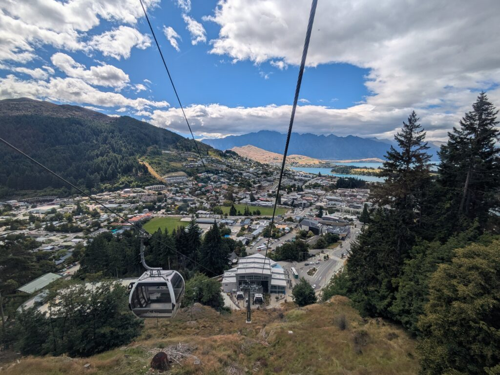

## English\_Practice

I enjoyed the Luge in Queenstown. There is similar to in Japan, but it in Queenstown is famous in NZ.

This is activity which I rode on the cart and went down from a mountain. It is dengerous to hit to my friend or joke. I recommend to slide far from my friend.

### From gondola to Luge

I went to the gondola point in Qeenstown. In my case, I got a ticket online so that I showed this staff its QR code.

I went up on steep slope with gondola. I felt fear. However, the scenely was very beautiful and it was fun because I was with my friend.

I looked around there after going up with gondola and I rode on another gondola to ride Luge. There is two gondolas which I went to the mountain and went to ride Luge.

### Overall Luge

There are two ways in Luge. For example, arrow track and dart track. Actually, dart track had a steap slope. When I went there fast, my cart floated and landed. Personally, I was excited, but it was a little dengerous so I needed to be careful.

I bought a ticket which included gondola and six times with Luge and it cost $99. It was alomost 9000 yen. I thought I rode on too much, but the time per once is short so it was enough for 2 hours. Finally, I went down from the mountain.

I really enjoyed more than I prespected. Nevertheless, it was so carefull if I could not control it. It was seacret that I was a little annoyed when I was hit by kids. See you later.

## 日本語版

Queenstownにある[Luge](https://queenstown.skyline.co.nz/things-to-do/queenstown-luge/)というものを楽しんできました。日本にも似たようなものはあると思いますが、NZだとQueenstownが有名だと思います。

Lugeは山からカートに乗って下っていく遊びになります。当たり前ですが友達と一緒でもぶつけたりふざけたりすると危険なので、離れて滑ることをおすすめします。

### ゴンドラからLugeへ

まずはクイーンズタウンのゴンドラ乗り場に行きます。私の場合はオンラインでチケットを取ってたので係員にQRコードを見せてそのまま進みました。

ゴンドラで上の方に行くときもかなり急斜面を登ってました。流石に怖く感じましたね。とは言えとてもきれいな景色だったし友達と一緒だったのでとても楽しかったですね。

ゴンドラで上に上がった後は軽くあたりを見て回って、Lugeに乗るためのゴンドラに乗りました。ここには山に行くためのゴンドラとLugeに乗るためのゴンドラがあるみたいです。

### Lugeについて

Lugeには二つのルートがあります。arrow trackとdart trackの2種類があります。実は片方のdart trackには急な斜面が存在します。そこをスピード出していくと浮いて着地します。個人的にはワクワクするのですが、少し危ないので注意が必要ですね。

私はゴンドラとLuge6回分のパスを購入したので合計$99でした。日本円だと大体9000円くらいですね。思ったより多いかなと思いましたが、1回あたりの時間は短めなので2時間もあれば満喫できますね。最後にゴンドラに乗って山を下って終わりという流れになります。

想像よりはかなり楽しめてスピードも出せたのが良かったですね。ただ、コントロールができないとぶつかったりして危険なので本当に気を付けなければなりません。最後の降りるポイントで何度もぶつけられてちょっとイライラしてたのは秘密ですが。ではでは。

## AI採点

## 総合評価（推定）

**Overall Band: 5.5〜6.0**

> 内容は伝わるが、**文法・語彙・不自然な英語表現による減点が多い**。  
> IELTS Band 8には **構文の正確性・語彙の自然さ・論理的つながり**が大きく不足。

* * *

# ① Task Response（内容）: **Band 6.0**

### 良い点

- 体験の流れは分かる

- 情報量は十分

- 時系列も概ね自然

### 減点ポイント

- **IELTSではカジュアルすぎる表現が多い**
    - _See you later._
    
    - _It was secret that…_

- 結論（全体評価）が弱い

- 見出しが不自然（試験では基本不要）

* * *

# ② Coherence & Cohesion（構成・つながり）: **Band 6.0**

### 問題点

- 接続詞が単調
    - _However_, _Actually_, _Finally_ の多用

- 文と文の論理関係が弱い

- 不自然な段落タイトル

❌

> Overall Luge

⭕

> Overall experience / Overall impression

* * *

# ③ Lexical Resource（語彙）: **Band 5.5**

### スペルミス（確実に減点）

- **dengerous → dangerous**

- **steap → steep**

- **prespected → expected**

- **alomost → almost**

- **seacret → secret**

- **Qeenstown → Queenstown**

- **scenely → scenery**

👉 IELTSでは**スペルミスは即減点**

* * *

### 語彙の不自然さ（頻出）

❌ 不自然

> There is similar to in Japan

⭕ 自然

> There are similar activities in Japan.

* * *

❌

> This is activity which I rode on the cart

⭕

> This is an activity where you ride a cart down a mountain.

* * *

❌

> It is dangerous to hit to my friend

⭕

> It is dangerous to crash into other people.

※ **hit to + 人 ❌（前置詞不要）**

* * *

❌

> I recommend to slide far from my friend

⭕

> I recommend keeping a safe distance from others.

* * *

# ④ Grammar Range & Accuracy（文法）: **Band 5.0〜5.5**

ここが最大の弱点です。

* * *

## ❌ 冠詞・単数複数（大量減点）

❌

> There is two gondolas

⭕

> There are two gondolas

* * *

❌

> This is activity

⭕

> This is **an** activity

* * *

❌

> the scenely was very beautiful

⭕

> the scenery was very beautiful

* * *

## ❌ 不自然・誤文（重要）

❌

> It is dengerous to hit to my friend or joke.

👉 **意味が崩壊**

⭕

> It is dangerous to crash into others or behave irresponsibly.

* * *

❌

> it was so carefull if I could not control it

👉 文法・意味ともにNG

⭕

> It was dangerous if I could not control the cart.

* * *

❌

> I thought I rode on too much

⭕

> I thought it might be too many rides.

* * *

## ❌ 時制・構文ミス

❌

> dart track had a steep slope

⭕

> dart track has a steep slope  
> （**事実説明なので現在形**）

* * *

❌

> When I went there fast

⭕

> When I went down at high speed

* * *

# IELTS Band 8に足りない点（重要）

### ① 文の「型」が弱い

Band 8では👇が必要

- 関係詞

- 分詞構文

- 複文の正確さ

❌

> I felt fear.

⭕

> I felt scared as the gondola climbed a very steep slope.

* * *

### ② 語彙が「幼い」

- fun

- very

- good

- excited  
    → **B6止まり**

Band 8では👇

- enjoyable

- thrilling

- visually stunning

- slightly hazardous

* * *

### ③ IELTSでは口語NG

- See you later

- It was secret that…

* * *

## 総評（率直）

- **今のままだと IELTS Writing 6 前後**

- Band 8を狙うなら：
    1. スペルミスをゼロにする
    
    3. 冠詞・単数複数を徹底
    
    5. 1文を「長く・正確に」
    
    7. カジュアル表現を排除
