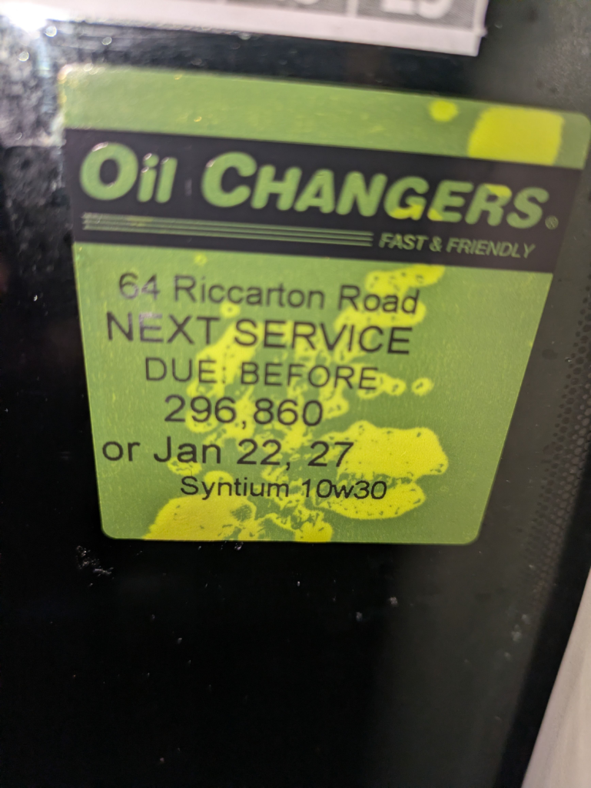
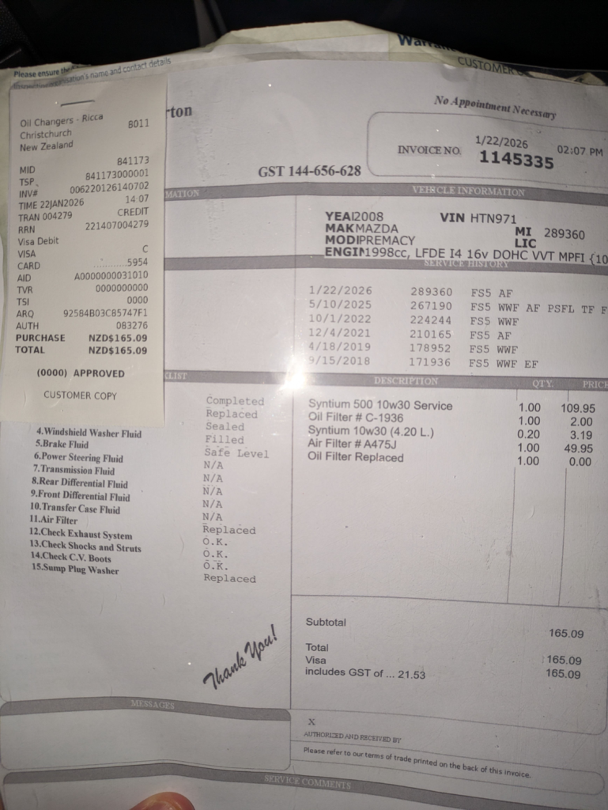

## English\_Practice

### Changing Engine Oil

Finally, I changed engine oil and oil filtter because the changing date has already passed. We change it when we investigate our car in Japan, but we just check it in NZ so I need to go the car service center.

I went to there. This is called "Oil Changer" and there are some shop in big cities.

I guess I can change my engine oil in other cities, but I need reservation or I should go there early morning and I can change it this afternoon.

### The time which engine oil and filtter are changed

I can change engine oil anytime until 5 p.m. and it takes 15 minutes. When I heard my friend about that, it would take for 30 minutes. Actually, it finishes early if there are not many people.

It cost approximetly $100 and I changed the air fillter also. It cost $50 and total fee was $160. Moreover, it takes short time so I could go shopping soon. In addition, the staff put engine oil in my car at maximum. Therefore, there is not out of oil.

### Put air in the tire

Next, puttin in ther tire. There is an air pump in the petrol station as same as Japan. There is petrol station which there is not staff works for 24 hours. There is no air pump like that.

I saw it in the gas station called "Z". It is expensive to put in petrol, but I can buy something in it like convinience store because there may be staffs and they help me.

The "psi" of unit is used in NZ. On the other hand, the "kpa" of unit is used in Japan. Normally, it shows 220-230kpa in almost of all cars. However, it shows 31-32 in NZ.

It is easy to pump air. Firstly, I setted up 31 or 32 before putting air in the tire. Secondly, I pumped air which I adjusted in tire after checking air pressure. Finally, I pluged after ringing.

It is so simple because of easy. There are a lot of old cars in NZ so we need to investigate our car to reduce broken and save money. It is better to change engine oil and filtter by myself if it is possible. See you later.

## 日本語版

### エンジンオイルの交換タイミング

車に貼ってあるオイルチェンジの交換タイミングをかなりすぎたので重い腰を上げて交換することにしました。日本だと車検の時に交換するみたいですがNZではオイルのチェックをするだけですので、お店に行く必要があります。

今回行ったところは[ここ](https://oilchangers.co.nz/)ですね。オイルチェンジャーと調べれば出ると思いますが大都市であればいくつかあると思います。

もちろん他都市にも交換できるところはありますが、予約が必要だったり朝早めに行けば午後にやってもらえるというところが多いと思います。

### エンジンオイルやエンジンフィルターの交換にかかる時間

ここは時間内に行けばいつでも交換してもらえますし、交換時間も15分ほどで終わります。私が聞いたときは30分くらいだと聞きましたが、人が少なければすぐに終わるんだと思います。

基本料金は$100くらいで私はそこにエアフィルターを交換したので$50ほど追加して合計$160くらいになりました。全く時間はかからないのでその後買い物などにすぐ行くこともできます。また、エンジンオイルもMAXまで入れてくれるので、オイル切れになることも少ないと思います。

次はタイヤの空気入れですね。ここは日本と同じようにガソリンステーションにタイヤの空気を入れる場所があります。ニュージーランドだと無人で24時間営業している場所もありますが、そのような場所にはおいてないことが多いですね。

### タイヤの空気入れについて

私が見かけたのは[Z](https://www.z.co.nz/)というガスステーションになります。ここのガソリンは割高なことが多いですが、コンビニのように物を買うことができ恐らくスタッフがいるので困ったときは助けてくれると思います。

ニュージーランドではkpaという単位ではなくpsiという単位が使われています。日本ではkpaですね。大体普通車だと220~230kpaと書かれていることが多いですが、NZであれば31~32に設定することが多いです。

ここの空気の入れ方はシンプルでまずは数値を31か32に設定した後、タイヤの空気を入れます。タイヤの空気圧をチェックした後、設定した値になるよう調整して空気を勝手に入れてくれます。最後にピピという音が鳴ったら終了の合図なの栓をして終わりですね。

シンプルなので簡単にできると思います。ニュージーランドは中古車が多いので、適宜自分でしっかりと点検してなるべく故障を減らしていくことが節約につながるんだと思います。可能ならエンジンオイルやフィルターの交換までできればよさそうですが。ではでは。

## AI採点

## 総合評価（推定バンドスコア）

**Overall Band: 5.0〜5.5**

> 内容は伝わるが、
> 
> - 文法ミスが多い
> 
> - 語彙の不自然さ
> 
> - 英語として成立しない文が複数
> 
> があり、Band 6には未達です。

* * *

## ① Task Response（内容の達成度）: **6.0**

### 良い点

- オイル交換 → タイヤ空気圧、という流れは明確

- 実体験に基づいており具体性がある

- 説明文として情報量は十分

### 減点ポイント

- **主語が曖昧**（I / we / you が混在）

- 日本語構文をそのまま英語にしている文が多く、意味が取りづらい箇所あり

👉 **内容自体はOK。英語化の精度が問題**

* * *

## ② Coherence & Cohesion（構成・つながり）: **5.5**

### 問題点

- 見出しはあるが **文と文の論理接続が弱い**

- "I went to there." / "Next, puttin in ther tire." など **突然始まる文**

### 具体例（減点）

❌

> I went to there.

→ **there に行く動作なので to は不要**

⭕

> I went there.

* * *

## ③ Lexical Resource（語彙）: **5.0**

### 大きな問題点

**日本語→英語の直訳が多すぎる**

#### 代表例

❌

> investigate our car

👉 「調べる」は **investigate ❌**（犯罪・研究レベル）

⭕

> check our car  
> inspect the car

* * *

❌

> broken

👉 名詞として使っているが意味不明

⭕

> breakdowns  
> mechanical problems

* * *

❌

> There is petrol station which there is not staff

⭕

> There are petrol stations with no staff.

* * *

### スペルミス（IELTSでは確実に減点）

- filtter → **filter**

- approximetly → **approximately**

- fillter → **filter**

- convinience → **convenience**

- pluged → **plugged**

- puttin → **putting**

- ther → **the**

👉 **Band 6以上では致命的**

* * *

## ④ Grammatical Range & Accuracy（文法）: **4.5〜5.0**

### ❌ 文法的にアウトな文（重要）

#### 1️⃣

❌

> Finally, I changed engine oil and oil filtter

⭕

> Finally, I changed **the** engine oil and **the** oil filter.

👉 冠詞欠落（IELTS超重要）

* * *

#### 2️⃣

❌

> We change it when we investigate our car in Japan

⭕

> In Japan, we usually change it during vehicle inspections.

👉

- we / investigate ❌

- 時制も不自然

* * *

#### 3️⃣

❌

> I need reservation

⭕

> I need **a reservation**

👉 **a / the の欠落**

* * *

#### 4️⃣

❌

> The time which engine oil and filtter are changed

⭕

> The time required to change the engine oil and filter

👉 関係代名詞の誤用

* * *

#### 5️⃣

❌

> Therefore, there is not out of oil.

❗意味が成立していません

⭕

> Therefore, the engine is unlikely to run out of oil.

* * *

#### 6️⃣

❌

> Next, puttin in ther tire.

👉 **完全に崩壊**

⭕

> Next, I checked the tire pressure.

* * *

#### 7️⃣

❌

> It is so simple because of easy.

👉 文法・意味ともにNG

⭕

> It is very simple and easy to do.

* * *

## IELTS Band 8 を目指すなら不足している点

### 必須改善ポイント

1. **冠詞（a / the）**

3. **動詞の自然さ（investigate ❌）**

5. **一文一義を守る**

7. **スペルミス撲滅**

9. **日本語構文を捨てる**

* * *

## 総評（正直）

- **内容：合格ライン**

- **英語力：IELTS 5前後**

- **今のままでは Band 6.0 は厳しい**

- ただし、**修正すれば一気に6.5は狙える素材**
