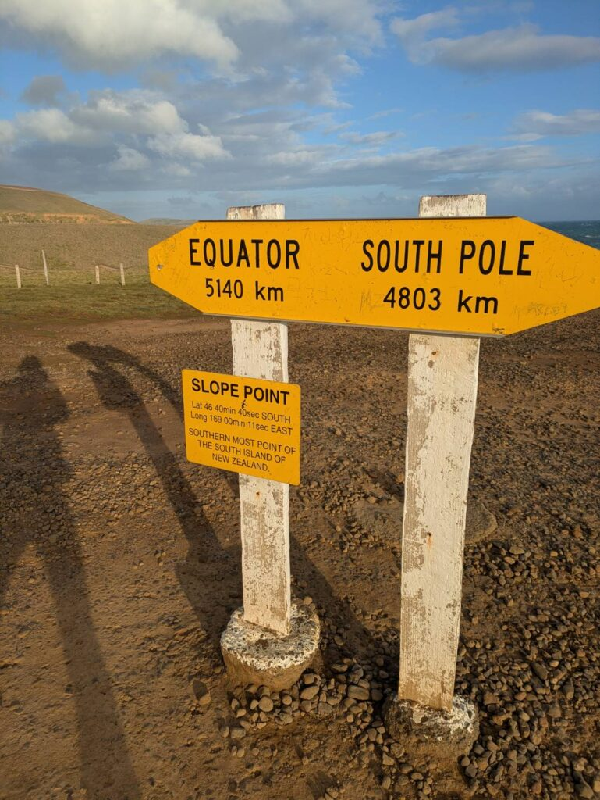
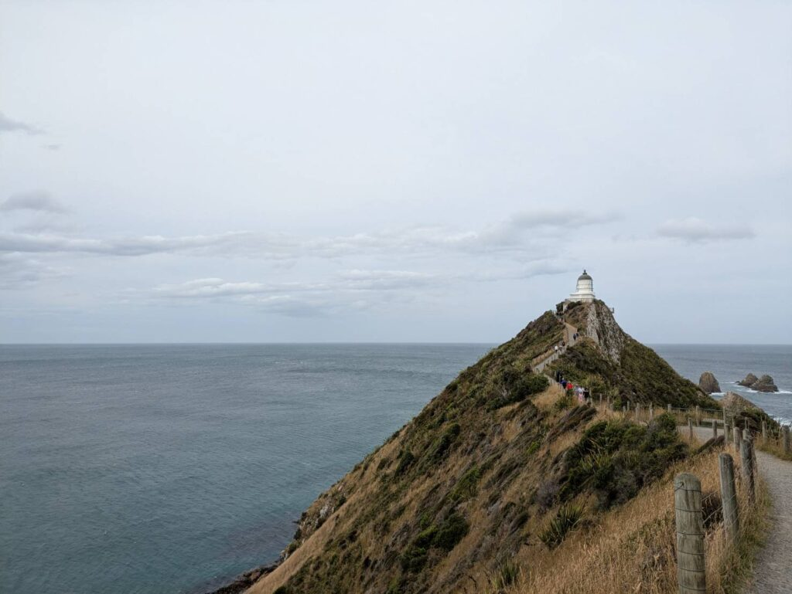
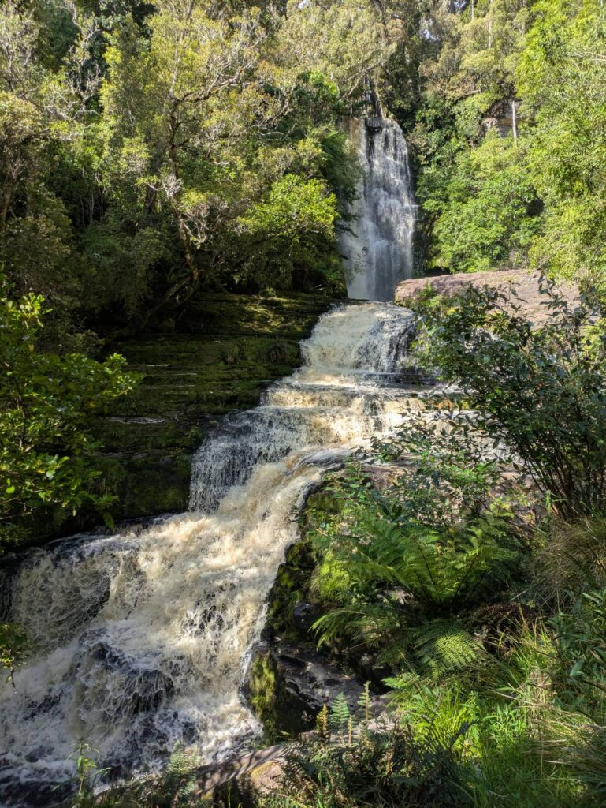
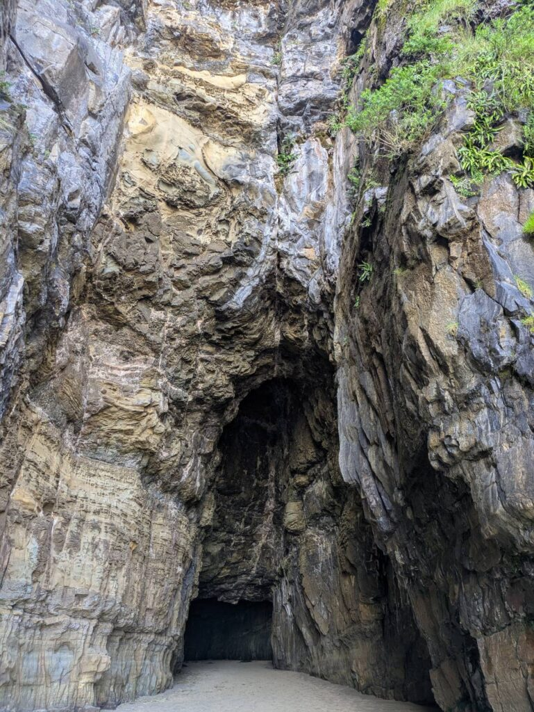
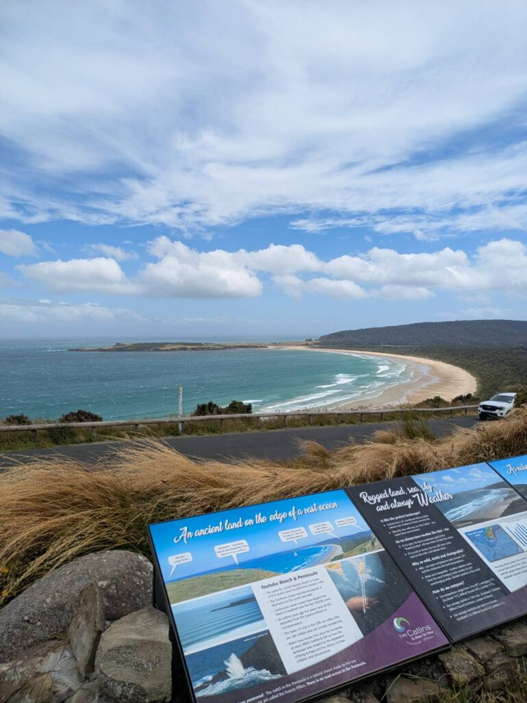

## English\_Practice

I went to the southern spot in NZ with my friend. Moreover, we went to other places.

#### Slope Point

This is the southern point in South Island of NZ. It took for 20 minutes on foot from parking area. It was amazing because the scenery was beautiful and I did not smell tide.

#### Nugget Point Lighthouse

I walked to the cliff from parking area and arrived the lighthouse. I saw the ocean with like the coral. I think you can take beautiful photos with sunset.

#### McLean Falls

There was a big brown fall. I saw it near there. It was not far from parking area and I watched it easily.

#### Cathedral Caves

There is similar one in North Island and this is the south one. There were two entrances and they connected the end. When I went there late, tide was full so you should go there before that.

#### Curio Bay Cliffs

This is the bay like beach. However, it was difficult to stand there and take photos because of strong wind. Moreover, you can see animals if it is lucky.

#### Waipapa Point Lighthouse

This is the lighthouse near the slope point. We can see sea lions there, but I cound not see them. I think there was the attention sign so we can watch them near hear

I went to some places with my friend. It took for 5 hours from Tekapo and I went to some sightseeing and came back next morning so I was tired. Nevertheless, it was meaningful.

I am looking forward to traveling with my other friend in two weeks. I have never been some places where I want to go. See you later.

## 日本語版

最近友達とニュージーランドの[最南端のスポット](https://www.newzealand.com/int/feature/curio-bay-and-slope-point/)に行ったのでそのことについて話そうと思います。とは言っても最南端だけでなく他の場所にも行きましたが。

#### Slope Point

ここはニュージーランド南島の最南端のスポットと言われています。駐車場から20分ほど歩くとこの場所に着きます。そこに至るまでの景色もきれいで潮のにおいも少なく良い気がします。

#### Nugget Point Lighthouse

駐車場から崖の方面に少し歩くと灯台に着きます。後ろの方にサンゴのようなものがあり綺麗な海を見ることができます。夕日と一緒だときれいな写真を撮れると思います。

#### McLean Falls

大きめの滝で色が茶色になっています。迫力が凄く近くまで寄ることができます。駐車場からはそこまで遠くなくサクッと見ることができると思います。

#### Cathedral Caves

実は北にも同じようなものがありますが、こちらは南バージョンになります。洞窟の入り口が2つあり奥では繋がっています。遅くに行くと潮が満ち始めるのでそれより前に行くのがおすすめです。

#### Curio Bay Cliffs

ここはbayなのでビーチのような感じですね。ただ、この時は風がかなり強く立つの撮るのも大変でした。運が良ければ動物も見られるみたいです。

#### Waipapa Point Lighthouse

ここはslope pointの近くにある灯台になります。ここは足利近くで見られるようですが私が行ったタイミングでは見られませんでしたね。注意看板もあるのでほんとに近くで見られるんだと思います。

といった感じでいろんな場所に友達と言ってきました。Tekapoから5時間ほどかけていった後、一日観光で朝方に戻ったのでかなり疲れましたが、とても有意義な一日でした。

2週間後に他の友達と旅行をするのでそれも楽しみです。まだ、言ってない場所もあるので色んな所に行ってみたいと思います。ではでは。

## AI採点

# 📊 総合評価（推定バンドスコア）

**Overall Band：6.0 前後**

| 項目 | Band | 評価要点 |
| --- | --- | --- |
| Task Response | 6.0 | 内容は伝わるが深掘り不足 |
| Coherence & Cohesion | 6.0 | 構成は明確だが接続語が弱い |
| Lexical Resource | 5.5 | 語彙が単純・不自然な選択あり |
| Grammatical Range & Accuracy | 5.5 | 基本文法ミスが頻発 |

👉 **Band 8 を目指すには：構文の正確性と語彙の自然さが最大の課題**

* * *

# ① Task Response（内容への回答）

### ✔ 良い点

- トピックは明確（旅行記）

- 各スポットの説明がある

- 時系列も破綻していない

### ❌ 減点ポイント

- **「感想・評価」が浅い**

- 「なぜ良かったのか」が表面的

- 比較・理由・具体例が少ない

📉 **Band 6 → 7 に上げるために必要**

- _why / how_ を1文足す  
    例：

> It was meaningful **because it allowed me to experience the remote nature of New Zealand.**

* * *

# ② Coherence & Cohesion（構成・つながり）

### ❌ 問題点（重要）

- **Moreover の誤用が多い**

- 文同士が「箇条書き的」

- 段落間の論理接続が弱い

### 具体的な減点例

❌

> Moreover, we went to other places.

→ **Moreover は「追加の強調」用。ここでは不自然**

✅

> In addition, we visited several other places.

* * *

❌

> I went to some places with my friend.

→ **前文の要約として弱い**

✅

> Overall, the trip allowed me to visit several scenic spots in the southern part of New Zealand.

* * *

# ③ Lexical Resource（語彙）

### ❌ 語彙の問題（頻出）

#### 1\. 不自然・誤用

| 原文 | 問題 | 修正例 |
| --- | --- | --- |
| southern spot | 不自然 | southernmost point |
| smell tide | 誤用 | smell the sea |
| like the coral | 文法不自然 | something like coral |
| fall | 語彙ミス | waterfall |
| if it is lucky | 不自然 | if you are lucky |

* * *

#### 2\. 語彙の単調さ（Band 6 止まり）

- big

- beautiful

- good

- difficult

- meaningful

📉 **Band 8 ではNG**

✅ 置き換え例

- big → **massive / impressive**

- beautiful → **scenic / breathtaking**

- difficult → **challenging**

- meaningful → **rewarding / worthwhile**

* * *

# ④ Grammatical Range & Accuracy（文法）

⚠ **ここが最大の減点源**

* * *

### ❌ 典型的ミス①：不定詞・前置詞

❌

> It took for 20 minutes on foot

✅

> It took **about** 20 minutes **to walk**

* * *

❌

> arrived the lighthouse

✅

> arrived **at** the lighthouse

* * *

### ❌ 典型的ミス②：冠詞・単数複数（IELTS超重要）

❌

> from parking area

✅

> from **the** parking area

* * *

❌

> There is similar one

✅

> There is **a** similar one

* * *

### ❌ 典型的ミス③：時制・論理

❌

> they connected the end

意味不明（誰が？いつ？）

✅

> they **were connected at the end**

* * *

### ❌ 典型的ミス④：語順・代名詞

❌

> watch them near hear

複合ミス（hear / here + 語順）

✅

> watch them from a close distance

* * *

# 🔧 全体的な改善例（1パラグラフ）

❌ 原文

> It was meaningful.

✅ Band 7–8 レベル

> Overall, the trip was extremely rewarding as it allowed me to explore some of the most remote and scenic areas in New Zealand with my friend.

* * *

# 🎯 Band 8 に足りない点（要約）

✔ 構成力 → **OK**  
❌ 文法精度 → **不足**  
❌ 語彙の自然さ → **不足**  
❌ 抽象化・評価 → **不足**

* * *

## 次にやるべきこと（超重要）

1. **「It took for / arrived / moreover」を完全に矯正**

3. **waterfall / southernmost / scenic を定着**

5. 1段落につき **理由文を1つ足す**
