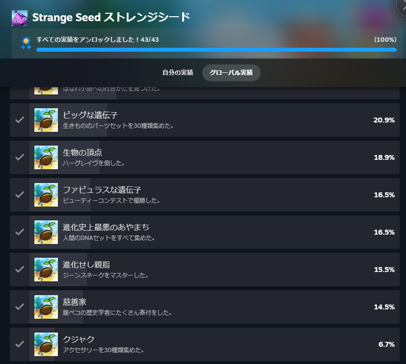
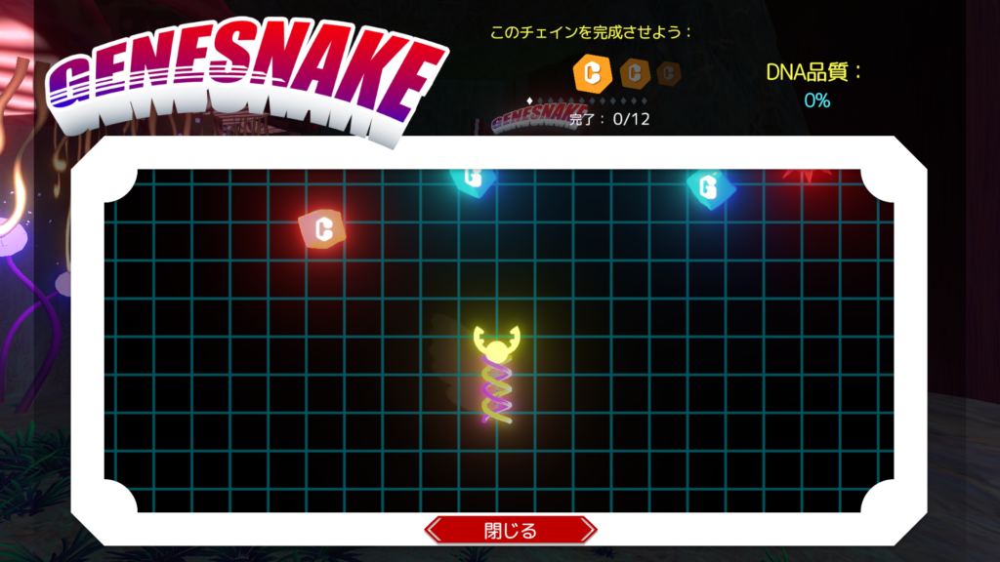

[このゲーム](https://store.steampowered.com/app/2463690/Strange_Seed/)はアクションゲームでまずはスライムからスタートします。スライムで一部の敵を倒すと生物のパーツをもらうことがあります。これを自分にも装備してどんどん強化していくゲームになります。

### Strange seed 概要

基本的には近くの生物を食べまくればいいと思います。また、強いパーツを集めてもコストが存在するのでそれ次第では十分に強くなれないかもしれません。

もちろんボス戦も存在します。ボス戦でも基本的には同じですね。敵の攻撃を避けながら攻撃すれば大丈夫です。

また、敵からパーツをもらうだけでなく祠に行ってパーツをもらうこともあります。祠では特定の物を要求されることがあります。特定のパーツを装備していたらもらえるなどですね。

### Strange seed スキンとアクセサリー

それからパーツ以外にもスキンやアクセサリーもあります。基本的には回収する必要はないですが、使う場所が2つほどあります。

1つ目はアンコウの提灯ですね。これがないと暗い洞窟では何もできないくらいですね。光るキノコがあるので多少は何とかなりますがあったほうが便利ですね。

2つ目はファッションショーですね。実績の一つですのでコンプには必要ですね。審査員の一人がアクセサリーを要求するのでいくつか装備すれば大丈夫だと思います。

### Strange seed ジーンスネーク

実績で苦労するのはジーンスネークというものだと思います。指定された遺伝子を取ってヘビを大きくしていくゲームになります。max20なので若干めんどくさいくらいですが、凄い難しいわけではないので何とかなると思います。

また、指定されたもの以外にもジョーカーのようななんにでもなるアイテムもありますので、それをうまく活用すれば大丈夫だと思います。

実績以外だとスキン集め、アクセサリー集めは多少苦労すると思います。装備についてはスキン以外が集まるまでひたすら敵を倒すか祠を巡ればよいので。ただ、スキンとアクセサリーはマップの隅々まで周る必要があるので少し大変ですね。私も全て集めた気がしないです。特にアクセサリーは未収集などの表示はないので。

こんな感じで全ての実績を達成しました。パーツごとに違う能力があるのでパーツ集めも楽しいですし、どうすれば最強の生物を作れるか考えるのも楽しいと思います。ではでは。
