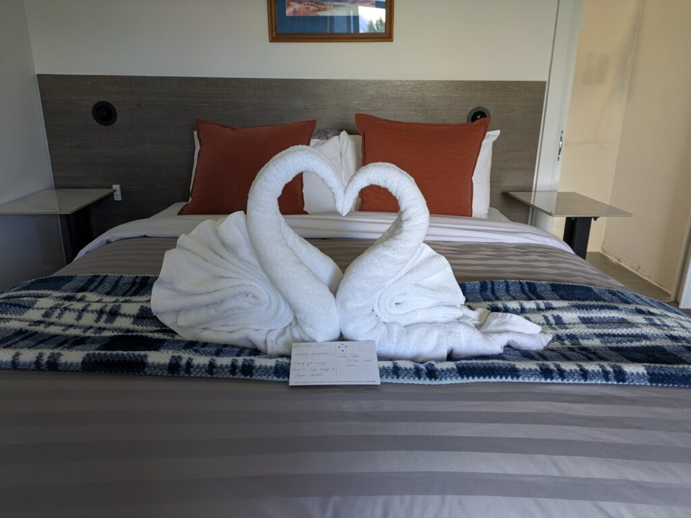
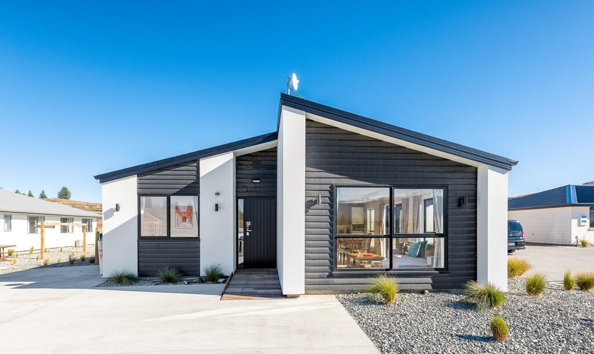

## English\_Practice

I wrote that I work as a house keeper before. I am going to write about my workplace.

I am working in the company called "Explore Tekapo". There are two accommodation which are a motel and private lodgings.

It is same to clean in which accommodation. Making bed is a little different, but it is almost same basecally how to clean.

### ExploreTekapo Motel

There are 18 rooms in the motel and 6 rooms which are able to stay by 4 people have kitchen. Other rooms are stayed by 2 people and if customers need, we prepare a single bed. Each rooms have a shower, but there are the bathtub in some rooms.

There are backpacker rooms at the motel. There are 4 or 6 beds in each rooms. No one shares with someone if it is season. I guess if it is winter, it become share room. Backpacker has shared kitchen and bath room.

There are private logdings. There are a lot of house to opposite lake from the motel. We have large rooms which a family or friends stay and small rooms.

### ExploreTekapo Private logdings

They are far from the lake, but it is more comfortable to stay there than staying the motel. No one shares these houses so it is better for me if I come here by car.

The motel has advantage that asking for reception to throw away rubbish or changing towels. Moreover, you can ask a faver for supplying amenity.

### ExploreTekapo Reception

Finally, I work at the reception in the motel twice per a week. I guide for customers about room, breakfast voucher and check-out time. I am bad at talking with them,but I am straggling with it.

We have reservation until March. I will be in April so if you have already booked, I can guide for you. I hope you stay there. This motel has three stars so it is good. Personally, I prefer Japanese hotel. See you later.

## 日本語版

[以前](/posts/2025/12/housekeeping-work-tekapo/)ハウスキーパーとしては働いているという話をしました。今回は今働いている職場について書いていこうと思います。

今働いているところは[Explore Tekapo](https://maps.app.goo.gl/WCurFy6aksADb3Km7)という会社になります。この会社では2パターンの宿泊施設があります。[モーテル](https://tekapomotel.co.nz/)と[民泊](https://exploretekapo.co.nz/)のようなものですね。

どちらの宿泊施設でもやる仕事は変わらないですね。ベッドメイキングが微妙に変わるだけで基本的なクリーニング方法は変わりません。

### ExploreTekapo モーテル

モーテルの数は18部屋あり、そのうち6部屋は4人部屋でキッチンがあります。それ以外の部屋は基本2人部屋で必要に応じてシングルベッドが用意されます。各部屋にはシャワーはありますが、バスタブは部屋によりますね。

モーテルにはバックパッカーもあります。4または6つのベッドが部屋にあり、シーズンの間であれば他の人とシェアすることはないですね。冬等であればシェアルームになると思いますが。他にはキッチンやバスルームもシェアになります。

### ExploreTekapo 民泊

モーテルの他にも民泊のようなものもあります。モーテルから湖とは反対の方に行くとたくさんの家があります。そこでは家族や友人たちと住めるくらい広い部屋もあれば、ワンルームの場所もあります。

湖から離れてはいますが、モーテルよりも部屋が広いので比較的快適に過ごせると思います。誰かとシェアすることもないので個人的にはモーテルよりも割といい気はします。車で来るのであればですが。

モーテルのいいところは長期の宿泊をする際にゴミを捨ててもらうようにお願いしたり、タオルを交換してもらったりすることができます。他にもアメニティの補充をお願いしてもよいと思います。

### ExploreTekapo 受付

最後にモーテルの受付ですね。週に2回ほど受付に立ってモーテルの案内をしています。案内と言っても部屋の場所や朝食券、チェックアウト時間をお知らせするくらいですね。雑談が苦手なのでやってみてはいますが、中々難しいなと感じているところです。

今の時期は3月くらいまで埋まってる可能性があるので4月とかであればまだいますし、もうすでに予約している人であればタイミング次第では日本語で案内ができますね。もしよければぜひ泊まってみて下さい、☆3のモーテルなのでそれなりには良いかと思います。個人的には日本のホテルが良いですが。ではでは。

## AI採点

## 総合評価（推定バンドスコア）

**Overall Band: 4.5〜5.0**

理由：

- 内容は伝わるが、**文法ミスが多く、意味が止まる箇所が頻発**

- 語彙の選択が初級レベルで、**不自然・誤用が多い**

- Cohesion（つながり）と自然な構文が弱い

- Task Achievement は部分的に達成

Band 8を目指すなら、**全面的な書き直しレベル**です。

* * *

# 各評価項目ごとの詳細フィードバック

* * *

## ① Task Achievement（内容達成度）: **Band 6 → 5**

### 良い点

- 何について書いているかは明確

- 職場・宿泊施設・受付業務という**テーマは一貫**している

### 減点ポイント

- **目的が弱い**
    - 「なぜこれを書くのか」「誰向けなのか」が曖昧

- 情報が**箇条書き的**で、説明文としての洗練度が低い

- IELTSでは「日記っぽさ」は減点対象

### 改善例（方向性）

- 導入で **目的文** を入れる  
    例： This essay describes my current workplace and the types of accommodation it provides.

* * *

## ② Coherence & Cohesion（構成・つながり）: **Band 5**

### 問題点

- 段落のつながりが弱い

- 接続詞がほぼ使えていない

- 文の並びが **日本語構造そのまま**

❌ 例：

> It is same to clean in which accommodation.

→ 英語として論理構造が成立していない

### 改善が必要な点

- 以下の接続表現がほぼゼロ：
    - however
    
    - in contrast
    
    - for example
    
    - in addition
    
    - therefore

Band 8では**必須**です。

* * *

## ③ Lexical Resource（語彙）: **Band 4.5**

### 致命的な語彙ミス（すべて減点）

以下、**全部IELTSで減点対象**です。

| 原文 | 問題点 | 正 |
| --- | --- | --- |
| house keeper | 複合名詞誤り | **housekeeper** |
| two accommodation | 不可算名詞 | **two types of accommodation** |
| private lodgings | 不自然 | **private houses / holiday homes** |
| It is same | 文法× | **It is the same** |
| basecally | スペル | **basically** |
| logdings | スペル | **lodgings** |
| throw away rubbish | 受付に依頼する文脈で不自然 | **dispose of rubbish** |
| ask a faver | 綴り・語彙 | **ask a favour** |
| guide for customers | 動詞の前置詞誤り | **guide customers** |
| straggling | 語彙誤用 | **struggling** |

👉 **スペルミスはIELTSでは容赦なく減点**されます。

* * *

## ④ Grammar Range & Accuracy（文法）: **Band 4.0〜4.5**

### 深刻な文法ミス（全指摘）

#### 1️⃣ 時制ミス

❌

> I wrote that I work as a house keeper before.

✔

> I previously mentioned that I worked as a housekeeper.

* * *

#### 2️⃣ 冠詞・単複数（大量にミス）

❌

> two accommodation  
> Each rooms have a shower  
> There are a lot of house

✔

> two types of accommodation  
> Each room has a shower  
> There are many houses

👉 **冠詞・単複数ミスはBand 6以上を完全にブロックします**

* * *

#### 3️⃣ 不自然な受動・構文

❌

> Other rooms are stayed by 2 people

✔

> Other rooms are designed for two people

* * *

#### 4️⃣ 文として成立していない文

❌

> It is same to clean in which accommodation.

→ **意味が取れない（IELTSでは致命的）**

✔

> The cleaning tasks are the same in both types of accommodation.

* * *

#### 5️⃣ 前置詞ミス

❌

> twice per a week

✔

> twice a week

* * *

## ⑤ Register（文体）: **Band 5**

IELTS Writingでは：

❌

> See you later.  
> ☆3のモーテル

→ **完全に不適切**

✔

- フォーマル〜セミフォーマルを維持する必要あり

- 絵文字・会話調は即減点

* * *

# Band 8を目指すための改善ポイント（超重要）

### 必須改善TOP5

1. **全文を英語構文で書き直す**

3. 冠詞・単複数を徹底的に修正

5. 接続詞を意識的に入れる

7. スペルミスをゼロにする

9. カジュアル表現を排除

* * *

## 正直な評価

> **今のままではBand 6は取れません。**

ただし、

- 内容理解力はある

- 書きたいことは明確

👉 **「書き方」を矯正すれば一気に伸びます**

## 📝 Model Answer (Band 8 level)

I previously mentioned that I work as a housekeeper, and in this essay, I would like to describe my current workplace in more detail.

I am currently employed by a company called _Explore Tekapo_, which provides two types of accommodation: a motel and privately owned holiday houses. Although these facilities differ in style, the cleaning tasks are largely the same. The main difference lies in bed-making; however, the overall cleaning procedures remain consistent across both types of accommodation.

The motel consists of 18 rooms, six of which are designed for up to four guests and include kitchen facilities. The remaining rooms are mainly intended for two people, although an additional single bed can be provided if necessary. Each room is equipped with a shower, while only some rooms include a bathtub. In addition, the motel offers backpacker-style rooms containing either four or six beds. During the peak season, guests usually occupy these rooms individually, whereas in winter they may be shared. The kitchen and bathroom facilities in the backpacker area are shared among guests.

In addition to the motel, Explore Tekapo also manages several private holiday houses located on the opposite side of the lake. These properties vary in size, ranging from studio-style rooms to larger houses suitable for families or groups of friends. Although they are situated further from the lake, these houses are generally more spacious than the motel rooms and therefore offer a more comfortable stay. As they are not shared with other guests, I personally consider them a better option, particularly for those travelling by car.

One advantage of staying at the motel is the availability of reception services. Guests staying for longer periods can request rubbish disposal, towel replacement, and the replenishment of amenities, which adds to the overall convenience of their stay.

Finally, I occasionally work at the motel reception, usually around twice a week. My responsibilities include explaining room locations, providing breakfast vouchers, and informing guests of the check-out time. Although I find casual conversation challenging, I am making an effort to improve my communication skills through this role.
