## English\_Practice

I am going to write about Arrowtown because I went to sightseeing.

There were a river and bridge with bungy jumping before coming Arrowtown. These were quite good seanary so that you should go there before going Queenstown.

### Arrowtown Bakery in Arrowtown

After that, I went to Arrowtown Bakery. This pie was cheaper than Fairlie's one and Sheffield's one because of small but it was tasty. Moreover, I ordered coffie. In addiation, there was the X sign which is sightseeing.

### Chinese settlement in Arrowtown

I then went to Chinese former site and a bridge. The site was not far from a central city and it took for 5 minutes on foot. All buildings were not house because some of them were narrow so they were used as warehouse.

I went to Norman Smith Bridge later. I saw wonderful viewing on the way which was narrow and hard. I went to the way beside a fat water pipe and it was so funny.

I was more scared of this bridge than I expected. I have never been a ahead way becasue it is a hiking course.

### Patagonia Chocolate and Slow Cuts in Arrowtown

I went to a chocolate shop and humberger shop after coming back to the central city. I ordered ice cream at the chocolate shop. However, there were brownies and cakes so I am going to order them next time.

This humberger was a simple cheese burberger. It was feature that maple jam was used as sauce. The size was normal but taste was so nce.

### Other sightseeing in Arrowtown

Finnaly, these were sightseeing in the city. Firstly, this was a telephone booth which I almost din not see many cities. We certainly can not use it, but it was left so I think that is rare.

Secondly, this was a museum which was setteled because this city was famouse as gold mining. I did not have enough time so I could not go there, but I am going there next time.

Thirdly, this was a war memorial monument which NZ warriors was enshrined in World Wor Two. I was a little bit sad because Japan was enemy against NZ. The seanary was good.

There are some affectionate sightseeing and restaurants. If I have a chance, I would like to go there again. Additionaly, a gold competition was held and one of Japanese people ranked in top 3. I am not sure about glof, but I was glad Japanese people achieved like thiscompetition. See you later.

## 日本語版

最近Arrowntownという場所に行って観光を少ししてきたのでそのことについて書こうと思います。

ちなみにここに来る前に川とその近くでバンジージャンプができる橋がありました。やらなくてもいい景色なのでQueenstownに行く前によるのもよいと思います。

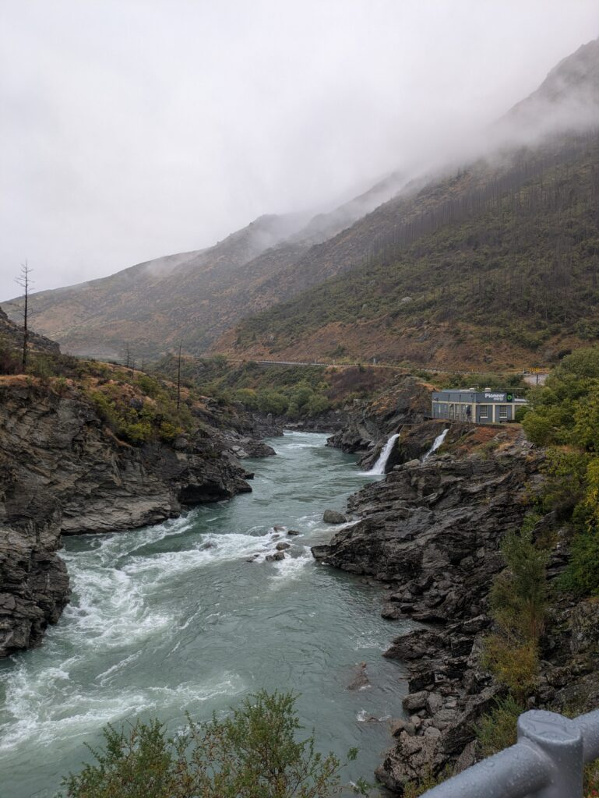

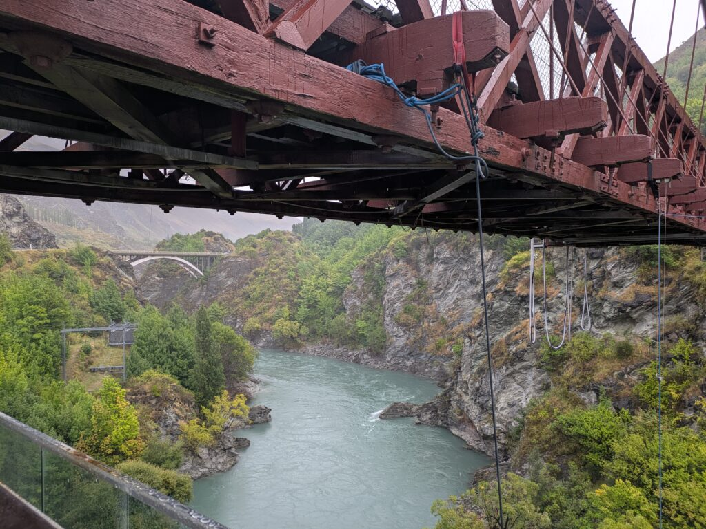

### Arrowtown Bakery in Arrowtown

その後に行ったのが[パイ屋](https://www.arrowtown.com/directory/food-and-drink/arrowtown-bakery/)さんですね。ここのパイはFairlieやSheffieldよりも安めではありました。それとコーヒーを頼みましたね。少し小さめですが味はとてもよかったです。それから謎のX看板がありました。謎に観光地になっているかと思います。

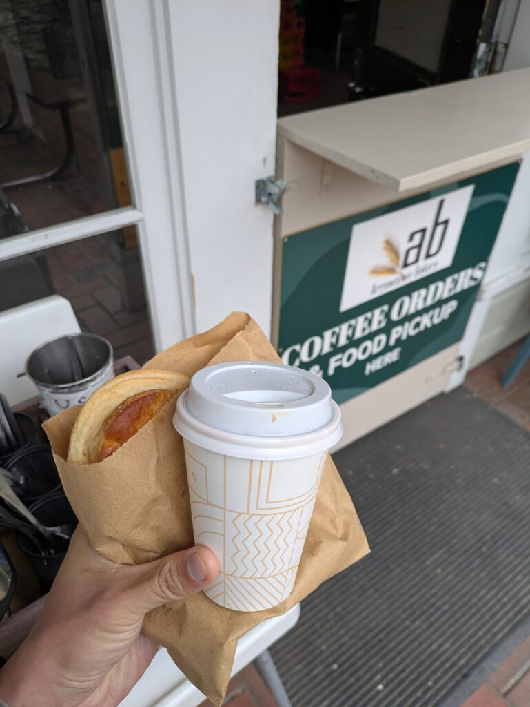

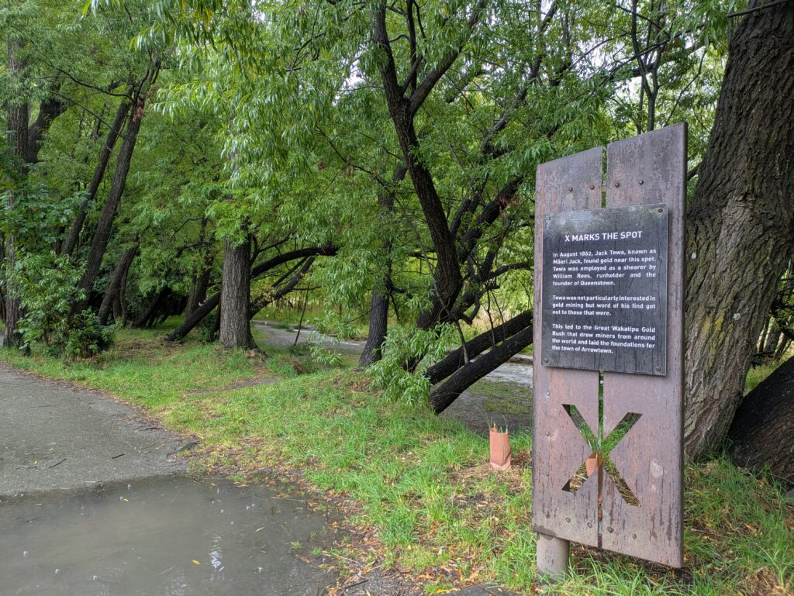

### Chinese settlement in Arrowtown

その後に行ったのはチャイニーズの跡地と橋ですね。跡地のほうは中心街からそこまで離れておらず5分くらい歩けば到着します。全てが家というわけではないと思いますが、すごく狭い場所もあってもしかしたら物置としても使われていたのかと思います。

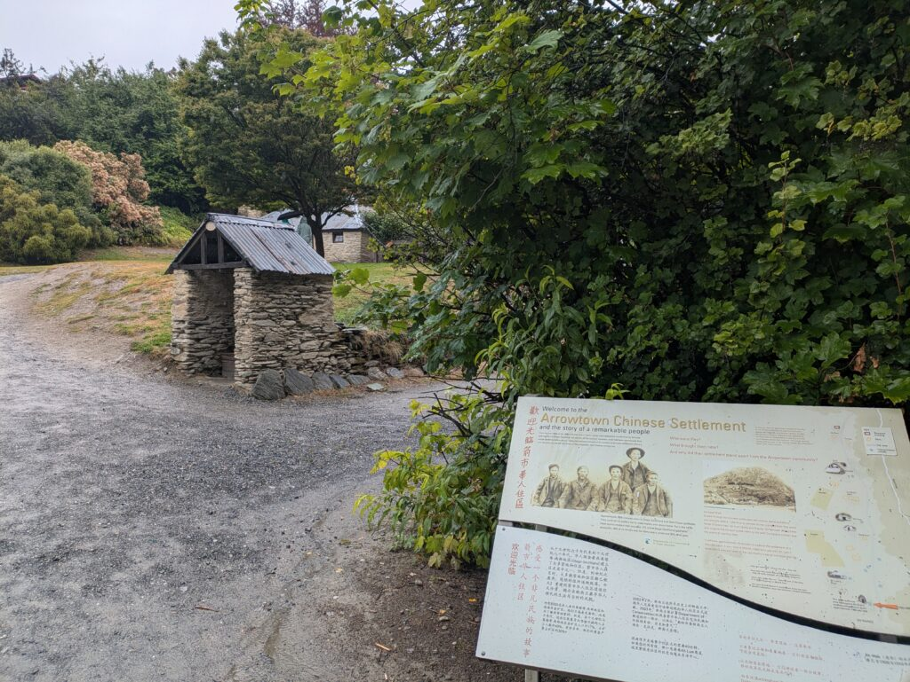

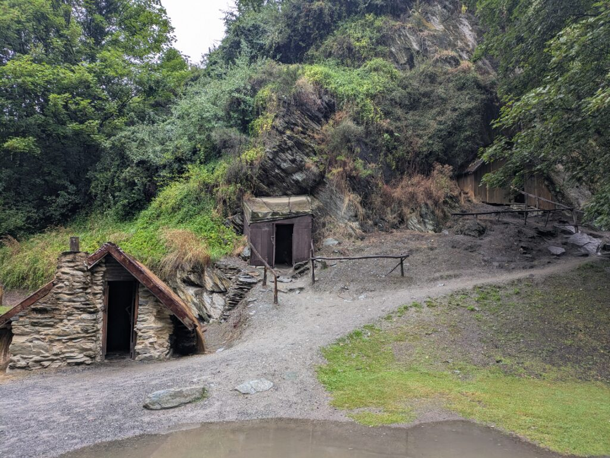

その後はNorman Smith Bridgeという場所に行きました。ここに行くまでの道中は道が細かったり険しい場所もありましたが、中々楽しい景色を見ることができました。太い水道管のようなものをたどっていく道中は面白かったですね。

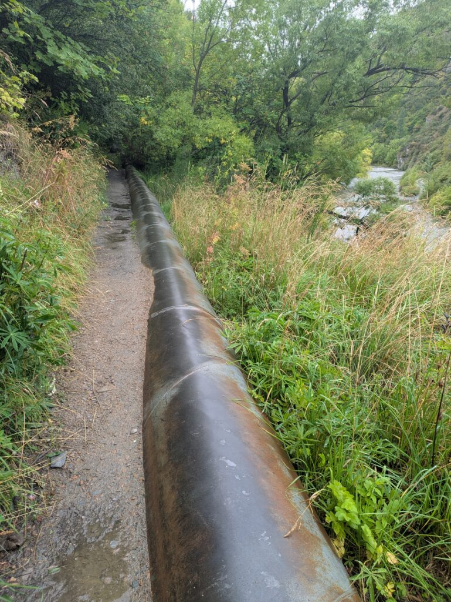

この橋は意外と揺れるので思ったよりは怖かったですね。この先は別のハイキングコースになるのでまだ行ってはないです。

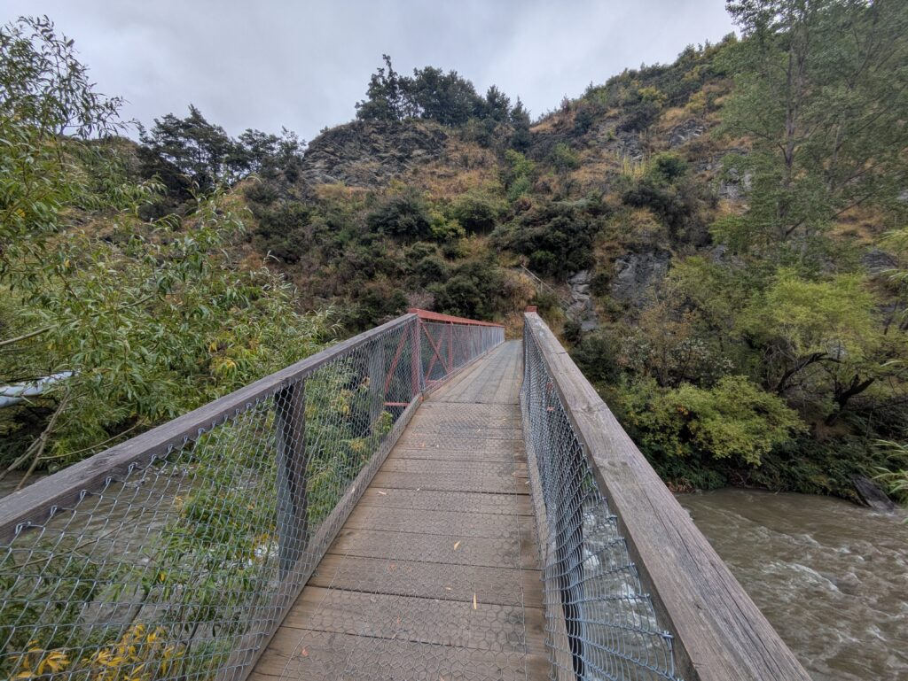

### Patagonia Chocolate and Slow Cuts in Arrowtown

その後中心街に戻ってきて[チョコレートショップ](https://www.patagoniachocolates.co.nz/?srsltid=AfmBOop-UkVBB_LlRG4HMOjow0beImd7ofpLga3V-CSBRfdottqmYUx5)と[ハンバーガー屋](https://slowcuts.co.nz/)さんに行きました。ここのチョコレートショップではアイスを頼みましたが、他にもブラウニーやらケーキやらも売っていたので今度来たときはそっちを注文してみようと思います。

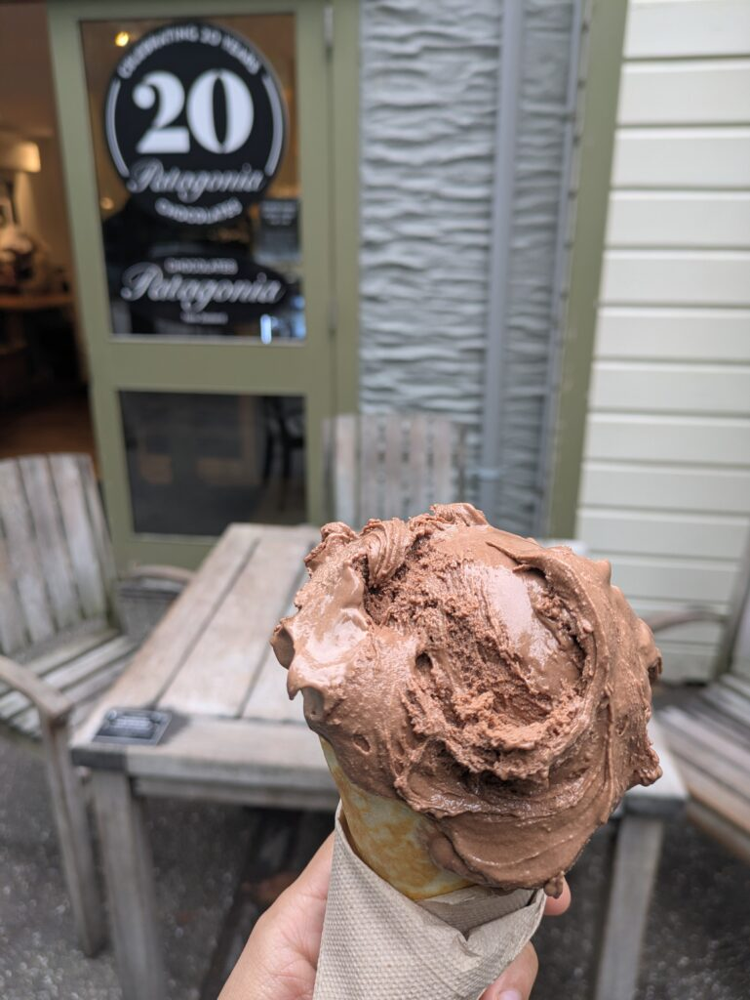

こちらのハンバーガーはシンプルなチーズバーガーですね。タレにメイプルジャムを使っているのも特徴ですね。大きさは普通ですが味はとてもよかったです。

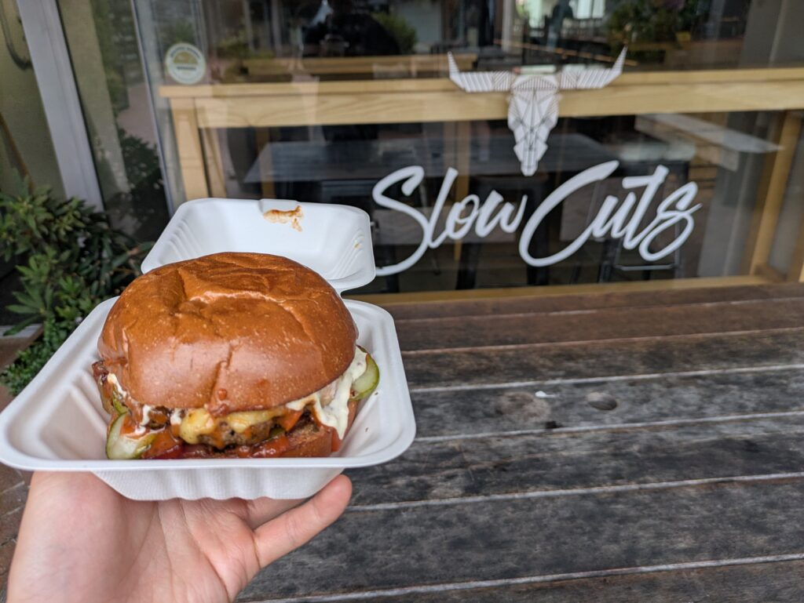

### Other sightseeing in Arrowtown

最後に街中で観光した場所ですね。一つ目はどこの街でも見かけなくなった電話ボックスですね。この電話ボックスも確か使えなかったかと思いますが、撤去されずに残ってるのは珍しいなと思います。

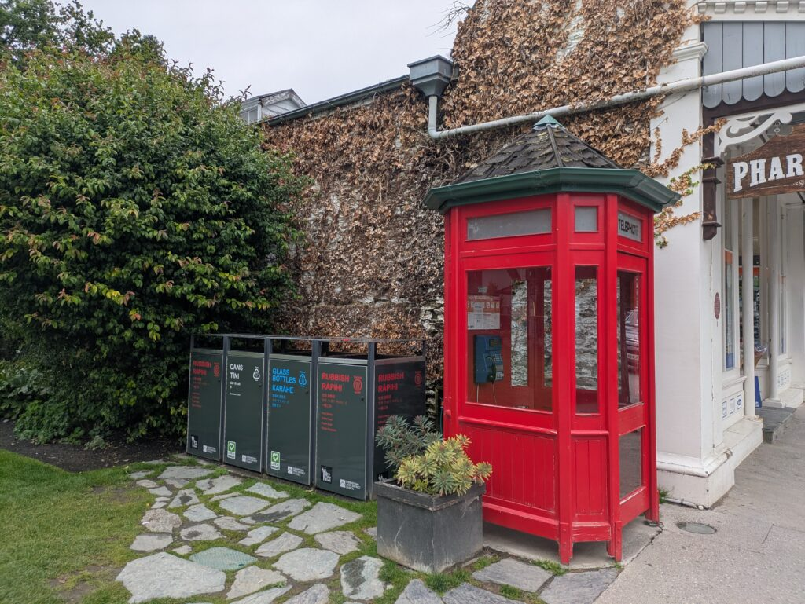

2つ目は博物館ですね。ここは元々金鉱が有名なのでそれを元に作られたものだと思います。今回は時間がなくて周れませんでしたが、次回は行ってみたいと思います。

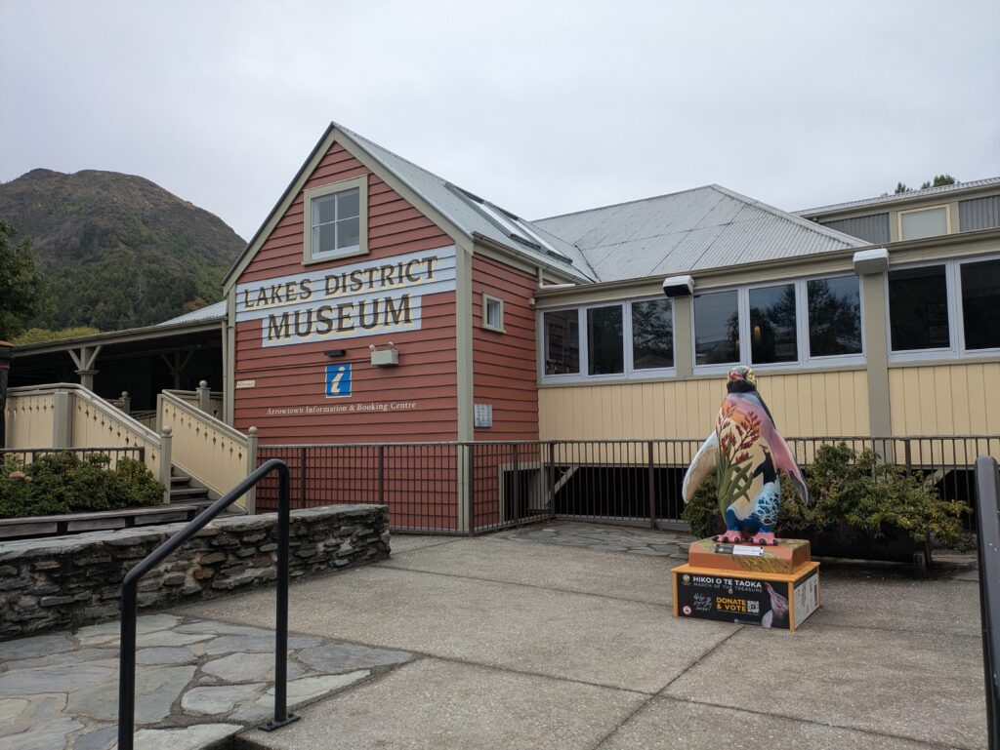

最後に戦争の記念碑ですね。第二次世界大戦でイギリス側に着いたニュージーランドの兵士たちが祀られている記念碑ですね。この場合は日本の敵対国として動いていたはずなので少し悲しいものがあります。景色はとてもよかったです。

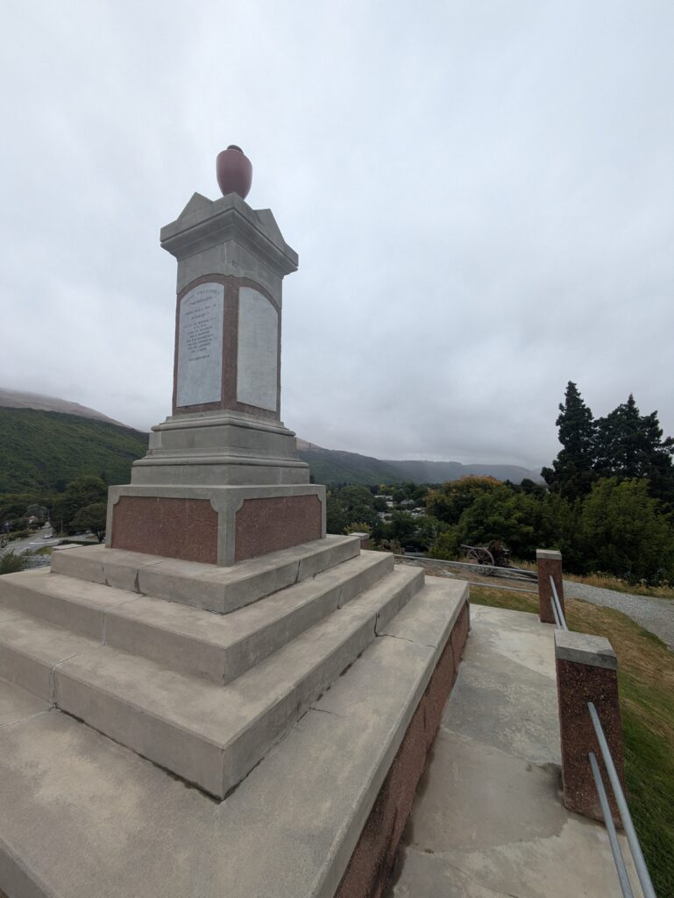

ここ以外にも他に魅力的な場所やレストランもあったのでもし機会があればまた行ってみたいと思います。また、ここに行ったときはゴルフの大会があったらしく日本人の方が上位にランクインしたという話も聞きました。ゴルフは全くわかりませんが、こういった場所で活躍しているという話が効けたのもうれしかったです。ではでは。

## AI採点

# 推定スコア（IELTS基準）

| Criteria | Band |
| --- | --- |
| Task Response | **6.0** |
| Coherence & Cohesion | **5.5** |
| Lexical Resource | **5.0** |
| Grammatical Range & Accuracy | **4.5** |

**Overall 推定: 5.0〜5.5**

理由

- 文法ミスが非常に多い

- 語彙の使い方が不自然

- 不完全な文がある

- スペルミス多数

ただし

- **内容は伝わる**

- **構造は理解可能**

→ IELTSでは **5.5くらいが妥当**

* * *

# 大きな問題点（重要）

主なミスのタイプ

1. **スペルミス**

3. **冠詞（a / the）**

5. **前置詞**

7. **自然な表現**

9. **名詞の単複**

IELTSでは  
**スペルミスはかなり減点されます**

例

```
seanarycoffieaddiationhumbergerburbergerncedin notsetteledfamouseWor Twoglof
```

* * *

# 文ごとの添削

## ①

あなたの文

```
I am going to write about Arrowtown because I went to sightseeing.
```

問題

- go sightseeing が正しい

- 過去形が必要

修正

```
I am going to write about Arrowtown because I went sightseeing there recently.
```

* * *

## ②

あなた

```
There were a river and bridge with bungy jumping before coming Arrowtown.
```

問題

- before coming Arrowtown ❌

- a river and bridge → a river and a bridge

- with bungy jumping → where you can do bungy jumping

修正

```
Before arriving in Arrowtown, there was a river and a bridge where people can do bungy jumping.
```

* * *

## ③

あなた

```
These were quite good seanary so that you should go there before going Queenstown.
```

問題

- scenery（不可算名詞）

- good scenery ❌

- so that you should ❌

修正

```
The scenery was beautiful, so it is worth visiting before going to Queenstown.
```

* * *

# Arrowtown Bakery

あなた

```
This pie was cheaper than Fairlie's one and Sheffield's one because of small but it was tasty.
```

問題

- because of small ❌

- one's ❌

- 文が崩れている

修正

```
The pies here were cheaper than the ones in Fairlie and Sheffield. They were small, but very tasty.
```

* * *

あなた

```
Moreover, I ordered coffie.
```

問題

- spelling

修正

```
Moreover, I ordered coffee.
```

* * *

あなた

```
In addiation, there was the X sign which is sightseeing.
```

問題

- addition

- which is sightseeing ❌

修正

```
In addition, there was a mysterious X sign which has become a small tourist attraction.
```

* * *

# Chinese Settlement

あなた

```
I then went to Chinese former site and a bridge.
```

問題

- Chinese former site ❌

修正

```
I then went to the former Chinese settlement and a bridge nearby.
```

* * *

あなた

```
The site was not far from a central city
```

問題

- the city centre

修正

```
The site was not far from the city centre.
```

* * *

あなた

```
it took for 5 minutes on foot
```

問題

- took for ❌

修正

```
It took about five minutes to walk there.
```

* * *

あなた

```
All buildings were not house
```

問題

- 不自然

- houses

修正

```
Not all the buildings were houses.
```

* * *

# Norman Smith Bridge

あなた

```
I saw wonderful viewing on the way
```

問題

- viewing ❌

修正

```
I saw beautiful scenery on the way.
```

* * *

あなた

```
the way beside a fat water pipe
```

問題

- fat ❌

修正

```
a large water pipe
```

* * *

あなた

```
it was so funny
```

問題

funny → 意味違う

修正

```
It was quite interesting.
```

* * *

# Chocolate shop

あなた

```
I went to a chocolate shop and humberger shop
```

修正

```
I went to a chocolate shop and a hamburger restaurant.
```

* * *

あなた

```
It was feature that maple jam was used as sauce.
```

問題

構文ミス

修正

```
One unique feature was that maple jam was used as the sauce.
```

* * *

あなた

```
taste was so nce
```

修正

```
The taste was very nice.
```

* * *

# Telephone booth

あなた

```
which I almost din not see many cities
```

問題

文法崩壊

修正

```
which you rarely see in many cities nowadays
```

* * *

# Museum

あなた

```
which was setteled because this city was famouse as gold mining
```

問題

構文崩壊

修正

```
which was built because the town was famous for gold mining.
```

* * *

# War memorial

あなた

```
NZ warriors was enshrined
```

問題

- warriors ❌

- was ❌

修正

```
New Zealand soldiers who fought in World War II are commemorated there.
```

* * *

あなた

```
Japan was enemy against NZ
```

修正

```
Japan was an enemy of New Zealand at that time.
```

* * *

# 最後

あなた

```
a gold competition was held
```

問題

golf

修正

```
a golf competition was held
```

* * *

# IELTS 7.5〜8にするための改善

重要ポイント

### ①スペル

あなたの最大の減点

IELTSでは

**スペルミス1〜2個でも減点**

あなたの文章

**15個以上**

* * *

### ②自然なコロケーション

例

❌ good scenery  
⭕ beautiful scenery

❌ funny road  
⭕ interesting road

* * *

### ③シンプルな文にする

あなたの文章

長くしようとして崩れる

例

❌

```
This pie was cheaper than Fairlie's one and Sheffield's one because of small but it was tasty
```

⭕ IELTS高得点

```
The pies were cheaper than those in Fairlie and Sheffield. They were small but very tasty.
```

* * *

# あなたの文章をBand 8レベルに書き直すと

例（最初）

```
Recently, I visited Arrowtown and did some sightseeing, so I would like to write about my experience.Before arriving in Arrowtown, there was a river and a bridge where people can do bungy jumping. The scenery around the area was beautiful, so I recommend stopping there before heading to Queenstown.First, I visited Arrowtown Bakery. The pies there were cheaper than those in Fairlie and Sheffield. Although they were slightly smaller, they were very tasty. I also ordered a coffee. Interestingly, there was a mysterious X sign that seems to have become a small tourist attraction.
```

* * *

# 総評

あなたの英語の特徴

良い点

- 内容は分かる

- 構造はある

- 語彙はそこそこある

弱点

- **スペル**

- **冠詞**

- **前置詞**

- **自然な英語**

# 修正版（Band 8レベル）

Recently, I visited Arrowtown and did some sightseeing, so I would like to share my experience there.

Before arriving in Arrowtown, there is a famous river and bridge where people can do bungy jumping. Even if you are not interested in trying bungy jumping, the scenery around the area is beautiful. Therefore, it is worth stopping by before heading to Queenstown.

## Arrowtown Bakery

After that, I visited Arrowtown Bakery. The pies there were cheaper than the ones I had in Fairlie and Sheffield. Although they were slightly smaller, they were very tasty. I also ordered a coffee, which went well with the pie. Interestingly, there was a mysterious X-shaped sign nearby that seems to have become a small tourist attraction.

## Chinese Settlement

Next, I went to the Chinese Settlement and a nearby bridge. The settlement is located only about a five-minute walk from the town centre, so it is very easy to access. Not all of the buildings were houses. Some of them were extremely small, so they might have been used as storage spaces rather than living areas.

Later, I visited Norman Smith Bridge. The path leading to the bridge was sometimes narrow and a little challenging, but the scenery along the way was beautiful. Walking along a path beside a large water pipe was particularly interesting and unique.

The bridge itself shook more than I expected, which made it slightly scary. The trail continues beyond the bridge as a hiking course, but I have not explored that part yet.

## Patagonia Chocolate and Slow Cuts

After that, I returned to the town centre and visited a chocolate shop and a hamburger restaurant.

At the chocolate shop, I ordered ice cream. However, they also had brownies and cakes, so I would like to try those next time.

The hamburger I ordered was a simple cheeseburger. One unique feature was that maple jam was used as part of the sauce. Although the size was average, the taste was excellent.

## Other Sightseeing

Finally, I visited a few other places in the town.

First, I saw an old telephone booth. These days, it is rare to see telephone booths in many cities. I believe this one may no longer work, but it was interesting that it had been preserved rather than removed.

Second, there was a museum. Arrowtown was historically famous for gold mining, so I assume the museum was built to showcase that history. Unfortunately, I did not have enough time to visit it this time, but I would like to explore it on my next trip.

Lastly, I saw a war memorial dedicated to New Zealand soldiers who fought in World War II. Since Japan was one of the countries fighting against New Zealand during the war, seeing the memorial gave me slightly mixed feelings. However, the surrounding scenery was very beautiful.

There are many other attractive places and restaurants in Arrowtown, so I would like to visit again if I have the chance. I also heard that a golf tournament was being held there at the time and that a Japanese player ranked highly in the competition. Although I do not know much about golf, I was happy to hear that a Japanese player performed well in such an event.

* * *

# IELTS的に良くなったポイント

### ①自然なコロケーション

例

- beautiful scenery

- worth stopping by

- slightly smaller

- town centre

* * *

### ②複雑な文構造

IELTS高得点に必要

例

```
Although they were slightly smaller, they were very tasty.
```

```
Since Japan was one of the countries fighting against New Zealand during the war
```

* * *

### ③語彙レベル

あなたの元の文

```
good scenery
```

改善

```
beautiful scenery
```

* * *

# 推定スコア

この書き直し

| 項目 | Band |
| --- | --- |
| Task Response | 7.5–8 |
| Coherence | 7.5 |
| Lexical Resource | 7–8 |
| Grammar | 7.5 |

**Overall: 7.5〜8**
