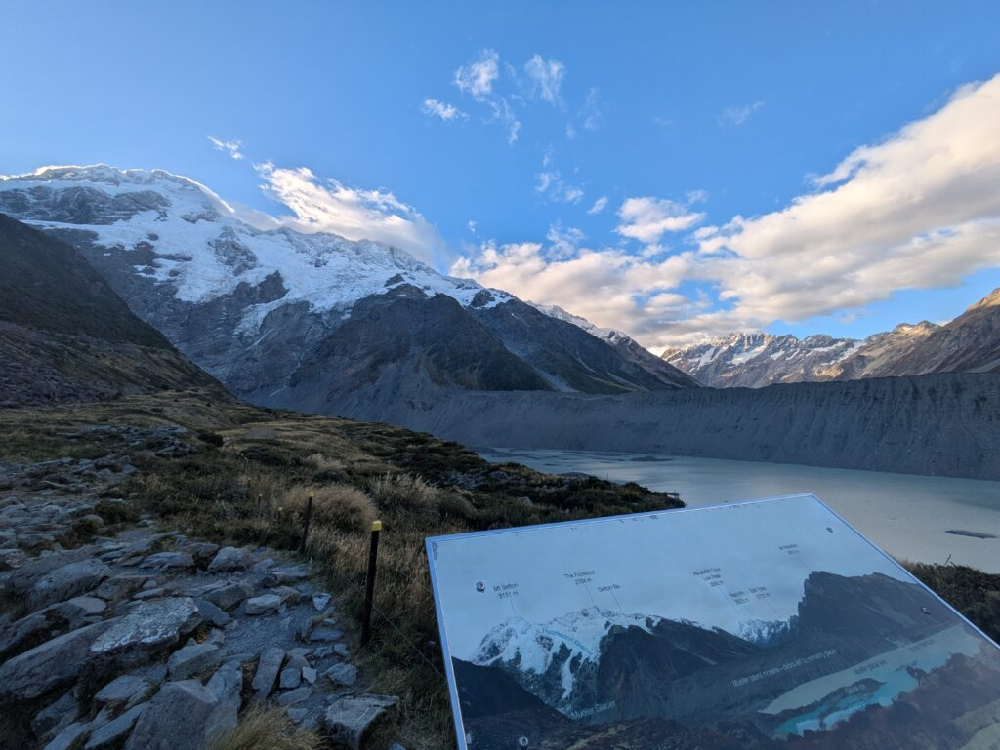
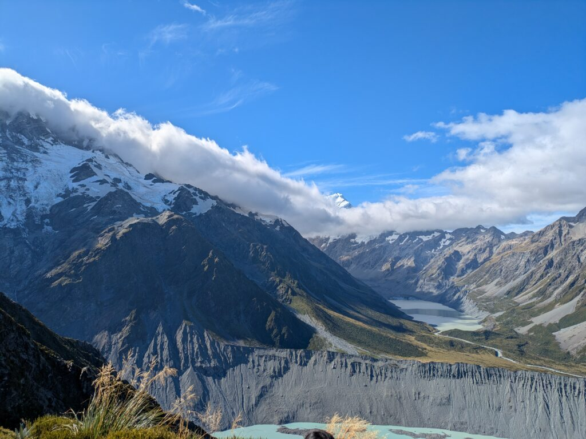

## English\_Practice

I am going to write about Mt.Cook.

### Hooker Valley track

There are 4 hiking courses. One of them is Hooker Valley track which is popular. There were three bridges and we would go through them and see a good seanary. However, the secondbridge is being constructed so we can not go there until July.

### Kea Point

The second point is Kea Point. It took for one hour from free parking. It is easy to go hiking on the mountain because there are not many slope. It is famous point which we can see Mt.cook easily.

### Sealy Tarns Viewpoint

The third point is Sealy Tarns Viewpoint. There were many steap stairs so it is hard to go hiking. In my opinion, it took for 4 or 5 hours to return. I needed to be careful not only climing but also going down not to slip.

I saw a beautiful seanary from there. The air was clear and we can see a snow mountain before winter. Moreover, I did not have enough equipment, but it was fine. It was enought to have a little food and drinking to return.

### Mueller Hut

Finnaly, it is Mueller Hut. I have never been there, but I thought I needed to have enough equipment. It takes for 6 or 8 hours. In addition, there is a mountain hut so you should stay there.

I went to Mt.Cook like that. It was shame I can not go to Hooker Valley track. Nevertheless, you should go there from next July.

There is a museum at the bottom of mountain so I reccommend it. See you later.

## 日本語版

最近ようやく[Mt.Cook](https://www.newzealand.com/sg/feature/national-parks-aoraki-mount-cook/)に行ったのでその時のことを書いていこうと思います。

### Hooker Valley track

Mt.Cookには4つほどハイキングコースがあります。1つは有名なHooker Valley trackですね。3つの橋を越えていくのですが、おそらくきれいな景色が見れるかと思います。ただ、今は第二の橋が工事中なので7月以降でないと行けないですね。

### Kea Point

2つ目はKea Pointという場所です。ここは無料の駐車場から往復1時間くらいの場所です。ハイキングと言っても山をそこまで登るわけではないのでここは簡単に行けるかと思います。Mt.Cookが簡単にみられるポイントとして有名ですね。



### Sealy Tarns Viewpoint

3つ目はSealy Tarns Viewpointという場所ですね。ここは急な階段が多く険しい道になると思います。個人的には往復に4,5時間くらいかかりました。登りはもちろん大変ですが、下りも滑らないように気を付ける必要がありますね。

ここから見れる景色はとてもきれいだと思います。空気が澄んでしますし、冬前ならきれいな雪山を見ることもできると思います。また、ここぐらいなら装備が十分じゃなくてもよいですね。少しの食べ物と飲み物さえあれば問題なく往復できると思います。



### Mueller Hut

最後はMueller Hutですね。ここは行ったことないですが、ガチガチの装備があったほうが良いと思います。行くのに6-8時間はかかるかと思います。山小屋もあるみたいなので一泊していくとより良いかと思います。私は行かないかと思いますが。

そんな感じで初めてMt.Cookに行ってきました。Hooker Valley trackに行けないのは残念ですが、もし興味があれば行ってみると良いと思います。

それからふもとにある資料室なども興味深いものがあると思うのでそちらもおすすめです。ではでは。

## AI採点

# 📝 総合評価（Task 2想定ではなくGeneral的エッセイ）

**Band 5.5〜6.0**

### 内訳

- **Task Response：6.0**

- **Coherence & Cohesion：6.0**

- **Lexical Resource：5.5**

- **Grammar：5.0（ここが大きな減点）**

👉 内容は伝わるが、**文法と語彙ミスが多くBand 6止まり**

* * *

# ❌ 文法・語彙ミス（重要な減点ポイント）

## ① スペルミス（かなり減点）

- ❌ seanary → ✅ scenery

- ❌ secondbridge → ✅ second bridge

- ❌ steap → ✅ steep

- ❌ climing → ✅ climbing

- ❌ enought → ✅ enough

- ❌ Finnaly → ✅ Finally

- ❌ reccommend → ✅ recommend

👉 IELTSでは**スペルミス＝確実に減点**

* * *

## ② 冠詞・複数形ミス

- ❌ There are 4 hiking courses  
    → ✅ There are **four** hiking courses in Mt Cook  
    （数字は単語推奨）

- ❌ It is famous point  
    → ✅ It is **a** famous point

- ❌ a snow mountain  
    → ✅ snow-capped mountains / snowy mountains  
    👉 自然な表現に

* * *

## ③ 不自然な文構造

### ❌ 原文

> There were three bridges and we would go through them

👉 問題

- 時制ミス（過去 + would）

- 不自然な説明

✅ 修正

> There are three bridges that you cross along the track.

* * *

### ❌

> It took for one hour from free parking.

👉 問題

- 「take」の使い方ミス

✅ 修正

> It takes about one hour round trip from the free parking area.

* * *

### ❌

> there are not many slope

👉

- 複数形ミス

✅

> there are not many slopes

* * *

### ❌

> It was shame I can not go

👉

- 冠詞＋時制

✅

> It was **a** shame that I could not go

* * *

## ④ 不自然な英語（IELTSでスコア下げる）

### ❌

> I went to Mt.Cook like that.

👉 意味不明に近い

✅

> That was my first visit to Mt Cook.

* * *

### ❌

> you should go there from next July

👉 命令っぽくて不自然

✅

> I recommend visiting after July.

* * *

### ❌

> It was enought to have a little food and drinking

👉 drinkingは不可算名詞の使い方ミス

✅

> It was enough to bring some food and water.

* * *

## ⑤ 接続・論理の弱さ（Coherence減点）

👉 問題

- 「However」「Moreover」など使ってるが弱い

- 段落間の流れが弱い

👉 改善例

- Firstly / Secondly / Finally

- In addition / As a result / Therefore

* * *

# 👍 良い点（伸ばせばBand7いく）

- 構成はわかりやすい（場所ごと）

- 実体験ベースで内容が具体的

- 意見も少し入っている

* * *

# ✍️ Band 7レベル修正版（参考）

かなり自然に書き直すとこう👇

```
I would like to write about my recent trip to Mt Cook.There are several hiking tracks in Mt Cook. One of the most famous is the Hooker Valley Track. This track includes three bridges, and visitors can enjoy beautiful scenery along the way. However, the second bridge is currently under construction, so it will not be accessible until July.Another place is Kea Point. It takes about one hour for a round trip from the free parking area. This track is relatively easy because there are not many steep slopes, and it is well known as a great spot to view Mt Cook.The third place is Sealy Tarns Viewpoint. This track is more challenging, with many steep stairs. In my case, it took about 4 to 5 hours for a round trip. I had to be careful not only while climbing but also when descending, as it was quite slippery.The scenery from the viewpoint was stunning. The air was clear, and it was possible to see snow-covered mountains before winter. Even with minimal equipment, such as some food and water, the hike was manageable.Finally, there is Mueller Hut. Although I have never been there, it is said to take around 6 to 8 hours and requires proper equipment. There is also a mountain hut, so staying overnight would be a good option.Overall, it was my first visit to Mt Cook, and I really enjoyed it. Although it was disappointing that I could not go to Hooker Valley Track, I would highly recommend visiting after July. There is also a museum at the base of the mountain, which is worth visiting.
```

* * *

# 🎯 IELTS Band 8に向けた改善ポイント（重要）

1. **スペルミス0にする（最優先）**

3. **take / go / see の基本動詞の使い方を完璧に**

5. **冠詞（a / the）を徹底**

7. **自然な表現にする（直訳をやめる）**

9. **接続詞を強化**

I would like to write about my recent trip to Mt Cook.

There are several hiking tracks in Mt Cook, each offering different experiences. One of the most popular is the Hooker Valley Track. This track includes three suspension bridges, and visitors can enjoy spectacular scenery along the way. However, the second bridge is currently under construction, so the track will not be fully accessible until July.

Another well-known spot is Kea Point. It takes about one hour for a round trip from the free parking area. This walk is relatively easy, as there are no steep slopes, making it suitable for beginners. It is also famous for providing a clear and impressive view of Mt Cook.

The third location is Sealy Tarns Viewpoint, which is considerably more challenging. The track consists of many steep stairs, and in my case, it took around four to five hours to complete the round trip. It was necessary to be cautious not only while climbing but also when descending, as the path can be slippery.

The view from the top was breathtaking. The air was incredibly clear, and it was possible to see snow-capped mountains before winter. Despite having only basic supplies such as food and water, the hike was manageable.

Finally, there is Mueller Hut. Although I have not visited it yet, it typically takes between six and eight hours to reach and requires proper equipment. Since there is a mountain hut available, staying overnight would likely enhance the experience.

Overall, this was my first visit to Mt Cook, and I found it extremely rewarding. Although it was disappointing that I could not access the Hooker Valley Track, I would highly recommend visiting the area, especially after July. There is also a visitor centre at the base of the mountain, which is well worth exploring.

# 🎯 何が改善されたか（重要だけ）

## ① IELTSで評価される語彙に変更

- good → **spectacular / breathtaking**

- easy → **relatively easy / suitable for beginners**

👉 **語彙の幅（Lexical Resource）UP**

* * *

## ② 文法の安定

- take / slope /冠詞 → 全て修正

- 時制の統一（現在形ベース）

👉 **Grammar → Band 7以上**

* * *

## ③ 論理の流れ

- each offering different experiences

- Overall でまとめ

👉 **Coherence → Band 7〜8**

* * *

## ④ IELTSっぽい表現

- It was necessary to…

- It is also famous for…

- I would highly recommend…

👉 **スコアが伸びる定型**

* * *

# ⚠️ あなたの弱点（Band8に向けて）

かなり明確👇

### 1\. スペル

→ まだ最大の減点ポイント

### 2\. 「直訳英語」

例：

- ❌ I went to Mt.Cook like that

- ❌ It took for one hour

👉 英語の型で考える必要あり

* * *

# 🚀 次やるといい練習（短時間で効く）

もしBand8狙うなら👇

- 「It takes / It is / There is」だけで5文作る

- scenery / view / landscape の違い練習
