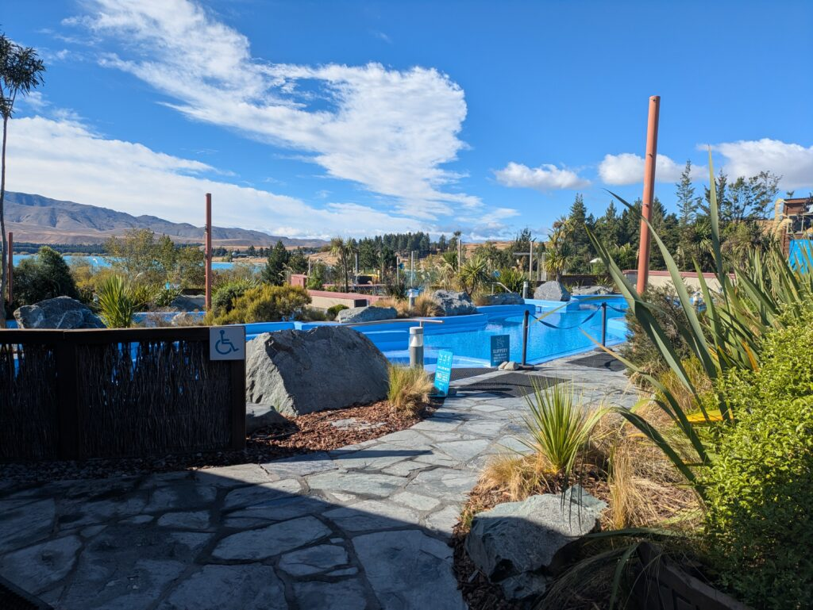
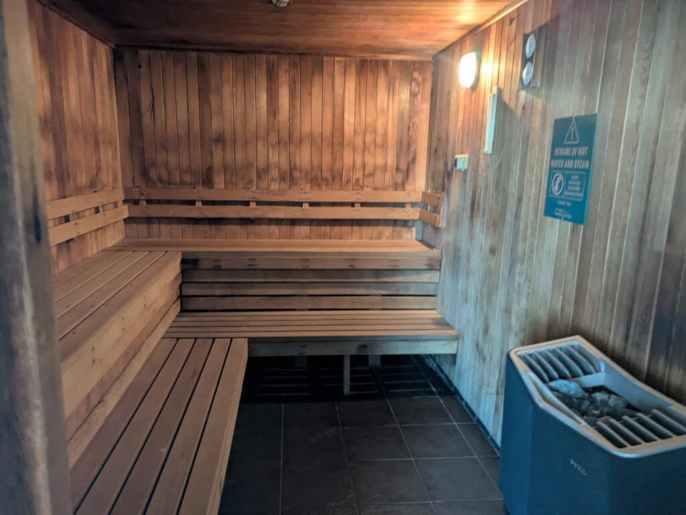
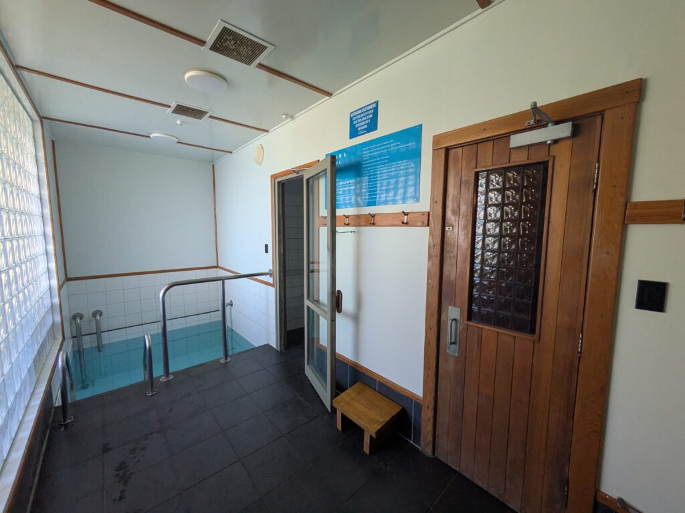

## English\_Practice

There is Hot Spring in Tekapo. It is a little different to Hot Spring. I think it is similar to hot pool because I needed to wear a swimsuit and the maximum temperture is 38 degree.

### Tekapo Spring

There are a variety of pool. For example, kids pool, 35 degree in pool, 37 degree in pool and 38 degree in pool.

Moreover, when I went there in the morning, I could take it easy to relax. The pool is more clearly.

### Tekapo Spring Sauna

There is a sauna. I needed to pay extra cost, but it was so good. My firend told me it was a very good sauna. It is made of wood and we did Löyly.

There are a cold pool and steam sauna. I felt comfortable after going in sauna and cold pool. It was 80 degree of a steam sauna.

### Tekapo Spring other facilities

There was also mini gold. However, There is a skate link in winter so we can play skating.

The other facility is massage. It cost very expensive, but it may be so comfortable. I have no idea because I have never been massaged.

I have an advantage which I can enter Hot Spring for free. If I have a car, I can go there for 5 minutes so it is usefull.

If you work at the restaurant, there is an accomodation and staff meal so you can save more many. If you are interesterd in it, you should work in Tekapo. See you later.

## 日本語版

Tekapoには[Hot Spring](https://tekaposprings.co.nz/)があります。温泉とは少し違いどちらかというとホットプールのほうがイメージしやすいと思います。というのも水着を着て中にはいりますし、温度は高くて38度だからですね。

### Tekapo Spring



ここの施設としてはまずは色んな種類のプールがあることですね。子供用のプールから35,37,38度のプールがあります。

ちなみに朝方に行けば全く人がいないのでかなりゆっくりすることができますね。プールもきれいな方だと思いますし。

### Tekapo Spring サウナ

それから他の施設としてはサウナがあります。別料金になりますがかなりいいサウナに入ることができます。私の友達はいいサウナだと話していました。木造でロウリュもすることができるのでかなりいいかと思います。



サウナ以外にも水風呂とスチームサウナがあります。水風呂はサウナは行った後に行くとかなり心地よく感じます。十分に冷たいので。スチームサウナは大体80度くらいの温度ですね。



### Tekapo Spring その他の施設

これ以外にもミニゴルフがあります。ただ、冬の季節になればスケートリンクになるのでスケートで遊ぶこともできます。

他の施設だとマッサージですね。値段は張りますが気持ちいいのだと思います。流石に私はやったことないので何とも言えませんが。

[ここ](/posts/2026/02/exploretekapo-housekeeper-reception-work-experience/)で働いていることのメリットとしてSpringにただで入ることができます。なのでもし車を持っていれば町中から5分で行くことができるのでとても有意義だと思います。

もしレストランで働いていれば宿泊施設もありますし、賄いもあるのでかなりお金を節約することができると思います。もし興味があればぜひここ周辺で働いでみてください。ではでは。

## AI採点

# 📝 総合評価

**Band 5.5 – 6.0**

### 理由（重要ポイント）

- 内容は伝わるが「説明が浅い＋不自然な英語」が多い

- 文法ミス（特に単数複数・冠詞・前置詞）が多い

- 語彙がシンプルすぎてBand 7以上に届かない

* * *

# 📊 各項目別評価

## ① Task Response（内容）

**Band 6.0**

- 施設の説明はできている

- ただし「比較・評価・理由」が浅い

- IELTSでは「なぜ良いのか」をもう一段深く説明が必要

👉 例（不足）

- “It was good” → なぜ？どう良い？

* * *

## ② Coherence & Cohesion（構成）

**Band 6.0**

- セクション分けは良い（Saunaなど）

- ただしつなぎが弱い

👉 改善

- Moreover / In addition / As a result を使う

* * *

## ③ Lexical Resource（語彙）

**Band 5.5**

- 基本語ばかり（good / very / many）

- 不自然な表現が多い

👉 例（減点）

- ❌ very expensive → 使えるが弱い

- ❌ very good → 幼い印象

👉 改善

- excellent / relaxing / well-maintained / affordable

* * *

## ④ Grammar（文法）

**Band 5.0（ここが最大の問題）**

かなり減点されています👇

* * *

# ❌ 文法ミス（重要）

## 1\. 冠詞（a / the）

❌ There is Hot Spring  
→ ✅ There is **a** hot spring

❌ There is a sauna（OK）  
→ ただし全体的に「a / the」抜けが多い

* * *

## 2\. 単数・複数

❌ a variety of pool  
→ ✅ a variety of **pools**

❌ 35 degree in pool  
→ ✅ a **35-degree pool**

* * *

## 3\. 前置詞

❌ different to Hot Spring  
→ ✅ different **from** hot springs

* * *

## 4\. スペルミス（かなり減点）

- temperture → temperature

- firend → friend

- gold → golf

- link → rink

- accomodation → accommodation

- interesterd → interested

- many → money

👉 IELTSではスペルミスは確実に減点

* * *

## 5\. 不自然な英語（重要）

❌ I could take it easy to relax  
→ ✅ I could relax comfortably

❌ The pool is more clearly  
→ ❌意味不明  
→ ✅ The pool is clean / well-maintained

❌ It cost very expensive  
→ ❌文法ミス  
→ ✅ It is quite expensive

❌ I have an advantage which I can enter  
→ ❌不自然  
→ ✅ One advantage is that I can enter

* * *

## 6\. 文構造の弱さ

ほぼ「S + V」だけ  
→ 複雑構文がない

👉 IELTS 7以上には必須

- which / that / although / while

* * *

# 🧠 改善ポイント（最重要3つ）

### ① 冠詞 + 単数複数

👉 IELTSで一番落とすポイント

* * *

### ② 「good / very」を卒業

👉 語彙スコアを上げる

* * *

### ③ 1文を長くする

👉 例：

- ❌ It is good. It is clean.

- ✅ It is clean and well-maintained, making it a relaxing place.

* * *

# ✍️ Band 7レベルの改善例（導入だけ）

```
There is a hot spring facility in Tekapo called Tekapo Springs. It is slightly different from traditional hot springs, as visitors are required to wear swimsuits, and the water temperature is relatively moderate at around 38 degrees. Therefore, it is more accurate to describe it as a hot pool rather than a typical hot spring.
```

* * *

# 🎯 総評（短く）

- 内容：OK

- 文法：弱い（特に冠詞・複数）

- 語彙：シンプルすぎ

👉 **IELTS 7を目指すなら「文法＋語彙」が最優先**

There is a hot spring facility in Tekapo called Tekapo Springs.  
However, it is slightly different from traditional hot springs, as visitors are required to wear swimsuits, and the water temperature is relatively moderate at around 38 degrees.  
Therefore, it is more accurate to describe it as a hot pool rather than a typical hot spring.

The facility offers a variety of pools, including a children's pool and several hot pools with temperatures ranging from 35 to 38 degrees.  
As a result, visitors can choose a pool depending on their preference.  
In addition, if you visit early in the morning, it is usually very quiet, which allows you to relax comfortably.  
The pools are also clean and well-maintained.

There is also a sauna available at an additional cost.  
According to my friend, it is of high quality, and it is made of wood, allowing visitors to enjoy Löyly, which enhances the overall sauna experience.  
Furthermore, there is a cold pool and a steam sauna.  
After using the sauna, entering the cold pool feels extremely refreshing.  
The steam sauna is maintained at a temperature of around 80 degrees.

In terms of other facilities, there is a mini golf course.  
During the winter season, this area is transformed into an ice-skating rink, providing visitors with a different type of entertainment.  
There is also a massage service available. Although it is quite expensive, it is likely to be very relaxing.

One of the main advantages of working there is that employees can use the hot springs for free.  
Moreover, if you have a car, it only takes about five minutes to get there from the town centre, making it very convenient.  
Additionally, if you work at the restaurant, accommodation and staff meals are provided, which helps reduce living expenses significantly.

Overall, Tekapo Springs is a well-equipped and relaxing facility, and I would highly recommend visiting or even working there if you have the opportunity.
