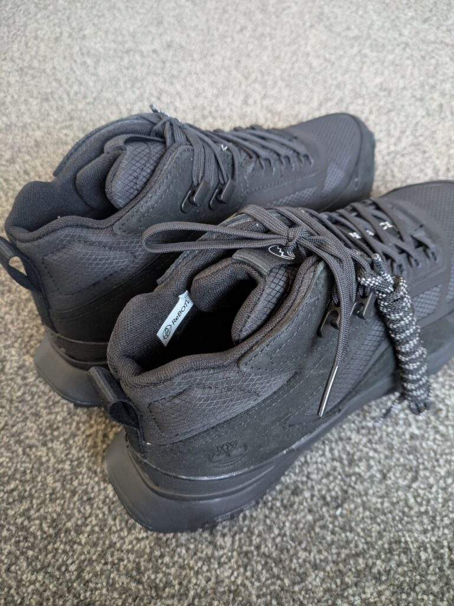
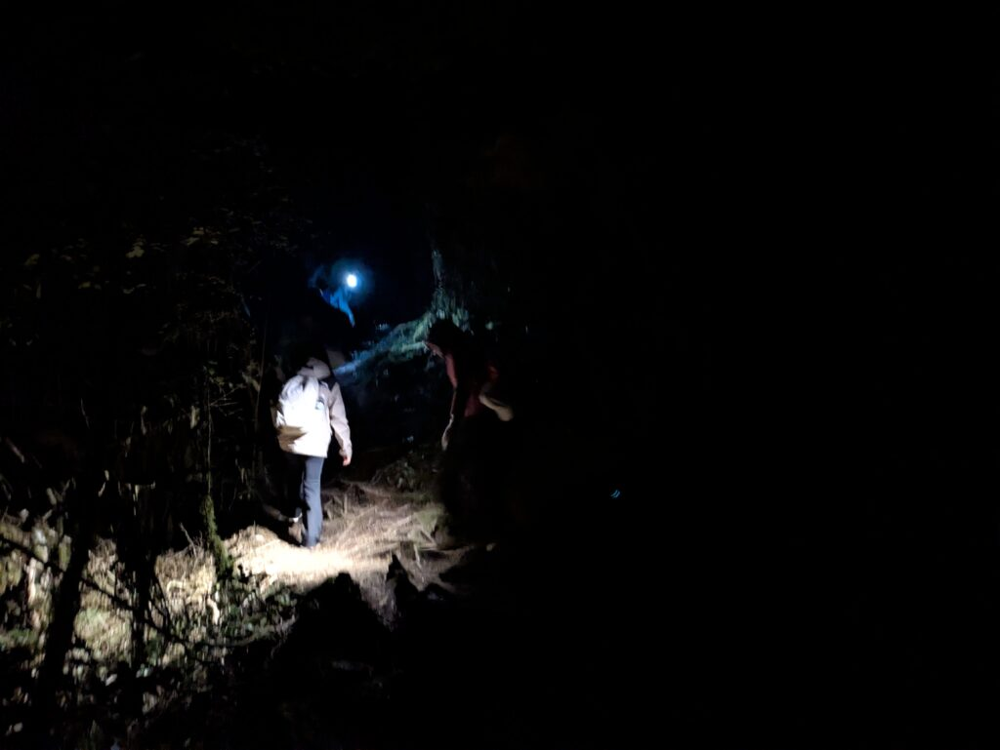
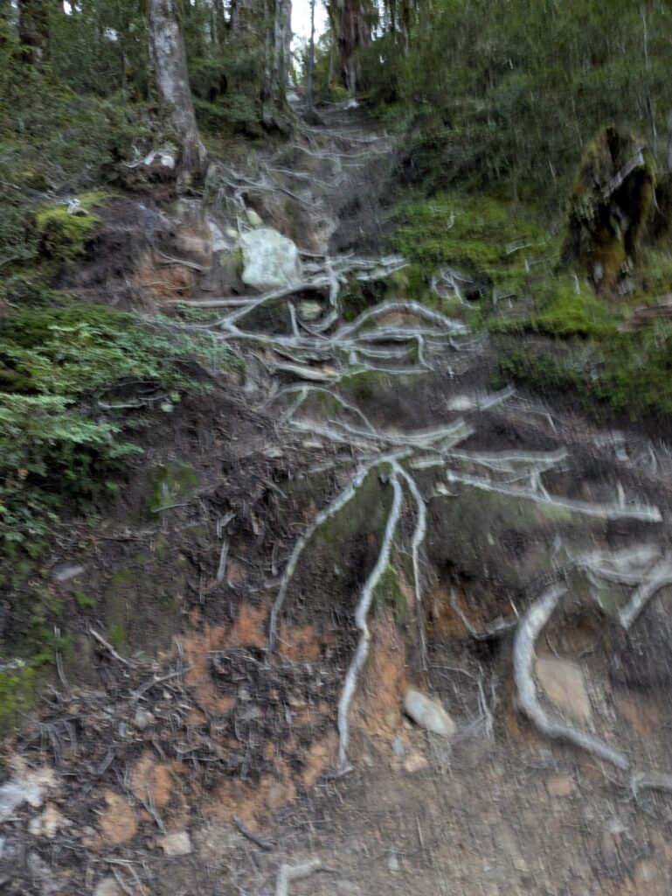
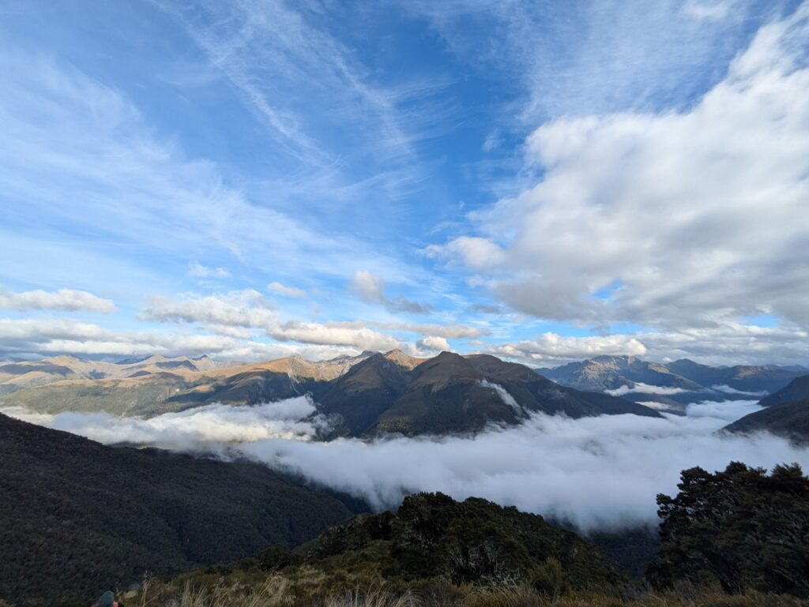
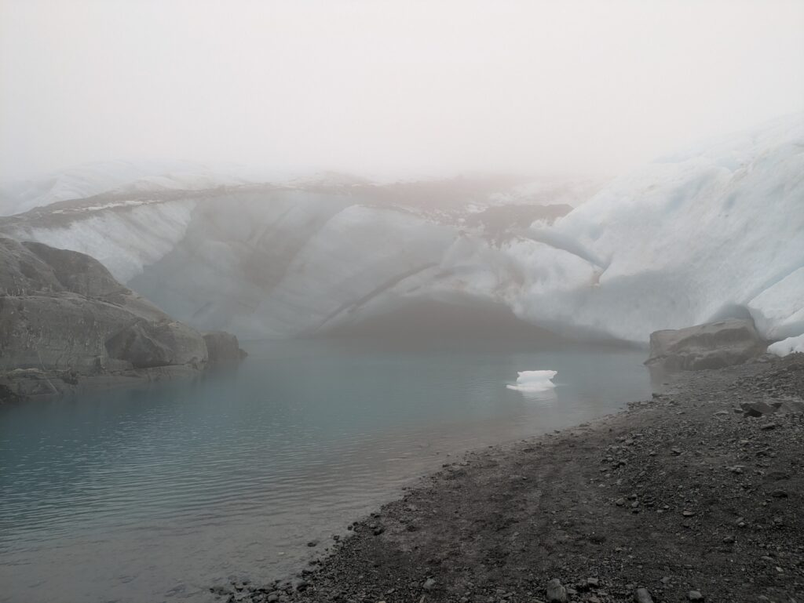

## English\_Practice

### Hiking shoes

I am going to write about hiking. Actually, I bought hiking shoes before doing. I guess normal shoes were fine but I thought it was hard and it cost $160 because it sold half price online.

### Brewster Mountain

When I went there around 6 a.m., it was still dark. Moreover, I had to go across the river and it was autumn so my feet felt cold and it was a bit bad begining.

It was a little easy to go up because there were tree route. I saw very beautiful seanary after clim up. It took for 2 or 3 hours to go there. Moreover, we needed to go up more.

### Brewster Hut

After that, we took a rest and ate lunch in Brewster Hut before leaving. I came there with my 5 friends but one of them left there. Personally, it was good choice. Actually, the viewing was so nice.

There were Keas because of summit. They are one of national birds in NZ and they have green feathers. I am not sure what they were doing. They moved something quickly.

### Glacier of Brewster

Finally, we reached near glacier. We were possible to touch it even though dirty. If it's good weather, it's possible to climb up and enter the glacier.

I went hiking like that. I explained about that funny but it was so hard. Moreover, someone dead one year ago and I found the grave

It took for 12 hours totaly and it took for 2 hours to go to the glacier from Brewster Hut. In addition, it was so bad weather so it was hard to go there and return because it was getting rainy and windy.

Additionaly, the way was so bad and it was easy to slip so I would be able to die. I will have never been there. However, if you go there, the sunny is better.

## 日本語版

### ハイキングシューズ

少し前にハイキングをしに行ったのでその時のことについて書いていこうと思います。実はそのハイキングに行く前にハイキングシューズを買っておきました。普通の靴でも問題ないと思いますが、流石に大変だと思ったので。値段は$160です。セールで半額になってたのをオンラインで買いました。

### Brewster 山

最初に行ったときは朝の6時くらいだったのでまだ真っ暗でした。更に初めに川を渡る必要があり秋というのもあって足が寒く少し嫌な始まりでしたね。

山を登っている最中は木の根があちこちから生えていて多少登りやすくはありますね。ある程度登るととてもきれいな景色が見えました。ここまで2,3時間ぐらいはかかりましたね。そこからまだ登るのでまだまだなのですが。

### Brewster Hut

その後は[Brewster Hut](https://www.doc.govt.nz/parks-and-recreation/places-to-go/otago/places/mount-aspiring-national-park/things-to-do/huts/brewster-hut/)という場所で軽い休憩と昼食を取って出発しました。私は他の5人と来たのですがそのうちの一人はここで休むことにしたみたいです。個人的にはこの判断が一番よかったなと思いました。景色自体はとても良いものでしたが。

それから山の上だったのでKeaがいました。Keaはニュージーランドの国鳥の1種で緑の羽毛を持っています。何をやってるのかよくわかりませんでしたが、せっせと物をどかしているような感じがしました。

### Brewsterの氷河

最終的に氷河の目の前に到着しました。もちろん触ることもできます、汚いとは思いますが。天気が良ければ氷河の上に登ったり、中に入ったりすることもできたとは思います。

といった感じでハイキングをやってきました。結構コミカルに説明しましたがこのハイキングはかなり大変でした。ちなみに去年は死者が1人出ていたみたいで墓地がありました。

また合計12時間ほどかかるハイキングでBrewster Hutから氷河まで2時間ほどかかりました。また、天候も悪くBrewster Hutについて1時間ぐらいで雨と風が強くなって進むのも変えるのも大変な状況でした。

さらに道中の道もかなり悪かったので細い場所や滑りやすい場所もあり、油断すると滑り落ちて死ぬような場所もありましたね。もう二度と行くことはないと思いますが、もし行くのであれば晴れの日に行ったほうがいいですね。

## AI採点

# 📝 総合評価（IELTS基準）

- **Task Achievement**: 6.0  
    → 内容は具体的で十分だが、やや説明不足・構成が弱い

- **Coherence & Cohesion**: 5.5  
    → 接続詞が単調（Moreover 多用）・流れがぎこちない

- **Lexical Resource**: 5.0  
    → 語彙がシンプル＆誤用あり（例: viewing, bad beginning）

- **Grammar Range & Accuracy**: 4.5  
    → 文法ミスが多く、意味は通じるが不自然

👉 **Overall: 5.0–5.5**

* * *

# ❌ 重要ミス（優先的に直すべき）

## ① 不定詞・動詞の誤り

> I bought hiking shoes before doing ❌

👉 doing の目的語がない  
✔ **before going hiking**

* * *

## ② 冠詞ミス（かなり多い）

> go across the river → OK  
> go up → OK

しかし：

> it was a bit bad beginning ❌

✔ **a bad beginning**

👉 IELTSではここかなり見られる

* * *

## ③ 語彙の不自然さ

### ❌ bad beginning

✔ unpleasant / rough start

### ❌ viewing

✔ view / scenery

### ❌ moved something quickly

✔ were moving things around

* * *

## ④ スペルミス（確実に減点）

- route → ❌ root（木の根）

- seanary → ❌ scenery

- clim → ❌ climb

- begining → ❌ beginning

- totaly → ❌ totally

- Additionaly → ❌ Additionally

👉 IELTSでは**スペルミス＝確実に減点**

* * *

## ⑤ 文構造の崩れ

> It took for 2 or 3 hours ❌  
> ✔ **It took 2–3 hours**

* * *

## ⑥ 不自然な文

> I will have never been there ❌  
> ✔ **I will never go there again**

👉 完全に文法崩壊している

* * *

# ✍️ 添削（改善版）

自然でIELTS 6.5〜7.0レベル：

* * *

### ✅ 修正版

I went hiking recently, so I would like to write about that experience.  
Before the trip, I bought a pair of hiking shoes. Although normal shoes might have been fine, I thought it would be difficult without proper equipment. They cost $160, but I bought them online at half price.

When we started hiking at around 6 a.m., it was still dark. In addition, we had to cross a river at the beginning, and since it was autumn, my feet felt extremely cold. It was quite an unpleasant start.

While climbing, there were many tree roots, which made it slightly easier to go up. After hiking for about two to three hours, we were able to see a beautiful view. However, we still had a long way to go.

We then took a short break and had lunch at Brewster Hut. I went there with five friends, but one of them decided to stay at the hut. Personally, I think that was the best decision, although the scenery was amazing.

Near the summit, we saw some kea. They are one of New Zealand’s native birds and have green feathers. I wasn’t sure what they were doing, but they seemed to be moving things around busily.

Eventually, we reached the glacier. We were able to touch it, although it was quite dirty. If the weather had been better, we might have been able to climb onto it or even go inside.

Overall, the hike was very challenging. It took about 12 hours in total, and around two hours to reach the glacier from Brewster Hut. The weather got worse quickly, with strong wind and rain, making both the ascent and descent difficult.

In addition, the trail was narrow and slippery in some places, and it felt dangerous enough that a small mistake could be fatal. I don’t think I would go there again, but if you do, I strongly recommend going on a sunny day.

* * *

# 📌 IELTS 8を目指すなら

### 必須改善ポイント

- 冠詞（a / the）を徹底

- スペルミスゼロ

- “bad”禁止 → 具体語に置き換え

- 文をつなぐ表現を増やす（However / As a result / Although）
