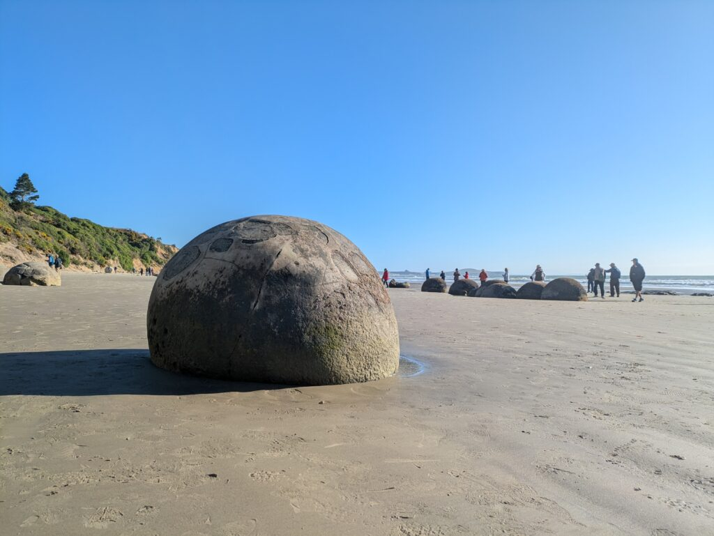
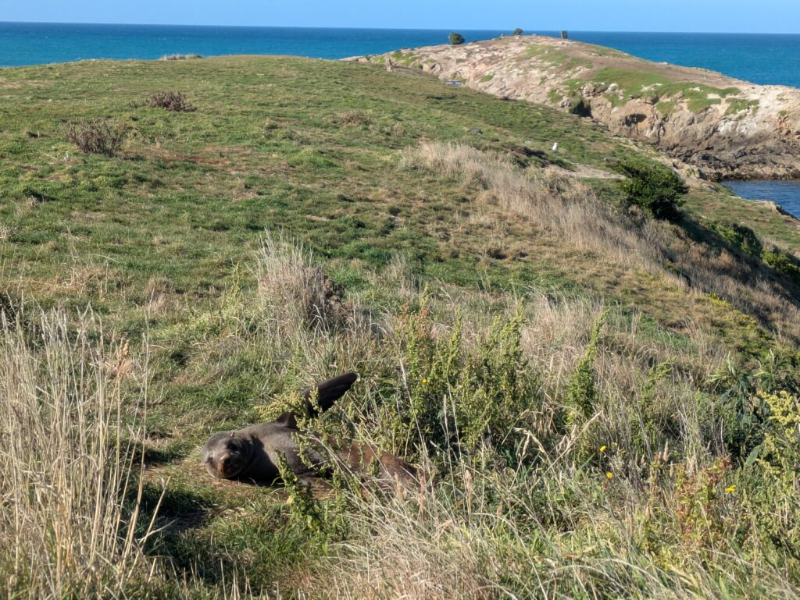

## English\_Practice

I went to Katiki but I looked around there a little.

### Moeraki Boulders Beach

Firstly, it was Moeraki Boulders Beach. There were a lot of big rocks.

I thought there were used as parts of ships. However, they were created naturally. The wave of ocean was perfect because if it had been too strong or weak, they would not have been there.

There were many rocks and we can ride on them and take pictures. It took for long time so I felt interesting deeply.

### Katiki Point

After that, I went to Katiki Point. There were lots of sea lions which lied down on the filed. Some people said they are smelly, but my nose is not sensitive so I did not realize.

They did not make noise, scratched thier body like dogs and lied down lazily. I felt jealous when I saw them.

I wanderd around Katiki like that. To be honest, I wanted to go to the castle and some sight seeing in Dunedin. Nevertheless, I had a problem with my car. I am gooing to write about my car's problem. See you later.

## 日本語版

Katikiという場所に行ってきました。とは言えそこまで周ってないので少ししか紹介できないのですが。

### Moeraki Boulders Beach

一つ目はMoeraki Boulders Beachという場所ですね。ここは大きな岩がいくつもあるところになっています。

最初は船で使われている部品の何かと思ってましたが、どうやら自然にできた岩のようです。波の力にが絶妙らしく、強すぎても弱すぎてもこのような形にはならないみたいです。

この岩は数個ではなくかなり多くありますし、上に乗っても丈夫なので写真を撮るのもいい感じに撮れると思います。長い時間をかけてできたので少し趣深く感じますね。

### Katiki Point

その後はKatiki Pointに行きました。ここではたくさんのアシカが寝転がってますね。よく匂いが言われますが私は鼻がそこまで敏感じゃないのでわかりづらかったですね。

特に鳴いてるわけでもなく犬みたいにひれで体を掻いたり、だらだらと寝転んでるだけでしたね。草むらの上でゴロゴロ寝転がってだらだらしている様はちょっとうらやましくも感じました。

というわけでKatiki周りを観光してきました。本当はDunedinに行ってお城やその周りの観光地を見に行こうと思ったのですが、車のトラブルがあっていけなくなりました。その話についてはまた今度書こうと思います。ではでは。

## AI採点

# ✅ 総合評価（推定）

**Band 5.5**

- 内容は伝わるが、**文法・語彙ミスが多く自然さに欠ける**

- IELTS 7+ を目指すには「自然さ・正確さ・表現の幅」が不足

* * *

# 📊 各項目評価

### ① Task Achievement → **6.0**

- 内容は一貫している

- 体験の説明はできている

- ただし：
    - **説明が浅い（why / detail不足）**
    
    - IELTS的には「もう少し具体例・理由」が必要

* * *

### ② Coherence & Cohesion → **6.0**

- 構成はOK（場所ごとに分けている）

- ただし：
    - 接続詞が弱い（Firstly / After that だけ）
    
    - 流れがやや単調

* * *

### ③ Lexical Resource → **5.5**

- 語彙がシンプルすぎる＋不自然

❌ 例：

- _big rocks_ → 幼い

- _take pictures_ → OKだが単調

- _interesting deeply_ → ❌完全に不自然

👉 IELTS 7+なら：

- _massive spherical rocks_

- _fascinating geological formations_

* * *

### ④ Grammatical Range & Accuracy → **5.0（大きな減点ポイント）**

ミスがかなり多いのでここがボトルネック

* * *

# ❌ 文法・語彙の全指摘（重要）

## ① 冒頭

❌ I went to Katiki but I looked around there a little.  
👉 問題：

- but 不自然

- 時制・流れが弱い

✅ 修正：

- I went to Katiki, but I only had time to look around briefly.

* * *

## ② There were a lot of big rocks.

👉 OKだが幼い

✅ 改善：

- There were numerous large rocks.

* * *

## ③ I thought there were used as parts of ships.

❌ 文法崩壊

👉 問題：

- there were used ❌

- 主語不明

✅ 修正：

- I initially thought they were parts of ships.

* * *

## ④ The wave of ocean was perfect

❌ 不自然

👉 問題：

- wave of ocean ❌

✅ 修正：

- The ocean waves were perfectly balanced

* * *

## ⑤ they would not have been there

👉 OKだが弱い

👉 より自然：

- they would not have formed in this way

* * *

## ⑥ we can ride on them

❌ 不自然

👉 問題：

- ride は乗り物

✅ 修正：

- we can stand on them

* * *

## ⑦ It took for long time

❌ 文法ミス

✅ 修正：

- It took a long time

* * *

## ⑧ I felt interesting deeply

❌ 完全に誤り

👉 問題：

- interesting → 主語が物

- deeply → 不自然

✅ 修正：

- I found them very fascinating

* * *

## ⑨ which lied down on the filed

❌ 3つミス

👉 問題：

- lied → lay

- filed → field

- which → 不自然

✅ 修正：

- sea lions lying on the field

* * *

## ⑩ they are smelly

👉 OKだがカジュアル

👉 IELTSなら：

- they have a strong smell

* * *

## ⑪ scratched thier body

❌ typo + 表現

✅ 修正：

- scratched their bodies

* * *

## ⑫ I wanderd

❌ spelling

👉 wandered

* * *

## ⑬ some sight seeing

❌ スペース不要

👉 sightseeing

* * *

## ⑭ I am gooing

❌ spelling

👉 going

* * *

# 🔥 総評（重要）

あなたの英語の状態：

👉 **「意味は伝わるが、ネイティブ的にはかなり不自然」**

* * *

# 🎯 IELTS 7+に行くための改善ポイント

### ① 文法の基礎ミスを減らす

特に：

- 過去形（lie / lay）

- 冠詞（a / the）

- スペル

* * *

### ② 「自然な表現」を覚える

例：

- ❌ big rocks → ✅ massive rocks

- ❌ interesting → ✅ fascinating

* * *

### ③ 文を少し長くする（複文）

今：

- シンプルすぎる

目標：

- Although / because / which を使う

* * *

# ✍️ 改善版（Band 6.5〜7レベル）

少しだけ修正した自然版：

> I went to Katiki, but I only had time to look around briefly.
> 
> Firstly, I visited Moeraki Boulders Beach, where there are numerous large, spherical rocks. At first, I thought they were parts of ships, but I later learned that they were naturally formed. The ocean waves must have been perfectly balanced, as these shapes would not have formed otherwise.
> 
> There are many rocks, and visitors can stand on them to take photos. Since they were formed over a long period of time, I found them quite fascinating.
> 
> After that, I went to Katiki Point, where I saw many sea lions lying on the grass. Although some people say they smell, I did not notice it much because I am not very sensitive to smells.
> 
> They were not making noise and were simply relaxing, scratching themselves like dogs. Watching them lie around lazily made me feel slightly jealous.
> 
> Overall, I enjoyed exploring the Katiki area. I had originally planned to visit Dunedin, but I had car trouble. I will write about that next time.
