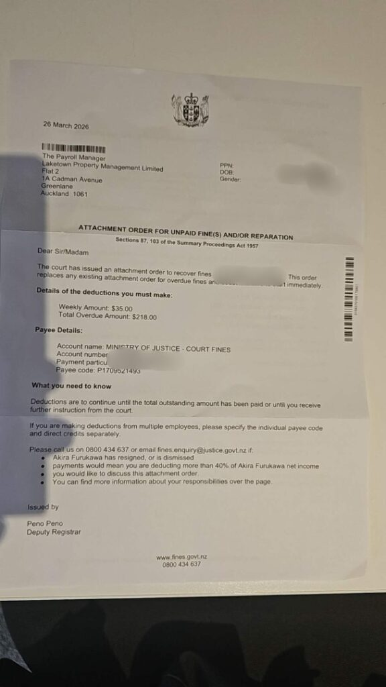
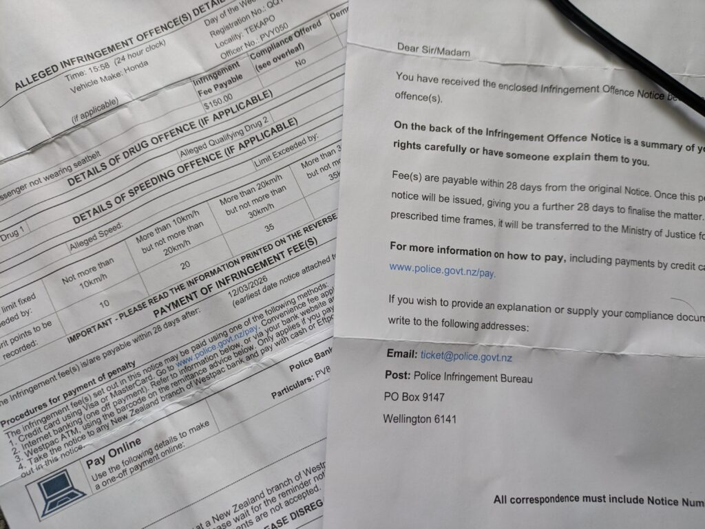

## English\_Practice

I paid a kind of things recently so I am going to write about that.

### Invoice from the judgement

Firstly, it was an invoice from the judgement. When I saw it, I thought I commited some incidents. Moreover, our company received it.

I sent email which I wanted to know detail to pointed email address for now. After that, I was called from the judgement to teach details.

Apparently, I did not change my living address so the invoice was sent to my previous workplace. It was a speed ticket which a camera measured automatically. I did not think it is a big problem. The fine was $218.

### Invoice from police office

Secondly, the invoice was sent from a police office. When I got on my friend car, we were caught by police. Actually, my friend got a speed ticket, but I did not use a seat belt and reclined the seat so I also received fine. Of cource, we received them each other.

I knew a person who sit back seat need to use a seat belt, but I thought we would not have been caught. It cost $150.

### Car repair cost bill

Finally, it was a car repair cost bill. When I went to Katiki, my car was broken. Actually, my car was overheated and if I had droven more, the engine of my car might have been broken.

I asked a wrecker after paking in parking area. I was contacted at 4p.m. so I could not request to repair at that time and I thought I called a repair company but I called a wrecker company so I could not contact it. Moreover, I then parked behind it and my boss picked me up. Additionally, I lost my car key.

After that, I requested to create a spare key and fix my car next morning. This staff taught me my car key was inside my car. Finally, I picked up my car there. I forgot to tell my phone number so I left my car there for 2 weeks. I paid $440 for wrecker and $337 for repairing.

I paid total $1145 like that. It was salary for 43 hours. I felt I paid so much. It cost so much for repairing but I enjoyed traveling and I have knowledge of car. See you later.

## 日本語版

最近いろんなものに対して支払いをしたのでそのことについて書いていこうと思います。

### 裁判所からの請求

まずは裁判所から来た請求書ですね。最初来たときは何かとんでもない事件を犯したのかと思いました。しかも請求書が届いたのが会社のオフィスだったので。

とりあえず詳細が知りたかったので指定されたメールアドレスに内容を教えてくださいという内容のメールを送りました。その後裁判所側から電話がきて詳細について教えてくれました。

どうやら住所の変更をしてなかったので請求書が前の仕事場に送られていたみたいです。それから内容はスピード違反でカメラが自動的にとらえてたみたいです。内容として大事じゃなくてよかったなと思いましたね。罰金は$218ですね。

### 警察署からの請求

2つ目は警察署から来たものですね。こちらは以前友達の車に乗った時に警察に捕まったからですね。元々は友達がスピード違反で捕まったのですが、私もシートベルトをせずにシートを倒していたので一緒に罰金をもらいました。もちろん請求自体は別々です。

後部座席の人もシートベルトもしないといけないのは知ってましたが、捕まらないだろうと高をくくってましたね（笑）罰金は$150になります。

### 車の修理費請求

最後に車の修理費ですね。[以前](/posts/2026/04/katiki-point-seals-road-trip/)Katikiに行ったときに車が壊れたという話をしました。実はオーバーヒートを起こしてこれ以上走行するとエンジンが壊れる可能性がありました。

そこでパーキングエリアに車を止めてレッカーを頼みました。連絡が来たのが夕方4時ごろで修理には間に合わなかったうえに、修理会社に連絡したと思ったらレッカー会社だったので修理会社に何も連絡できず建物の裏に停めて上司に迎えに来てもらいました。更に車のカギを無くすという状況でしたね

翌日の朝に連絡して車のスペアキー作成と修理の依頼をしました。そしたら車のカギはどうやら車の中にあったみたいです。その後無事に車を修理してもらい無事に何事もなく取りに行きました。電話番号を教えそびれたので2週間ぐらい置きっぱなしになってましたが。支払いはレッカーが$440で修理費が$337ですね。

といった感じで合計$1145の支払ですね。大体43時間分くらいの給料ですね。そう考えるとかなり支払ったなという感じです。車の修理費が結構かかってますが旅の旅費と考えればまあ楽しめましたし、少し車について詳しくなれたのもよかったかなと思います。ではでは。

## AI採点

# 🔢 総合スコア（推定）

**Band 5.0**

### 内訳

- **Task Response**: 6.0

- **Coherence & Cohesion**: 5.0

- **Lexical Resource**: 5.0

- **Grammatical Range & Accuracy**: 4.5

👉 内容は伝わるが、「文法ミス＋不自然な英語」が多く減点。

* * *

# ❌ 主な問題（重要順）

## ① 文法ミス（最も大きな減点）

かなり多いです。特に：

- 動詞の形

- 冠詞（a / the）

- 複数形

- 前置詞

* * *

## ② 不自然な英語（直訳）

日本語の構造そのまま → IELTSでは減点

* * *

## ③ 語彙ミス

単語の選び方が不自然 or 間違い

* * *

# ✍️ 添削（全文・細かく）

## 🔹 Introduction

❌

> I paid a kind of things recently

👉致命的ミス

- a kind of things → ❌

✅ 修正

> I have paid for various things recently, so I will write about them.

* * *

## 🔹 見出し

❌

> Invoice from the judgement

👉誤り

- judgement ❌（文脈的に）

- 正しくは court

✅

> Fine from the court

* * *

## 🔹 Paragraph 1

❌

> I thought I commited some incidents

👉重大ミス

- commited → committed（スペル）

- incidents → crimes

✅

> I thought I had committed a serious crime.

* * *

❌

> our company received it

👉主語ミス

✅

> it was sent to my company

* * *

❌

> I sent email which I wanted to know detail

👉不自然すぎる

✅

> I sent an email asking for more details.

* * *

❌

> to pointed email address

👉完全に誤り

✅

> to the specified email address

* * *

❌

> to teach details

👉teachは使わない

✅

> to explain the details

* * *

❌

> I did not think it is a big problem

👉時制ミス

✅

> I did not think it was a serious problem

* * *

## 🔹 Paragraph 2

❌

> When I got on my friend car

👉

- get on → 乗り物（バス）

- car → get in

✅

> When I got into my friend's car

* * *

❌

> we were caught by police

👉

- the が必要

✅

> we were stopped by the police

* * *

❌

> I did not use a seat belt

👉

- wear を使う

✅

> I was not wearing a seatbelt

* * *

❌

> reclined the seat

👉  
文脈的にOKだが不自然

* * *

❌

> we received them each other

👉完全に誤り

✅

> we were fined separately

* * *

❌

> a person who sit back seat

👉複数ミス＋文法

✅

> people sitting in the back seat

* * *

❌

> I thought we would not have been caught

👉意味はOKだがやや不自然

✅

> I thought we wouldn’t get caught

* * *

## 🔹 Paragraph 3

❌

> my car was broken

👉不自然

✅

> my car broke down

* * *

❌

> had droven

👉重大ミス（過去分詞）

✅

> had driven

* * *

❌

> asked a wrecker

👉NZ英語でも不自然

✅

> called a tow truck

* * *

❌

> paking

👉スペルミス

* * *

❌

> I could not request to repair

👉不自然

✅

> I couldn’t arrange the repair

* * *

❌

> I called a repair company but I called a wrecker company

👉意味が崩壊

✅

> I thought I had contacted a repair company, but it turned out to be a towing company.

* * *

❌

> parked behind it

👉意味不明

* * *

❌

> This staff taught me

👉teach ❌

✅

> The staff told me

* * *

❌

> I forgot to tell my phone number

👉OKだが自然ではない

✅

> I forgot to give them my phone number

* * *

## 🔹 Conclusion

❌

> I paid total $1145

👉

- 冠詞

✅

> I paid a total of $1145

* * *

❌

> It was salary for 43 hours

👉

- 冠詞

- 不自然

✅

> This is equivalent to about 43 hours of work

* * *

❌

> I have knowledge of car

👉  
不可算名詞

✅

> I gained some knowledge about cars

* * *

❌

> See you later

👉IELTSではNG

* * *

# 📊 改善ポイント（IELTS 8向け）

## 🔥 最優先

1. **動詞の形（特に過去分詞）**

3. **冠詞（a / the）**

5. **自然な表現に置き換える力**

* * *

## 🎯 具体的トレーニング

あなたに必要なのはこれ👇

### ① コロケーション暗記

- commit a crime

- get into a car

- wear a seatbelt

- call a tow truck

* * *

### ② 文型の固定化

例：

- I sent an email asking...

- I thought I had...

- It turned out that...

* * *

# ✨ 総評

- 内容は良い（体験として面白い）

- ただし「英語としてかなり不自然」

👉今のままだと **Band 5止まり**  
👉文法改善で **6.5〜7は狙える**

# ✍️ 改善版（Band 7+レベル）

## Introduction

I have recently had to pay for several things, so I would like to write about them.

* * *

## Fine from the court

First of all, I received a notice from the court. When I first saw it, I thought I had committed a serious crime. What made it worse was that it was sent to my workplace.

Since I wanted to know more details, I sent an email to the specified address. Later, I received a phone call from the court explaining everything.

Apparently, I had not updated my address, so the notice had been sent to my previous workplace. It turned out to be a speeding ticket detected by a camera. Fortunately, it was not a serious issue. The fine was $218.

* * *

## Fine from the police

Secondly, I received a fine from the police. This happened when I was in my friend’s car and we were stopped by the police. My friend was caught for speeding, and I was also fined because I was not wearing a seatbelt and had reclined my seat.

Of course, we were fined separately. Although I knew that passengers in the back seat must wear seatbelts, I underestimated the risk and thought we wouldn’t get caught. The fine was $150.

* * *

## Car repair costs

Finally, I had to pay for car repairs. As I mentioned before, my car broke down when I went to Katiki. The engine had overheated, and if I had continued driving, it could have been seriously damaged.

I pulled over in a parking area and called a tow truck. I was contacted around 4 p.m., which was too late to arrange repairs that day. In addition, I mistakenly contacted a towing company instead of a repair company, so I couldn’t organize the repair properly. I left the car there and asked my boss to pick me up. To make matters worse, I also lost my car key.

The next morning, I contacted the company to request a spare key and repairs. It turned out that my key had been inside the car the whole time. In the end, the car was repaired successfully, and I picked it up later. However, since I forgot to give them my phone number, the car was left there for about two weeks.

The towing cost $440, and the repair cost $337.

* * *

## Conclusion

In total, I paid $1,145, which is equivalent to about 43 hours of work. Thinking about it this way, I feel that I spent quite a lot of money.

Although the repair cost was high, I still enjoyed the trip, and I also learned more about cars, so it was a valuable experience overall.

* * *

# 🎯 改善ポイントまとめ

- 不自然な直訳 → **自然な表現へ修正**

- 文法（特に過去完了・冠詞）を整理

- IELTS向けに**フォーマル寄り＋論理的構成**
