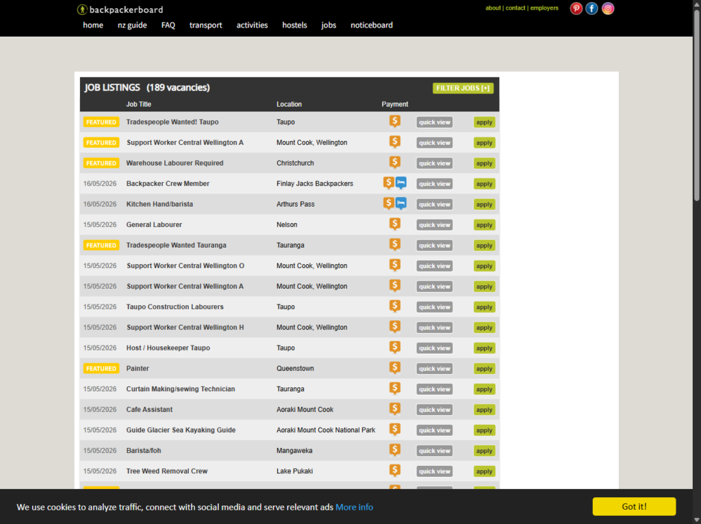
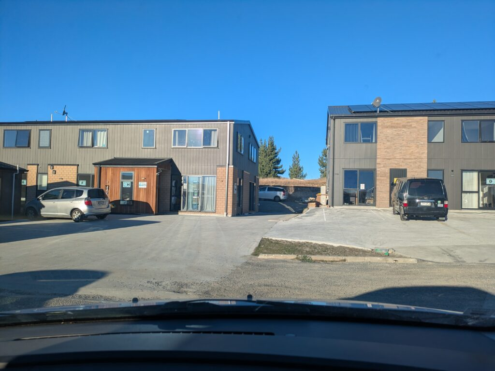
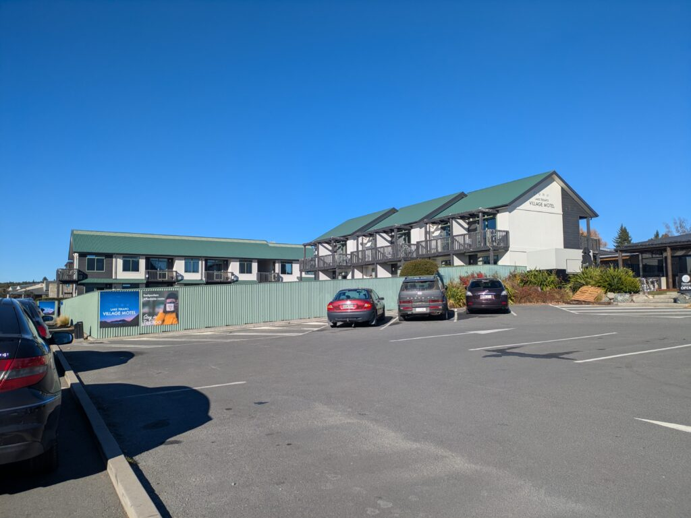

## English\_Practice

I am going to write about quitting job which I worked for 5 months.

### How to find ExploreTekapo

I belonged to Explore Tekapo which I applied on backpackerboard. There were some jobs on this website. For instance, hosuekeeping, waiter and constracter.

### About ExploreTekapo

I worked as a housekeeper there. Basically, I did making bed, cleaning romms and bathrooms. It depends on customer's request what I made sofa bed or splied from queen bed to double single beds.

There were 2 companies which is motel one and holiday one. Japanese people can work for 6 months in one company so we can work for a year. Other counries people can do for 6 months at maximum.

### ExploreTekapo pros and cons

One of the advantage is makeing overseas friends. When I left there, there were Czech, French, Germany, Austrian, Hungarian, Malaysian and Japanese. Moreover, when I was there, there were Korean, Taiwaniese and Finnish. I heard there was British. It was good opotuniry to make friendship to other countries people.

In addition, other companies staff staied together especially chinese. Sometimes, I heard chinese because of many chinese staff.

One of the disadvantage is woking hours will be 20 hours per week in winter because the number of people stayover was increasing so there are so rooms not to clean. If you want to work more, you need to work at the reception or second job.

One of the pros which i worked at the reception is my English skill is improved and it is effective to work other places because I needed to talk with customers. The cons is that I could not go to Hot Springs every day because I had to work until 6 p.m. Additionaly, it was for free to go to Hot Spring and sauna when I worked there.

One of the cons is I was not used to talk with native speaker. If customers of native speaker checked in or my co-worker was it, it was easy to chat with them. However, some people speak English fluently.

I worked for 5 monthes like that. My colleague sometimes conflicted but I enjoyed working normally. This job was not bad, but I finished cleaning early and then I went to Hot Springs and chatted and hung out with my friends so I spent good holiday. I am going to travel again before going back to Japan. See you later.

## 日本語版

大体5か月ほど長らく働いていた職場を退職したのでそのことについて書こうと思います。

### How to find ExploreTekapo

私が今回[働いていた場所](/posts/2026/02/exploretekapo-housekeeper-reception-work-experience/)は[Explore Tekapo](https://exploretekapo.co.nz/)という会社になります。元々応募したサイトは[backpackerboard](https://www.backpackerboard.co.nz/work_jobs/job_listings.php)というサイトになります。ここにはニュージーランド中の仕事がある程度募集されています。例えばハウスキーパーやウェイトレス、工事現場の仕事などもあります。

### About ExploreTekapo

今回はここでハウスキーパーの仕事をしました。基本的な仕事としてはベッドメイキング、部屋のクリーニング、バスルームの掃除になります。お客さんの要望次第ですがソファベッドを組み立てたり、ベッドをクイーンからダブルシングルに変えたりします。

さらにこの会社は2つの会社にできており、モーテル用の会社とホリデーハウス用の会社があります。日本人は一つの会社で6か月ほど働くことができるので、ここで仕事をしてそのまま1年いることも可能ですね。他の国の人だと最長6か月ですかね。

### ExploreTekapo pros and cons

ここで働くことの一つのメリットとしてはいろんな国の人と仲良くなることができることです。私が去る前はチェコ、フランス、ドイツ、オーストリア、ハンガリー、マレーシア、日本人がいました。また、私がいたときには韓国、台湾、フィンランドがいました。聞いた話ではイギリスもいたみたいです。そういった意味では英語練習＋他の国の人と仲良くなるいい機会だと思います。

また、スタッフハウスには別の会社の人が同居しているので中国の人たちがいました。どうしても中国語話者が多いので中国語を聞く機会が増えますが。

ここで働くことのデメリットとしては冬だと働く時間が週20時間近くになることですね。長期滞在者が増えるので掃除をする部屋が減っていきます。増やす方法としては受付の仕事をするかセカンドジョブを見つけることですね。

受付をするメリットはお客さんと会話をする機会が増えるので多少英語力が伸びたり、他で働く際に有利になるくらいですね。デメリットは拘束時間が長くなるのでホットスプリングに毎日行けないことですね。ちなみにここで働けばホットスプリングとサウナは無料で行くことができます。

ここで働くことのデメリットは第二言語の人の英語には慣れますがネイティブには慣れないところですね。ネイティブのお客さんが多かったり、同僚にいればかなり楽ですが、基本的には慣れないかと思います。それでも流暢に話す人もいるので大丈夫だとは思いますが。

といった感じでここで5ヵ月ほど働きました。私の周りで衝突している人たちもいましたが、基本的には楽しかったですね。仕事は微妙ですが、早めに終わらせてホットプールでまったりしたり近くの人とだらだらと会話して遊びに行ったりといい休暇を過ごせました。また、旅を再開して日本に帰るまでだらだらと過ごしていきたいと思います。ではでは。

## AI採点

## IELTS Writing 推定スコア（Task 1/Task 2ではなくGeneral English Writingとして評価）

- **Task Response / Task Achievement**: 5.5

- **Coherence & Cohesion**: 5.0

- **Lexical Resource**: 4.5

- **Grammatical Range & Accuracy**: 4.0

### Overall 推定Band

**Band 4.5〜5.0程度**

内容自体は伝わります。  
ただし、IELTS基準では以下がかなり減点されています。

- 文法エラー頻発

- 不自然な英文

- 品詞ミス

- 単数複数

- 冠詞

- 語法ミス

- 文構造不足

- 接続の弱さ

- ネイティブが使わない表現

ただ、**「意味はある程度追える」状態**なのでBand 4よりは上です。

* * *

# 良い点

まず良い点です。

### 良いところ

- 具体例が多い

- 自分の経験を詳細に書けている

- pros and cons構成は分かりやすい

- IELTSで重要な「実体験ベースの説明」ができている

- 話題展開は自然

内容はかなり良いです。  
問題はほぼ「英語化」です。

* * *

# 大きな減点ポイント

## 1\. 動詞の形がかなり不自然

例：

> I am going to write about quitting job

❌ quitting job  
→ 冠詞不足

✅ quitting **a** job  
✅ quitting **my** job

さらに自然にするなら：

✅ I am going to write about the job I quit after working there for about five months.

* * *

# 2\. 「worked for 5 months」が修飾できていない

> quitting job which I worked for 5 months

これは文法的にかなり不自然です。

「5か月働いた仕事」なのか  
「5か月間辞めていた仕事」なのか曖昧。

* * *

# 3\. 語彙ミスが多い

## hosuekeeping

❌ spelling

✅ housekeeping

* * *

## constracter

❌

✅ construction worker  
✅ construction job

「constracter」はほぼ使いません。

* * *

## romms

❌ rooms

* * *

## splied

❌ split

* * *

## opotuniry

❌ opportunity

* * *

## counries

❌ countries

* * *

## makeing

❌ making

* * *

## staied

❌ stayed

* * *

## woking

❌ working

* * *

## Additionaly

❌ Additionally

* * *

## monthes

❌ months

* * *

IELTSではスペルミスも普通に減点です。

* * *

# 4\. 名詞の単数複数ミス

IELTS Band 6未満で非常に多い典型例です。

* * *

## One of the advantage

❌

✅ One of the advantages

「one of the + 複数名詞」

これはIELTS超重要です。

* * *

## One of the disadvantage

❌

✅ One of the disadvantages

* * *

## native speaker

❌

✅ native speakers

一般論なら複数が自然。

* * *

# 5\. 冠詞ミス

かなり多いです。

* * *

## at the reception

✅ OK

* * *

## go to Hot Spring

❌

✅ go to the hot springs

通常は複数扱い。

* * *

## worked for 5 months

これはOK

* * *

# 6\. 不自然な英文（重要）

ここがBand 6を超えない最大原因です。

* * *

## I belonged to Explore Tekapo

文法上は可能ですがかなり不自然。

英語では会社に「所属する」は普通こう言います。

✅ I worked for Explore Tekapo.  
✅ I worked at Explore Tekapo.

* * *

## There were some jobs on this website.

意味は通じるが弱い。

✅ Various jobs were advertised on this website.

の方がIELTSっぽい。

* * *

## I did making bed

❌

✅ I made beds  
✅ I was responsible for making beds

* * *

## cleaning romms and bathrooms

✅ cleaning rooms and bathrooms

* * *

## It depends on customer's request what I made sofa bed

かなり不自然。

言いたいことは：

「お客さんの要望によってソファベッドを組み立てた」

なので：

✅ Depending on the customers’ requests, I sometimes prepared sofa beds.

* * *

## splied from queen bed to double single beds

かなり意味不明になっています。

たぶん：

「クイーンベッドをシングル2つに分けた」

✅ converted queen beds into two single beds

* * *

# 7\. 関係代名詞 misuse

## There were 2 companies which is motel one and holiday one.

❌ which is

複数なので：

✅ There were two companies: one for motels and the other for holiday houses.

これが自然。

* * *

# 8\. 「people」の扱い

## Other counries people

❌

✅ people from other countries

IELTSでは非常によく使います。

* * *

# 9\. 中国語の文

## I heard chinese because of many chinese staff.

かなり不自然。

✅ I often heard Chinese because many Chinese staff members lived there.

* * *

# 10\. 時制崩壊

## One of the disadvantage is woking hours will be 20 hours

現在形と未来形混在。

✅ One disadvantage was that working hours dropped to around 20 hours per week during winter.

* * *

# 11\. 文の論理構造が弱い

## because the number of people stayover was increasing so there are so rooms not to clean

かなり崩れています。

問題点：

- stayover → stayovers / long-term guests

- because と so の重複

- there are so rooms

- 時制混乱

自然：

✅ because more guests stayed long term, there were fewer rooms to clean.

* * *

# 12\. 「英語力が伸びる」

## my English skill is improved

❌

✅ my English improved  
✅ I improved my English skills

* * *

# 13\. 「effective to work other places」

❌

✅ helpful when applying for other jobs  
✅ useful experience for future jobs

* * *

# 14\. ネイティブに慣れない

## I was not used to talk with native speaker

❌

✅ I was not used to talking with native speakers.

be used to + ing

超重要です。

* * *

# 15\. If customers of native speaker checked in

かなり不自然。

✅ If native English-speaking customers checked in

* * *

# 16\. My colleague sometimes conflicted

❌

✅ Some of my colleagues had conflicts with each other.

* * *

# 17\. good holiday

意味は通じるが弱い。

✅ relaxing time  
✅ enjoyable experience

* * *

# IELTS的に特に改善すべきポイント

## 最優先

### 1\. 冠詞

- a

- the

- some

### 2\. 単数複数

- advantage → advantages

- speaker → speakers

### 3\. 動詞パターン

- be used to ~ing

- improve English

- work for

### 4\. 不自然な直訳

日本語順で作っている。

IELTS 6.5以上は：

- 英語の自然な語順

- 英語的発想

が必要。

* * *

# IELTS 8を目指すなら必要な改善

今は：

- 「日本語を英語に変換している段階」

IELTS 7〜8は：

- 英語で直接構成する

- collocationが自然

- 文法エラーが少ない

- complex sentenceを自然に使う

が必要です。

* * *

# 改善するとかなり良くなる文（例）

元：

> One of the advantage is makeing overseas friends.

改善：

✅ One of the biggest advantages of working there was the opportunity to make friends from many different countries.

これはIELTS 6.5〜7寄り。

* * *

# 総評

内容は良いです。  
実体験ベースなので読みやすいです。

ただし現在は：

- 文法

- コロケーション

- 自然な語順

- 冠詞

- 単数複数

でかなり失点しています。

# Band 8レベルを意識した改善版

I recently left a job where I had worked for about five months, so I would like to write about my experience there.

## How I Found Explore Tekapo

I worked for a company called Explore Tekapo. I originally found the job through a website called Backpackerboard, which advertises various jobs across New Zealand. There are many types of jobs available on the site, including housekeeping, waitressing, and construction work.

## About Explore Tekapo

At Explore Tekapo, I worked as a housekeeper. My main responsibilities included making beds, cleaning rooms, and cleaning bathrooms. Depending on the guests’ requests, I sometimes prepared sofa beds or converted queen beds into two single beds.

The company was divided into two sections: one for motels and another for holiday houses. Japanese workers were able to work for up to six months in each section, which meant it was possible to stay and work there for about a year in total. However, workers from some other countries were generally limited to six months.

## Pros and Cons of Working There

One of the biggest advantages of working at Explore Tekapo was the opportunity to meet people from many different countries. Before I left, there were staff members from the Czech Republic, France, Germany, Austria, Hungary, Malaysia, and Japan. During my time there, I also worked with people from Korea, Taiwan, and Finland, and I heard that there had previously been staff from the UK as well.

Because of this international environment, it was a great opportunity to practice English and learn about different cultures. In addition, some staff members from other companies shared the same staff accommodation, including many Chinese workers, so I often had opportunities to hear Chinese as well.

On the other hand, one disadvantage was that working hours tended to decrease during winter. Since more guests stayed for longer periods, there were fewer rooms to clean, and weekly working hours sometimes dropped to around 20 hours. To earn more money, staff usually needed to work at reception or find a second job.

Working at reception had both advantages and disadvantages. One major benefit was that I had more opportunities to communicate with guests, which helped improve my English and provided useful customer service experience. However, the downside was that the working hours were longer, so I could not visit the hot springs every day. Fortunately, staff members were allowed to use the hot springs and sauna for free.

Another disadvantage was that I became more accustomed to speaking with non-native English speakers rather than native speakers. Unless native English-speaking guests checked in or there were native-speaking coworkers, there were limited opportunities to become familiar with natural native English. Nevertheless, some staff members became very fluent, so I believe it still depended on individual effort.

Overall, I enjoyed my time working there for five months. Although there were occasionally conflicts between coworkers, most of the time the atmosphere was friendly and enjoyable. The work itself was sometimes tiring, but after finishing early, I often relaxed at the hot springs, chatted with friends, and spent time exploring the area. It was a memorable experience, and I would like to continue travelling around New Zealand before eventually returning to Japan.
