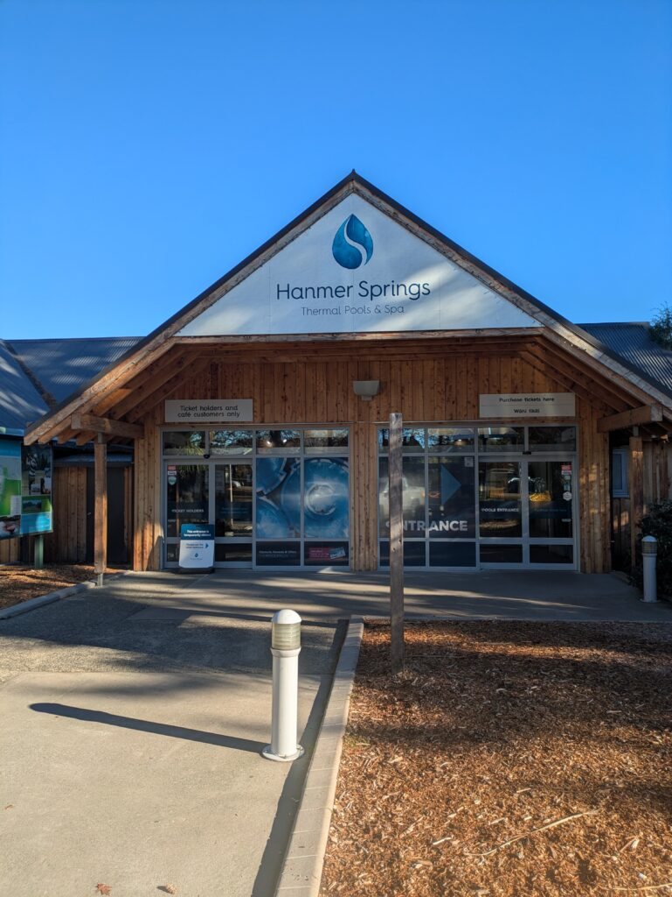
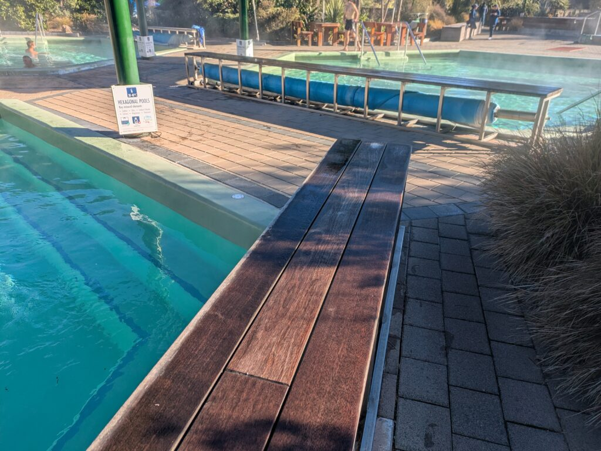
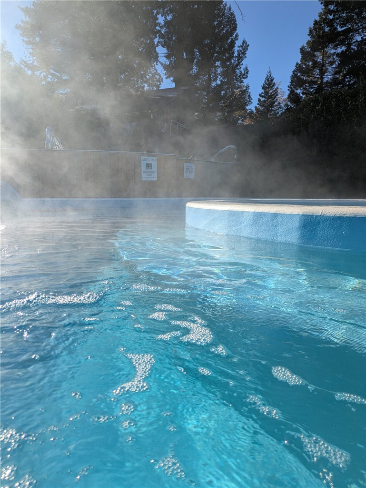
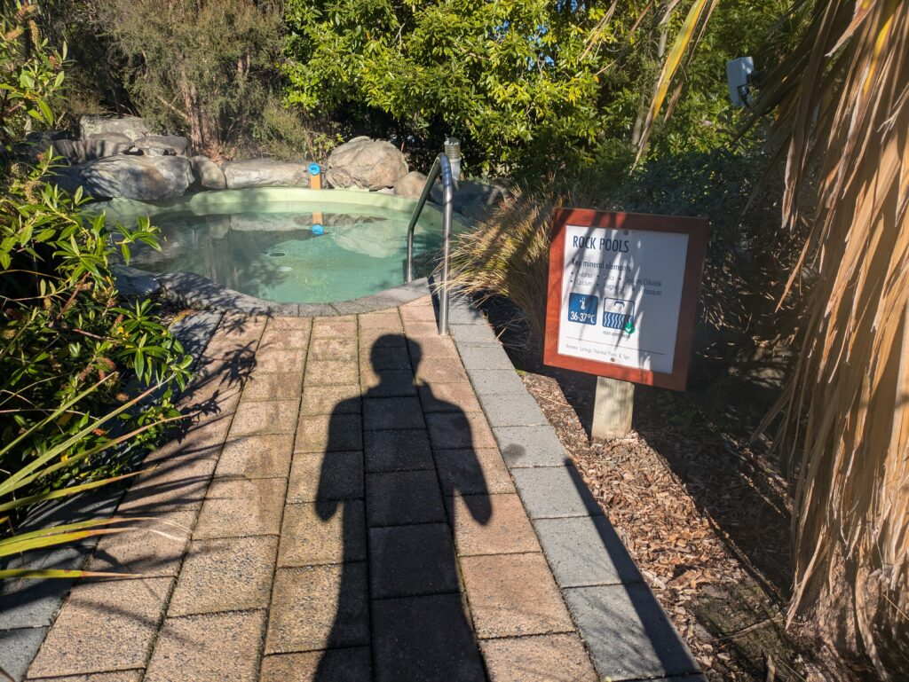
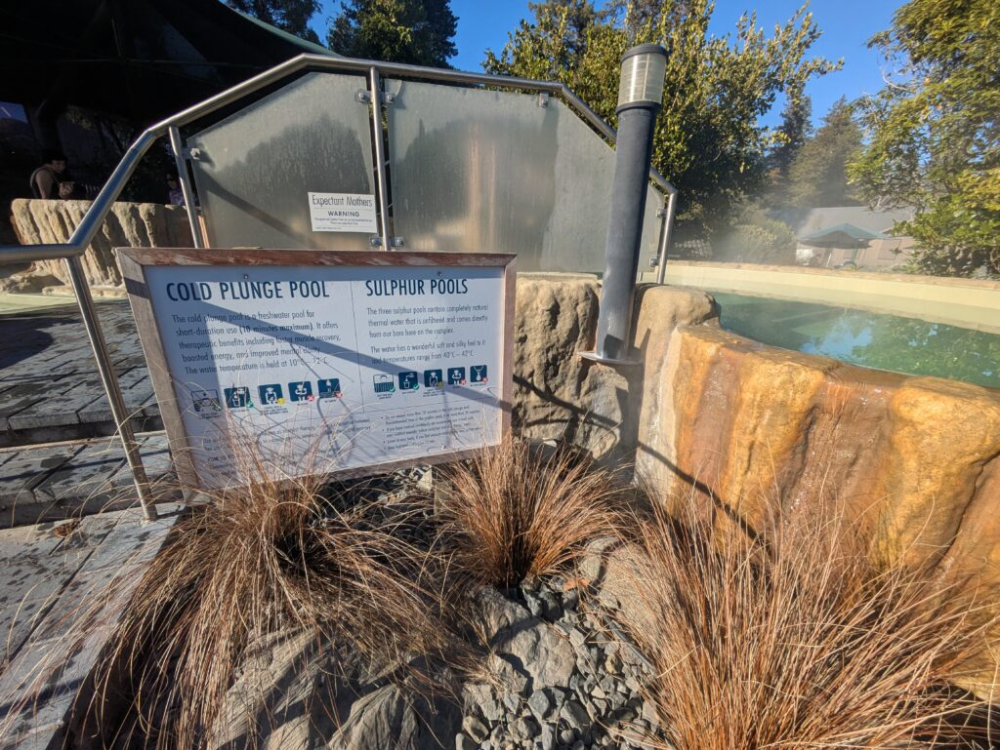
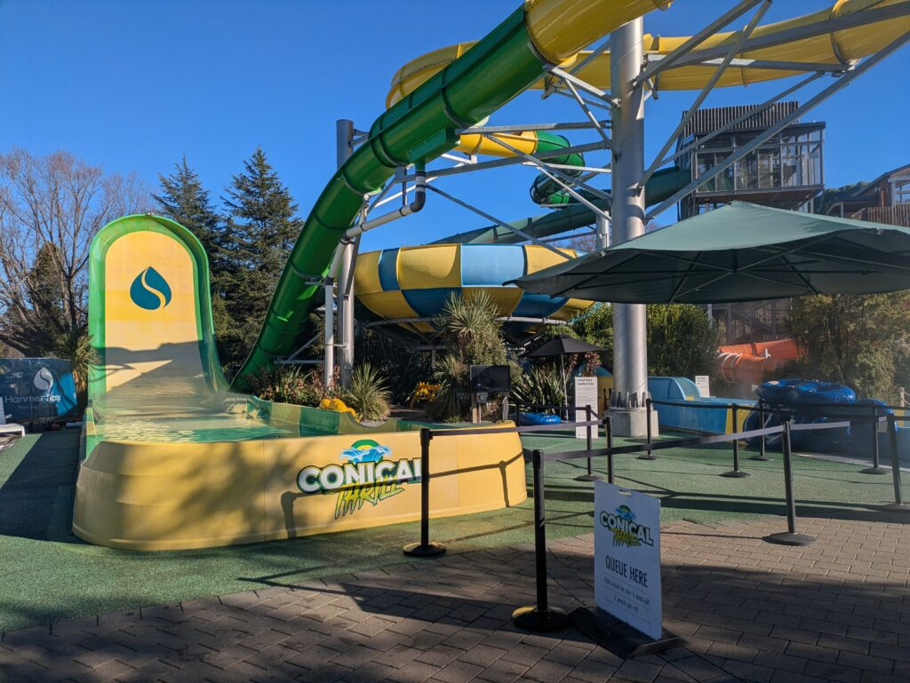
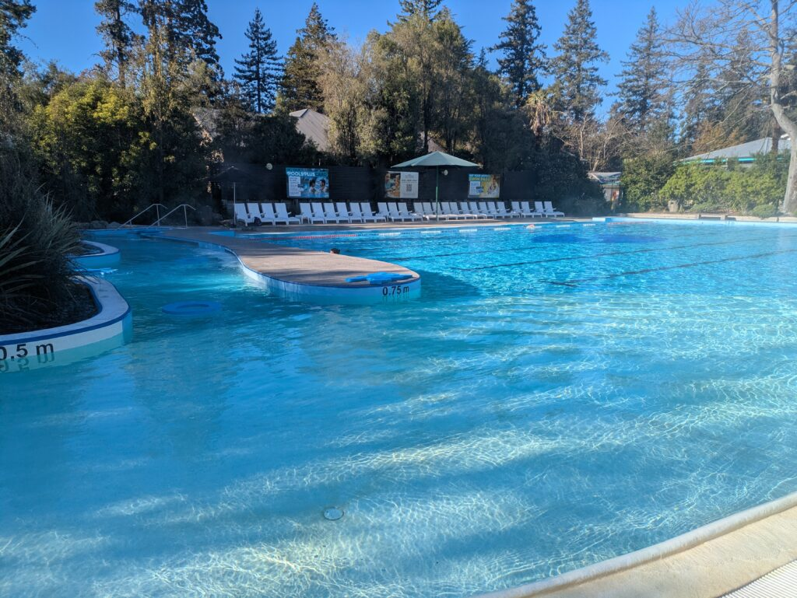

## English\_Practice

I quitted my job and started a road trip again. I did not have enough time to write articles because I went to many places. I went those places before working so I just went to a couple of places. I went to some places where I forgot.

### Overall HanmerSprings

At first, I went to HanmerSprings where I do not do many things. However, Hot Springs and skiing are famous there. I just enjoyed Hot Springs because I could not ski in this season.

One of advantages of HanmerSprings is that there were kind of many pools and attractions to compare with Tekapo Springs. One of cons is that sauna has time limits.

Moreover, a few of pools and sauna were reformed when I went Hanmer Springs. It was a little shame but I had a fun so you should go there. It cost $42 and it was almost same places with Tekapo. Nevertheless, I was more excited than Tekapo one in personal.

### Introduction each pools

Firstly, it was a normal hot pool. It was 40 degree and almost same to hot springs. The sigh showed it included some effective ingredient like calcium and celica. Pregnancies were not allowed to enter there.

Nextly, it was jacuzzi which made bubble. I stood outside and sat inside. I did not use a lot because it was low temperature for me.

This hot pool was a shallow and taken photo spot. It was easy to enter for everyone.

This area was a pool with sulphur and cold pool. It was a slightly smelly. In addition, it looked dirtier than other pools. I do not know it was sulphur or rubbish.

This area had some attractions. I did not use these because it was accepted with two people. However, customers looked fun when they rode on a rubber boat. I recommend to come with friends.

Finally, these pools were a lazy river and normal pool. Those were colder than other pools. I just enjoyed between hot pool and lazy river pool. It was so funny.

I swam like that. It was disappointing because I could not enter some pools and sauna. If I have a chance, I would like to try. See you later.

## 日本語版

仕事を辞めて再度ロードトリップを再開することにしました。あちこち行ってたら記事を書く時間がなくてかなり時間が空いてしまいましたが。とは言えある程度各地を回ったので南島に関してはそこまで多くいったわけではないですね。忘れていて同じところを行った場所も多少あったりします。

### HanmerSpringsについて

というわけでまずはHanmerSpringsですね。ここで出来ることはそこまで多くないですが、一番有名なのはHot springsとスキーになるかと思います。今はまだスキーのシーズンではないのでHot springsだけ楽しんできました。

[HanmerSprings](https://hanmersprings.co.nz/)のいいところは[Tekapo Springs](/posts/2026/03/tekapo-spring/)に比べてプールの種類も豊富でアトラクションまでついているところですね。デメリットと言えばサウナが時間制限になっているところですね。

更に私が行ったタイミングで一部のプールとサウナが改装中になってました。少し残念でしたがそれ以外でも十分に楽しめるので良ければぜひ行ってみてください。値段は$42とTekapoと変わらないですが、個人的にはTekapoより楽しめるかなと思います。

### 各プールの紹介

まずはシンプルなHot poolですね。大体40度くらいなので温泉とそこまで変わらないと思います。一応カルシウムやシリカなど効能がある成分も入っているので体にもよさそうには見えます。妊婦は入っちゃダメみたいです。

次がジャグジーですね。泡が出ているもので外側は立って内側では座ることができます。温度は低めなので私はあまり使ってないですね。

ここはどちらかといえば浅く写真が撮れるスポットという感じです。老若男女問わず入りやすい場所だと思います。

ここは硫黄が入っているプールと冷水プールですね。匂いが少しするので人によってはきついと思います。また、他と比べて汚れている印象はありました。硫黄なのかゴミなのかわかりませんが。

ここはアトラクションエリアですね。二人で入ることが条件っぽいので私は使いませんでしたが、専用のゴムボートに乗って滑ってる様は楽しそうでした。ぜひ友達と来てください！

最後に流水プールと普通のプールですね。ここも温水ですが温度は低めになります。私は初めの暖かめのプールとここの流水プールを往復するような形で遊んでいました。流水プールはやっっぱり楽しいですよね。

といった感じで楽しんできました。行けてないプールやサウナがあるのは残念でしたが、もしまた行く機会があれば今度は挑戦したいですね。ではでは。

## AI採点

## IELTS Writing 想定スコア（Task 1/2共通基準で近似）

- **Task Response / Response to the task:** 5.0

- **Coherence & Cohesion:** 5.0

- **Lexical Resource:** 4.5

- **Grammatical Range & Accuracy:** 4.0

### 総合目安

**Band 4.5〜5.0程度**

意味はかなり伝わります。ただし、IELTSでは以下が大きく減点されています。

- 不自然な直訳

- 動詞・前置詞ミス

- 冠詞不足

- 単数複数ミス

- 語法ミス（英語でその言い方をしない）

- 接続の不自然さ

- “日本語の発想をそのまま英語化”している箇所

特に **Grammar と Lexical Resource** が大きな減点ポイントです。

* * *

# 良い点

まず良い点です。

- 内容は具体的

- 自分の体験を書けている

- 構成は一応流れている

- 「比較」「感想」「おすすめ」が入っている

- 読み手に伝えようとしている意識はある

IELTSでは、  
「内容が空っぽ」より、  
「文法ミスだらけでも具体性がある」方が高評価です。

これは良いです。

* * *

# 大きな減点ポイント

## 1\. 不自然な動詞選択

例：

> I quitted my job

❌ 不自然

「quit」は通常：

- quit my job

- left my job

です。

"quitted" は文法上ゼロではないですが、ほぼ使いません。

✅ 修正

> I quit my job and started another road trip.

* * *

## 2\. 「行った」が全部 went

かなり多いです。

IELTSでは語彙の繰り返しは減点です。

例えば：

- visited

- travelled around

- explored

- stopped by

- headed to

などを混ぜる必要があります。

* * *

## 3\. 冠詞ミス

かなり多いです。

例：

> went to many places

⭕ OK

でも：

> Introduction each pools

❌

✅

> Introduction to Each Pool

* * *

## 4\. 単数複数ミス

IELTSでかなり見られます。

例：

> a few of pools

❌

✅

> a few pools

* * *

## 5\. 不自然な比較表現

例：

> to compare with Tekapo Springs

❌

✅

> compared with Tekapo Springs

または

> compared to Tekapo Springs

* * *

## 6\. 日本語直訳

これが最大の問題です。

例えば：

> I went to some places where I forgot.

英語話者は意味がかなり取りづらいです。

言いたいことは：

「前に行ったことを忘れていて、同じ場所にまた行った」

ですよね。

✅

> I accidentally revisited some places because I had forgotten that I had already been there before.

IELTSは  
「自然な英語か」  
をかなり見ます。

* * *

# 文ごとの詳細添削

* * *

## 1文目

> I quitted my job and started a road trip again.

### 問題点

- quitted → 不自然

- a road trip again → slightly awkward

✅

> I quit my job and restarted my road trip around New Zealand.

* * *

## 2文目

> I did not have enough time to write articles because I went to many places.

意味は通じます。

ただ IELTS 的には単調。

✅

> I did not have enough time to write articles because I was constantly travelling to different places.

* * *

## 3文目

> I went those places before working so I just went to a couple of places.

かなり不自然です。

### 問題

- went those places ❌

- before working ❌

- couple of places → 意味ズレ

日本語と内容も少し違っています。

✅

> However, I had already visited many places before I started working, so I did not travel around the South Island that much this time.

* * *

## 4文目

> I went to some places where I forgot.

❌ 意味不明に近いです。

✅

> I accidentally revisited some places because I had forgotten that I had already been there.

* * *

# タイトル

> Overall HanmerSprings

❌ 不自然

✅

> About Hanmer Springs

または

> My Experience at Hanmer Springs

* * *

# この文

> At first, I went to HanmerSprings where I do not do many things.

❌

### 問題

- where I do not do many things  
    → 「私が何もしない場所」みたいになる

✅

> There are not many things to do in Hanmer Springs.

* * *

# この文

> I just enjoyed Hot Springs because I could not ski in this season.

❌

### 問題

- Hot Springs → 固有名詞っぽい

- in this season ❌

✅

> I only enjoyed the hot springs because it was not the skiing season.

* * *

# この文

> One of advantages

❌

✅

> One of the advantages

* * *

# この文

> there were kind of many pools

❌ IELTSでは "kind of" 多用は弱い

✅

> there were a variety of pools

* * *

# この文

> One of cons

❌

✅

> One of the disadvantages

* * *

# この文

> sauna has time limits

△

自然にするなら：

✅

> the sauna had a time limit

* * *

# この文

> were reformed

❌

reform は制度改革のイメージ。

プール改装は：

✅

> were under renovation

* * *

# この文

> It was a little shame

❌

✅

> It was a little disappointing

* * *

# この文

> I had a fun

❌

fun は不可算

✅

> I had fun

* * *

# この文

> almost same places with Tekapo

❌

✅

> almost the same price as Tekapo Springs

* * *

# この文

> I was more excited than Tekapo one in personal.

かなり不自然。

✅

> Personally, I enjoyed it more than Tekapo Springs.

* * *

# この文

> Introduction each pools

❌

✅

> Introduction to Each Pool

* * *

# この文

> It was 40 degree

❌

✅

> It was around 40 degrees Celsius.

* * *

# この文

> almost same to hot springs

❌

✅

> which felt similar to Japanese hot springs

* * *

# この文

> The sigh showed

❌ spelling

sign です。

* * *

# この文

> effective ingredient

❌

温泉効能は：

✅

> minerals

* * *

# この文

> celica

❌ spelling

silica

* * *

# この文

> Pregnancies were not allowed

❌

pregnancy = 状態

✅

> Pregnant women were not allowed to enter.

* * *

# この文

> Nextly

❌ ほぼ使いません

IELTSでかなり不自然。

✅

> Next,  
> Secondly,

* * *

# この文

> which made bubble

❌

✅

> which produced bubbles

* * *

# この文

> low temperature

△

自然なのは：

✅

> not very warm

* * *

# この文

> taken photo spot

❌

✅

> a good place to take photos

* * *

# この文

> It was a slightly smelly.

❌

✅

> It smelled slightly of sulphur.

* * *

# この文

> customers looked fun

❌

人は fun ではなく：

✅

> looked like they were having fun

* * *

# この文

> accepted with two people

❌

✅

> required at least two people

* * *

# この文

> recommend to come with friends

❌

recommend の後ろ。

✅

> I recommend coming with friends.

* * *

# この文

> Those were colder than other pools.

⭕ 通じる

より自然：

> They were cooler than the other pools.

* * *

# この文

> enjoyed between hot pool and lazy river pool

❌

✅

> moved back and forth between the hot pool and the lazy river

* * *

# この文

> It was so funny.

❌

funny = 面白い/変

楽しいなら：

✅

> It was really fun.

* * *

# 最後

> If I have a chance, I would like to try.

時制ミス。

✅

> If I have another chance to visit, I would like to try them next time.

* * *

# IELTS Band 6.5〜7を狙うなら必要な改善

## 最重要

### 1\. 「自然な英語」にする

今はかなり直訳寄り。

日本語をそのまま変換しない。

* * *

### 2\. 前置詞

かなり弱いです。

特に：

- compare with/to

- similar to

- recommend ~ing

- interested in

- good for

など。

* * *

### 3\. 単数複数

IELTSでは非常に重要。

特に：

- pool / pools

- attraction / attractions

- ingredient / ingredients

* * *

### 4\. 語彙の幅

今は：

- good

- fun

- many

- went

に偏っています。

Band 7以上は：

- enjoyable

- impressive

- relaxing

- crowded

- scenic

- fascinating

など欲しいです。

* * *

# IELTS的に最も危険なミス

これです：

> It was a slightly smelly.

こういう  
「文法的に壊れている英文」  
は大きく減点されます。

逆に、

語彙が簡単でも：

> It smelled a little strange.

なら高評価です。

IELTSは  
「難しい単語」より、  
「壊れていない自然な英語」  
の方が重要です。

# My Trip to Hanmer Springs

After quitting my job, I decided to restart my road trip around New Zealand. I had been travelling around so much that I barely had time to write any articles, so there was quite a long gap since my last post. That being said, I had already visited many places around the South Island before I started working, so I did not explore as many new locations this time. In fact, I accidentally revisited a few places simply because I had forgotten that I had already been there before.

## About Hanmer Springs

First of all, let me talk about Hanmer Springs. Although there are not many activities available in the area, the town is best known for its hot springs and ski fields. Since it was not the skiing season yet, I only visited the hot springs this time.

One of the best things about Hanmer Springs is the wide variety of pools and attractions compared with Tekapo Springs. On the other hand, one downside is that the sauna has a time limit, which was slightly disappointing.

To make matters worse, several pools and the sauna were under renovation when I visited. Although that was unfortunate, I still had a great time overall, so I would definitely recommend visiting if you have the chance. The entrance fee was around $42, which is similar to Tekapo Springs, but personally, I found Hanmer Springs more entertaining.

## Introduction to Each Pool

The first area was the standard hot pool. The water temperature was around 40 degrees Celsius, so it felt quite similar to a Japanese hot spring. According to the signs nearby, the water contained minerals such as calcium and silica, which are apparently beneficial for the body. However, pregnant women were advised not to enter the pool.

Next was the jacuzzi area. It produced strong bubbles, and people could either stand around the outer section or sit inside the pool itself. Since the water temperature was slightly lower than the other pools, I did not spend much time there personally.

There was also a shallow pool area that seemed particularly popular for taking photos. Because it was not too deep, it looked suitable for visitors of all ages.

Another section featured a sulphur pool and a cold pool. The sulphur smell was fairly strong, so some people might find it unpleasant. In addition, the water looked slightly dirtier than the other pools, although I could not tell whether it was because of the sulphur or simply because of debris in the water.

There was also an attraction area with water slides and inflatable rides. I did not try them because it appeared that at least two people were required to participate. However, the people riding the inflatable boats looked like they were having a fantastic time. I would strongly recommend visiting with friends if you want to enjoy that area fully.

Finally, there was a lazy river pool alongside a standard swimming pool. Although both were heated, the water temperature was lower than the hotter pools. I spent most of my time moving back and forth between the hot pool and the lazy river, which was surprisingly relaxing and enjoyable.

Overall, I had a great experience at Hanmer Springs. It was a shame that some facilities were unavailable during my visit, but I would definitely like to go back again in the future and try everything properly next time.
