## English\_Practice

I am going to write about that I applied WHV in Australia and I was accepted quickly.

### Creating account of applied visa

Firstly, I started creating an account to access this link in immigration of Australia. I use an Android so I downloaded Google Authenticater. This is an application for two-factor authentication. I am used to use it.

### Basic Information of applied visa

After that, I logged in and applied a new visa. I did it which was "417".

I stay in New Zealand with WHV and my visa is not expired so I wrote about that. Moreover, I answered each questions.

These were basic questions. Be careful to miswrite passport number and name.

I wrote my address in this form. I live in Tekapo so that I wrote this address. Additionaly, I wrote down Japanese phone number. Probably, I will not use New Zealand one in Australia.

### About job and health of applied visa

This form is about job. I wrote about what I did or I am going to do. However, I do not think what I will do. I chose science from multiple because I graduated from mathematics

I filled out next question which I stayed other countries more 3 months. In addition, I have no problem with my health so I chose all "No".

This form showed personal career. For instance, teacher and military. I never work these job so I chose all "No".

These questions were attention which I work with WHV. I selected all "Yes".

This form was appliance at that time. It double-checked for questions that I chose. I wrote down all "Yes".

### Attemption with proof of apllied visa

After that, I attemped PDF of passport and proof of bank statement. I transed a picture to pdf and renamed to "passport.pdf". I did same with proof of bank statement as well. I downloaded it from BNZ immediately so I did not need translated one. The immigration in NZ calcurated exchange.

I filled out my address in this form. As I wrote, I did it again because of my living in NZ.

Finally, I informed information of my credit card.

It was complete to see this viewing. I was not struggling with applying visa as I expected.

I omitted something but it was no problem to fill out with Google translation. It should be fine, if we do not mistake about passport number, name, picture, proof.

Actually, I applied it around 10 p.m. and I was accepted it within 10 minutes. It is not hard to get a visa unless we mistake something. I am going to Australia when I have time. See you later.

## 日本語版

最近オーストラリアのビザを申請して速攻でビザの許可が下りたのでそのことについて書いていこうと思います。

### ビザ申請のアカウント作成

まずは[ここ](https://online.immi.gov.au/lusc/login)からオーストラリアの移民局にアクセスしてアカウントの作成から始めます。私はAndroidなので[Google Authenticater](https://play.google.com/store/apps/details?id=com.google.android.apps.authenticator2&pli=1)をダウンロードしました。これは2段階認証用のアプリですね。私はよく使うので元から入っていましたが。

### ビザの申請 基本情報

その後はログインした後新しくビザの申請をします。申請するビザは417と書かれたビザになります。

現在私はニュージーランドにワーホリで滞在しているので、まだビザが切れていないのでその旨を書いています。それから各質問に答えていきます。

[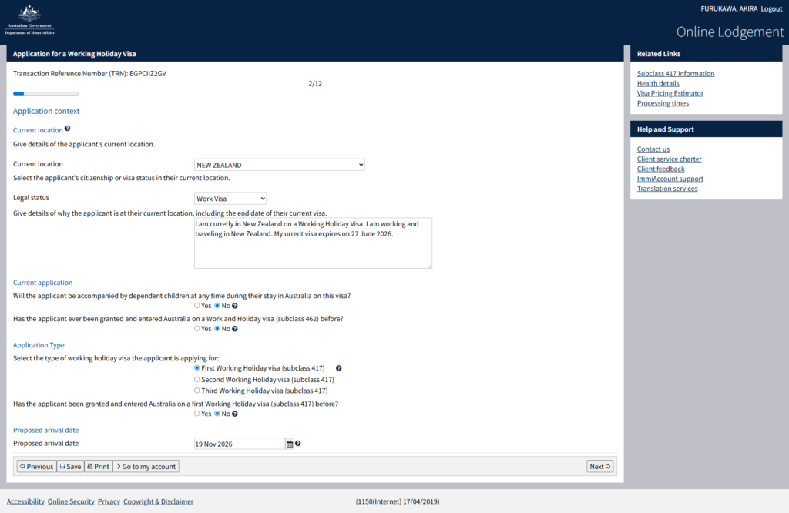](https://xainome.blog/wp-content/uploads/2026/05/ELodgement-Page-05-08-2026_12_19_AM.png)

ここは基本的な質問ですね。パスポートや氏名などスペルミスに気を付けましょう。

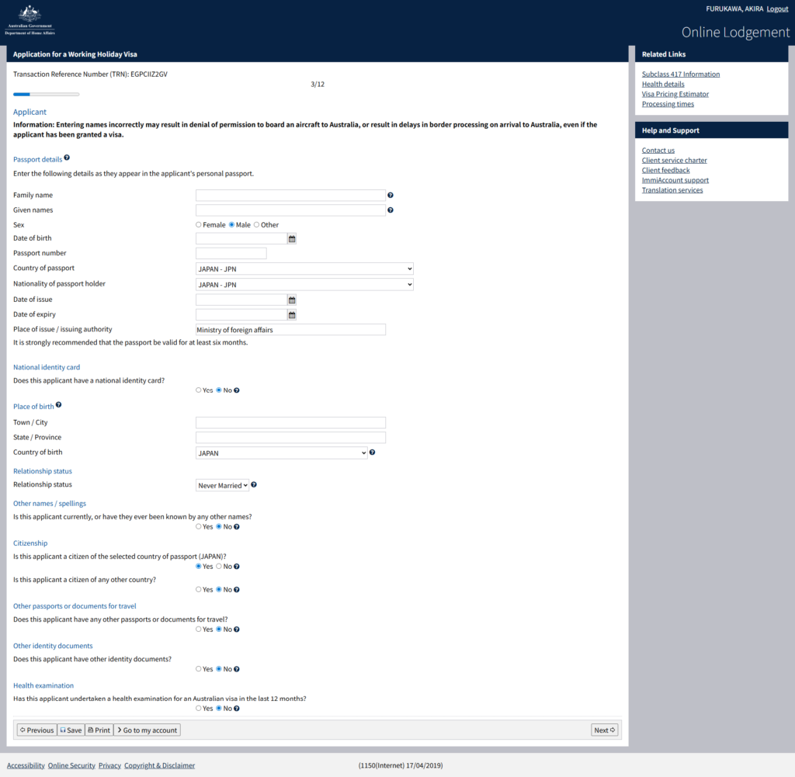

ここは住所になります。私は今Tekapoに住んでいるのでそこの住所にしました。それから電話番号は日本の物にしてます。恐らくニュージーランドのものオーストラリアでは使わないと思うので。

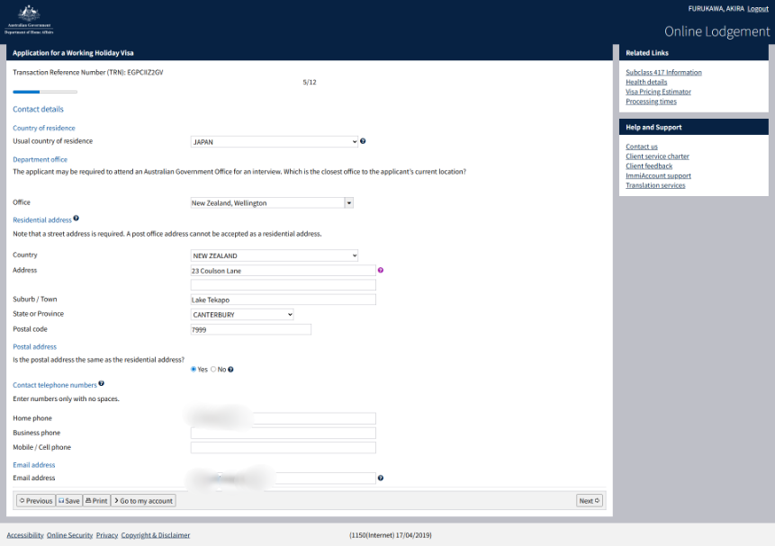

### ビザ申請 仕事や健康について

ここでは仕事についてですね。前にやってた仕事やどんな仕事に就く予定かを書いています。特に何も考えていないのでざっくりですが。大学は数学系なのでサイエンスのほうを選択しています。

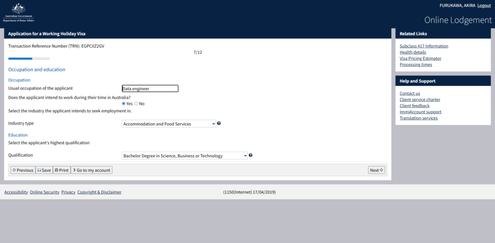

次の質問で3か月以上滞在した国の話があったので入力しました。6月末までいる予定ですが、今日日付までしか入力できない仕様になってるみたいです。後は健康面に関してでしたが特に問題ないので全てNoを選択しました。

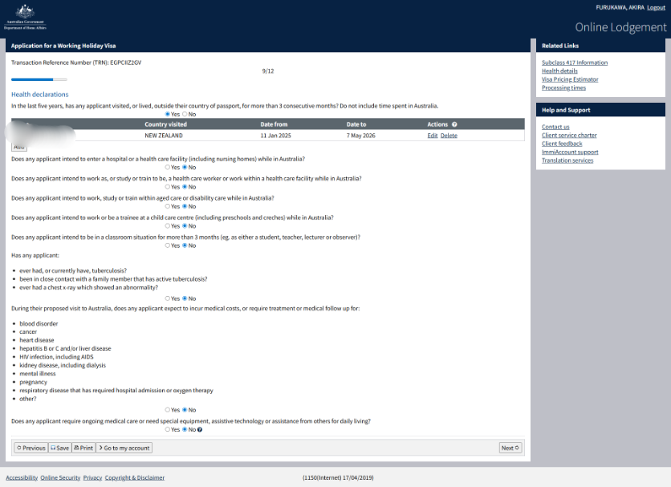

ここでは個人の経歴などについて書かれています。例えば教師関連の仕事をするや軍隊の経験があるかなどが問われています。私は特に何もないので全てNoを選択しています。

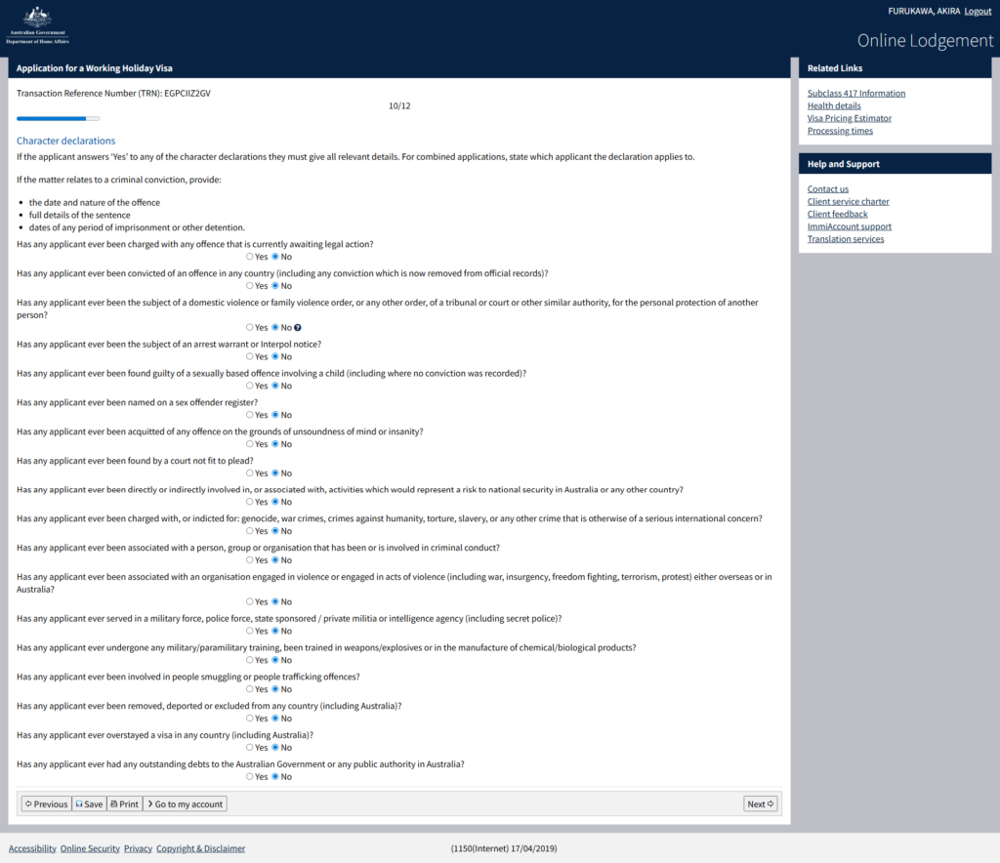

ワーキングホリデービザで就職するにあたっての注意点ですね。ここも全てYesにします。

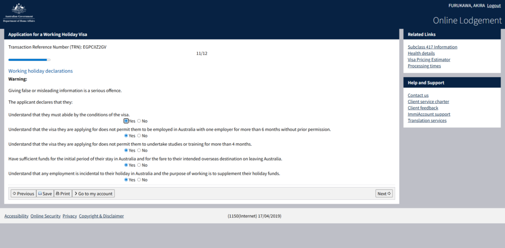

ここは今回の申請についてですね。申請内容に問題がないかを確認しています。全てYesを入力すれば問題なしです。

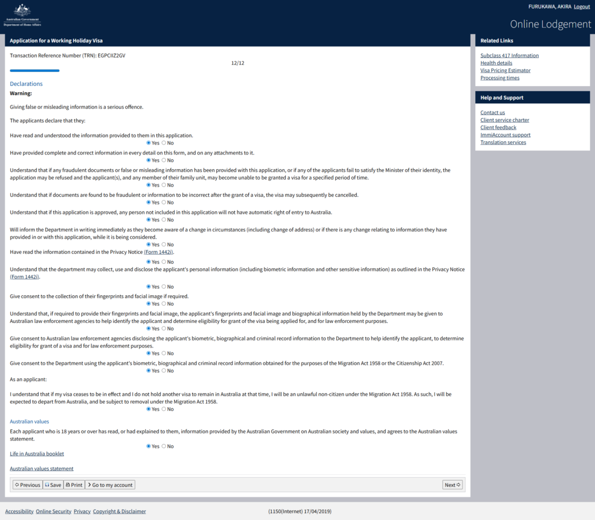

### ビザ申請 証明書の添付

それからパスポート写真のPDFと資金証明書のPDFを添付します。私は写真をpdfに変換した後、passport.pdfという名前に変えて添付しました。同じように資金証明書もBank Statementという名前にして添付しています。資金証明書はBNZからすぐにダウンロードできましたので、翻訳などは必要ありませんでした。為替の計算についても移民局側が勝手にやってくれるみたいです。

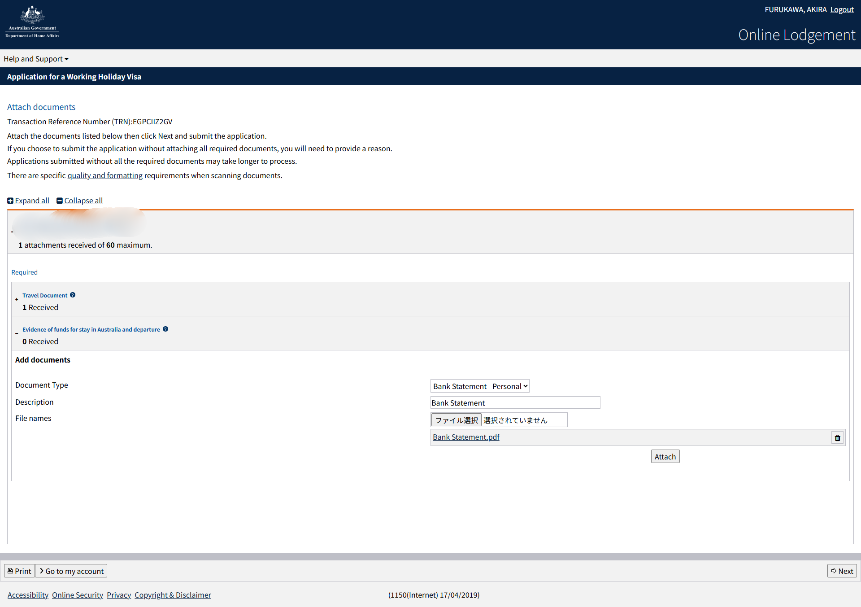

ここには住所を入力します。先ほども書きましたが私はニュージーランドに住んでいるのでそこの住所を記入しました。

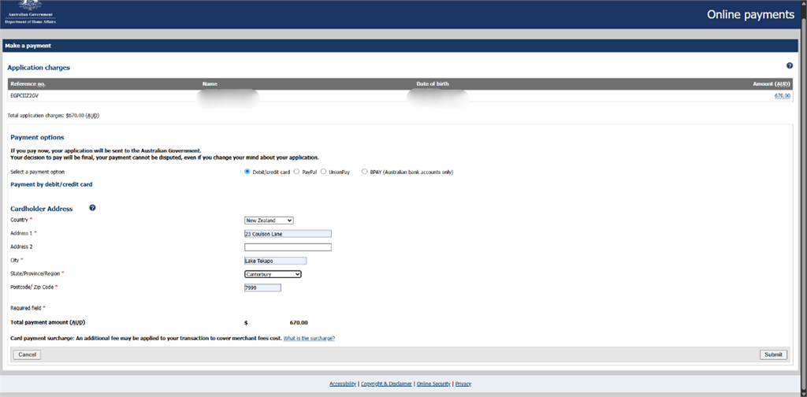

最後にクレカの情報を入力して支払いが完了すれば終わりですね。

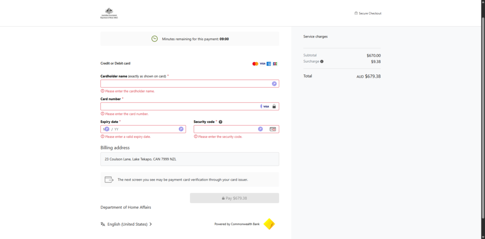

この画面が出れば申請は完了になります。思ったよりは大変じゃないのでそこまで苦戦しなかった感じがします。

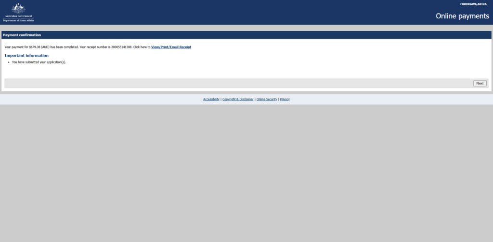

多少省いたところもありますがある程度Google翻訳にかけつつ入力していけば問題ないと思います。パスポート番号や名前を間違えない、パスポートの写真がきれいに撮れている、資金証明書に十分な資金が残されているうえで変な解答をしなければ問題ないと思います。

ちなみに夜10時くらいに申請をしましたが10分も経たないうちにビザの申請が下りてました。しっかりとできていればすぐにビザの許可が下りるんだと思います。というわけでタイミングを見て今度はオーストラリアにだらだらしに行こうと思います。ではでは。

## AI採点

## 推定 IELTS Writing Band

- **Task Response:** 5.5

- **Coherence & Cohesion:** 5.0

- **Lexical Resource:** 5.0

- **Grammatical Range & Accuracy:** 4.5

### Overall

**Overall Band: 5.0**

内容自体は伝わりますし、流れもあります。  
ただし、IELTSでは「自然な英語」「文法精度」「論理的なつながり」がかなり重視されるため、多くの減点があります。

特に問題なのは：

- 不自然な動詞の使い方

- 冠詞(a / the)不足

- 単数複数

- 時制

- “apply” の使い方

- 名詞化しすぎ

- 日本語直訳

です。

* * *

# 良い点

## 1\. 内容は具体的

ビザ申請の流れが具体的なので、Task Response はそこまで低くありません。

## 2\. 段落分けはできている

見出しを作っているので読みやすいです。

## 3\. 実体験ベース

IELTSでは具体例があると評価されやすいです。

* * *

# 大きな減点ポイント

* * *

# ① apply の使い方がかなり不自然

あなたの文章では almost 全部不自然です。

* * *

## ❌

> applied WHV in Australia

## ✅

> applied for a Working Holiday Visa in Australia

「apply」は基本的に：

apply for + noun\\text{apply for + noun}apply for + noun

になります。

* * *

## ❌

> applied visa

## ✅

> visa application  
> applying for a visa

* * *

## ❌

> Creating account of applied visa

## ✅

> Creating an account for the visa application

* * *

# ② 冠詞ミス（IELTSでかなり重要）

IELTS 6.5以上では冠詞ミスをかなり減らす必要があります。

* * *

## ❌

> Creating account

## ✅

> Creating an account

* * *

## ❌

> use an Android

## ✅

> use Android

Android は通常冠詞なし。

* * *

## ❌

> downloaded Google Authenticater

## ✅

> downloaded Google Authenticator

スペルミスです。

* * *

## ❌

> This is an application

## ✅

> It is an application

前文とのつながり的に自然。

* * *

# ③ 不自然な英語（日本語直訳）

ここが最も大きいです。

* * *

## ❌

> I am going to write about that I applied WHV in Australia

英語では “write about that” はかなり不自然。

## ✅

> I am going to write about applying for an Australian Working Holiday Visa and how quickly it was approved.

かなり自然になります。

* * *

## ❌

> I did it which was "417".

意味は推測できますがかなり不自然。

## ✅

> I applied for the subclass 417 visa.

* * *

## ❌

> I wrote about that.

日本語の「その旨を書いた」の直訳。

## ✅

> I mentioned that my current visa had not expired yet.

* * *

## ❌

> This form showed personal career.

## ✅

> This section asked about my personal background.

career はここでは変。

* * *

# ④ 文法エラー

* * *

## ❌

> each questions

## ✅

> each question

each の後は単数。

* * *

## ❌

> more 3 months

## ✅

> more than 3 months

* * *

## ❌

> I never work these job

## ✅

> I have never worked in these jobs.

または

> I have never done those jobs.

* * *

## ❌

> I selected all "Yes"

## ✅

> I selected “Yes” for all of them.

* * *

# ⑤ 時制の問題

* * *

## ❌

> my visa is not expired

## ✅

> my visa has not expired

または

> my visa was still valid

* * *

## ❌

> I stay in New Zealand

## ✅

> I was staying in New Zealand

過去の申請時点の話なので過去進行形が自然。

* * *

# ⑥ 語彙の問題

* * *

## ❌

> transed a picture to pdf

存在しない単語です。

## ✅

> converted a picture into a PDF

* * *

## ❌

> calcurated

## ✅

> calculated

スペルミス。

* * *

## ❌

> appliance

家電という意味になります。

## ✅

> application

* * *

## ❌

> attemped PDF

## ✅

> attached a PDF

* * *

# ⑦ Coherence（論理のつながり）

接続詞が弱いです。

IELTS 7+ を狙うなら：

- Moreover

- In addition

- Afterward

- As a result

- Therefore

- Since

- Because of this

などをもっと自然に使いたいです。

* * *

# 特に良くない英文（IELTS的に大きく減点）

* * *

## ❌

> It was complete to see this viewing.

かなり意味不明に近いです。

## ✅

> The application was complete once this screen appeared.

* * *

## ❌

> I was accepted it within 10 minutes.

## ✅

> My visa was approved within 10 minutes.

accepted はビザでは不自然。

* * *

# IELTS 8 を目指すなら重要

今の文章は：

- 「意味はわかる」

- 「かなり日本語的」

- 「自然さが不足」

という状態です。

IELTS 7+ では：

- ネイティブっぽい自然なコロケーション

- 文法精度

- 冠詞

- 時制

- 前置詞

が非常に重要になります。

* * *

# あなたが特に改善すべきポイント

## 優先度高

1. apply の使い方

3. 冠詞

5. 単数複数

7. 自然な動詞選択

9. 日本語直訳を減らす

* * *

# 自然なタイトル例

## ❌

> Basic Information of applied visa

## ✅

> Basic Information for the Visa Application

* * *

## ❌

> Attemption with proof of apllied visa

## ✅

> Attaching Supporting Documents

* * *

# 改善後だとBandどのくらい狙える？

この内容を：

- 文法修正

- 自然な英語

- コロケーション修正

すると **6.5〜7.0** は十分見えます。

内容自体は悪くないです。  
問題は「英語の自然さ」と「基礎文法精度」です。

かなりIELTS向きの改善余地があります。
