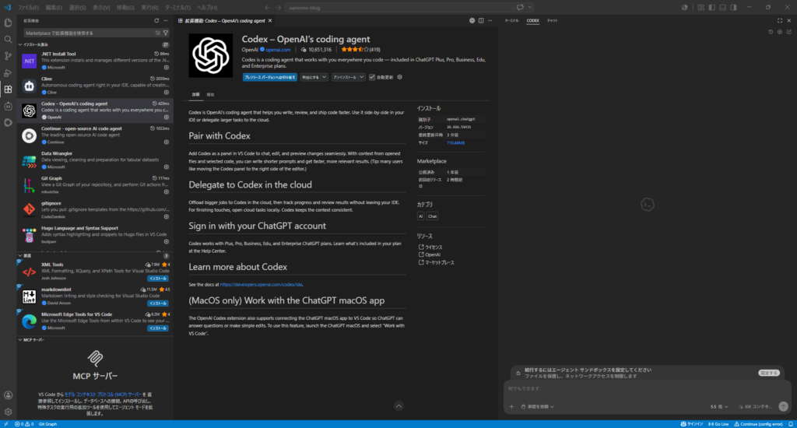
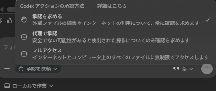
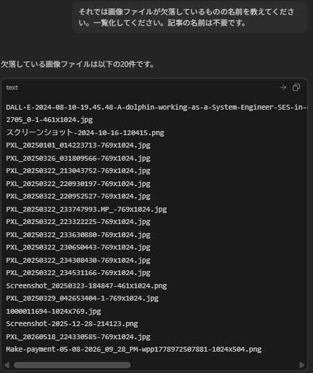
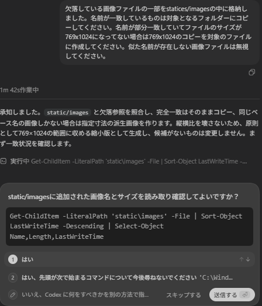
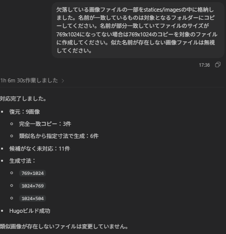

## Codexについて

### 使用理由 - Codex

codexとはOpenAIが提供しているAIコーディングまたはAIエージェントになります。Codex自体は1年くらい前からローンチされており、私も存在自体は知っていました。それ以外にも他のAIコーディングも名前ぐらいはある程度把握しています。

今回Codexを選んだのはシンプルでChat-GPTのPlusプランに加入しているからですね。他のAIコーディングでもいいのはあるとは思いますが、他のサブスクに変更するのも面倒ですしそこまで大きな差が出ないのであればこだわる必要はないと思います。

無料でAIコーディングできるものであれば過去に試してみたClineやContinueがあれば無限にできると思います。制限付きならGoogleの[Antigravity](https://antigravity.google/download)や[Copilot](https://copilot.microsoft.com/)でも十分だとは思います。

本題ですがそもそもなぜAIコーディングを使うことになったかというとWebサイトを移行するにあたって変更するものが多くあったからです。例えばフォームの表示がうまくいかない、リンクを最適化したい、不要な画像の削除をしたいなど人力でやるには手間がかかるようなものをやりたくなかったからです。

### Codexの導入

というわけでまずはCodexを導入します。VScodeを事前に入れているので拡張機能からCodexを探してインストールしていきます。もちろんCodexのアプリを入れてみましたが、vscodeからアクセスできるならそちらが楽だと思います。特に使いやすさに大きな差は出ないと思いますので。



#### Codexへの指示だし

最初に聞いたのはフォームがうまく表示されなかったことですね。私がアイキャッチ画像で使っているイルカの画像が表示されなかったり、先頭の記事が枠にはまってないなどの事象が起きていました。というわけで以下のように指示を出して聞いてみました。

```
これはHugo + PaperModのサイトです。

まずプロジェクト構成を確認してください。
まだファイルは編集しないでください。

確認してほしいもの：
- hugo.toml
- contentフォルダー構成
- themes/PaperMod
- layoutsフォルダーがあるか
- publicフォルダーがあるか
- PaperModテーマが正しく入っているか
- “found no layout file for html” の警告が出る理由

原因を簡単に説明してください。
その後、安全な修正案を出してください。ただし、私が許可するまで編集しないでください。
```

### 作業とその確認

Codexを使うにあたってファイルのアクセスやネットの利用などが当然あります。その時に承認を求めるかどうかがあります。私は不安なタイプの人間なので確認を求めるようにしています。面倒であれば代理で承認やフルアクセスでもよいかと思います。会社のPCであればそもそも利用を禁止されるかもしれませんが。



次に実際に質問して編集を行ってもらいます。今回お願いしたのは画像の圧縮とコピーですね。特にコマンドを聞かれなければフォルダの中身を確認して表示してもらえます。



次に以下のように聞いてみました。そうするとコマンドで確認しようとするのでそれのアクセス許可確認が行われます。特に問題なければ1で今後も聞かれたくなければ2を選択してよいと思います。



他にも確認事項などで聞かれることがありますが、基本的には"はい"で問題ありません。というわけで最終的にはこうなりました。私の想定通りだったので特に問題ないですね。中身も確認しましたが特に問題なさそうでした。画像も圧縮されてましたので。



といった具合でうまく表示されてなかったり、リンクを変えたいけど大量に変えることになる場合はCodexなどのAIコーディングを使うとかなり楽になりますね。これがわかると個人開発が捗るというのもうなずけます。もちろんセキュリティやアプリをローンチする場合はまた別の障害が出てくるとは思いますが。ではでは。
