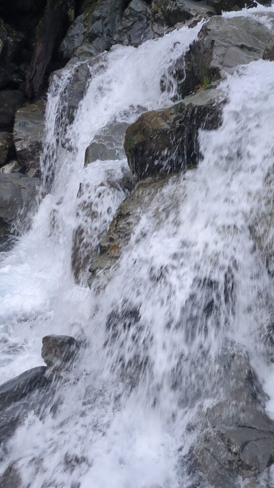
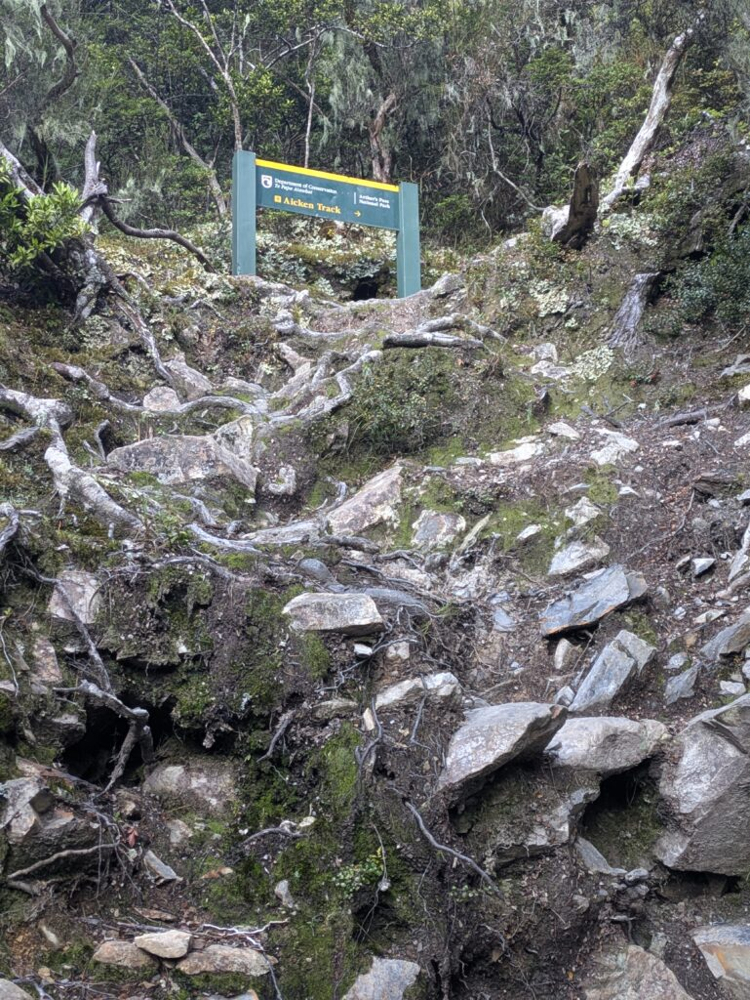
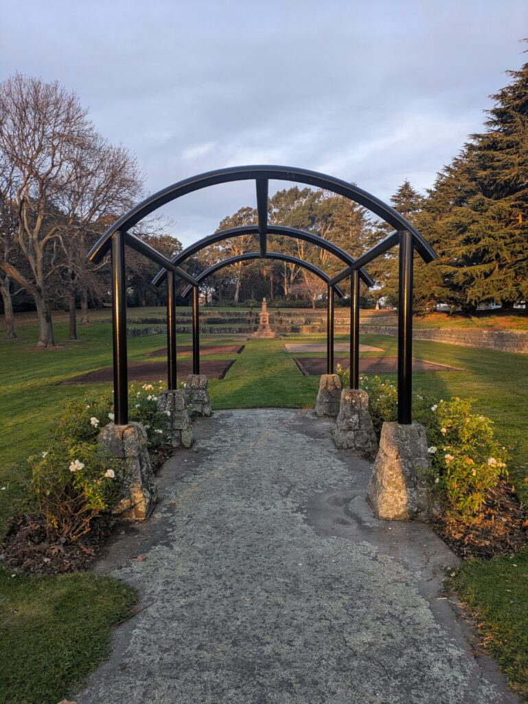

## English\_Practice

I am restarting to do road trip where I am going to write. I wrote about Hanmer Springs. I will write from Arthurs pass to Timaru.

Firstly, I went to Talbot Forest Scenic Reserve and Peel Forest before going to Arthurs pass. I walked in the nature in former one.

There were two falls in back one and I went to Emily Falls. The way to go there was a little mud. However, when I wanted to see the fall, I needed to across the river and go to way which was slippery.

### Arthurs pass

Arthurs pass was consisted of a couple of hiking courses. I always choose a short course because I do not like hiking. I went to Devils Punchbowl Waterfall at this time.

I arrived near the big fall and it took for 30 minutes. It was a good track which was short, but I really enjoyed walking in nature. Nevertheless, there was another track on this way. Moreover, it was harder than that course.

I climbed the cliff at the sigh named "Aicken Track" at first. After that, I headed to final sigh after one and half hour. However, I had to go up the strict rock stair. I recommend to prepare beverage if you go there.

### Timaru

I often went to Timaru for shopping. However, I really did not go to the sightseeing. I have just seen penguins.

I headed to Botanic garden. I saw birds and gardens mainly because it was not season to see flowers.

They were so amazing because there were many kind of parrots which have funny feature and organized gardens. If I have a chance, I would like to visit there in spring.

I enjoyed exploring like that for a few days. I am going to wirte from oamaru to dunedien next time. See you later.

## 日本語版

ロードトリップを再開したのでどこに行ったかを書いていこうと思います。[前回](/posts/2026/05/hanmersprings-pools/)はHanmer Springsのことについて書きました。今回はArthurs passからTimaruまでを書いていこうと思います。

まず[Arthurs pass](https://www.newzealand.com/nz/arthurs-pass/)に行く前にタルボット・フォレスト・シニック保護区とピールフォレストという場所に行きました。前者の方は軽いウォーキングが自然の中で出来る場所でハイキングほどきつくはありません。

後者のピールフォレストは2か所の滝が見れる場所で私はエミリーフォールのほうへ行きました。道中は少しぬかるみがある程度で大変な道のりではないですね。ただ、滝を見るには川を横切る必要があり、更に滑りやすい場所を通れば滝の近くまで行くことができます。

### Arthurs pass

Arthurs passは複数のハイキングコースからなっている場所であり、各山を登ることができます。私はそこまでハイキングが好きな方ではないのでいつも短めのほうを選んでいます。今回はDevils Punchbowl Waterfallというところに行きました。

ここは大きめの滝が見られる場所で大体30分くらいで着きます。コースとしては短いですが十分に自然を味わうことができるのでとても良い場所だと思います。ただ、この道中で別のトレッキングコースがあり、そちらに行くとハードよりのコースになっています。

Aicken Trackという名前でまず看板のところに行くのに岩場を登ります。そこから1時間半くらいで最後の看板までたどり着きますが、険しい岩場を登ることになります。もし行く場合は飲み物ぐらいは準備しておくことをおすすめしておきます。

### Timaru

Timaruには買い物でよく来ていましたが、観光自体はあまりしていませんでした。せいぜいペンギンを見に行ったぐらいですね。

ここではBotanic gardenがあったのでそちらに行きました。とは言ってもシーズンではないので花はある程度枯れており、鳥と庭園がメインでした。

色んなオウムの種類がいてそれぞれ面白い特徴をしているのと綺麗に整えられている庭園はとても素晴らしいものだと思います。次行くことがあれば春先辺りに訪れてみたいなと思います。

という感じで数日巡ってました。次はoamaruからdunedinあたりを書いていこうと思います。ではでは。

## AI採点

IELTS Writing Task 2基準で見ると、現在の英文はおおよそ **Band 4.5〜5.0** です。  
理由は、「意味はある程度伝わる」が、文法・語法・自然さ・結束性にかなり不自然な箇所が多いためです。

特に減点が大きいのは：

- 動詞の使い方

- 冠詞

- 前置詞

- 不自然なコロケーション

- 日本語直訳

- 文のつなぎ方

- 時制の不統一

- 可算/不可算

- 固有名詞表記

です。

* * *

# IELTS基準での評価

## 1\. Task Response — 5.5

内容自体は伝わります。  
ただし、

- 説明不足

- 不自然な表現

- 同じ構文の繰り返し

があり、読み手が引っかかります。

* * *

## 2\. Coherence and Cohesion — 5.0

段落構成はありますが、

- 接続詞の使い方が不自然

- 文同士の流れがぎこちない

- “Moreover”, “Nevertheless” が不自然

です。

IELTSでは「自然な流れ」がかなり重要です。

* * *

## 3\. Lexical Resource — 5.0

語彙は簡単なもの中心です。

さらに：

- “back one”

- “strict rock stair”

- “organized gardens”

など、英語として存在しない/不自然な語彙選択があります。

* * *

## 4\. Grammatical Range and Accuracy — 4.5

ここが最大の減点ポイントです。

特に：

- be動詞 + 過去分詞

- 不定詞

- 前置詞

- 冠詞

- 単数複数

のミスが非常に多いです。

* * *

# 細かい添削

* * *

## 1文目

> I am restarting to do road trip where I am going to write.

❌ 問題点

### restarting to do

→ 不自然

英語では：

- restart a trip

- resume a road trip

を使う。

### do road trip

→ ❌

road trip は “do” を使わない。

### where I am going to write

→ 意味不明

「どこに行ったかを書く」が崩れている。

* * *

✅ 自然

> I restarted my road trip, so I would like to write about the places I visited.

* * *

## 2文目

> I wrote about Hanmer Springs.

△ 文法OKだが不自然

ブログ文脈なら：

> Last time, I wrote about Hanmer Springs.

の方が自然。

* * *

## 3文目

> I will write from Arthurs pass to Timaru.

❌

### from A to B

「AからBまで移動する」

ではなく、

「A〜Bについて書く」

なら：

> This time, I will write about my trip from Arthur’s Pass to Timaru.

* * *

# 次段落

> I walked in the nature in former one.

❌

### in the nature

→ ❌

英語では：

- in nature

- surrounded by nature

を使う。

### former one

→ 不自然

* * *

✅

> The former was a place where I could enjoy a light walk in nature.

* * *

# 滝の説明

> There were two falls in back one

❌

### back one

存在しない表現

→ latter one

### falls

通常 waterfalls

* * *

✅

> The latter, Peel Forest, has two waterfalls, and I visited Emily Falls.

* * *

# 超重要ミス

> I needed to across the river

❌

across は前置詞

動詞ではない。

* * *

✅

> I needed to cross the river

これはIELTSでかなり減点されるタイプ。

* * *

# ここも重要

> Arthurs pass was consisted of

❌

「consist」は受動態にしない。

* * *

✅

> Arthur’s Pass consists of several hiking tracks.

これは超頻出ミス。

* * *

# ここ

> It took for 30 minutes.

❌

* * *

✅

> It took about 30 minutes.

* * *

# ここ

> another track on this way

❌

英語では：

- along the way

- on the route

* * *

# ここ

> I climbed the cliff at the sigh named "Aicken Track"

❌

### sigh

ため息

→ sign

### climbed the cliff

崖登った意味

実際は岩場。

* * *

✅

> First, I climbed over some rocky terrain to reach the sign for the Aicken Track.

* * *

# ここかなり危険

> strict rock stair

❌

意味不明

strict は「厳格な」

* * *

✅

> steep rocky path  
> steep rocky stairs

* * *

# ここ

> I recommend to prepare beverage

❌

recommend の使い方

* * *

✅

> I recommend bringing some water.

IELTSではこういう自然表現が重要。

* * *

# Timaru

> go to the sightseeing

❌

sightseeing は不可算

* * *

✅

> I did not really go sightseeing.

* * *

# ここ

> it was not season to see flowers

❌

* * *

✅

> it was not the season for flowers

* * *

# ここ

> many kind of parrots

❌

* * *

✅

> many kinds of parrots

単複ミス。

IELTSでかなり見られる。

* * *

# ここ

> funny feature

△

「面白い特徴」なら：

- unique characteristics

- interesting features

* * *

# ここ

> organized gardens

△

庭園に organized は不自然。

* * *

✅

> beautifully maintained gardens

これはネイティブっぽい。

* * *

# 最後

> I am going to wirte from oamaru to dunedien next time.

❌ スペル

- write

- Oamaru

- Dunedin

* * *

# 8.0以上を狙う改善ポイント

あなたの英語の特徴は：

- 日本語をそのまま英語にしている

- 「意味を直訳」している

- 英語の自然な動詞を選べていない

です。

Band 8は：

- 自然なコロケーション

- ネイティブに近い語順

- 無駄のない接続

- 正確な文法

が必要。

I restarted my road trip recently, so I would like to write about the places I visited along the way. Last time, I wrote about Hanmer Springs, and this time I will cover my trip from Arthur’s Pass to Timaru.

Before heading to Arthur’s Pass, I stopped by two places called Talbot Forest Scenic Reserve and Peel Forest. The former was a relaxing place where I could enjoy a light walk surrounded by nature, so it was much easier than a proper hiking trail.

At Peel Forest, there are two waterfalls, and I decided to visit Emily Falls. The track itself was not very difficult, although some parts were slightly muddy. However, to get closer to the waterfall, I had to cross a river and walk across some slippery rocks.

## Arthur’s Pass

Arthur’s Pass is well known for its many hiking tracks, and visitors can climb several mountains in the area. Since I am not a huge fan of long hikes, I usually choose shorter tracks. This time, I visited Devils Punchbowl Waterfall.

The waterfall is quite impressive, and it only takes around 30 minutes to reach it. Although the track is relatively short, it is still a great place to fully enjoy the surrounding nature. Along the way, there is also another track that leads to a more challenging route.

The track is called the Aicken Track. To reach the first sign, I had to climb over some rocky terrain. After about an hour and a half, I finally reached the last sign, but the trail became much steeper and rougher along the way. If you are planning to go there, I would definitely recommend bringing some water with you.

## Timaru

I often visited Timaru for shopping, but I had not really explored the city itself. The only sightseeing I had done before was going to see the penguins.

This time, I visited the Botanic Gardens. Since it was not the season for flowers, many of them had already withered, so the birds and the gardens themselves became the main attraction.

There were many kinds of parrots, each with unique characteristics, and the beautifully maintained gardens were wonderful to walk through. If I have another chance to visit Timaru, I would like to go there again in early spring.

That is how I spent the past few days travelling around the South Island. Next time, I will probably write about my trip from Oamaru to Dunedin. See you next time.
