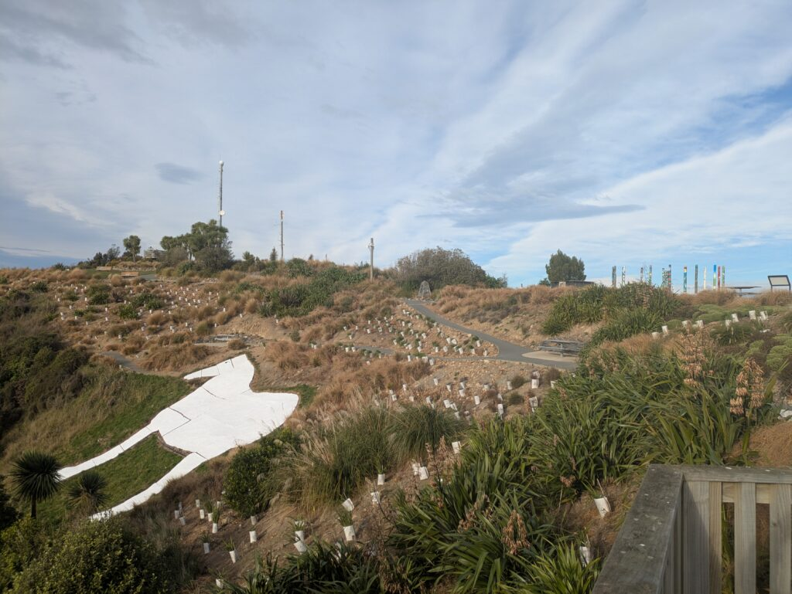
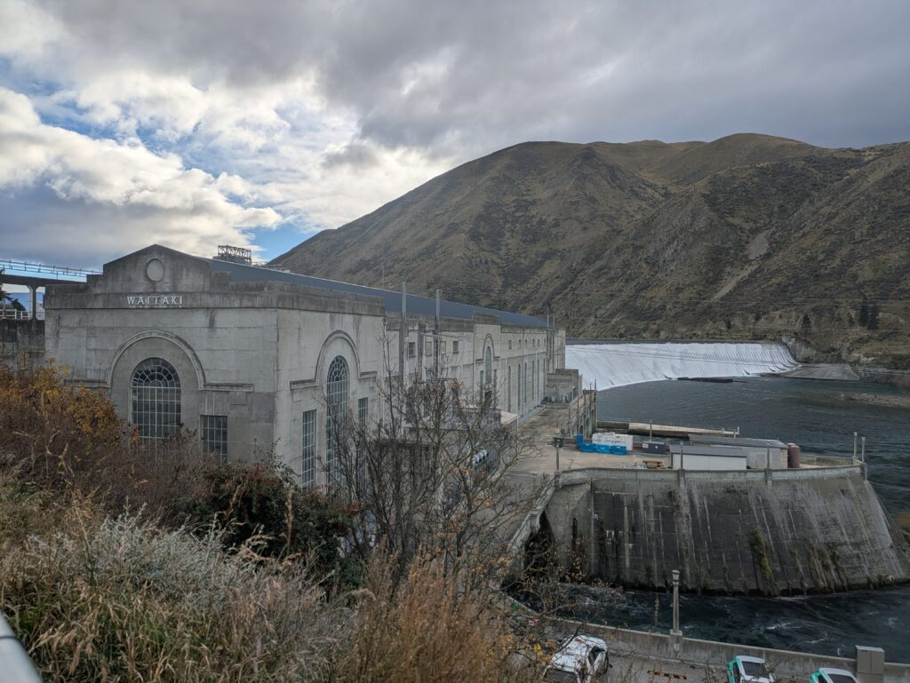
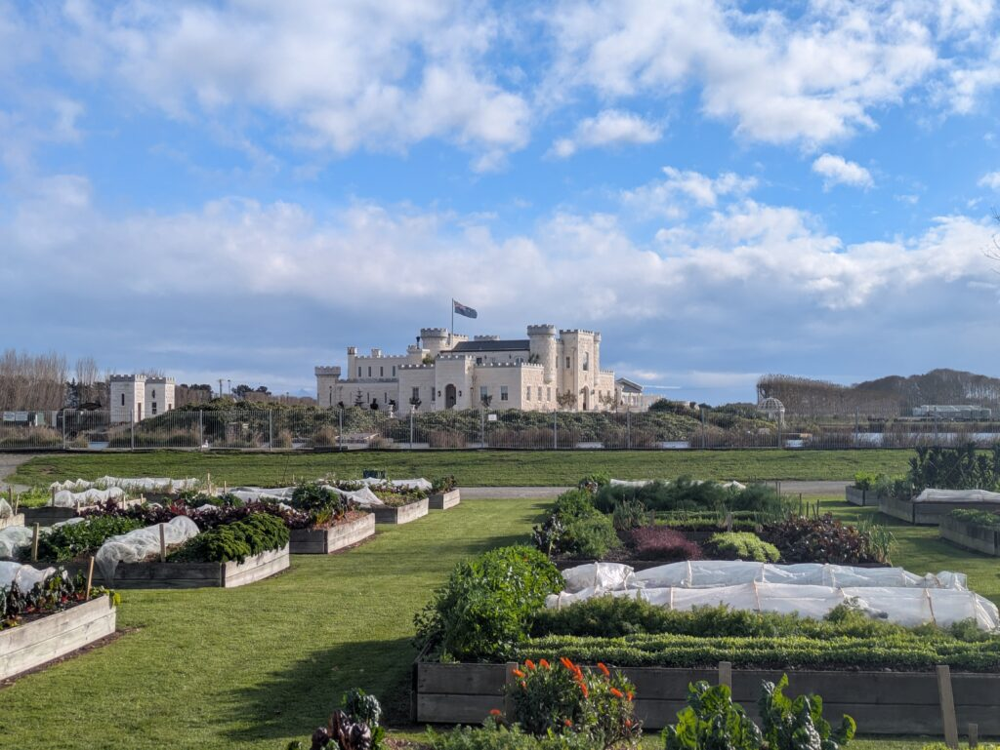
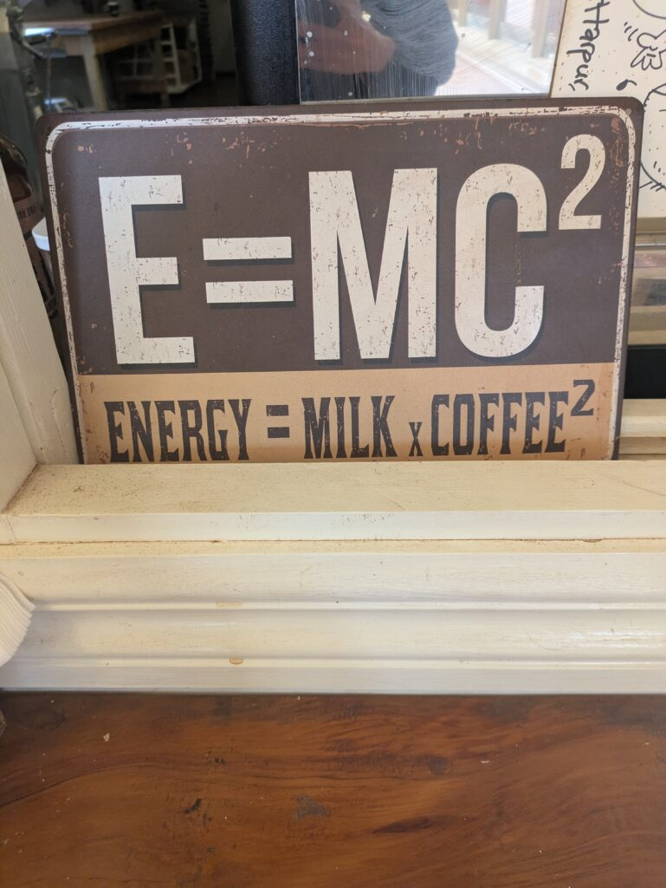
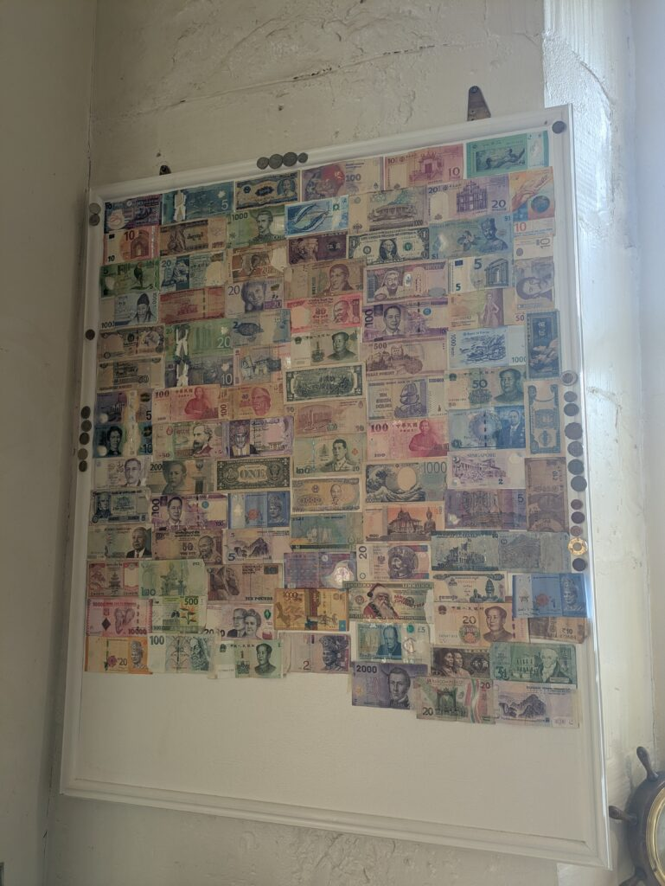
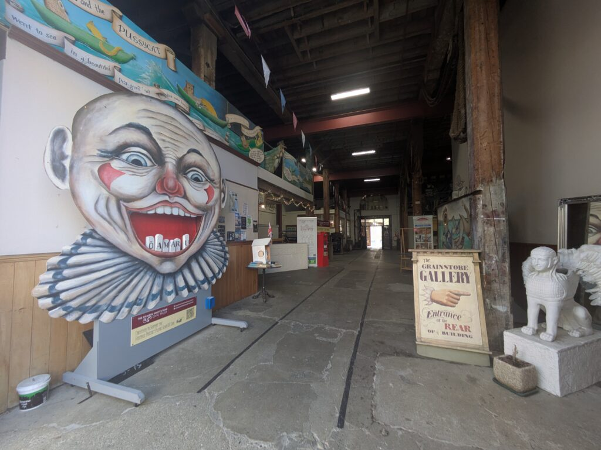
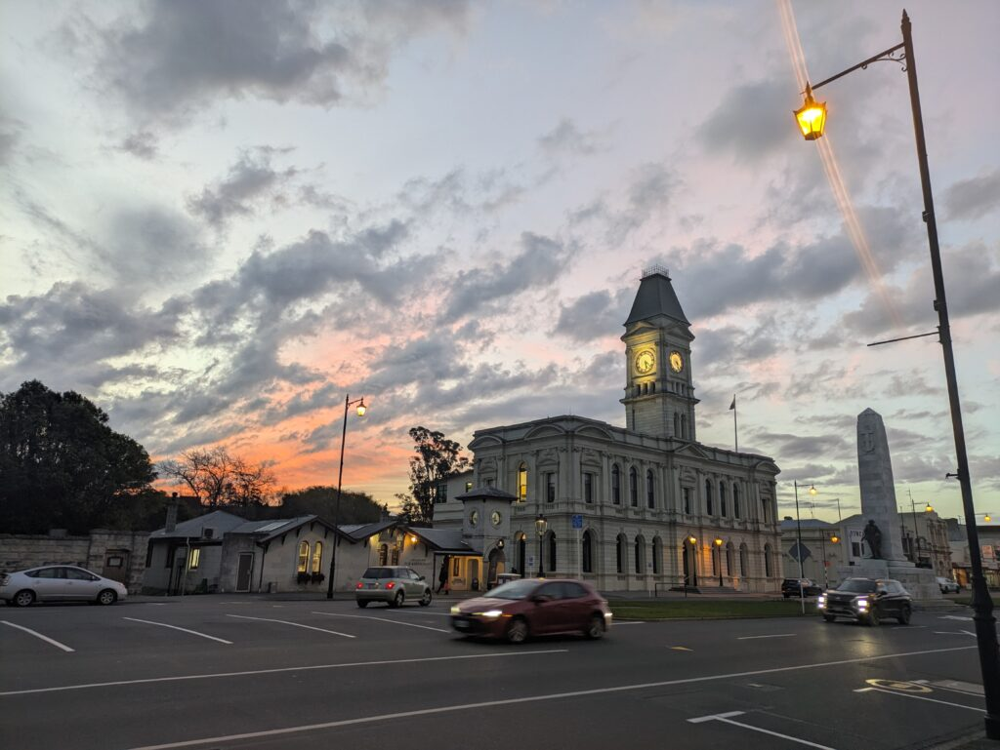
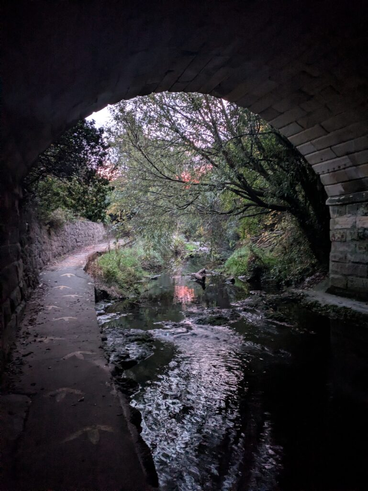

## English\_Practice

### Sightseeing near Oamaru

I am going to write about my road trip from Timaru to Oamaru. I already wrote about Timaru. Firstly, this is White Horse Monument. Here is a simple view spot. The scenery is so nice.

This is Waitaki Dam. I felt it did not look high, but this dam has much width.

This is Riverstone Castle. It looked so beautiful and it was built around 200 ago.

### Oamaru

These are pictures with Oamaru city. This is a funny sigh. The originally is energy equal material multipul speed with light squared. However, it was good joking and it shows attractive. It means Flat White,maybe.

This is notes of each countries in that cafe. Those are interesting because there are each features almost of all countries. Japanese notes also are on this board.

This is near the Art gallery. It has unique gallery and some equipment on the circus.

This is near city center in Oamaru. There is the clock tower so I felt it looked Europe. This is a good place to see sightseeing.

Moreover, this town has a river under a bridge. I like this atmosphere because it has nature.

I looked around Oamaru. If I have time more, I would like to explore this city because I could not see some shops.

## 日本語版

### Oamaru付近の観光スポット

今回はTimaruからOamaruまでの道のりを書いていこうと思います。Timaruは[前回](/posts/2026/06/roadtrip-arthurs-pass-to-timaru/)書いたので今回はその先にある観光スポットからになります。まずはWhite Horse Monumentですね。ここはシンプルな観光スポットになります。もちろん見える景色はよいものでした。

ここはWaitaki Damですね。そこまで高くないように感じましたが、ある程度幅があるダムになっています。

ここは[Riverstone Castle](https://waitakinz.com/explore/riverstone-castle)ですね。建てられたのはそこまで昔ではないと思いますが外観はきれいなお城だと思います。

### Oamaru

ここからは[Oamaru](https://www.newzealand.com/nz/oamaru/)市内の写真になります。これは面白い看板だなと思って取りました。本来はエネルギー = 物量 × 光の速さの2乗ですがうまい具合にコーヒーの魅力を伝えられてるなと思います。この感じだとFlat Whiteになる気もしますが。

ここは先ほどのコーヒーショップ内で見かけた各国の紙幣ですね。全ての国というわけではないですが国ごとの特徴があって面白いなと感じます。もちろん日本の古い紙幣もありますね。

ここはArt galleryの近くになります。変わった作品やサーカスなどで使われたものもあってユニークな場所だなと感じました。

ここはOamaru市内の中心付近ですね。時計台があってヨーロッパを彷彿とさせるような雰囲気です。ここの近場の建物もとても良い雰囲気で観光するのにとても良いなと感じました。

またこの町には川があり、高架下のようなものがありました。自然もあるのでこの町の雰囲気は凄く好きですね。

といった感じでOamaruの周るをぐるっと見て回りました。もう少し時間があったら市内を見て回りたかったですね。お店などはあまり見て回れなかったので。

## AI採点

## IELTS Writing 推定スコア（Task 1/Task 2基準に近い形で評価）

| 項目 | 推定Band |
| --- | --- |
| Task Response | 5.5 |
| Coherence & Cohesion | 5.5 |
| Lexical Resource | 5.0 |
| Grammatical Range & Accuracy | 4.5 |
| Overall | **5.0〜5.5** |

内容自体は伝わります。  
ただし、以下でかなり減点されています。

- 不自然な英文直訳

- 冠詞ミス

- 単数複数

- 語法ミス

- 動詞選択ミス

- 「英語として存在しない表現」

- 文同士のつながり不足

特に **“日本語をそのまま英語へ置き換えた感”** が強く、IELTSでは自然さが重要です。

* * *

# 良かった点

- 時系列は分かる

- 読者は「旅行記事」だと理解できる

- 景色や雰囲気を説明しようとしている

- “atmosphere” “unique” などIELTS向き語彙を使おうとしている

* * *

# 細かい添削・減点ポイント

* * *

## 1\. “Here is a simple view spot.”

### 問題点

- “view spot” はかなり不自然

- “simple” も観光地にはあまり使わない

### より自然

- a simple tourist attraction

- a scenic viewpoint

- a sightseeing spot

### 修正版

> It is a simple sightseeing spot with a nice view.

* * *

## 2\. “this dam has much width”

### 問題点

“much width” は不自然です。

### 自然な表現

- very wide

- has a considerable width

- stretches across the river

### 修正版

> Although it did not seem very tall, it was surprisingly wide.

* * *

## 3\. “it was built around 200 ago”

### 文法ミス

- “200 years ago” が必要

### さらに問題

元の日本語では「そこまで昔ではない」なので、  
「200年前」は内容改変になっています。

### 修正版

> Although it does not seem very old, the exterior of the castle was beautiful.

* * *

## 4\. “These are pictures with Oamaru city.”

### 問題点

- “with Oamaru city” 不自然

- city には通常冠詞不要

### 修正版

> These are photos taken around Oamaru.

* * *

## 5\. “funny sigh”

### スペルミス

- sigh = ため息

- sign = 看板

これはIELTSでかなり危険です。

* * *

## 6\. “The originally is energy equal material multipul speed with light squared.”

### 問題点

ほぼ全体が不自然です。

#### “originally”

副詞になっている

#### “multipul”

スペルミス（multiple）

#### 数式の説明方法

英語では通常：

> Energy equals mass times the speed of light squared.

を使います。

* * *

## 7\. “it shows attractive”

### 問題点

- attractive は形容詞

- show は目的語必要

### 修正版

> it showed the appeal of coffee well.

* * *

## 8\. “notes of each countries”

### 問題点

- notes → 紙幣なら banknotes / bills

- each countries ❌

- each country ✅

### 修正版

> banknotes from different countries

* * *

## 9\. “there are each features”

### 問題点

英語としてかなり不自然。

### 修正版

> each country had its own unique design and characteristics.

* * *

## 10\. “Japanese notes also are on this board.”

### 不自然

- also の位置

- notes 不自然

### 修正版

> Old Japanese banknotes were also displayed there.

* * *

## 11\. “It has unique gallery”

### 問題点

- 冠詞抜け

- gallery は場所なので works/artworks が必要

### 修正版

> There were unique artworks and equipment used in circuses.

* * *

## 12\. “I felt it looked Europe.”

### 問題点

- looked Europe ❌

- looked European ✅

- looked like Europe ✅

### 修正版

> It reminded me of a European town.

これはIELTSでかなり自然です。

* * *

## 13\. “This is a good place to see sightseeing.”

### 問題点

- see sightseeing ❌

### 修正版

> It was a great place for sightseeing.

* * *

## 14\. “this town has a river under a bridge”

### 問題点

意味が少し違う。

日本語の「高架下のようなもの」は  
“an underpass-like structure” に近いです。

* * *

## 15\. “If I have time more”

### 文法ミス

語順。

### 修正版

> If I had more time

* * *

## 16\. “I would like to explore this city”

ここは良いです。自然。

* * *

# IELTS 8.0以上を狙うために必要な改善

## 1\. 「説明文」ではなく「感想＋描写」を混ぜる

今は：

> This is ○○.

が多すぎます。

IELTS 7+ は：

- 感想

- 雰囲気

- 比較

- 印象  
    を自然に混ぜます。

* * *

## 2\. “looked beautiful” の繰り返しを減らす

IELTSでは語彙の幅が重要です。

例えば：

- picturesque

- charming

- atmospheric

- scenic

- historic-looking

- elegant

* * *

## 3\. 短文連打を減らす

今：

> This is Oamaru. This is near the city center. There is a clock tower.

Band 8:

> Near the city center stood a clock tower, which gave the area a distinctly European atmosphere.

I would like to write about my road trip from Timaru to Oamaru. Since I already wrote about Timaru in my previous post, this time I will focus on the sightseeing spots beyond the city.

The first place I visited was the White Horse Monument. Although it is a fairly simple tourist attraction, the scenery from there was beautiful and relaxing.

Next, I stopped by Waitaki Dam. While the dam itself did not appear particularly tall, I was surprised by how wide and impressive it was.

I also visited Riverstone Castle. Even though it does not seem very old, the exterior of the building looked elegant and gave the impression of a European-style castle.

From here, the photos are taken around Oamaru. I found an interesting sign at a coffee shop that humorously referenced Einstein’s famous equation, “Energy equals mass times the speed of light squared.” I thought it was a clever way to express the appeal of coffee. In New Zealand, it probably referred to a Flat White.

Inside the same café, I noticed banknotes from various countries displayed on the wall. Although not every country was represented, I enjoyed seeing the different designs and characteristics of each currency. There were even some old Japanese banknotes on display.

Near the art gallery, I came across several unusual artworks and equipment that had apparently been used in circuses. The area had a very creative and unique atmosphere.

I also explored the city center of Oamaru. The clock tower and surrounding historic buildings reminded me of a European town, and I felt the area was perfect for sightseeing. In addition, the town has a river and several structures beneath the bridges, which added to the charm of the scenery. I especially liked how the town blended nature with its historic atmosphere.

Overall, I really enjoyed walking around Oamaru. If I had had more time, I would have liked to explore more shops and spend longer in the city.
