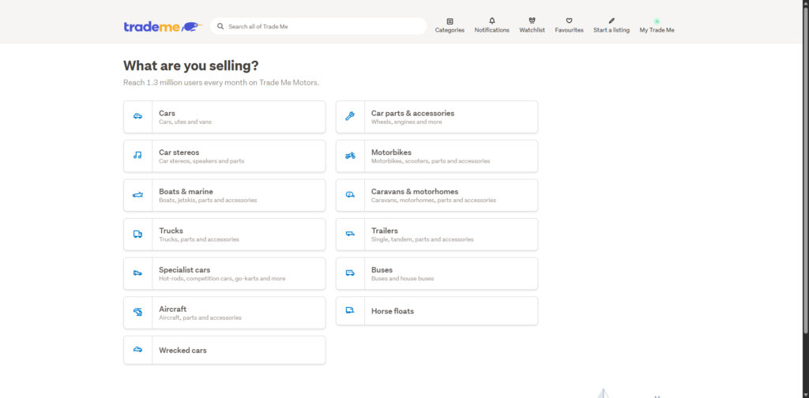
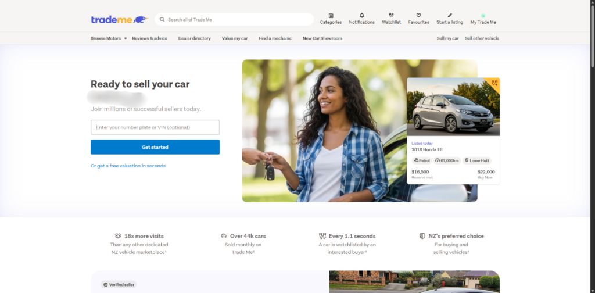
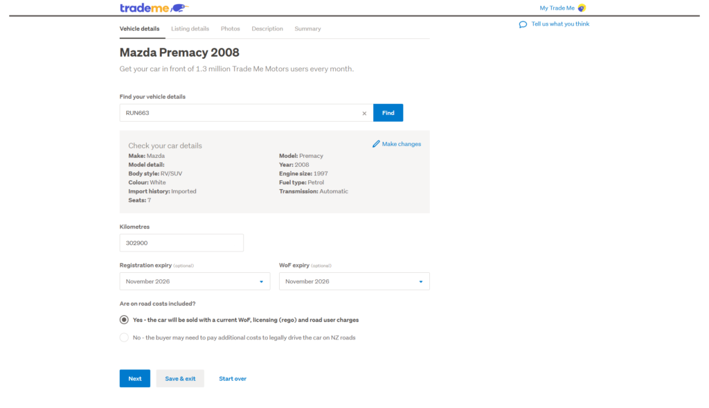
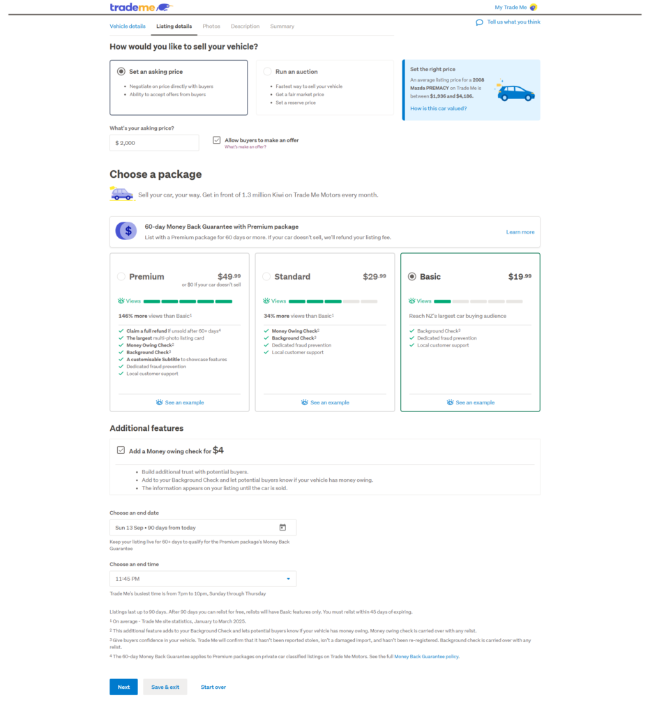
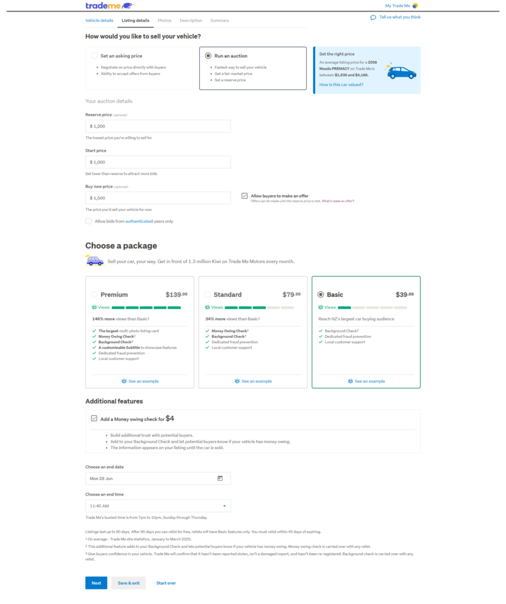
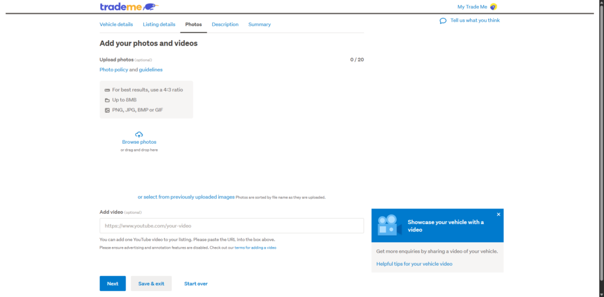
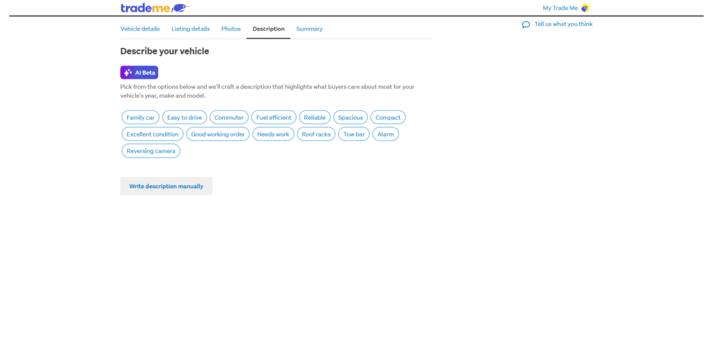

## English\_Practice

I am going to write about selling my car. I bought it on Facebook, but I sold it on Trade me.

### How to sell a car on Trade me

Firstly, I logged in trade me and i clicked "Car, motorbike or boat" from "Start a listing". After that, I chose what I wanted to sell. I selected cars.

I put my plate number in this form.

The plate number shows car details so that I filled out mileage, rego and WOF expiry date and extra payment. If WOF is expired, I would choose "No".

### How to decide price on Trade me

Secondly, I decided price. I had two options. On the one hand, I can decide price and deal with buyer. On the other hand, it is auction. I could set reserve, start and buy now price on this form. I started $1000 at least and would finish it $1500.

Receiving offer, selecting package and illustrating extra option, finish date and time are common between these option. I think we should turn off offer. If you would like to sell early, I recommend choosing "on" because buyer offer lower price.

Selecting package means how to show. If I paid higher price, it would show primary, but I did not do. When I paid extra option, it showed owing check because I did not give debt and it was more reliable.

Finally, I uploaded pictures and videos and wrote description. You can ask AI about description after choosing kind of cars or you can write it by yourself. I do not know AI descript what buyer want to buy.

I selected auction because I did not want to deal a lot with buyer. Moreover, if someone bought now on price, that means my car was sold out. After that, I emailed buyer who received mycar.

### Dealing with buyer

In addition, Trade me has receipt so it is better to write it because it become proof of a problem is happend. I made sure income, gave buyer the car and changed the owner.

I had some reason why selling price was $1500. One is some parts of my car was broken. I had enough time until next WOF, but it is not passed. Another one is mileage was 300,000km over. Mazda premacy 2008 is newer than some cars, but it ran for long distance. Finally, self-contained was expired. My sticker is not expired. Nevertheless, all blue sticker were expired until 7th June 2026. It can not be used on campsite so I decrease price.

To be honest, I think repairing cost is higher than selling price, but I knew about car a lot and it is going to be useful because of Japanese car. I may buy a car in Japan so I hope this experience is efficient for me. See you then.

## 日本語版

ここ最近自身の車を売ったのでそのことについて書いていこうと思います。私自身は車をFacebookから買いましたが、売ったのはTrade meになります。

### Trade meでの売り方

まずは[ログイン](https://www.trademe.co.nz/a/list)して"Start a listing"から"Car, motorbike or boat"をクリックします。そこから何を売るかを選択します。今回は車ですね。

ここではプレートナンバーを入力します。

プレートナンバーにはある程度車の詳細などがあるので走行距離、regoとWOFの有効期限、追加で支払うものがあるかを選びます。WOFなどが切れてたらNoになりますね。

### Trade me 価格の決め方

次は価格の設定ですね。Trade meでは2つのオプションがあります。一つはこちらで取引したい価格を設定してお客さんとやり取りをして取引するパターンですね。

もう一つはオークション形式ですね。3つの価格を決めておきます。開始取引価格から最低落札価格、確定取引価格を決めます。私は最低$1000から始め、$1500であればオークションが終了するようにしました。

この2つのやり方で共通しているのはオファーを受けるかどうか？パッケージの選択、追加オプションの表示、表示の終了日付と日時ですね。オファーは基本オフでいいと思います。大体取引したい価格よりも低めで来るので早めに売りたいとかでなければオフで良いと思います。

パッケージの選択は表示方法の選択ですね。高く払えば優先的に表示してもらえると思います。そこまでする必要はないとは思いますが。追加オプションは未払料金などがあるかになります。信頼を高めるにはある方が良いですね。借金の押し付けになるか不安だと思いますので。

最後に写真や動画を載せて説明文を書けばそこで終了になります。説明文は車の種類を選んでAIに任せてもよいですし、自身で書いても問題ありません。AIが買いたくなるような文を書くかはわかりませんが。

私はオークション形式にしました。やり取りをそこまでしたくはないかったので。また、確定価格を設定したことで誰かがその値段で取引するとその車は売れたことになりますね。その後は買い手とやり取りをして車を引き取ってもらえば終わりになります。

### 取引後の相手とのやり取り

また、Trade meには[レシート](https://assets.contentstack.io/v3/assets/blt8ede3f648df7664a/blt2a61ae7445f2cf5c/5f162d8897028b2c10fa5aff/VehicleSaleReceiptPDF.pdf?lid=ubzoo7lca3mt&utm_source=tm-mk-br-motors1900&utm_medium=email&utm_campaign=sendemail6-soldiwtn&utm_content=)の機能がありますのでそれを書いておくのもおすすめです。何かあたときに問題になりにくいので。入金を確認して引き取ってもらって車の[オーナー変更](https://transact.nzta.govt.nz/transactions/NoticeOfDisposal/entry?utm_source=chatgpt.com)が終われば無事に終了となります。

今回のやり取りで$1500としましたがいくつか理由があります。1つは車のパーツが壊れていることです。次のWOFまで余裕はありますが通らない状態ですね。2つ目は走行距離が30万kmを超えてることですね。これも価格が下がる要因ですね。2008はまだ新しい方ですがかなりの距離を走ってました。最後にself-containedの期限切れですね。ステッカー自体の期限は切れてませんが青色のステッカーは07/06/2026で全て期限切れになります。これではキャンプサイトで使えないので価格を下げました。

正直車の各修理代のほうが高くついたと思いますが、私としては車についていろいろ知れましたし、日本車なので今後も使える知識だとは思います。日本でも車を買う可能性もあるのでここでの経験が活かせると良いなと思います。ではでは。

## AI採点

**Overall: Band 5.0〜5.5**

内容はかなり伝わりますが、**文法ミス・冠詞・単数複数・語順・不自然な語彙選択**が多く、IELTSでは大きく減点されます。

| 評価項目 | 目安 | コメント |
| --- | --- | --- |
| Task Achievement | 6.0 | 日本語の内容はだいたい反映できています。ただし一部意味が変わったり、説明不足があります。 |
| Coherence & Cohesion | 5.5 | 構成は分かりやすいですが、接続表現が少し機械的です。 |
| Lexical Resource | 5.0 | `decide price`, `income`, `efficient`, `descript` など不自然な語彙が多いです。 |
| Grammar Range & Accuracy | 4.5〜5.0 | 冠詞、複数形、時制、主語と動詞の一致、前置詞のミスがかなり多いです。 |

* * *

## 特に大きな減点ポイント

### 1\. 固有名詞・大文字

誤り：

> Trade me  
> i clicked  
> mazda premacy

正しくは：

> Trade Me  
> I clicked  
> Mazda Premacy

**I は必ず大文字**です。IELTSでも基本ミスとして目立ちます。

* * *

### 2\. 「価格を決める」は _decide price_ では不自然

誤り：

> I decided price.

自然：

> I set the price.  
> I decided on the price.

**decide + 名詞**ではなく、通常は **decide on the price** または **set the price** を使います。

* * *

### 3\. 冠詞・単数複数のミス

誤り：

> deal with buyer  
> buyer offer lower price  
> wrote description  
> had some reason

正しくは：

> deal with **the buyer / buyers**  
> buyers usually offer **a lower price**  
> wrote **a description**  
> had some **reasons**

IELTSで8.0を狙うなら、**a / the / 複数形**はかなり重要です。

* * *

### 4\. 「売り切れた」は車には _sold out_ を使わない

誤り：

> my car was sold out

自然：

> my car was sold  
> the sale was completed

`sold out` は店の商品・チケットなどが「完売」のときに使います。個人売買の車なら **sold** で十分です。

* * *

### 5\. 「入金確認」は _make sure income_ ではない

誤り：

> I made sure income

自然：

> I confirmed the payment  
> I made sure the payment had gone through

`income` は「収入」という意味なので、この文脈では **payment** が正しいです。

* * *

## 主な文法・語彙ミスの修正

| 原文 | 修正例 | 理由 |
| --- | --- | --- |
| I bought it on Facebook | I bought it **through** Facebook | Facebook Marketplaceなどは through/on どちらも可。ただし through が自然 |
| I sold it on Trade me | I sold it on **Trade Me** | 固有名詞 |
| I logged in trade me | I logged **into Trade Me** | log into が自然 |
| i clicked | **I** clicked | I は必ず大文字 |
| I selected cars | I selected **car** | カテゴリー選択なら単数 |
| I put my plate number in this form | I entered my licence plate number **on the form** | enter / on the form が自然 |
| The plate number shows car details | The plate number brings up some vehicle details | より自然 |
| so that I filled out | so I filled in | so that は目的。「そのため」は so |
| extra payment | whether there was any money owing | NZ車売買では money owing が自然 |
| If WOF is expired | If the WOF **has expired** | 現在完了が自然 |
| I decided price | I set the price | collocation |
| I can decide price and deal with buyer | you set a price and negotiate with buyers | 一般説明なら you が自然 |
| it is auction | the other is an auction | 冠詞が必要 |
| start and buy now price | the starting price and Buy Now price | 自然な表現 |
| I started $1000 at least | I set the starting price at $1,000 | set A at B |
| would finish it $1500 | set the Buy Now price at $1,500 | 意味が不明瞭 |
| Receiving offer | accepting offers | 名詞句として自然 |
| these option | these options | 複数形 |
| turn off offer | turn off offers | 複数形 |
| buyer offer lower price | buyers usually make lower offers | 主語動詞一致＋自然表現 |
| Selecting package means how to show | Selecting a package affects how your listing is displayed | 意味を明確化 |
| it would show primary | it would be displayed more prominently | primary は不自然 |
| owing check | money owing check | Trade Me文脈ではこの形 |
| I did not give debt | I was not passing on any debt | 「借金を押し付ける」に近い |
| AI descript | AI can write a description | descript は動詞ではない |
| what buyer want to buy | something that makes buyers want to buy it | buyer needs s / natural |
| deal a lot with buyer | communicate too much with buyers | deal は少し雑 |
| bought now on price | used the Buy Now option | Trade Me文脈 |
| emailed buyer who received mycar | contacted the buyer and arranged collection | my car はスペース必要、意味も修正 |
| it become proof | it can serve as proof | 主語動詞一致 |
| problem is happend | if a problem occurs | happen は自動詞、過去分詞は happened |
| changed the owner | completed the ownership transfer | 自然な表現 |
| I had some reason why selling price was $1500 | I had several reasons for setting the price at $1,500 | reason は複数 |
| some parts of my car was broken | some parts of my car were damaged | parts は複数 |
| it is not passed | it would not pass | WOFに通らない |
| mileage was 300,000km over | the mileage was over 300,000 km | 語順 |
| it ran for long distance | it had already travelled a long distance | 車の走行距離 |
| self-contained was expired | the self-contained certification had expired | 名詞が必要 |
| all blue sticker were expired until | all blue stickers expired on / became invalid on | until は不自然 |
| on campsite | at campsites | campsite は可算名詞 |
| I decrease price | I lowered the price | 過去形 |
| repairing cost is higher | the repair costs were higher | 複数形・時制 |
| I knew about car a lot | I learned a lot about cars | knew ではなく learned |
| because of Japanese car | because it was a Japanese car | 文として不完全 |
| efficient for me | useful for me | efficient は効率的という意味 |

Recently, I sold my car, so I would like to write about the process. I originally bought the car through Facebook, but I ended up selling it on Trade Me.

## How to Sell a Car on Trade Me

First, I logged into Trade Me and clicked “Car, motorbike or boat” under “Start a listing”. After that, I selected what I wanted to sell. In my case, it was a car.

The next step was to enter the licence plate number. Once you enter the plate number, Trade Me automatically brings up some of the vehicle’s details. You then need to fill in information such as the mileage, the expiry dates for the rego and WOF, and whether there is any money owing on the vehicle. For example, if the WOF has already expired, you would select “No”.

## How to Set the Price on Trade Me

The next step is setting the price. On Trade Me, there are generally two ways to sell a vehicle.

The first option is to set a fixed price and negotiate directly with potential buyers. The second option is to sell the car through an auction. If you choose the auction format, you can set three prices: the starting price, the reserve price, and the Buy Now price. In my case, I set the starting price at $1,000 and the Buy Now price at $1,500.

There are also several settings that apply to both selling methods, such as whether to accept offers, which package to choose, whether to add extra options, and when the listing should end. Personally, I think it is usually better to turn off offers unless you want to sell the car quickly, because buyers often make offers below your asking price.

Choosing a package mainly affects how prominently your listing is displayed. If you pay more, your listing is likely to receive more visibility, although I personally did not think it was necessary. As for the extra options, one useful feature is the money owing check. This can help build trust with potential buyers, as many people may worry about accidentally taking over a vehicle with unpaid debt attached to it.

Finally, you upload photos and videos and write a description of the vehicle. You can either write the description yourself or use AI after selecting the type of car. However, I am not sure whether AI can always write a description that genuinely makes people want to buy the car.

I chose the auction format because I did not want to spend too much time negotiating with buyers. Also, by setting a Buy Now price, I could make the sale easier: if someone agreed to that price, the car would be sold immediately. After that, I only had to contact the buyer and arrange for them to collect the car.

## Communicating with the Buyer After the Sale

Trade Me also has a receipt function, so I recommend using it. Having a receipt can help prevent problems later if anything goes wrong. Once I confirmed the payment, handed over the car, and completed the ownership transfer, the sale was officially finished.

There were several reasons why I set the price at $1,500. First, some parts of the car were damaged. Although there was still some time left before the next WOF, the car probably would not have passed without repairs. Second, the mileage was over 300,000 kilometres, which naturally lowers the value of a car. Although a 2008 Mazda Premacy is not extremely old compared with some other vehicles, this one had already travelled a very long distance.

The final reason was the self-contained certification. The sticker itself had not expired yet, but all blue self-contained stickers became invalid on 7 June 2026. This meant the car could no longer be used at certain campsites in the same way, so I lowered the price.

To be honest, I probably spent more on repairs than I received from selling the car. However, I learned a lot about vehicles through the whole experience. Since it was a Japanese car, I think some of that knowledge may be useful in the future as well. I may buy a car again when I return to Japan, so I hope this experience will help me then.
