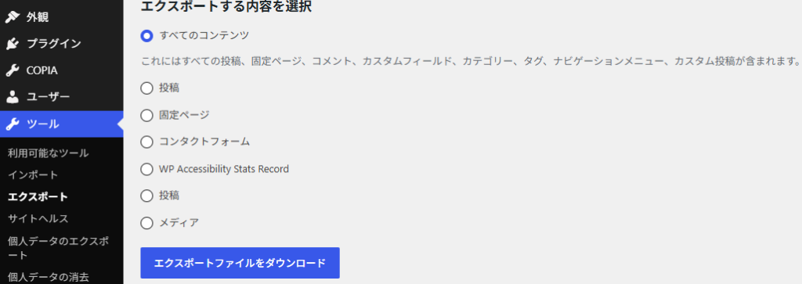
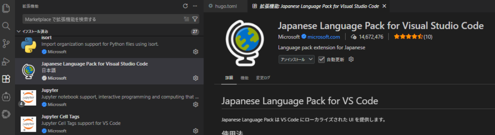
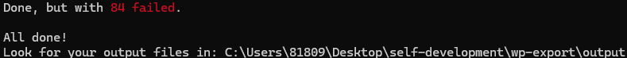
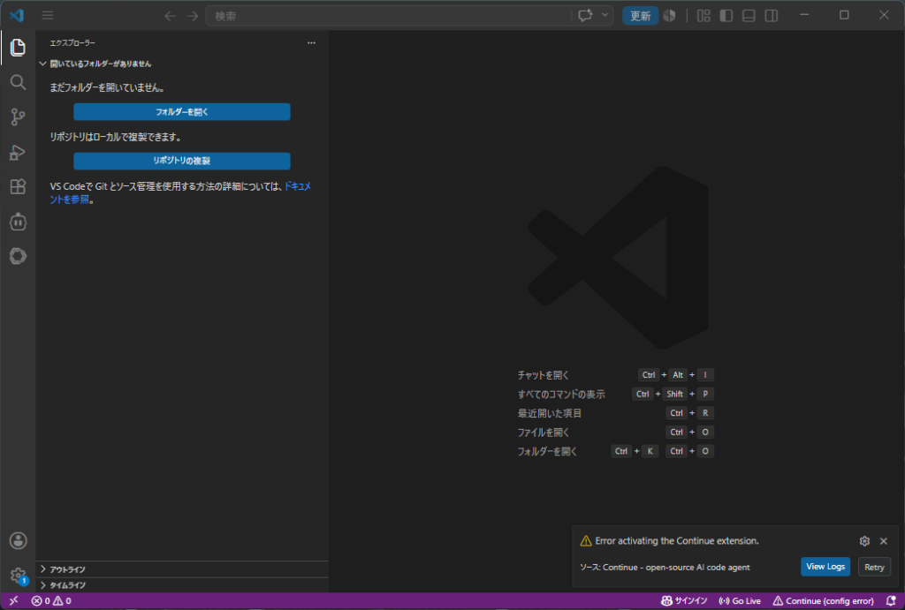
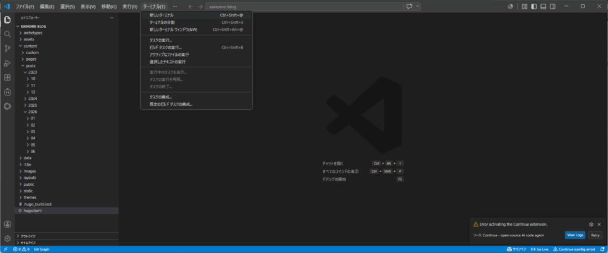
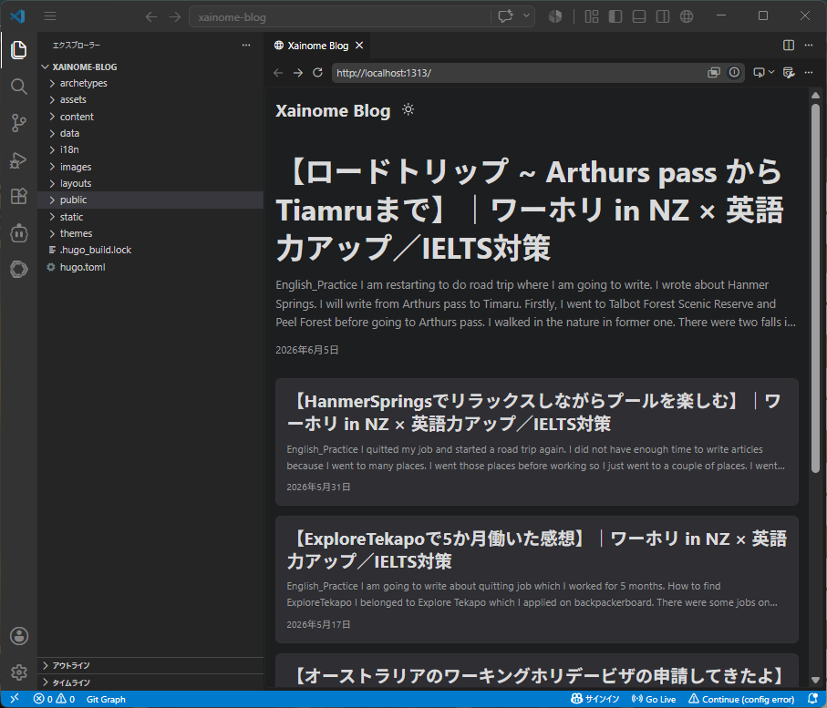

## WordpressからHugoへの移行方法

ニュージーランドでのロードトリップが一通り落ち着いて車も売り、やることがなくなったので前から考えていた無料でサイト運営をしていこうかと考えています。ちなみに私が使用していたサーバーは[Conoha](https://www.conoha.jp/)になります。

なぜConohaにしたかと言われたら特に理由はないですね。Wordpressを使ってサイト運営してみようと考えて調べた結果、たまたま見つけた個人ブログで紹介してたからだと思います。

### Hugo+Git+Cloudflare Pagesとは

私はWordpressについてはまだまだ知らないことも多いとは思います。例えば会員機能は一個人で使うことはほぼないですね。利点としてはGUIで使いやすい、複数人で運用しやすい、学習コストが低い。欠点としてはサーバー代、表示が遅い、古いプラグインのセキュリティ問題。これは私が体験しただけですので改善方法はあるかと思いますが。

今回移行するにあたって試してみるのはHugo+Git+Cloudflare Pagesですね。Hugoはmarkdown形式の書き方からHTMLへ変換するプログラムになります。Gitは作成したHTMLや画像をアップする場所、Cloudflare Pagesは作成したHTMLをインターネットに公開する場所になります。


実はGithub Pagesというものもあり、これならGitにpushするだけなので楽なのですがCDN性能が弱いみたいです。CDNはざっくり言えば全世界からのアクセス表示速度でいいと思います。厳密には全く違うのですが理解としてはそれでいいと思います。

### Wordpressから移行する理由

WordpressはアクセスするたびPHPが実行されDBにアクセスしてHTMLを作成するので遅くなりがちらしいです。HugoはHTMLをローカルで事前に作成し、読者がサイトにアクセスした際はCloudflare Pagesがただ表示するだけなので早くなるだろうということです。

今のところWordpressで記事も書きつつ、過去の記事を全て移行出来て表示出来たら完全に無料のほうへ移行しようとは思っています。何とか次のサーバー代の請求までには済ませたいですね…

画像に関してはある程度圧縮してgitへアップする予定です。動画は時間が長ければYoutubeの限定公開で短ければCloudflare R2にアップして見られるようにしようとは思ってます。まだ、どうなるかわかりませんが。

### Wordpressから記事をエクスポートする方法

ということで過去の記事の移行方法です。まずはWordpressの管理画面からツール > エクスポートで全てのコンテンツを選択します。ただ、私の場合wordpressからmarkdownに変換する際WP Accessibility Stats Recordで問題が発生したので投稿、固定ページ、コンタクトフォームを個別でエクスポートしました。



### VScode、Node.jsのインストール

前提としてOSはWindowsを想定しています。次に[VScode](https://code.visualstudio.com/)のインストールですね。ここでmaekdown式で記事を書きます。私もまだやったことはないですし、プログラミングよりなので慣れるのに時間がかかりますが、無料で運用する第一歩という感じですね。また、gitへのpushもこちらで出来ます。もちろんプログラミング言語をダウンロードしてればプログラミングを行うことも可能です。

Downloadをクリックしexeファイルを実行すればインストール画面に行きます。特に設定とかは考えずインストールすればよいと思います。インストール出来てvscodeを開けたら、日本語設定ができる拡張機能をインストールします。

左側のタブからJapanese Languageを探してみましょう。使用方法は書いてありますのでその通りに従ってください。



今度は[Node.js](https://nodejs.org/ja)のダウンロードが必要になります。LTS版が安定しているのでそちらをダウンロードします。ダウンロードが完了したら一旦確認しましょう。Powershellを開いて確認します。タスクバーからsearchがあるのでそこから探すと良いと思います。Powershellを開いて以下のコマンドからバージョンの確認ができれば問題ありません。私はこの辺までは別の作業時にやってたりします。

```
node -v
```

### wordpressをMarkdown形式のファイルへ変換

次にエクスポート用フォルダの作成ですね。これはダウンロードしたxmlファイルを格納するフォルダを作成することになります。特にこだわりがなければデスクトップでも問題ありません。wp-exportフォルダを作成した場合、こんな感じ。

```
cd Desktop/wp-export
```

作成したフォルダにxmlを配置した後、以下のコマンドを実行します。これでxmlファイルからwordpress形式のHTMLを読み込みmarkdownファイルへと変換します。

```
npx wordpress-export-to-markdown
```

まずはxmlファイルの場所を聞かれるのでそれを入力します。事前に作成たフォルダに移動してればファイル名を入力するだけで問題ありません。

次に記事をフォルダーごとに分割するかを聞かれます。私はyesにしてます。管理がしやすくなると思うので。

次にフォルダの前に日付の接頭辞を付けるか聞かれます。ここではNoにします。どのみちフォルダ名を変える予定なので。

次に年月別にフォルダ分けするかを聞かれます。ここは管理がしやすくなるので月別で階層分けするようにしました。

次に画像の保存について聞かれます。私はどのみち画像の整理や圧縮も必要になるのでALLにしています。

画像のダウンロードに失敗した場合は最悪直接Wordpressからダウンロードする方法もあります。outputフォルダに出力されてますので軽く確認しましょう。outputフォルダの中にpostsというフォルダがあります。



### Hugoのインストール

次に作業フォルダの作成をします。これにはHugoのインストールが必要なのでwingetを使用してインストールを行います。以下のコマンドをPowershellで確認してバージョンが表示されればwingetコマンドがあるので問題ありません。

```
winget --version
```

もし出てこなければMicrosoft StoreにアクセスしてApp Installerをインストールしましょう。これもインストールしたうえでバージョンの表示がされない場合は以下からWindows Package Manager Client  
winget.exeがあるかを確認してONにしましょう。

> "設定">"アプリ">"詳細アプリ設定">"アプリ実行エイリアス"

ONになってるうえでバージョンが表示されない場合は以下のコマンドを使用してApp Installerを再登録しましょう。その後Powershellを消して再度開いてからバージョンの確認を行います。私の場合はこれで解決できました。

```
Add-AppxPackage -RegisterByFamilyName -MainPackage Microsoft.DesktopAppInstaller_8wekyb3d8bbwe
```

wingetの確認が出来たら次はHugoのインストールをしていきます。以下のコマンドをPowershell入力します。

```
winget install Hugo.Hugo.Extended
```

インストール出来たら確認しましょう。

```
hugo version
```

### 作業フォルダの作成

インストールの確認が出来たら作業フォルダを作成していきます。作業フォルダ自体はどこに作成しても構いません。今回はデスクトップ上にmy-blogを作ったとします。以下のコマンドを実行しましょう。

```
hugo new site my-blog
```

これで作業フォルダの完成です。次は[Git](https://git-scm.com/install/windows?)を導入していきます。これがあるとブログのアップロードの他にいろんなテーマの導入にも使えます。まずはインストールをしましょう。リンクから飛んでx64をダウンロードして、実行ファイルを起動すればインストールできます。インストールが終わったら確認しましょう。

```
git --version
```

gitのインストールが終わったらthemeの導入をしていきます。今回はPaperModですね。他にもいろいろあるので色々調べてみて自信の好みのものを導入してみてください。私は以前自身の[成果物](https://xainome.blog/github%e3%81%ab%e4%bb%8a%e6%9b%b4%e5%89%b5%e4%bd%9c%e7%89%a9%e3%82%92%e7%99%bb%e9%8c%b2%e3%81%97%e3%81%a6%e3%81%bf%e3%81%be%e3%81%97%e3%81%9f/)などを上げましたのですでにインストール済みです。

```
cd Desktop\my-blog
git clone https://github.com/adityatelange/hugo-PaperMod.git themes/PaperMod
```

### Webサイトをローカルで表示

次にhugo.tomlというファイルがあるのでそれを開いて設定をしていきます。まずはVScodeを開きましょう。左側に"フォルダーを開く"とあるのでそこから作業フォルダを開きましょう。



フォルダーを開いたら作業フォルダの直下にhugo.tomlがあるのでそれを開いて以下のコードを貼り付けます。baseURLは後々自身のブログのURLに書き換える必要があるとは思います。

```
baseURL = 'https://example.org/'
languageCode = 'ja'
title = 'Xainome Blog'
theme = 'PaperMod'

[pagination]
pagerSize = 5
```

wp-exportの中にできたoutput内にあるpostsをmy-blog>contentsの中に格納します。これで表示の準備ができました。最後にVscodeからターミナルを開いて以下のコマンドを入力します。もしターミナルが表示されてなければ上部タブにあるターミナルから開きましょう。



一旦表示されればそれで完成ですね。他にもまだやることはありますが、ここまでを一先ずの区切りにしようと思います。次はいよいよgitにpushしてcloudflareとの連携までやってみたいと思います。ではでは。


