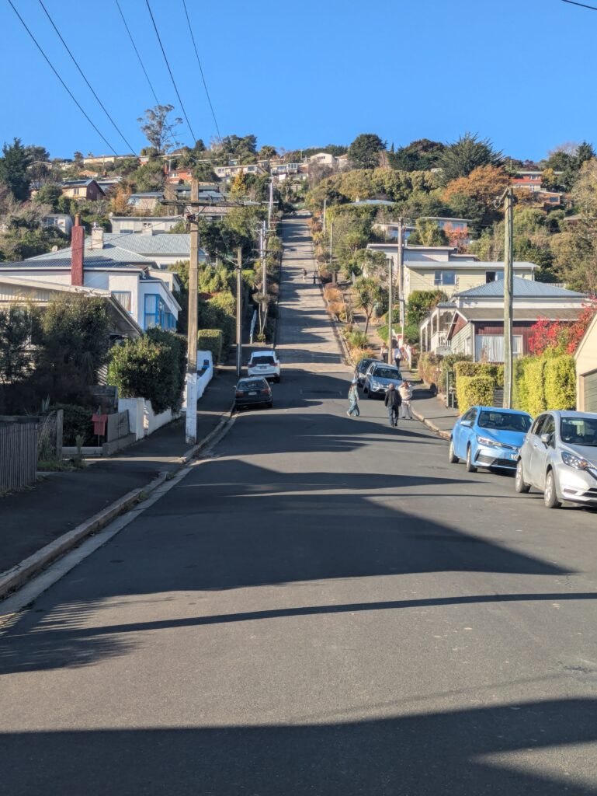
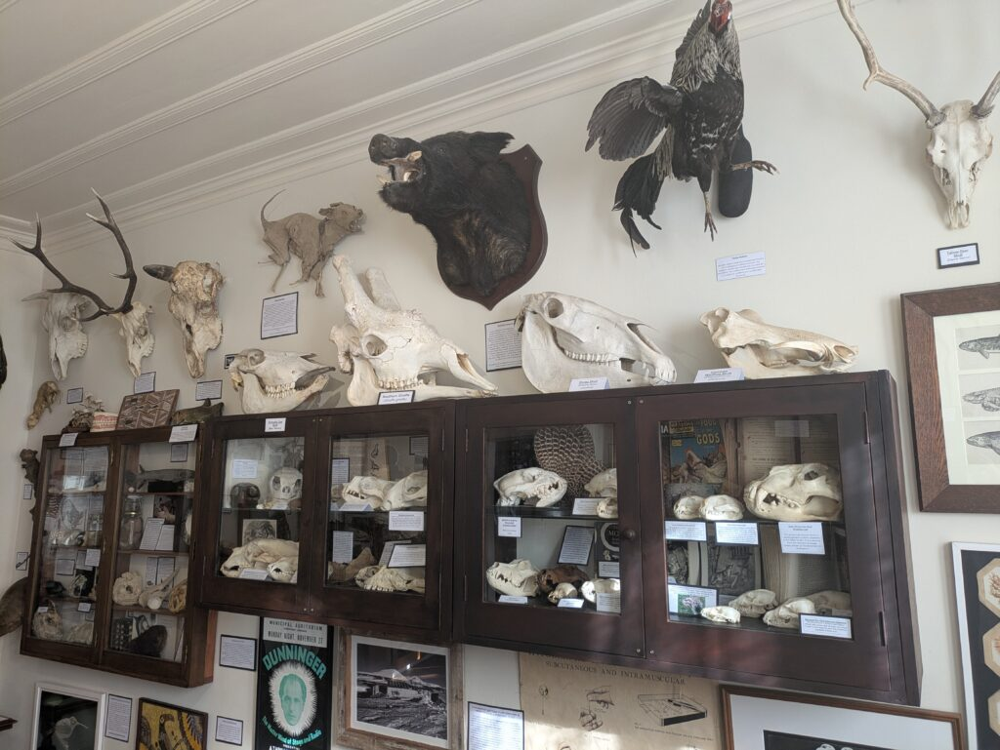
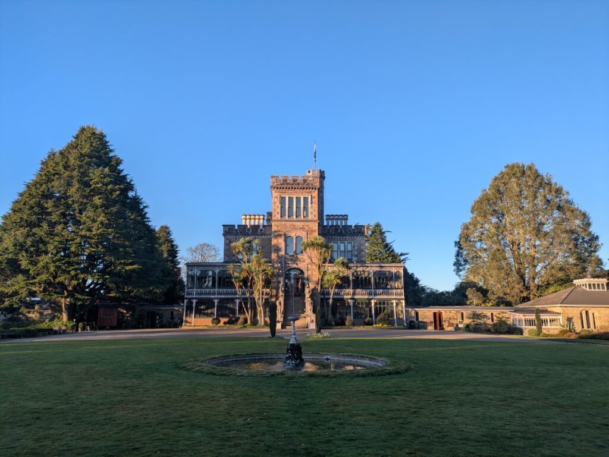
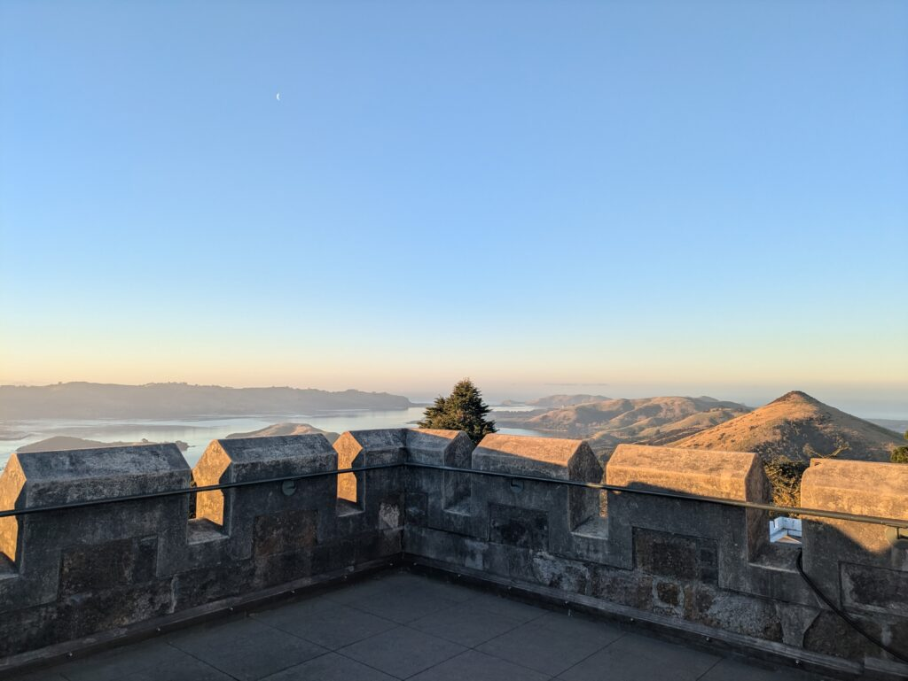
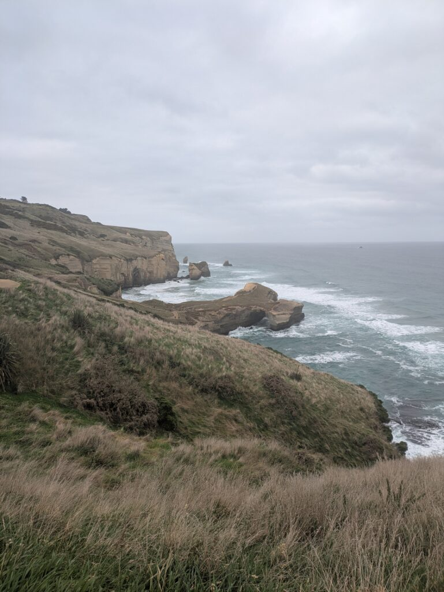

## English\_Practice

I already wrote until Oamaru before so I'm going to write about Dunedin. Actually, I filled down an article on my way.

### Baldwin St

Firstly, there was a steepest slope which doesn't look hard with a picture. However, it was so steep. I tried to run up it, but I could not do even though I walked up.

### The Dunedin Museum of Natural Mystery

Secondly, this was a bone museum. It was run personally so that working day was three times per week. There were many bones, taxidermy, old posters and masks. One of them was Japanese thing which was a criminal poster.

Moreover, there were North Korea and Chinese propaganda posters. In addition, one of exhibition were sold. I could buy them, but I thought someone who was wired bought them.

### Larnach Castle

Thirdly, I went to the Larnach Castle. This was built 200 years ago, but inside of it looked clean. I felt it was not ancient. Nevertheless, rock tile was a little leaned so it was not replaced morden

The exhibition did not look natural but orgnied. It made sense how people of that age used them. Additionally, the scenary was very beautiful when I saw it top of castle.

### Tunnel Beach

Finally, this was a tunnel beach. There was a beach when I went through this tunnel as it showed the name. You should be careful to slip because it was not large and there were many locks.

Therefore, you should research time because it depends on tides when you go there

I explored around Dunedin like that. On the ohter hand, if I had a chance, I would like to go to museums and a reserve which there were some albatross. See you later.

## 日本語版

[前回](https://xainome.blog/%e3%80%90%e3%83%ad%e3%83%bc%e3%83%89%e3%83%88%e3%83%aa%e3%83%83%e3%83%97-timaru-%e3%81%8b%e3%82%89-oamaru%e3%81%be%e3%81%a7%e3%80%91%ef%bd%9c%e3%83%af%e3%83%bc%e3%83%9b%e3%83%aa-in-nz-x/)Oamaruまでを書いたので今回はDunedinまでの旅を書いていこうと思います。とは言えDunedinまでの道中は以前書いたので省きます。

### Baldwin St

まずは世界一険しい坂があるところですね。写真だけだとわからないですがめちゃくちゃ傾斜が急です。この坂道を走って駆け上がってみましたが、最後の100mくらいでばてました笑。普通に坂を上ったとしても苦労すると思います。

### The Dunedin Museum of Natural Mystery

次は骨の[博物館](https://www.royaldunedinmuseum.com/)ですね。ここは個人で経営している博物館になってます。また、営業日も週に3日ほどですね。いろんな骨や剥製、少し古めのポスターやお面などが飾ってありました。一応日本の物もありましたが犯罪者のポスターでしたね。

もちろん日本以外にも北朝鮮や中国のプロパガンダポスターも飾ってありました。また、一部の作品に関しては販売もしていました。もしほしければ買うこともできますが、骨のオブジェクトなのでどんなもの好きが買うんだろう？という感じですね。

### Larnach Castle

次に行った場所は[ラーナック城](https://www.larnachcastle.co.nz/)ですね。これが建築されたのは200年前くらいなので中はやはり切れい目でしたね。そこまで古さを感じさせるような場所ではなかったです。ただ、床の石タイルが多少傾いていましたので現代風に全て張り替えたりはしてなさそうです。

もちろん展示してあるものが自然でなかったり、よく見せるようにセットしてあるとは思いますが、当時の人たちが使ったものなどが良くわかります。また、城のてっぺんから見える景色はとても綺麗でした。階段を駆け上がってみたときは壮観ですね。

### Tunnel Beach

最後はトンネルビーチですね。名前は凄くシンプルですがその名の通りトンネルを抜けた先にビーチがあるような場所になっています。ビーチ自体はそこまで広くはなく岩がゴロゴロしてるので滑らないよう注意が必要ですね。

また、時間帯によっては潮の満ち引きでビーチに行けない可能性もあるのである程度時間を調べていったほうが良いとは思います。

といった感じでDunedin周辺を散策してきました。他にも博物館やアルバトロスというでかい鳥が見れる保護区域もあるので時間があれば行ってみたかったですね。もし次旅行に行く機会があれば行ってみたいとは思います。ではでは。

## AI採点

| 項目 | 推定Band |
| --- | --- |
| Task Achievement | 5.5 |
| Coherence and Cohesion | 5.5 |
| Lexical Resource | 5.0 |
| Grammatical Range and Accuracy | 4.5 |
| **Overall** | **5.0** |

内容は十分伝わりますが、**文法ミス・不自然な表現・語彙選択の誤り**がかなり多く、Band 7以上は難しいです。

* * *

# 文法・語彙の細かい指摘

## ①

> I already wrote until Oamaru before so I'm going to write about Dunedin.

### 問題

- wrote until Oamaru ❌

- before と already の重複

- 英語としてかなり不自然

### 自然な表現

✅ I wrote about my trip up to Oamaru in my previous article, so this time I will write about Dunedin.

* * *

## ②

> Actually, I filled down an article on my way.

### 問題

filled down ❌

「記事を書いた」は

✅ wrote an article

「道中については以前書いた」

✅ I have already written about the journey to Dunedin, so I will skip that part.

* * *

# Baldwin St

## ③

> there was a steepest slope

### 問題

最上級なのに the がない。

❌ a steepest slope

✅ the steepest street in the world

また、Baldwin Street は坂ではなく「通り」です。

* * *

## ④

> which doesn't look hard with a picture

### 問題

with a picture ❌

✅ in photos  
✅ in pictures

* * *

## ⑤

> I tried to run up it

文法的にはOK。

しかし、

✅ I tried running up the street.

のほうが自然。

* * *

## ⑥

> but I could not do even though I walked up.

意味が分かりません。

言いたいこと：

「最後の100mでばてた。」

✅ but I ran out of energy during the last 100 metres.

* * *

# Museum

## ⑦

> It was run personally

❌

run personally  
＝個人的に運営された

意味不明です。

✅ It is privately owned.  
✅ It is run by an individual.

* * *

## ⑧

> working day was three times per week

❌

working day  
three times per week

営業日は

✅ It is only open three days a week.

* * *

## ⑨

> One of them was Japanese thing

❌ thing

IELTSでは thing の多用は減点。

✅ One of the exhibits was a Japanese poster featuring a criminal.

* * *

## ⑩

> a criminal poster

意味が通じません。

✅ a wanted poster of a Japanese criminal

* * *

## ⑪

> one of exhibition were sold.

3つミス。

### exhibition

❌

✅ exhibits

### one of

単数

✅ one of the exhibits was sold.

しかし意味的には

「一部の展示品は販売されていた」

✅ Some of the exhibits were also for sale.

* * *

## ⑫

> someone who was wired

❌ wired

wired  
＝興奮している

言いたいこと：

「どんなもの好きが買うんだろう」

✅ I wondered what kind of person would buy such bone decorations.

* * *

# Larnach Castle

## ⑬

> I went to the Larnach Castle.

the 不要。

✅ I went to Larnach Castle.

* * *

## ⑭

> This was built 200 years ago

事実として約150年前です。

また、

✅ It was built nearly 150 years ago.

* * *

## ⑮

> inside of it looked clean.

inside of it ❌

✅ the interior looked surprisingly well preserved.

* * *

## ⑯

> I felt it was not ancient.

不自然。

✅ It did not feel particularly old.

* * *

## ⑰

> rock tile was a little leaned

2つミス。

rock tile ❌

leaned ❌

✅ some of the stone tiles were slightly uneven.

* * *

## ⑱

> it was not replaced morden

❌

modern のスペルミス。

文法崩壊。

✅ it seems that not everything has been replaced with modern materials.

* * *

## ⑲

> The exhibition did not look natural but orgnied.

organized のスペルミス。

さらに意味も少し違う。

✅ The displays may have been carefully arranged rather than left exactly as they were.

* * *

## ⑳

> It made sense how people of that age used them.

❌

make sense の使い方が違う。

✅ It helped me understand how people lived in those days.

* * *

## ㉑

> the scenary

❌ scenary

✅ scenery

* * *

## ㉒

> when I saw it top of castle.

❌

✅ from the top of the castle.

* * *

# Tunnel Beach

## ㉓

> this was a tunnel beach.

❌

✅ This place is called Tunnel Beach.

* * *

## ㉔

> as it showed the name.

❌

✅ as the name suggests

* * *

## ㉕

> many locks.

❌

lock  
＝鍵

✅ rocks

* * *

## ㉖

> research time

❌

✅ check the tide times

* * *

## ㉗

> it depends on tides

❌

✅ because access to the beach depends on the tide.

* * *

# 最後

## ㉘

> I explored around Dunedin like that.

直訳。

✅ That is how I spent my time exploring around Dunedin.

* * *

## ㉙

> a reserve which there were some albatross.

文法崩壊。

✅ a reserve where you can see albatrosses.

* * *

## ㉚

> some albatross

❌

複数形。

✅ albatrosses

* * *

# スペルミス一覧

| 誤り | 正しい |
| --- | --- |
| filled | wrote |
| wired | weird |
| morden | modern |
| orgnied | organised |
| scenary | scenery |
| ohter | other |
| locks | rocks |

I wrote about my trip as far as Oamaru in my previous post, so this time I will continue with my journey to Dunedin. Since I have already written about the drive to Dunedin itself, I will skip that part.

## Baldwin Street

The first place I visited was Baldwin Street, which is famous for being one of the steepest residential streets in the world. The slope does not look particularly difficult in photos, but it is incredibly steep in person. I tried running up the street, but I ran out of energy during the last hundred metres. Even walking to the top would be quite challenging.

## The Dunedin Museum of Natural Mystery

Next, I visited the Dunedin Museum of Natural Mystery, a privately owned museum that is open only three days a week. The museum displays a wide variety of bones, taxidermy specimens, old posters and masks. One of the exhibits was a Japanese wanted poster featuring a criminal.

There were also propaganda posters from North Korea and China. Interestingly, some of the exhibits were available for purchase. Since many of them were bone decorations, I could not help wondering what kind of people would buy them.

## Larnach Castle

My next destination was Larnach Castle. Although it was built nearly 150 years ago, the interior looked surprisingly well preserved and did not feel particularly old. However, some of the stone floor tiles were slightly uneven, suggesting that not everything has been replaced with modern materials.

The displays may have been carefully arranged for visitors, but they still provided a good idea of how people lived in those days. The view from the top of the castle was also breathtaking.

## Tunnel Beach

Finally, I visited Tunnel Beach. The name is quite simple, and as it suggests, the beach can be reached by passing through a tunnel. The beach itself is not very large, and there are many rocks, so visitors need to be careful not to slip.

Depending on the tide, it may not always be possible to access the beach, so checking the tide times in advance is highly recommended.

That was my trip around Dunedin. There are also several museums and a wildlife reserve where visitors can see albatrosses, and I would have liked to visit them if I had had more time. If I ever have another opportunity to travel to Dunedin, I would definitely like to return.
