### Githubのアカウント作成とVScodeの拡張機能

いよいよGithubに自身の成果物をあげてCloudflareで表示させようと思います。まずはGithubのアカウント作成ですね。私は以前作成したので省きますが、もしアカウントを持っていなければアカウントの作成からしましょう。そこまで難しくはないと思います。

アカウントの作成が完了したらVScodeからGithubにアクセスしてログインします。この辺りで入れておくとよいVScodeの拡張機能があります。以前日本語の設定やCodexの導入をしましたが、同様にいくつかの拡張機能を入れておくと後で見やすくなると思います。個人的には以下ですね。

- Git Graph (gitの履歴が追いやすくなる)

- Hugo Language and Syntax Support (Hugo独自の書き方をサポートする)

- Markdown All in One (Markdownで書く際に見やすくなる)

- Prettier - Code formatter (見た目がきれいになる、チームでやるときはよりよい)

この辺りがあれば今後vscodeで記事を書く際でも管理が楽になります。もし今後他の開発をするのであればまだ入れるものもありますが。

### Gitの操作

#### .gitignoreの作成

まずは.gitignoreというファイルを作成していきます。ここにはリポジトリにコミットする必要がないファイルを記載していきます。例えばこんな感じ。

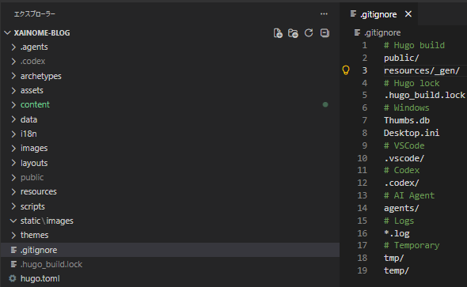

最低限publicだけ書いていれば問題ありません。もし他に不必要なファイルがあればそれも併せて書いておくと良いと思います。私の場合はvscodeやcodexなどですね。

#### リポジトリとコミット

というわけでまずはローカルでリポジトリの作成をしていきます。左側にあるタブからリポジトリを初期化するをクリックします。

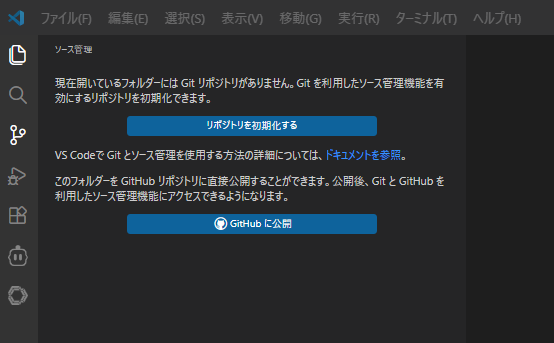

最初のコミットメッセージは大体first commitだったりします。メッセージ自体は何でも大丈夫です。ただ、その前にpublicフォルダーが対象になってないか？だけは確認しておきましょう。不要なうえに大量のファイルがあるので制限に引っかかりやすくなります。

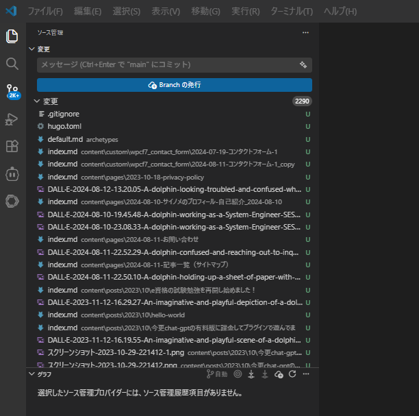

その後はローカルでコミットを行います。チェックマークを押してコミットをするか"・・・"からコミットがるのでそこからコミットしていきます。普通のコミット以外にもいろいろありますが一旦無視で大丈夫です。

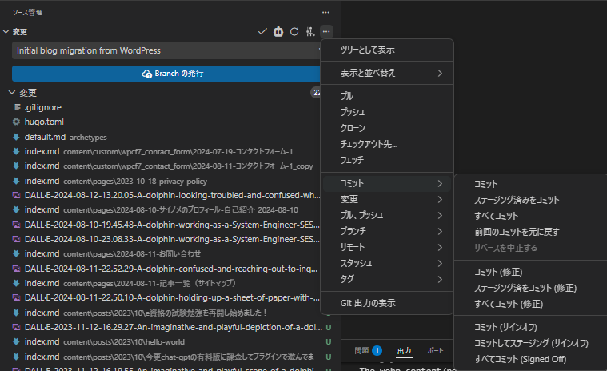

#### ブランチの発行とリポジトリの表示

コミットが終わったらブランチの発行をしていきます。サインインの許可を求められるので許可しましょう。以下のように変更の欄に何もない状態になったらコミット完了です。Branchの発行をクリックします。

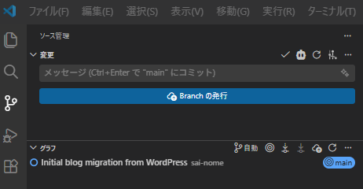

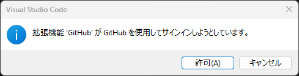

特に問題なければアクセス許可を進めていきましょう。

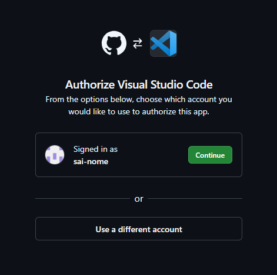

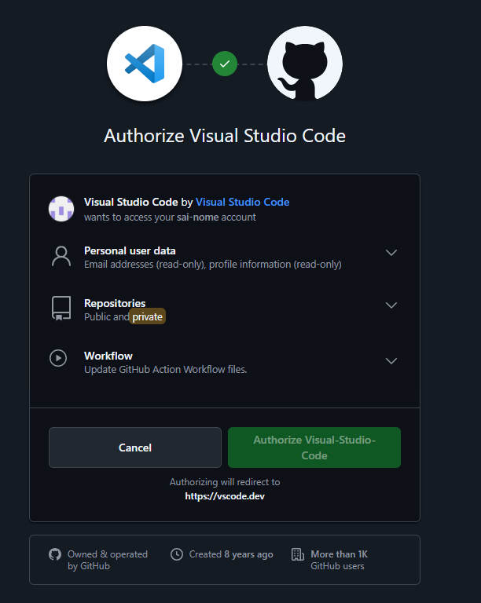

次にprivateかpublicかを確認されます。他の人に見せたくなければPrivate、成果物としてたくさんの人に見せたいものがあればPublicにします。もちろんPrivateにして招待制にしても問題ありません。私は特に気にしないのでPublicにしておきます。

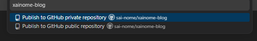

Githubにアクセスして以下のような表示が出ればリモートリポジトリにPushされています。Gitはリモートとローカルの2つの概念があるのでややこしいですが、リモートの方に反映されていれば順調に進んでいることになります。

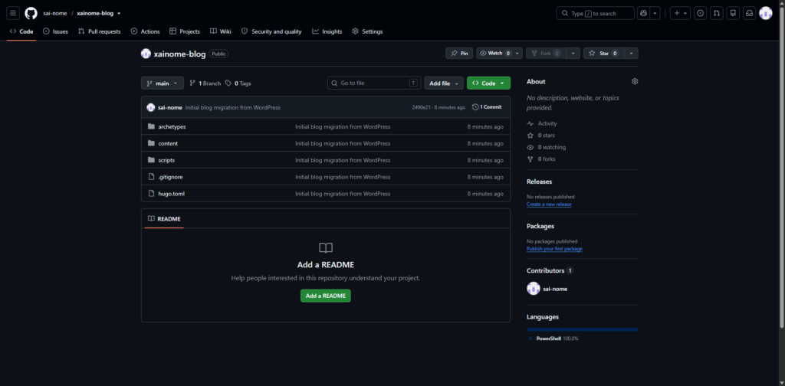

### Cloudflareでデプロイ

というわけで最後にCloudflareに接続していきます。まずは[ログイン](https://dash.cloudflare.com/login)をしましょう。どのみちアカウント連携を行うので事前に接続しておくと良いと思います。

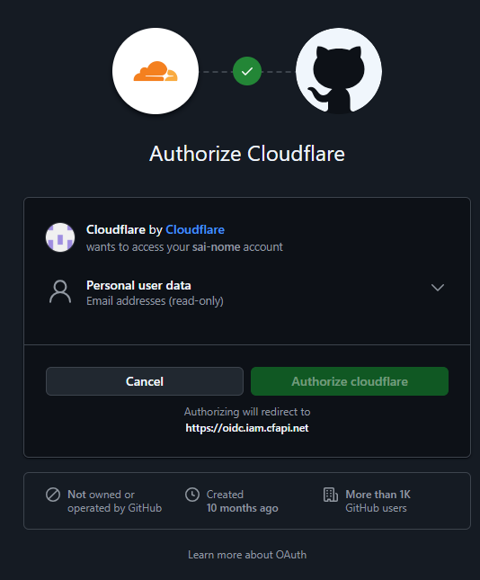

以下の画面が表示されたらWorkers&Pagesを選択して、Create applicationを選択します。

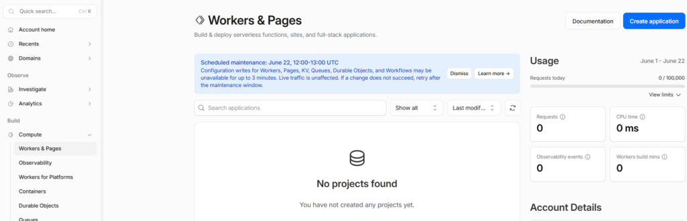

ここでは下の方にあるLooking to deploy pages? Get startedを選択します。

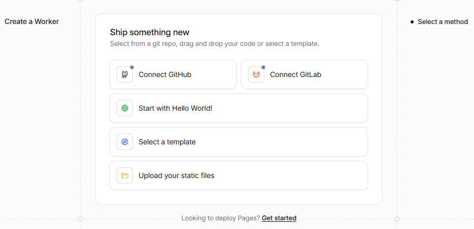

ここではすでにリモートへpush済みなので上の方を選択します。後はアカウントとリポジトリの設定をします。

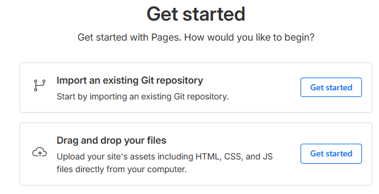

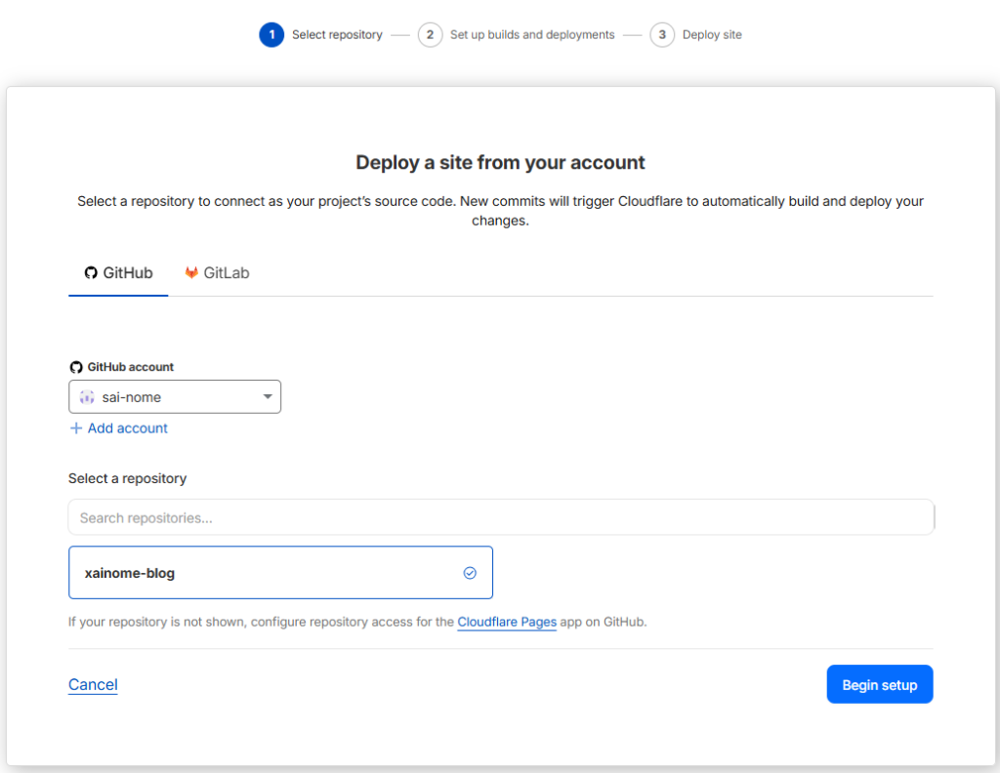

その後はプロジェクトの設定ですね。FrameworkをHugoに設定して環境の設定をローカルと合わせます。これはpowershellを開いて"hugo version"を入力した時に出るものですね。

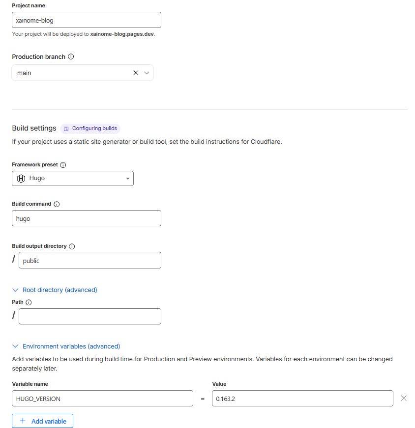

デプロイをしてこの画面が出れば完成です。URLから飛ぶと実際に表示されることがわかりました。

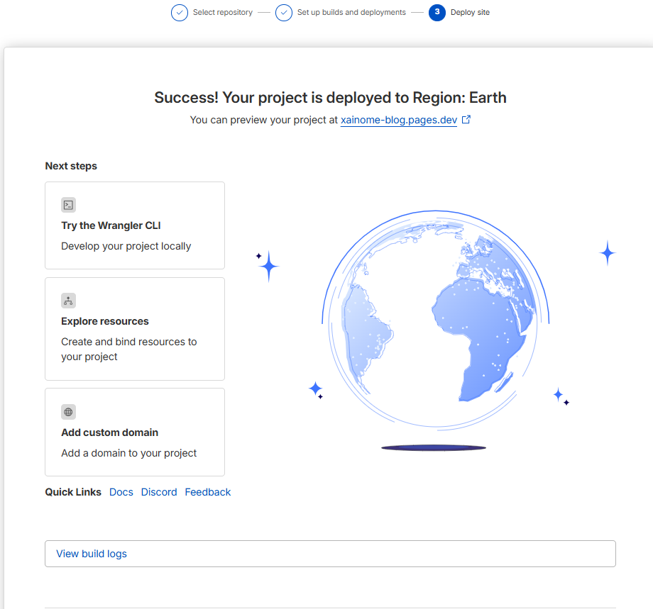

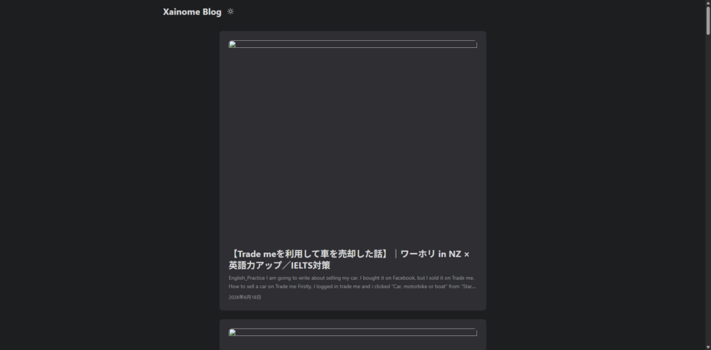

ただ、記事のタイトルで使用している画像が表示されず記事ページはWordpressのままになっています。

### Cover imageが出ない、記事ページに飛ばないときの対処

画像に関してはmarkdownファイルにあるcoverの部分にrelative: trueを追加しました。全部修正するのは手間なのでAIコーディングにお任せしています。

```
cover:
  image: "images/ChatGPT-Image-Jun-18-2026-05_00_22-PM.png"
  relative: true
---
```

記事ページに関してはhugo.toml側でbaseURLをWordpressと同じにしていたのが原因です。というわけで以下のように修正します。\[\]内は自身のブログとして修正してください。

```
baseURL = 'https://[example-blog].pages.dev/'
```

修正が終わったら再度コミットしてリモートリポジトリにプッシュしましょう。次回からはclouldflareの方で自動的にdeployしてくれるので、少し待ってから対象のURLに飛んでみましょう。無事に表示されて記事のリンクまで飛べたら完成です。お疲れさまでした。

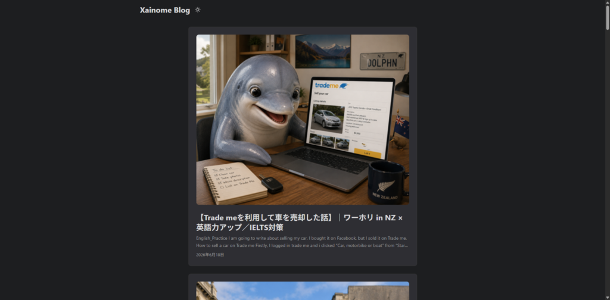

もちろんこれで全て完了というわけではなく元の記事のURLを残したまま新しい記事のURLへ移行したり、ドメインの変更、Wordpress側の停止とサーバーの解約などやることはまだ残っています。後はMarddown形式の記事に慣れるくらいですかね。それでも新しいサイトの運営が一旦完了したので移行作業の8割くらいは終わったと思います。ではでは。
