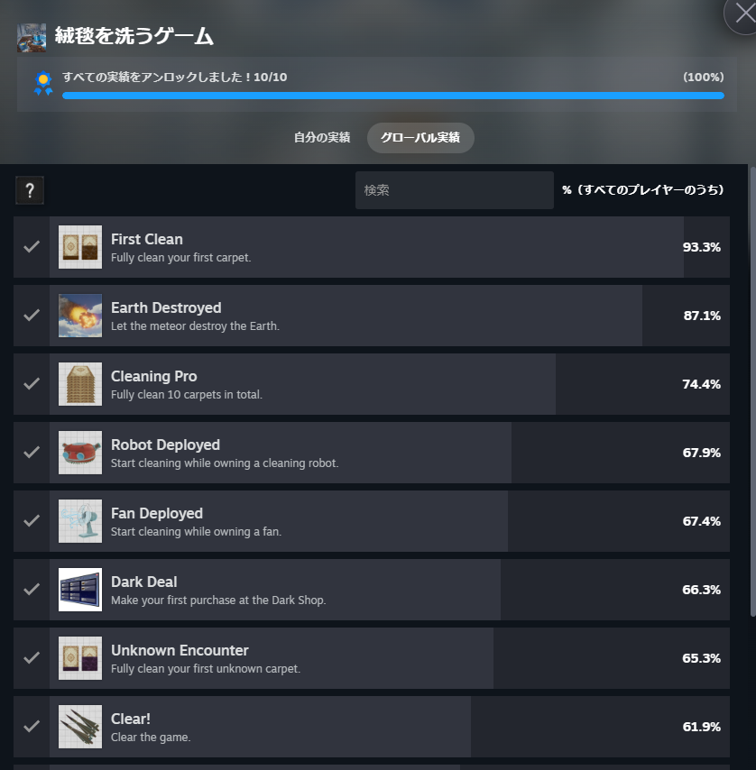
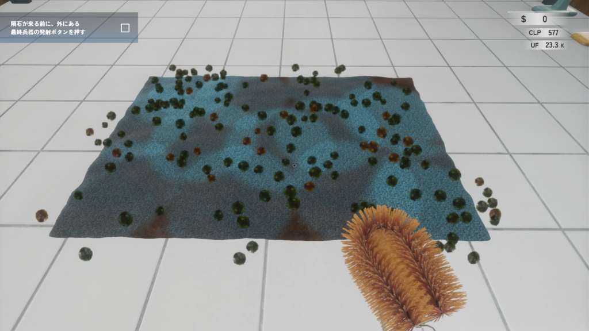
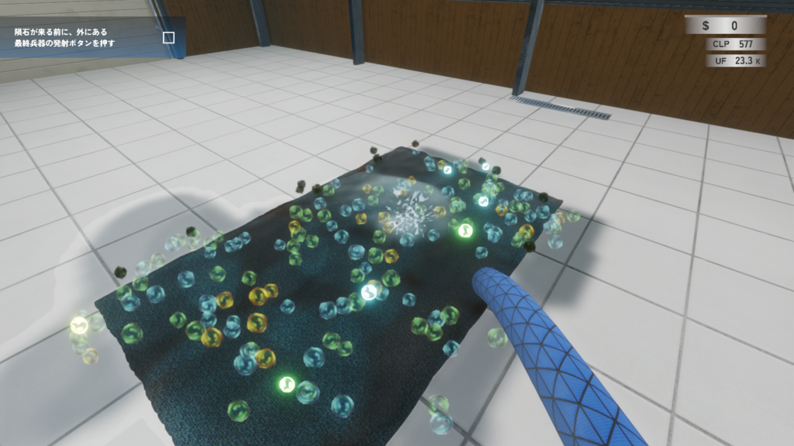
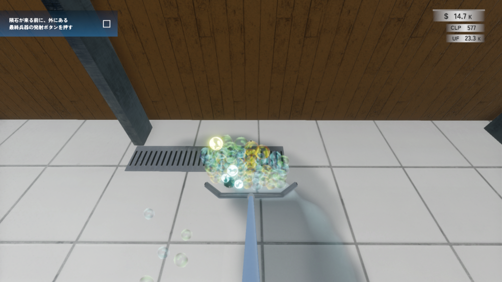
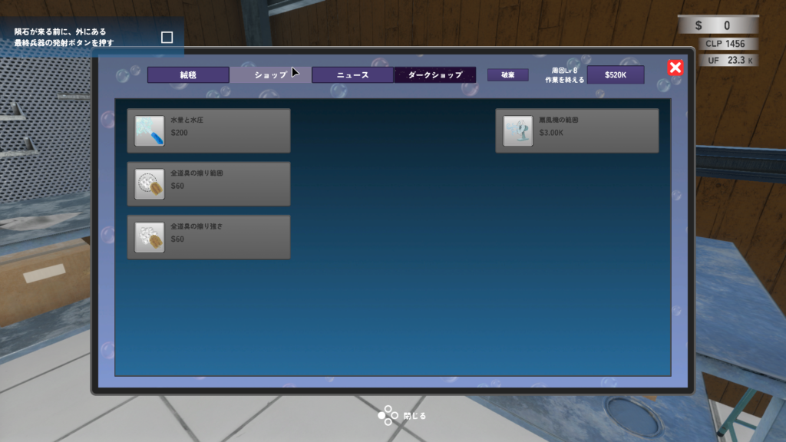
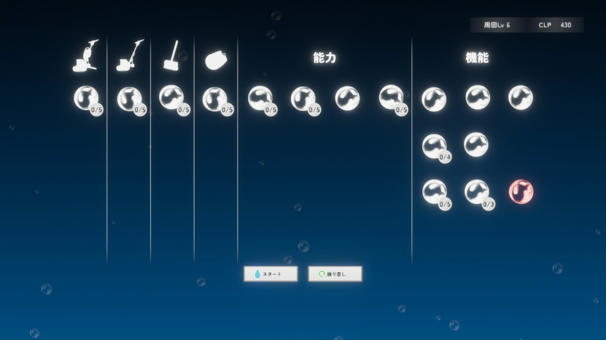
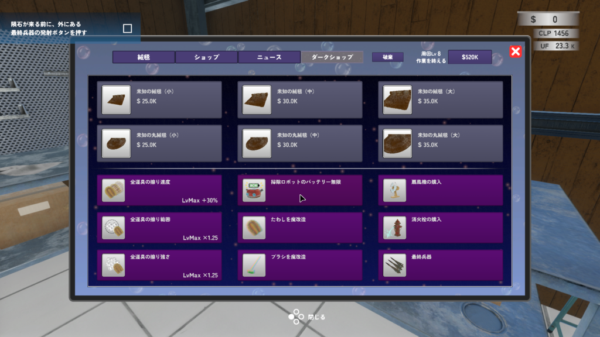
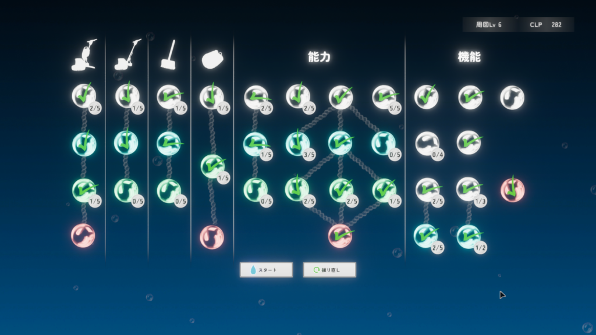

久しぶりにSteamを開いたとき、たまたま見かけて面白いかなと思って[購入](https://store.steampowered.com/app/4634560/_/?l=japanese)しました。定価で700円になります。実績自体は難しくなくシナリオ通りに進めていって、掃除アイテムを集めるとコンプはできると思います。

## 絨毯を洗うゲーム ゲーム内容

ゲーム内容としてはpower wash simulatorに近いと思いますが、こちらは時間限定と周回要素があります。もう少し内容に触れると隕石が落ちてくるのでそれまでに汚れを落としお金を集め、隕石衝突を阻止しようという内容になっています。

まずは絨毯を選んで汚れを落としていきます。最初はたわしだけなのでひたすらこすっていきます。

たわしから謎の粒が出てきたら次は水で汚れを落としていきます。そうすると汚れが落ちた球になります。

この球を排水溝に流していきます。そうすることでお金が増えていきます。

### 絨毯を洗うゲーム 強化要素

このお金を使って自身の装備を強化していきます。汚れを落とす強さや範囲などを増やしていきます。お金を集めていくと強化できるものも増えていきますので、ひたすら絨毯をきれいにしていきましょう。

隕石が落ちた後はCLPを使ってパッシブスキルを強化していきます。CLPはきれいにした絨毯によってもらえる量が変わります。私のお勧めはCLPの獲得量が確率で倍になるものですね。

ここからは少しネタバレになりますが、ある程度進めてお金を貯めるとダークショップが使えるようになります。ここで売っている絨毯を綺麗にするとUFポイントがもらえ、そこで新しいスキルを開放することができます。最後の最終兵器を買って隕石を阻止すればゲームクリアになります。

### 最後に

ゲームクリア直後はこんな感じのスキルの割り振りをしてました。特に気にせず自由に割り振ってもいずれはクリアできると思います。周回すればするほどお金も貯まりやすくなるので。

といった感じでゲームを楽しみました。このゲームは数時間もあればクリアできて、気分転換になるのでとてもおすすめですね。値段もリーズナブルなのでぜひプレイしてみてください。ではでは。
