少し前にリリースされた「[必殺！メガ子パンチ！](https://store.steampowered.com/app/4574890/_/?l=japanese)」というゲームの実績をコンプしました。5,6時間でコンプできるターン性のカードバトルになります。

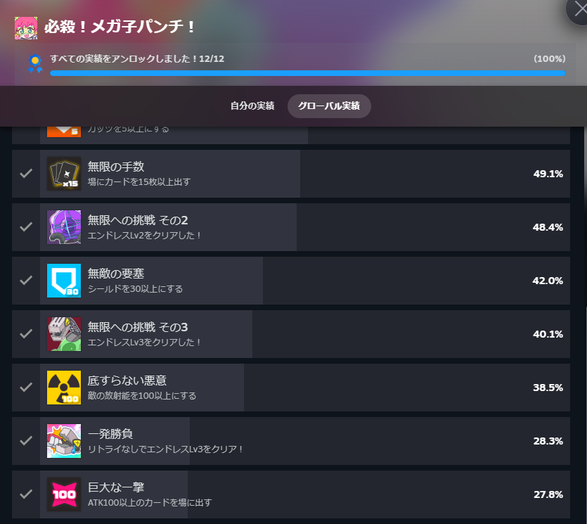

#### ゲーム内容

このゲームはルールはシンプルでブラックジャックのようなカードゲームになっています。システムとしては山札からカードを引き、カードの合計がなるべく21になるようにします。21ぴったりだと必殺技が使え、大ダメージを与えることができます。

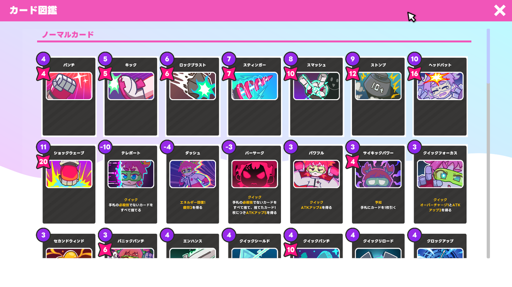

最初はストーリーモードだけですがこれをクリアするとエンドレスモードが出てきます。エンドレスと言っても制約が付いたり敵が強化されてるだけなので、どちらかといえばハードモードという感じ。

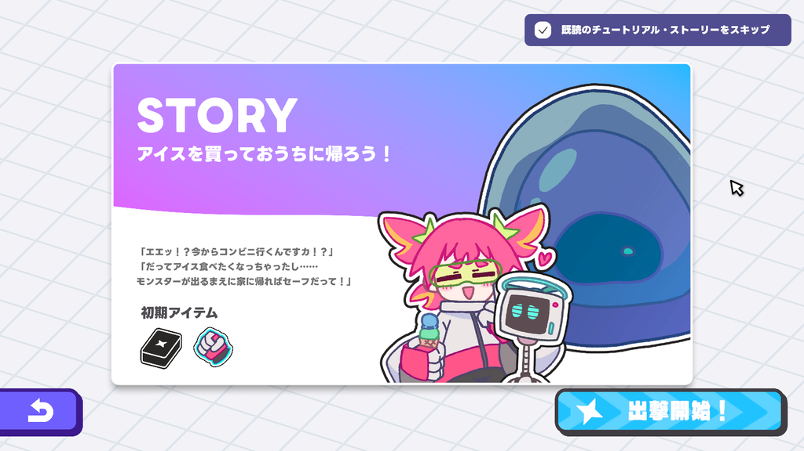

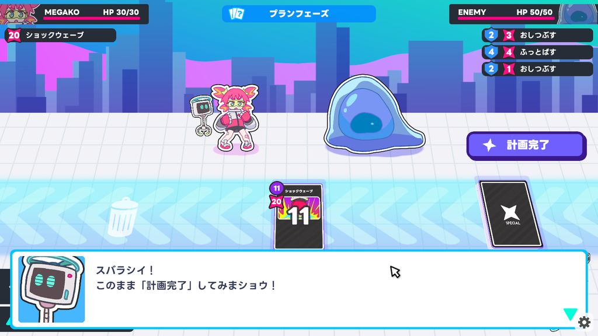

### ゲームシステム

基本的にはカードを引いて出すだけですが敵にはシールドがあり、それよりも高いダメージを与えないと敵からダメージを受けます。逆に言えばノーダメで敵を倒せるようなデッキの構成を作っていく必要があります。

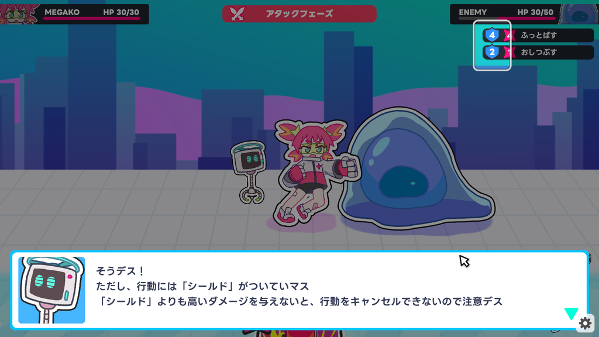

山札からカードを引くたびにエネルギーを消費します。また、手札にカードを戻すときにもエネルギーを使います。ただし、手札からカードを出す際はエネルギーを使用しません。

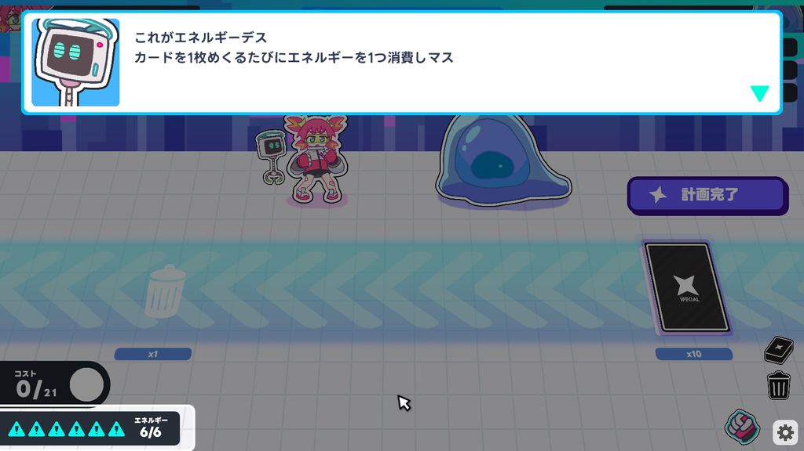

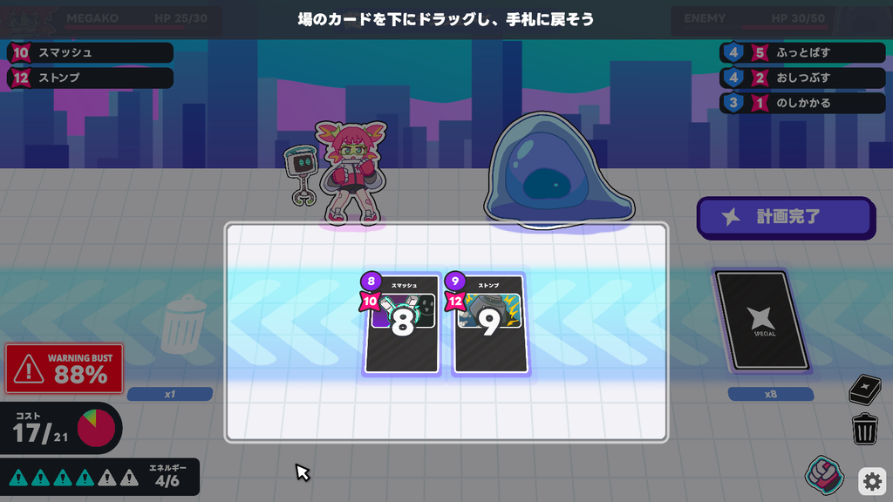

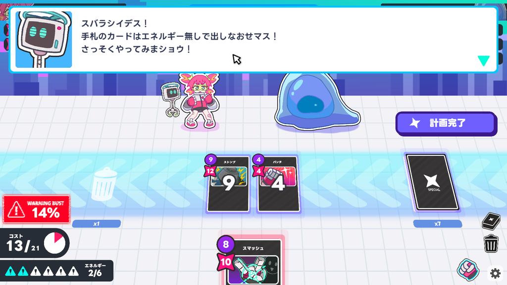

21ぴったりになるとフィニッシュカードが出て、大ダメージを与えられます。後述しますがこのフィニッシュカードは厄介な性質があるので注意が必要です。

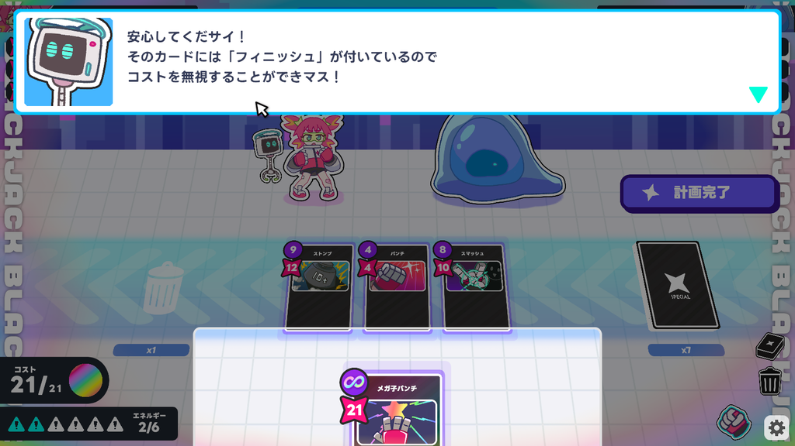

バトルに勝利するとカード(フィニッシュカードも含める)がもらえます。また、特定のステージならアイテムももらえます。アイテムを上手く利用することでバトルを有利に進めたり、実績解除に繋がったりします。

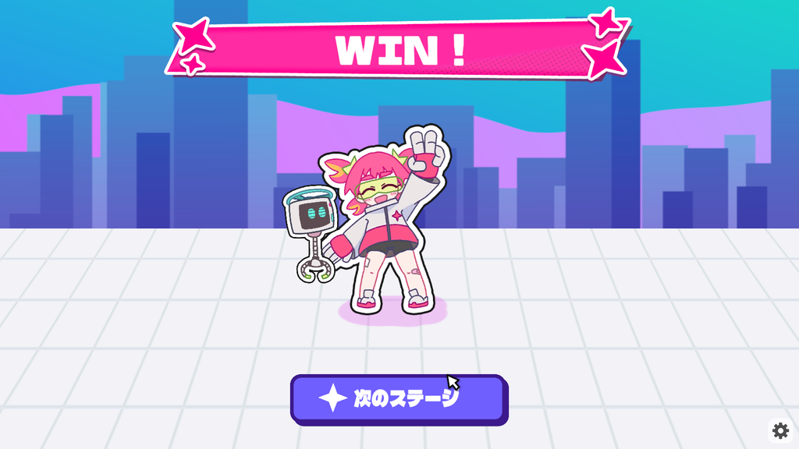

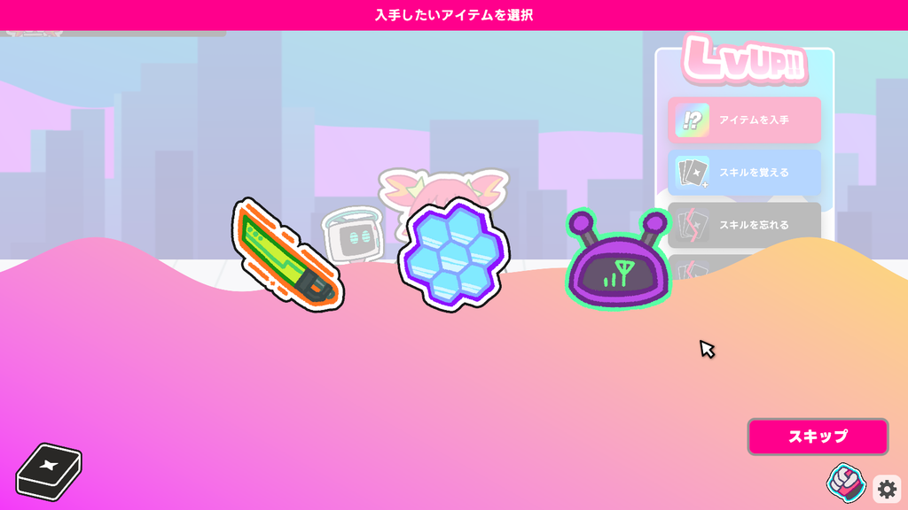

エンドレスモードは3つあり、3つ目をクリアするとエンディングになります。これをリトライなしでやるのは少し大変ですが、デッキ構築を上手くやれば大丈夫だと思います。私がクリアした時はこんな感じでした。

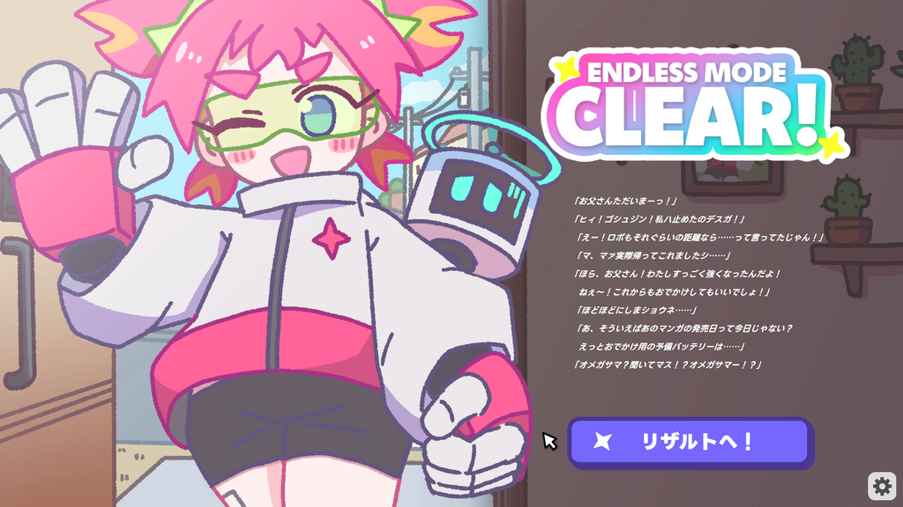

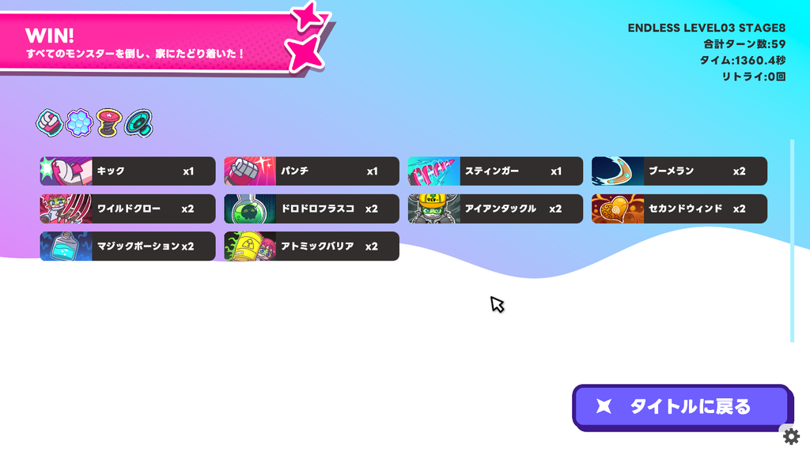

### 実績について

ここからは実績解除について書いていこうと思います。基本的にはアイテムとカードの組み合わせを考えながらやっていけばできると思います。例えばエネルギーを増やすカードを中心に集めたり、ガッツを増やすカードを集めたり、コスト0のカード(例えばガード系のアイテムを取ってエネルギーを残しながら戦闘を進める)を増やしていくなどです。後は放射能付与カードとステータス付与を倍にするカードを取るとかですね。

少し大変なのはATK100以上のカードですね。考えられる方法はブーメランをひたすら使う、あるいはメガパンチの攻撃力をあげていくことですね。

ブーメランにクイックを付加することで、1ターンで何度でも手札に戻り攻撃力をひたすら上げていくことができます。これは穴抜けの方法だと思いますが楽に戦闘を進めかつ攻撃力も上げられる方法ですね。最近のアプデで上級モードが追加され、この使用を使えないようにするモードができました。私はやったことないですが...

#### メガパンチでの実績解除

もう一つはシンプルにメガパンチの攻撃力をあげることです。メガパンチを使えば使うほどATKをあげられるアイテムがあるのでそれを使用していきます。カードは高コストのカードを減らして、低コストのカードを増やし21が出やすくなるように調整します。

私の場合はそれだけでなく超電波アンテナと超電磁バリアの2つのアイテムを組み合わせました。ガードカードを出してアンテナのコストを減らします。20枚以上出すとコストがマイナスなるので21になるよう調整しつつ、アンテナカードを出してエネルギーを増やしていきます。

この戦法を使えるのでラスボスなのでアイテムガチャをしつつ、成功するまで粘るのが大変ですね。これはあくまで私がやったやり方なので他に楽な方法があるかもしれませんが。

といった感じで進めると実績コンプはできると思います。低価格でサクッと遊べるので興味があればぜひ。ではでは。
