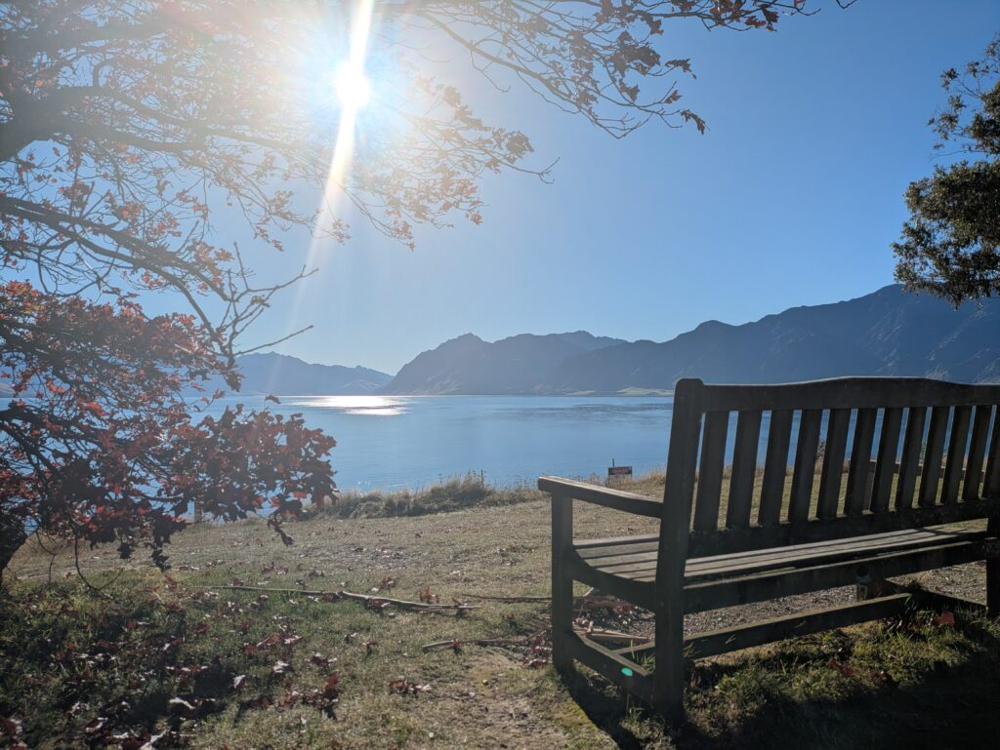
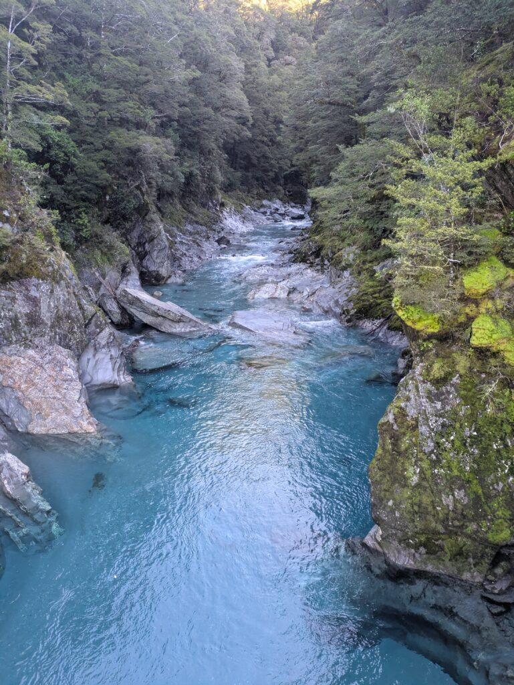
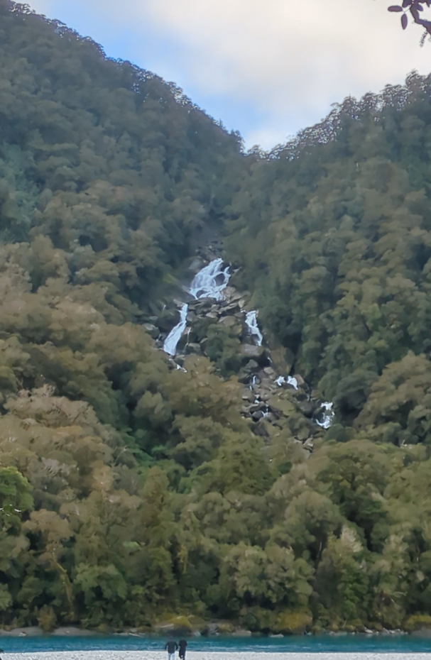
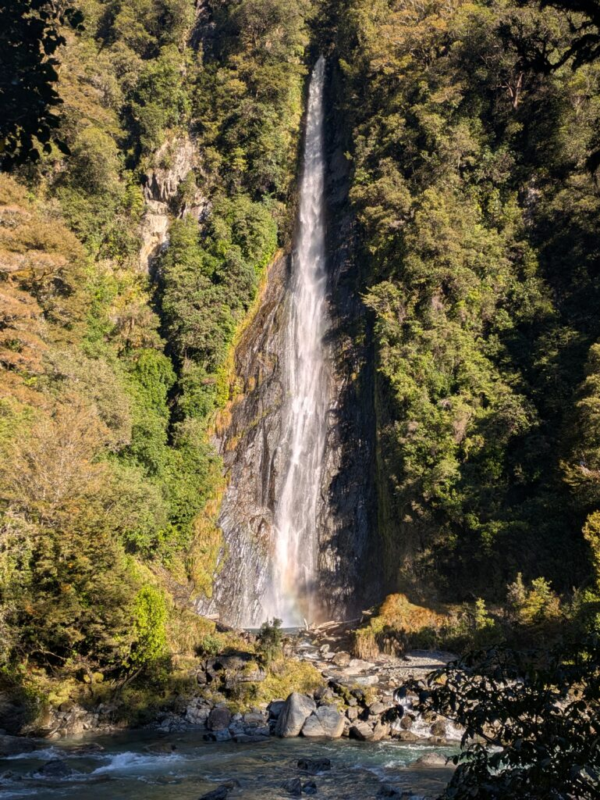
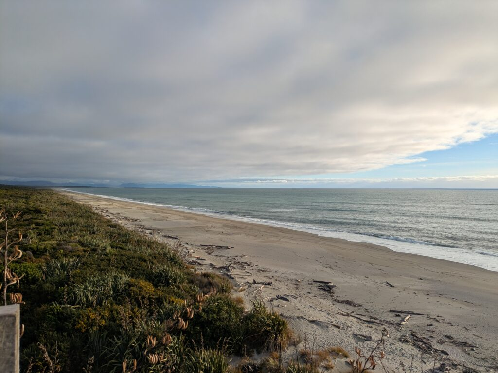
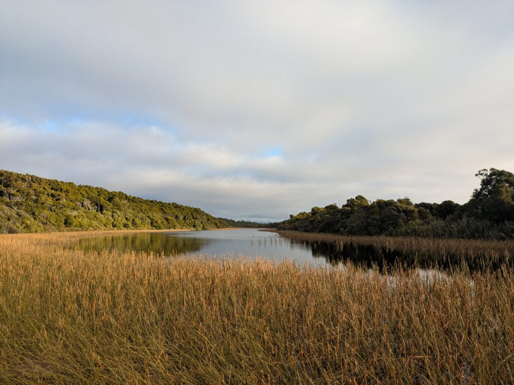
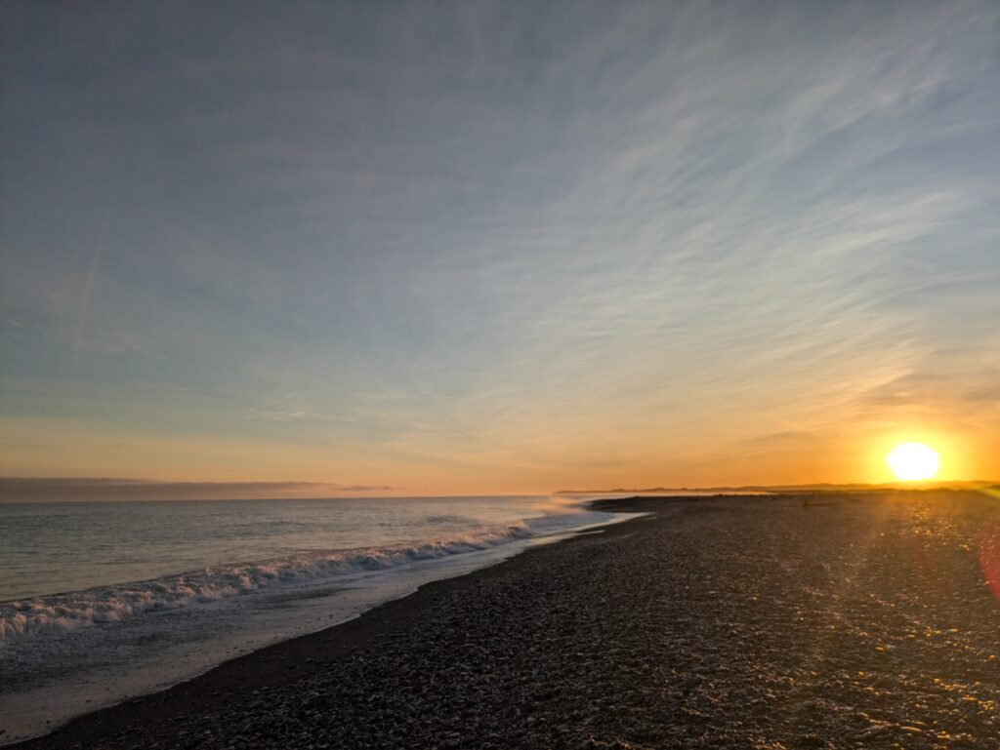
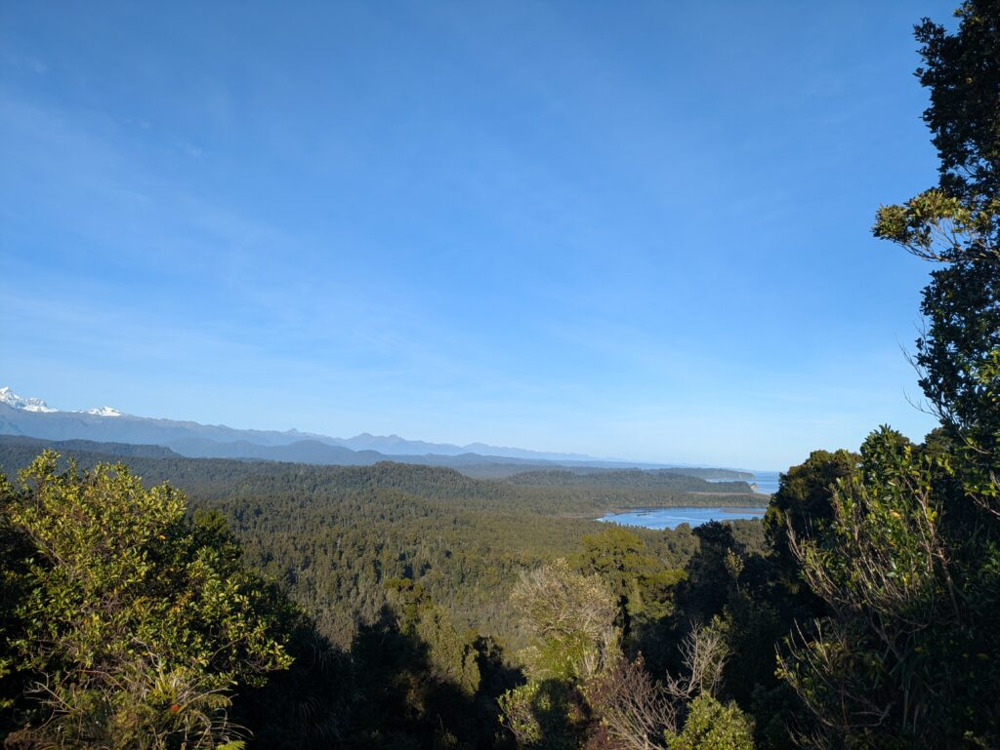

## English\_Practice

I went to the [Milford Sound](https://xainome.blog/%e3%80%90%e3%83%ad%e3%83%bc%e3%83%89%e3%83%88%e3%83%aa%e3%83%83%e3%83%97-milford-sound%e3%81%b8%e8%a1%8c%e3%81%a3%e3%81%a6%e5%88%86%e3%81%8b%e3%81%a3%e3%81%9f%e6%b3%a8%e6%84%8f%e7%82%b9%e3%80%91/) before. I am going to write from Queenstown to [Okarito](https://www.newzealand.com/jp/okarito/).

### Lake Hawea

Firstly, this is Lake Hawea which is next Lake Wanaka. It was clear blue and there was a tree which was fitted to wedding. Moreover, there was a bench that I was thinking something.

In addition, there were a few of viewpoints near this lake so I found my favorite point.

### Blue pools track

This was near the river confluence. The pool was a little green and the river confluence was opposite side from a taken picture. This water was clear and clean.

### 各Falls

One of falls is Fantail Falls. It was a little bit far from viewpoint. However, the stream came from high point so the sound was big and I saw good viewing when I sat on the bench.

Another of falls is Thunder Creek Falls. I was closer it than previous one. This height was lower than it but I felt comfortable.

### Ship creek

This is exploring hiking course where I walked around nature and I climbed up the high ground. I recommend walking lazily because I was good when I did.

### Okarito

This is a small settlement near the sea. I saw the sunrise at seashore and walked trekking course in the forest where kiwi were living. There were not hospitals and supermarkets, but I did not see many tourist so I felt comfortable.

I walked around like that. I omit previous exploring places. However, I discovered new sightseeing so I was satisfied, especially Okarito. I have been to Hokkaido recently. Therefore, I did not post new articles but I will do original frequency. See you then.

## 日本語版

前回はMilford Soundまで行きました。今回はQueenstownの近くからOkaritoという町までのことを書いていこうと思います。

### Lake Hawea

まずはLake Hawea ですね。Lake Wanakaの隣にある湖です。湖はとても青く綺麗でウェディングにぴったりの木が生えています。ベンチもあってここでまったりしながら考え事するのもよいです。

ビューポイントはここだけでなく湖の周りにいくつか存在するので、お気に入りの場所を探すのもよいかと思います。

### Blue pools track

ここは川の合流地点付近の場所になります。プールと言われる場所は上記の湖とはまた違って少し緑がかった色になってます。橋の上から撮ってますが反対側には別の川との合流地点があります。ここの水は透き通っててとても綺麗でした。

### 各Falls

1つ目はFantail Fallsです。滝自体は見るポイントから少し離れていますが、高いところから流れているので音は凄く、近場のベンチで座ってみると良い景色です。

2つ目はThunder Creek Fallsです。こちらは先ほどよりもかなり近くまで行けます。高さは先ほどのほうが高いですが、近場まで行けますし、心地よさを感じることができます。

### Ship creek

ここは探索路みたいな場所ですね。高台に登って周りを見渡せるような場所と自然の中を歩けるハイキングコースがあります。歩いていて気持ちいいので、だらだらと散策するのがおすすめです。

### Okarito

ここは海に近い小さな集落になります。朝日が見える海岸にkiwiがいる森の中を歩けるトレッキングコースがあります。周りに病院やスーパーはありませんが、とても静かで観光客もほぼいなかったのでとても快適な場所だなと思いました。

といった感じでざっくりと探索してきました。以前探索した場所は省略しましたが、新しい発見もあってとても充実しました。特にOkaritoは良かったのでおすすめです。最近北海道に旅行に行ってたので全く更新できませんでしたが、今後は元の頻度に戻して投稿できたらと思います。ではでは。

## AI採点

## 総合評価：**Band 4.5程度**

ただし、これは旅行ブログの翻訳であり、正式なIELTS Writing Task 1・2の形式ではありません。そのため、以下は**英語表現の質をIELTSの基準に当てはめた参考評価**です。実際の試験でこの内容をそのまま書いた場合は、設問に答えていないためTask Responseが大幅に下がります。

| 評価基準 | 推定Band | 評価 |
| --- | --- | --- |
| Task Response | 5.0 | 日本語の大まかな内容は伝わるが、意味の省略や変更が複数ある |
| Coherence and Cohesion | 5.0 | 見出しによる構成は明確だが、代名詞の指示対象が曖昧 |
| Lexical Resource | 4.0 | 基本語彙は使えているが、不自然なコロケーションが非常に多い |
| Grammar Range and Accuracy | 4.0 | 冠詞、前置詞、単複、語順、関係詞の誤りが頻繁にある |

**推定総合：4.5**

現状でも訪れた場所や感想はある程度伝わります。ただし、読み手が意味を推測しなければならない文が多く、Band 6以上に必要な正確性には達していません。

* * *

## 特に改善が必要な点

### 1\. 過去形と現在形が混在している

旅行中に自分が行ったことは基本的に**過去形**、現在も変わらない場所の特徴は**現在形**にします。

- 自分の体験：`I visited`, `I walked`, `I saw`

- 場所の一般的特徴：`The lake is`, `There are`, `The track leads to`

今回の文章では、同じ場所の説明の中で `This is`、`It was`、`There were` が不規則に混ざっています。

### 2\. 日本語を単語単位で直訳している

次の表現は、単語の意味は近くても英語では使いません。

- `sound was big`

- `good viewing`

- `walking lazily`

- `new sightseeing`

- `original frequency`

- `fitted to wedding`

英語では単語単体ではなく、自然な組み合わせで覚える必要があります。

### 3\. 冠詞・単数複数・前置詞の誤りが多い

特に以下が減点対象です。

- `a few of viewpoints` → `a few viewpoints`

- `One of falls` → `One of the waterfalls`

- `many tourist` → `many tourists`

- `closer it` → `closer to it`

- `next Lake Wanaka` → `next to Lake Wanaka`

- `far from viewpoint` → `far from the viewpoint`

* * *

# 文ごとの詳しい添削

## 導入部分

### 1\. `I went to the Milford Sound before.`

**修正：**

> In my previous post, I travelled as far as Milford Sound.

問題点：

- `Milford Sound`は固有名詞なので、通常`the`は付けません。

- `before`だけでは「以前行った」という意味になり、日本語の「前回の記事では」が表現できていません。

- `went to`では「Milford Soundまで書いた」ではなく、単に「行った」だけになります。

### 2\. `I am going to write from Queenstown to Okarito.`

**修正：**

> This time, I am going to write about my journey from the Queenstown area to Okarito.

問題点：

- `write from A to B`は「AからBに向けて書く」のように聞こえます。

- `write about my journey`とする必要があります。

- 日本語は「Queenstownの近くから」なので、`from Queenstown`より`from the Queenstown area`が正確です。

* * *

## Lake Hawea

### 3\. `Firstly, this is Lake Hawea which is next Lake Wanaka.`

**修正：**

> First up is Lake Hawea, which is located next to Lake Wanaka.

問題点：

- `next`の後には前置詞`to`が必要です。

- `which`の前にコンマが必要です。Lake Haweaはすでに特定されており、後半は補足説明だからです。

- ブログでは`Firstly`より`First up`のほうが自然です。

### 4\. `It was clear blue and there was a tree which was fitted to wedding.`

**修正：**

> The lake was a beautiful shade of blue, and there was a tree that would make a perfect backdrop for wedding photos.

問題点：

- `It`が湖なのか場所全体なのか曖昧です。

- `clear blue`だけでは不自然です。水の透明度を表すなら`crystal clear`、色なら`a beautiful shade of blue`が自然です。

- `be fitted to`は「部品などが取り付けられる」という意味です。

- `wedding`は可算名詞なので、単独では使えません。

- 「ウェディングにぴったりの木」は`perfect for wedding photos`などと表現します。

### 5\. `Moreover, there was a bench that I was thinking something.`

**修正：**

> There was also a bench where I could sit, relax, and think.

問題点：

- 元の文では「ベンチが何かを考えていた」という構造になっています。

- 場所を表す関係副詞`where`が必要です。

- `think something`ではなく、通常は`think about something`です。

- `Moreover`は論文調で、このブログにはやや堅すぎます。

### 6\. `In addition, there were a few of viewpoints near this lake so I found my favorite point.`

**修正：**

> There are several viewpoints around the lake, so it is worth exploring the area to find your favourite spot.

問題点：

- `a few of viewpoints`は誤りです。
    - `a few viewpoints`
    - `a few of the viewpoints`のどちらかです。

- 湖の周囲なので`near`より`around`が自然です。

- 日本語では「お気に入りを探すのもよい」という提案ですが、英訳では「私は見つけた」に意味が変わっています。

- 観光場所には`point`より`spot`が自然です。

* * *

## Blue Pools Track

### 7\. `This was near the river confluence.`

**修正：**

> Blue Pools Track is located near the confluence of two rivers.

問題点：

- `This`が何を指しているか曖昧です。

- `confluence`には通常、`the confluence of A and B`の形を使います。

- 場所の一般的な説明なので現在形が適切です。

### 8\. `The pool was a little green and the river confluence was opposite side from a taken picture.`

**修正：**

> Unlike Lake Hawea, the pools had a slightly greenish colour. I took the photo from the bridge, while the confluence with another river was on the opposite side.

問題点：

- 日本語では湖との色の違いを説明していますが、英訳では比較が消えています。

- `a little green`は「少し緑色」ですが、自然の水には`slightly greenish`がより適切です。

- `opposite side`の前には`the`または`on the`が必要です。

- `a taken picture`という表現は使いません。

- 写真を撮った地点なら`where I took the photo`と表現します。

- `pool`は名称がBlue Poolsなので、通常は複数形の`pools`が自然です。

### 9\. `This water was clear and clean.`

**修正：**

> The water was crystal clear and exceptionally beautiful.

問題点：

- `This water`より`The water`が自然です。

- `clean`は衛生的に汚れていないという意味が強く、見た目の透明感には`clear`や`crystal clear`を使います。

- 日本語の「とても綺麗」は`beautiful`も含めると正確です。

* * *

## Waterfalls

見出しの`各Falls`は英語では不自然です。

**自然な見出し：**

> Waterfalls

または

> Fantail Falls and Thunder Creek Falls

### 10\. `One of falls is Fantail Falls.`

**修正：**

> The first waterfall was Fantail Falls.

問題点：

- `one of`の後は必ず「限定された複数名詞」です。
    - `one of the falls`
    
    - `one of the waterfalls`

- 今回は順番を説明しているため、`The first waterfall was...`が最も自然です。

### 11\. `It was a little bit far from viewpoint.`

**修正：**

> The waterfall was some distance from the viewpoint.

問題点：

- `viewpoint`には`the`が必要です。

- `It`が曖昧なので、`The waterfall`と明示したほうが読みやすいです。

- `a little bit far`は会話では使えますが、文章では`some distance from`のほうが自然です。

### 12\. `However, the stream came from high point so the sound was big and I saw good viewing when I sat on the bench.`

**修正：**

> However, because the water falls from a considerable height, its roar is still impressive. There is also a nearby bench where you can sit and enjoy the view.

問題点：

- `stream came from high point`は「小川が高い地点から来た」という意味になります。

- 滝には`the water falls from a considerable height`を使います。

- `sound was big`は誤りです。音には`loud`、`powerful`、`impressive`などを使います。

- 滝の音には名詞`roar`もよく使われます。

- `good viewing`は不自然です。
    - `a good view`
    
    - `beautiful scenery`
    
    - `enjoy the view`

- 元の日本語では一般的なおすすめなので、`I sat`より`you can sit`が合います。

### 13\. `Another of falls is Thunder Creek Falls.`

**修正：**

> The second waterfall was Thunder Creek Falls.

問題点：

- `another of falls`は誤りです。

- `another of the falls`なら文法的には可能ですが、ここでは順番が明確なので`the second waterfall`が自然です。

### 14\. `I was closer it than previous one.`

**修正：**

> I was able to get much closer to it than to Fantail Falls.

問題点：

- `closer`の後には`to`が必要です。

- `previous one`の前には`the`が必要です。

- 元の意味は「自分が近かった」ではなく「滝の近くまで行けた」なので、`was able to get closer to`が適切です。

- 比較構造は`closer to A than to B`です。

### 15\. `This height was lower than it but I felt comfortable.`

**修正：**

> It was not as tall as Fantail Falls, but being able to get so close made the experience feel much more refreshing.

問題点：

- `This height`は不自然です。滝自体を主語にします。

- `lower than it`の`it`が何を指すか不明確です。

- 高さを比較する場合は`not as tall as`が自然です。

- `I felt comfortable`は、椅子や部屋の快適さには使えますが、滝を見た心地よさには不自然です。

- この場合は`refreshing`、`relaxing`、`soothing`などが適切です。

* * *

## Ship Creek

### 16\. `This is exploring hiking course where I walked around nature and I climbed up the high ground.`

**修正：**

> Ship Creek has a lookout that offers panoramic views of the surrounding area, as well as a walking track through the native forest.

問題点：

- `exploring hiking course`という組み合わせは使いません。

- 可算名詞`course`には冠詞が必要です。

- `walk around nature`は不自然です。
    - `walk through the forest`
    
    - `walk in nature`
    
    - `explore the natural surroundings`

- `climb up the high ground`も不自然です。

- 日本語の内容を正確に伝えるには、展望場所と自然歩道を分けて説明したほうがよいです。

- `as well as`を使うことで、二つの特徴を自然につなげられます。

### 17\. `I recommend walking lazily because I was good when I did.`

**修正：**

> It is a pleasant place to take your time and stroll around at a leisurely pace.

問題点：

- `lazily`は「怠けて」「だらしなく」という否定的な意味があります。

- 「のんびり」には`at a leisurely pace`を使います。

- `I was good`は「私は上手だった」「私は良い人だった」という意味です。

- 気分がよかったなら`I felt good`ですが、ここでは一般的なおすすめに書き換えるほうが自然です。

- `because`による理由説明も不自然です。

* * *

## Okarito

### 18\. `This is a small settlement near the sea.`

**修正：**

> Okarito is a small coastal settlement.

問題点：

- 文法的には大きな誤りではありません。

- ただし、`This`より地名を明示するほうが読みやすいです。

- `coastal settlement`のほうが簡潔で自然です。

### 19\. `I saw the sunrise at seashore and walked trekking course in the forest where kiwi were living.`

**修正：**

> It has a beach where you can watch the sunrise, as well as a walking track through a forest inhabited by kiwi.

問題点：

- `seashore`には`the`が必要ですが、この文脈では`the beach`のほうが自然です。

- `walked trekking course`には冠詞がなく、動詞の使い方も不自然です。
    - `walked along a trekking route`
    
    - `hiked along a trail`

- 日本語では「朝日が見える海岸」と「森のトレッキングコース」があるという説明で、必ずしも実際に朝日を見たとは書かれていません。英訳では意味が変わっています。

- `where kiwi were living`は文法的に完全な誤りではありませんが、恒常的な生息には現在形の`where kiwi live`が自然です。

- ニュージーランド英語では、鳥の`kiwi`は複数でも`kiwi`とすることがあります。`kiwis`も一般英語では使用可能です。

### 20\. `There were not hospitals and supermarkets`

**修正：**

> There are no hospitals or supermarkets nearby.

問題点：

- 「一つもない」は`There are no...`が自然です。

- 否定文で選択肢を並べる場合、通常は`and`ではなく`or`を使います。

- 現在も存在しない施設を説明するなら現在形が適切です。

- `nearby`を加えると「周辺に」が表現できます。

### 21\. `but I did not see many tourist so I felt comfortable.`

**修正：**

> However, it was extremely peaceful, and I saw hardly any tourists, which made it a very relaxing place to stay.

問題点：

- `tourist`は可算名詞なので、`many tourists`と複数形にします。

- 「ほぼいなかった」には`did not see many`より`hardly any`が正確です。

- `comfortable`より`peaceful`、`relaxing`が適切です。

- `so`を何度も使うと文章が単調になります。

- `which made...`を使うと、結果を自然に表現できます。

* * *

## 最後のまとめ

### 22\. `I walked around like that.`

**修正：**

> That was a brief overview of the places I explored on this part of the trip.

問題点：

- `like that`では、日本語の「といった感じでざっくりと」のニュアンスが伝わりません。

- 読者に記事をまとめる表現としては`a brief overview`が自然です。

### 23\. `I omit previous exploring places.`

**修正：**

> I have left out the places I had already visited before.

問題点：

- 記事を書いた時点ですでに省略したので、`omit`ではなく`have left out`または`omitted`を使います。

- `previous exploring places`は不自然です。

- 「以前探索した場所」は`places I had already visited`とします。

### 24\. `However, I discovered new sightseeing so I was satisfied, especially Okarito.`

**修正：**

> Even so, I made several new discoveries, which made the journey especially rewarding. Okarito was undoubtedly the highlight.

問題点：

- `sightseeing`は通常、不可算名詞で「観光する活動」を表します。

- 「新しい観光を発見する」とは言いません。
    - `discover new places`
    
    - `make new discoveries`
    
    - `find new attractions`

- `satisfied`は、商品や結果に満足した場合には使えますが、「充実した旅」には`rewarding`や`fulfilling`が自然です。

- `especially Okarito`は文として不完全です。

- 「特に良かった」は`was the highlight`が自然です。

### 25\. `I have been to Hokkaido recently.`

**修正：**

> I recently travelled around Hokkaido.

問題点：

- `have been to`は「訪問経験がある」という意味にも聞こえます。

- 今回は最近の旅行について述べているため、単純過去の`travelled`が明確です。

- 「旅行に行っていた」は`travelled around`が自然です。

### 26\. `Therefore, I did not post new articles but I will do original frequency.`

**修正：**

> As a result, I have not been able to update the blog at all, but I hope to return to my usual posting schedule from now on.

問題点：

- `Therefore`はやや堅く、ブログでは`As a result`や`That is why`が自然です。

- 最近まで更新できておらず、現在にも影響があるため、現在完了形が適しています。

- `post new articles`でも意味は通じますが、`update the blog`のほうが日本語に近いです。

- `do original frequency`は英語では使いません。

- 「元の頻度に戻す」は`return to my usual posting schedule`です。

- 「できたらと思います」の控えめな希望は`I hope to`で表現できます。

### 27\. `See you then.`

**修正：**

> See you next time.

問題点：

- `then`は特定の日時や出来事を指します。

- 次の記事で会うという意味には`See you next time`が自然です。

* * *

# 冠詞・単数複数の重点チェック

| 誤り | 正しい形 | 理由 |
| --- | --- | --- |
| `the Milford Sound` | `Milford Sound` | 固有名詞 |
| `next Lake Wanaka` | `next to Lake Wanaka` | `next to`が一組の前置詞 |
| `fitted to wedding` | `perfect for weddings` / `wedding photos` | `wedding`を単数で裸のまま使えない |
| `a few of viewpoints` | `a few viewpoints` | `of`は不要 |
| `from viewpoint` | `from the viewpoint` | 特定の展望地点 |
| `One of falls` | `one of the falls` | `one of the + 複数名詞` |
| `previous one` | `the previous one` | 特定の一つ |
| `at seashore` | `at the seashore` / `on the beach` | 可算・特定場所 |
| `walked trekking course` | `walked along a trekking course` | 冠詞と前置詞が必要 |
| `many tourist` | `many tourists` | `many`の後は複数形 |
| `hospitals and supermarkets` | `no hospitals or supermarkets` | 否定列挙では`or`が自然 |

* * *

# Band 8.0以上を目指した翻訳文

以下は、原文の意味を保ちながら、旅行ブログとして自然で語彙の幅がある英語に直したものです。

In my previous post, I travelled as far as Milford Sound. This time, I am going to write about my journey from the Queenstown area to the small settlement of Okarito.

## Lake Hawea

First up was Lake Hawea, which lies next to Lake Wanaka. The lake was a stunning shade of blue, and there was a tree by the water that would make a perfect backdrop for wedding photos. There was also a bench where visitors could sit, relax, and spend some time thinking while enjoying the peaceful scenery.

This is not the only viewpoint around the lake. There are several scenic spots along the shoreline, so it may be worth exploring the area and finding your own favourite place.

## Blue Pools Track

Blue Pools Track is located near the confluence of two rivers. Unlike the deep blue water of Lake Hawea, the pools had a slightly greenish colour.

I took my photo from the bridge, while the point where the river joins another stream was on the opposite side. The water was crystal clear and exceptionally beautiful.

## Waterfalls

The first waterfall I visited was Fantail Falls. Although the waterfall itself is some distance from the main viewpoint, it drops from a considerable height, so the sound of the water is still remarkably powerful. There is a bench nearby, making it a pleasant place to sit and admire the scenery.

The second was Thunder Creek Falls. Visitors can get much closer to this waterfall than to Fantail Falls. It is not quite as tall as the previous one, but being able to approach it so closely makes the experience feel more immersive and refreshing.

## Ship Creek

Ship Creek is an excellent place for a short and relaxing walk. There is a track leading up to a lookout, from which visitors can enjoy panoramic views of the surrounding landscape. Another walking trail winds through the native forest.

The area is pleasant to explore, so I would recommend taking your time and strolling around at a leisurely pace rather than rushing through it.

## Okarito

Okarito is a small coastal settlement. It has a beach where visitors can watch the sunrise, as well as a walking track through a forest inhabited by kiwi.

There are no hospitals or supermarkets nearby. However, the village was extremely quiet, and I saw hardly any other tourists during my visit. As a result, it felt like a remarkably peaceful and relaxing place to stay.

That was a brief overview of the places I explored on this part of my journey. I have left out some locations that I had already visited before, but I still made several new discoveries, which made the trip feel particularly rewarding.

Okarito was undoubtedly the highlight, so I would highly recommend visiting it.

I recently travelled around Hokkaido, which meant that I was unable to update the blog for quite some time. From now on, however, I hope to return to my usual posting schedule.

See you next time.
