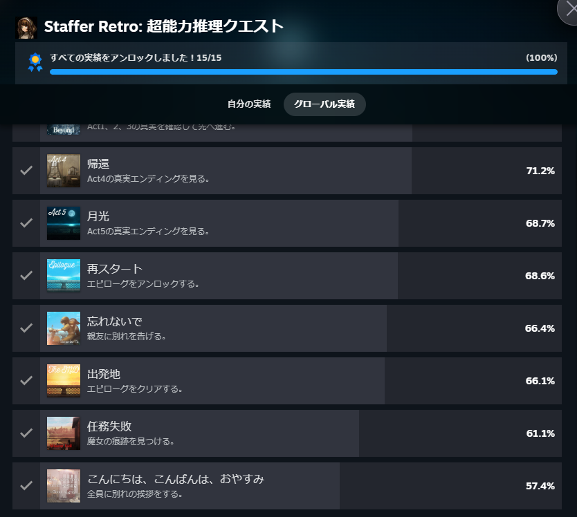
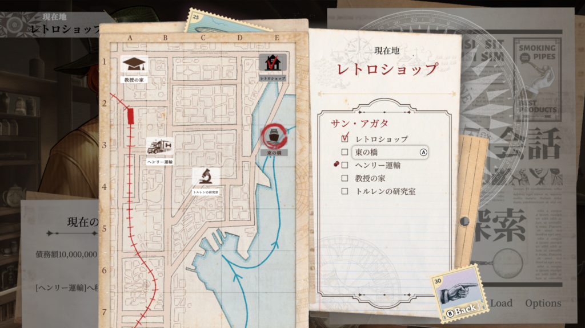
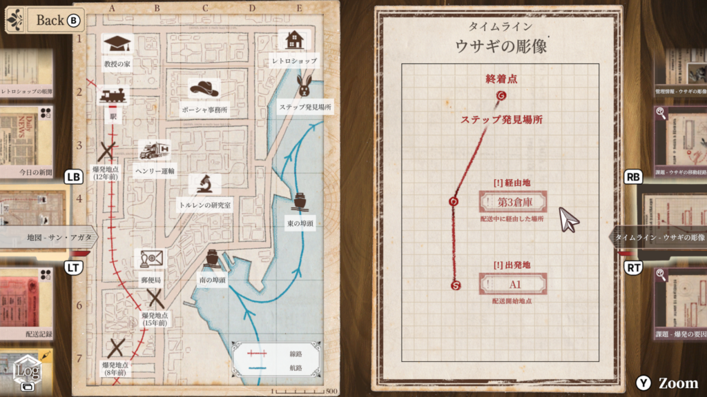
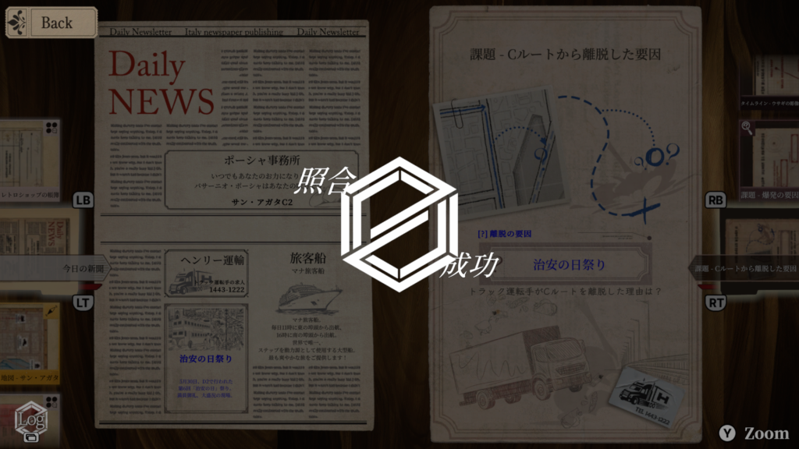
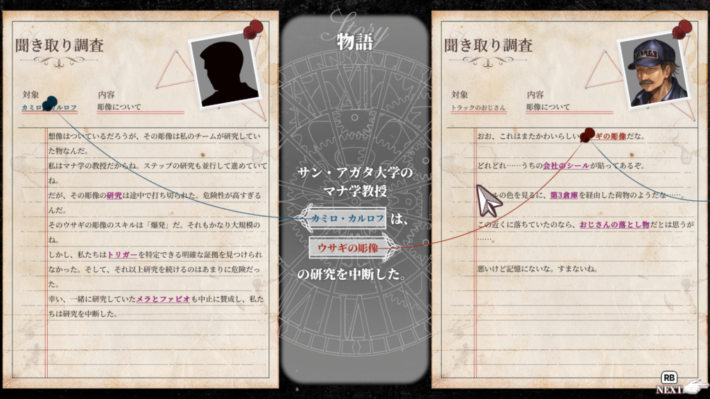
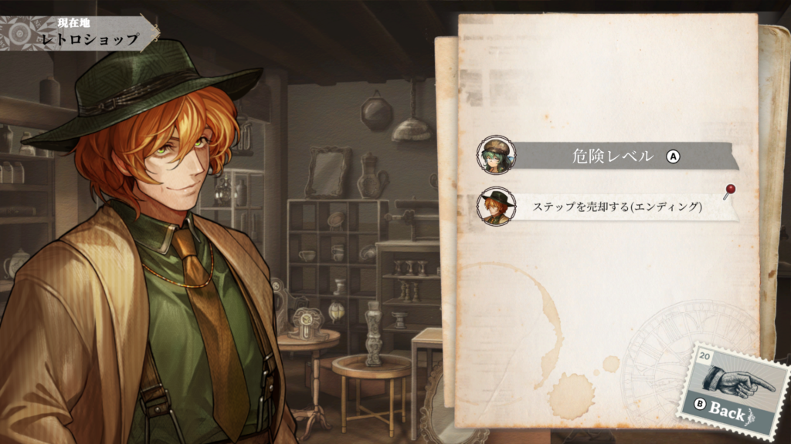
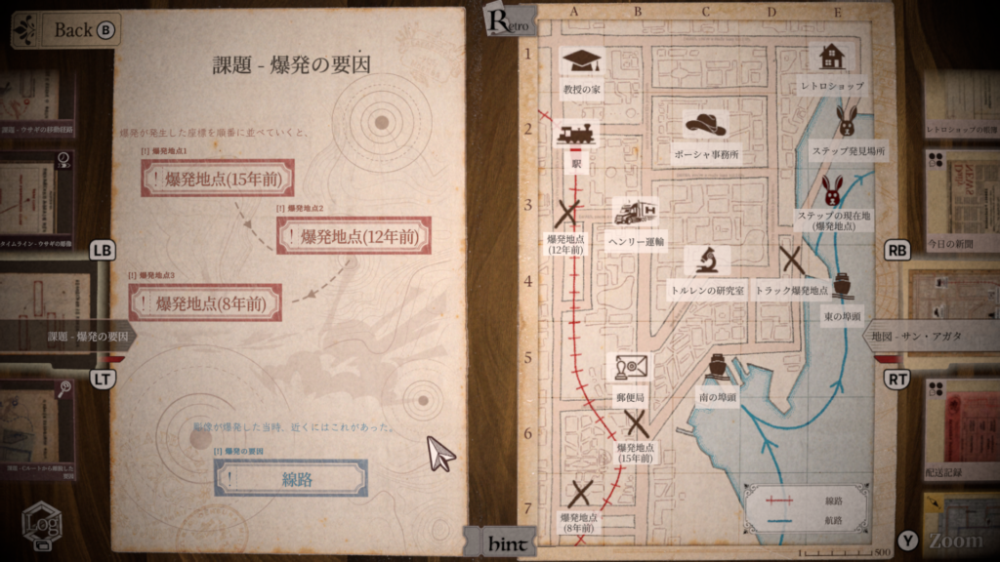
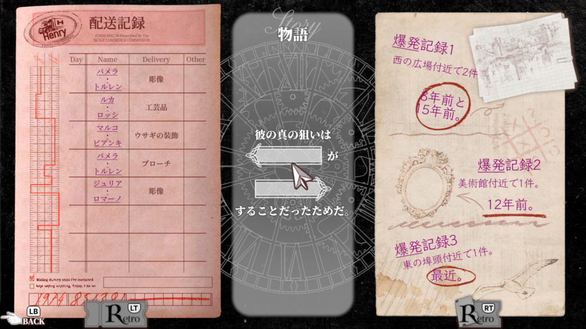

## Staffer Retro: 超能力推理クエスト

ここ最近色んなゲームを買ってプレイしているのですが、その中でもまったりしながらもしっかりとした推理ができる[ゲーム](https://store.steampowered.com/app/3837350/Staffer_Retro/?l=japanese)で遊んでました。実績自体はストーリーを全てこなせばコンプできると思います。

このゲームはストーリーパート、会話パート、推理パートに分かれています。ストーリーではキャラクター達が音声アリで話すので内容を把握していきます。ログがあるのでもし必要なら見返してみることも大事だと思います。

### Staffer Retro: 超能力推理クエスト 各パートの魅力

会話パートは推理に必要な情報集めや推理のヒントなどをくれたりします。ヒントに関しては見なくても進めることはできますので不要なら飛ばしても問題ありません。また、いろんな場所に移動して話を進めていくことも必要になると思います。

推理パートはこのゲーム最大のポイントですね。集めた情報からどこに何があったか、何が原因だったか、どんな物語があったのかを埋めていきます。

また、物語によってはエンディングに分岐があります。全てを解決しないまま進むエンディングですね。特に見なくても問題ないですがせっかくならどんな風に終わるのか見てみるのも面白いと思います。

### ※ネタバレポイント

最後にStaffer Retroのネタバレも含むので遊んでみてほしいのですが、推理パートでは少し変わった要素があります。それは元々集めた証拠の中に矛盾するポイントが存在することです。真実に近づくにつれて推理して出た事実と矛盾する証拠が出てきます。そこを修正するポイントですね。

それから物語の裏側を紐解く場所ですね。ストーリーの途中で流れを見直す場面がありますが、証拠を集めていくとその物語すら間違ってるポイントが出てきます。その修正をする中で物語の真実に気づくと少しゾクゾクするのでそこもおすすめポイントですね。

このゲームは魔法要素を含むので推理が少し大変な部分もありますが、物語は面白いのでどんどん進めたくなる部分もあります。また、キャラクター達も個性豊かなので好きなキャラを見つけていくのもよいですね。ではでは。
