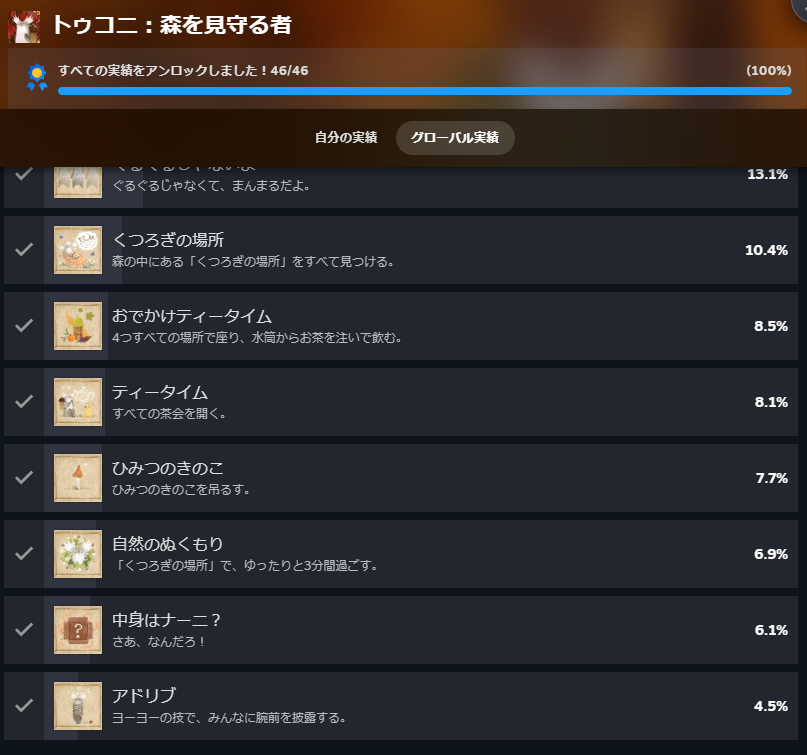
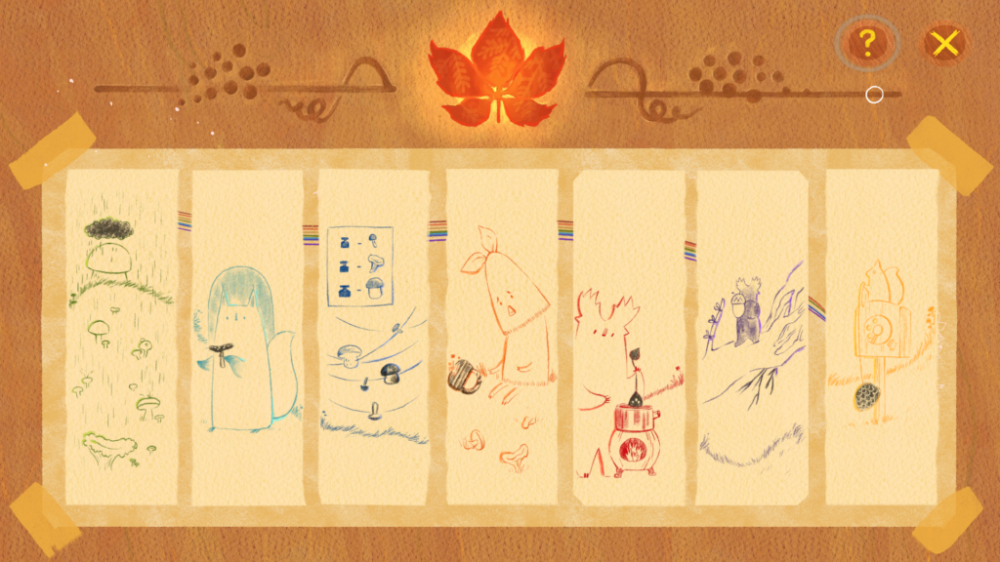
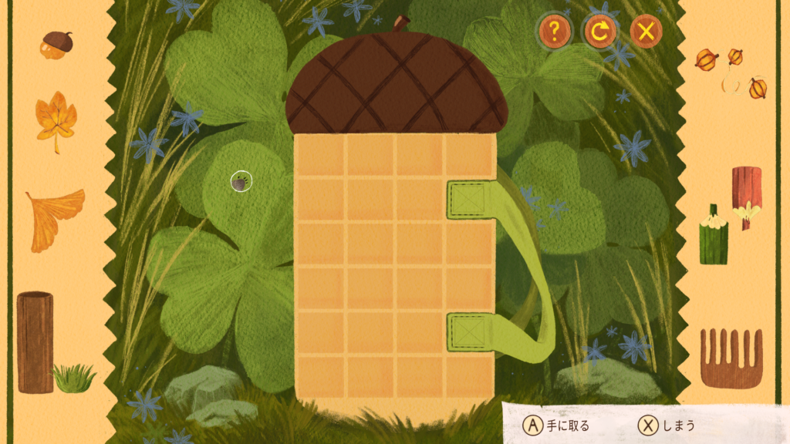
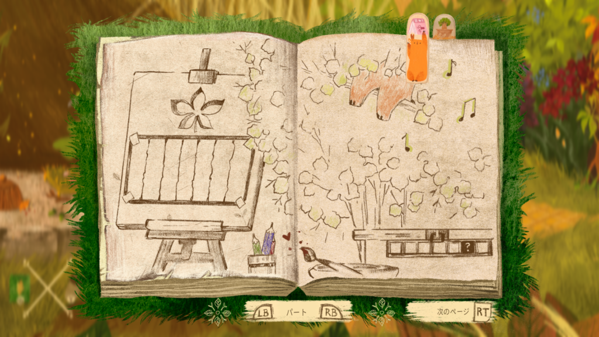
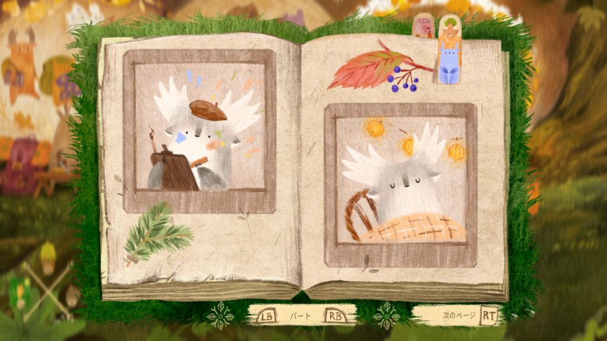
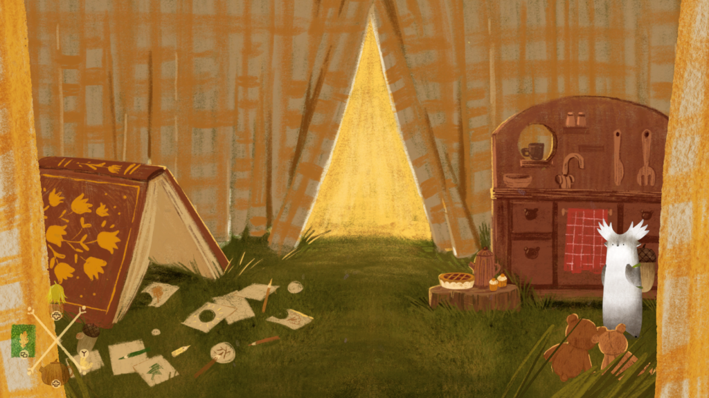
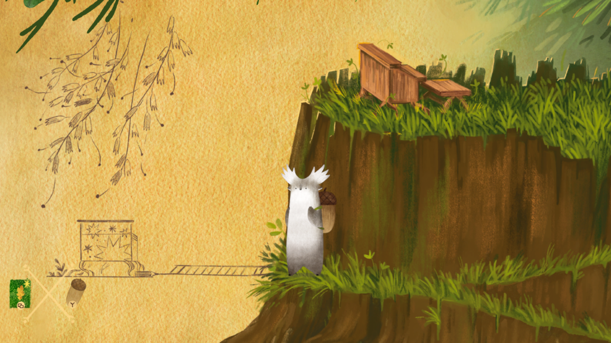
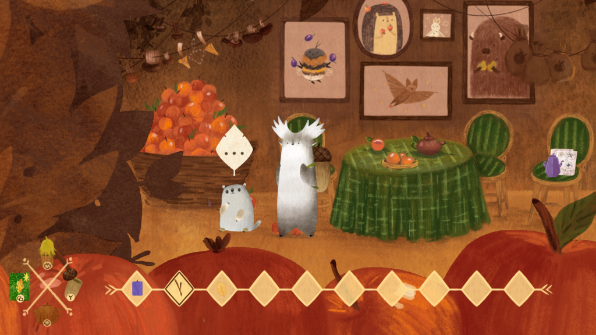

最近発売されたほのぼのゲームの[トゥコニ](https://store.steampowered.com/app/2933200/_/?l=japanese)というゲームをクリアして実績もコンプしました。

### トゥコニ ゲーム内容

このゲームは特に文章もなくボイスも喋るというよりはどうぶつの森に近い感じです。ゲーム内容としては探索パズル系になっています。いろんなところを巡って困っている動物たちを助けていくゲームになります。

パズルの内容は様々で絵合わせや図面パズルなどです。人によっては少し難しく感じるものもありますが、最悪答えをもらえますのでやるだけやってみると良いと思います。

また、手持ちの手帳にはやるべきことのヒントが書かれています。解くべきパズルはもちろん、くつろぎの場所のヒント、ティー作成方法と渡す相手ですね。

### トゥコニ 実績について

実績の中でよく見かけるのはアイテムを自身が使用することです。例えば第一章で集めるアイテムの中に櫛があります。それを使用することも実績の一つになります。もし、実績コンプをするならばとりあえず手に入れたアイテムを使ってみるのが良いと思います。

また、実績解除の内個人的にわかりにくいなと思ったのは以下の4つですね。まずは"ぐるぐるじゃないよ"ですね。第4章の以下の場所で左または右に行き続けて一周するというものですね。

次が"カエデ・トゥコニに手紙を届ける"で第一章をスタートして左に進み、色鉛筆を取った後この場所で使うと手紙を届けることができます。

次はくつろぎの場所の一つで第三章の川付近で兜を使えば出てきます。

最後は"ひみつのきのこ"ですね。道中にある枝と葉っぱを組み合わせてキノコを作り、画像の左上にある場所で使用します。画面をしっかり見ればわかりますが、見落としやすいところだと思います。

最近色んなゲームを買ってプレイしてるのですが、久々にまったりとしたゲームをプレイしました。4時間もかからないくらいなので、もしまったりパズルゲームに興味があればやってみてください。ではでは。
