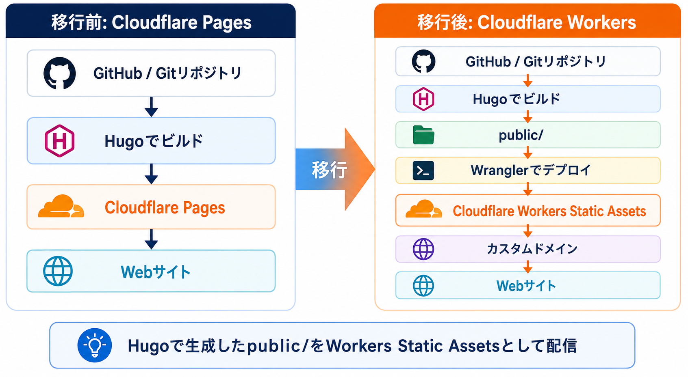
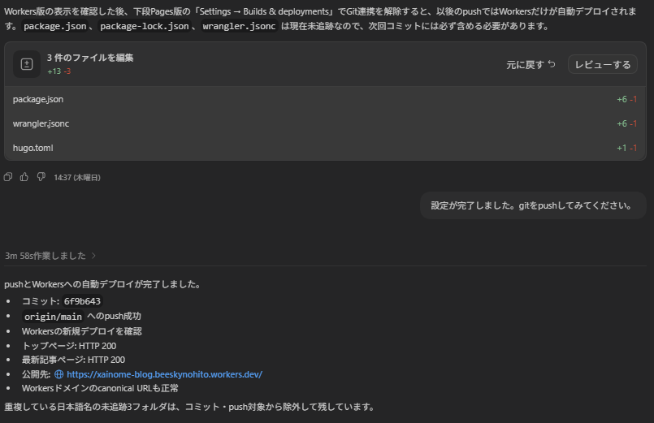

## はじめに

この記事では、Hugo + PaperModで作成したブログをCloudflare PagesからCloudflare Workers Static Assetsへ移行した手順をまとめます。
今回はCodexに多くの作業を任せましたが、実行したコマンドや設定値を確認しながら進めました。この記事では、その過程で実際に行った作業を記録します。

主に行った作業は以下のとおりです。
- wordpressからエクスポートしたxmlを添付して特定のコマンドを実行して記事を変換させること
- フォルダー名の変換
- 画像の整理とファイル名の調整

### この記事で分かること

- PagesとWorkersの違い
- 移行前に確認する項目
- Wranglerの設定方法
- Hugoサイトのビルドとデプロイ方法
- カスタムドメインを接続する方法
- 移行後に確認する項目

## 移行した理由

移行した理由としてはcloudflare workersの存在を知ったからです。codexから指示してcloudflare workersを使用してwebサイトの作成をしている動画を拝見しました。
その時私もcloudflare pagesを使用していたのでAIと対話してpageからworkersに移行すべきか聞いてみました。解答が以下ですね。

```text
はい。CloudflareがWorkersへの移行を勧めている一番大きな理由は、PagesとWorkersで分かれていた仕組みを、
Workersという1つのプラットフォームに統合しているからと考えると分かりやすいです。Cloudflare自身も現在、

新規の静的サイト・SPA・フルスタックアプリはWorkers Static Assetsを使うことを推奨。
Pagesは引き続き動作するが、新機能・最適化はWorkersを中心に行う。

と明記しています。
```

ちなみにこの部分は[CloudflareのPagesからWorkersへの移行ガイド](https://developers.cloudflare.com/workers/static-assets/migration-guides/migrate-from-pages/)を参考にしています。

と言ったわけでworkersに移行したほうが今後SEO対策が必要のないWebサイト(HP, Webアプリなど)を運営するにも便利だと思うので使ってみたいなと思いました。
せっかくなら他のwebサイトも作って試してみたいところですね。

### 移行前の構成

<!-- ここに移行前の構成を書く -->

```text
Gitリポジトリ
    ↓
Cloudflare Pages
    ↓
Webサイト
```

### 移行後の構成

<!-- ここに移行後の構成を書く -->

```text
Gitリポジトリ
    ↓ Hugoでビルド
public/
    ↓ Wranglerでデプロイ
Cloudflare Workers Static Assets
    ↓
Webサイト
```
この辺は完全にcodexに任せてたのでふわっとした理解になってますね...

## 移行前に確認したこと

- [ ] Hugoのバージョン
- [ ] Node.jsのバージョン
- [ ] Cloudflareアカウント
- [ ] Pagesのビルドコマンド
- [ ] Pagesの出力ディレクトリ
- [ ] カスタムドメイン
- [ ] DNSレコード
- [ ] 環境変数
- [ ] `_headers` と `_redirects`
- [ ] 画像や記事内リンク

この辺は私が確認したというよりはAIの方で勝手に確認して実行した部分だと思います。実行などは全て任せてたので。

## Workers用の設定を作る

プロジェクト直下に `wrangler.jsonc` を作成します。

```jsonc
{
  "$schema": "node_modules/wrangler/config-schema.json",
  "name": "xainome-blog",
  "compatibility_date": "2026-09-03",
  "assets": {
    "directory": "./public"
  },
  "workers_dev": true,
  "preview_urls": true
}
```

`assets.directory`には、Hugoが生成した静的ファイルのフォルダーを指定します。

今回作成した構成図も載せておきます。



## Hugoをビルドする

```powershell
hugo --gc --minify --environment production
```

このコマンドでHugoのサイトをビルドして、`public/`の中にWebサイトのファイルを作成します。

ビルド後に、次のファイルやフォルダーが生成されているか確認します。

- `public/index.html`
- `public/sitemap.xml`
- `public/robots.txt`
- 記事ページ
- coverimage
- 記事内の画像

## Wranglerをインストールする

```powershell
npm install --save-dev wrangler
npx wrangler login
```

Node.jsのバージョンがWranglerの要求を満たしているか確認します。

```powershell
node --version
npx wrangler --version
```

## ローカルで確認する

```powershell
npx wrangler dev --port 8787
```

ブラウザで `http://localhost:8787/` を開き、次の項目を確認します。

- [ ] トップページ
- [ ] 記事ページ
- [ ] 内部リンク
- [ ] coverimage
- [ ] 記事内画像
- [ ] sitemap.xml
- [ ] robots.txt
- [ ] 404ページ

## Workersへデプロイする

```powershell
npx wrangler deploy
```

実際にデプロイしたところ、以下のURLでWebサイトを確認できました。

[https://xainome-blog.beeskynohito.workers.dev/](https://xainome-blog.beeskynohito.workers.dev/)

Workers Static Assetsの料金については、[Cloudflareの公式料金表](https://developers.cloudflare.com/workers/platform/pricing/)を参考にしています。静的アセットの配信は無料で利用できるようです。

実際にWorkersへのデプロイが完了したときの画面です。トップページや記事ページが`HTTP 200`で表示されていることも確認しました。



デプロイ後に表示された `workers.dev` のURLへアクセスし、本番相当の表示を確認します。

## カスタムドメインを接続する

<!-- ここにCloudflare Dashboardでのドメイン接続手順を書く -->

1. Cloudflare Dashboardを開く
2. `Workers & Pages`を開く
3. 対象のWorkerを選択する
4. `Settings` → `Domains & Routes`を開く
5. `Add Custom Domain`からドメインを追加する
6. 本番ドメインで表示を確認する

## DNSやドメインを移行する場合の注意点

<!-- ドメインをCloudflare Registrarへ移管する場合の内容を書く -->

- [ ] 現在のDNSレコードを保存する
- [ ] DNSSECを利用している場合は切り替え前に確認する
- [ ] メールの利用有無を確認する
- [ ] ドメインロックを解除する
- [ ] Auth Code（EPPコード）を取得する
- [ ] 移管完了まで旧サービスを削除しない

## 移行後の確認

- [ ] HTTPSで表示できる
- [ ] wwwあり・なしの動作を確認する
- [ ] 主要記事へアクセスできる
- [ ] 旧URLから新URLへ移動できる
- [ ] coverimageが表示される
- [ ] 画像のリンク切れがない
- [ ] sitemap.xmlが正しい
- [ ] Google Search Consoleの設定を確認する
- [ ] Cloudflare Pagesを停止する前にWorkersを再確認する

## まとめ

<!-- 実際に移行して分かったこと、費用、注意点を書く -->

一応手順として示していますが、私はざっくりとした指示しか出しておらず実行はほとんどcodexがおこなっております。コマンドの実行からworkersの設定までやってくれています。私がやり残したこととしてはカスタムドメインの移管なので、この辺りがうまく行けたらなと思います。ではでは。
