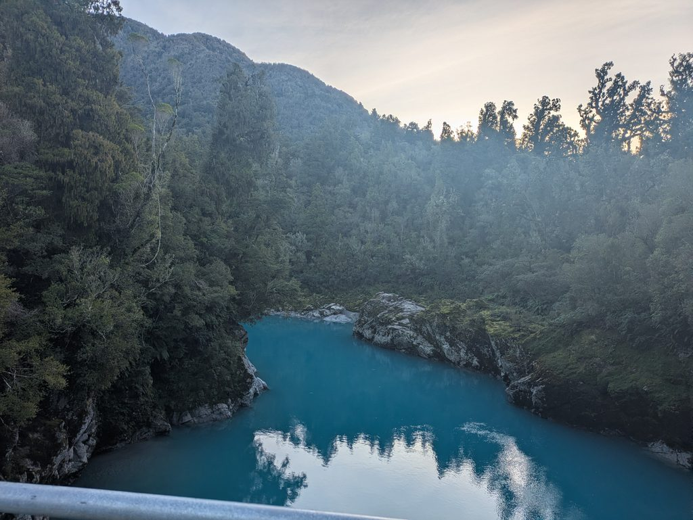
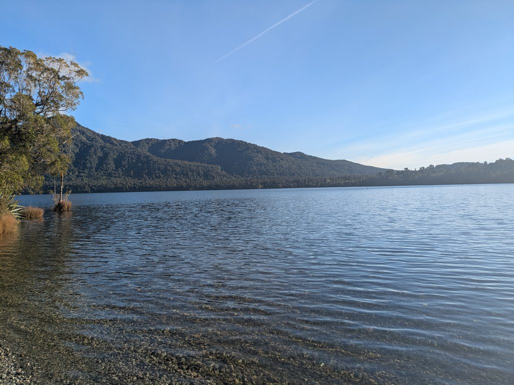
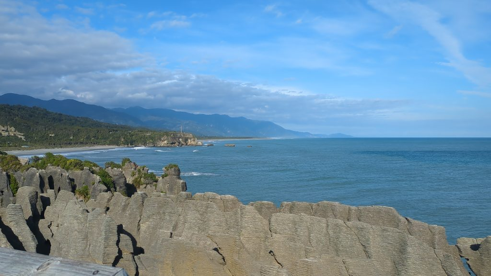
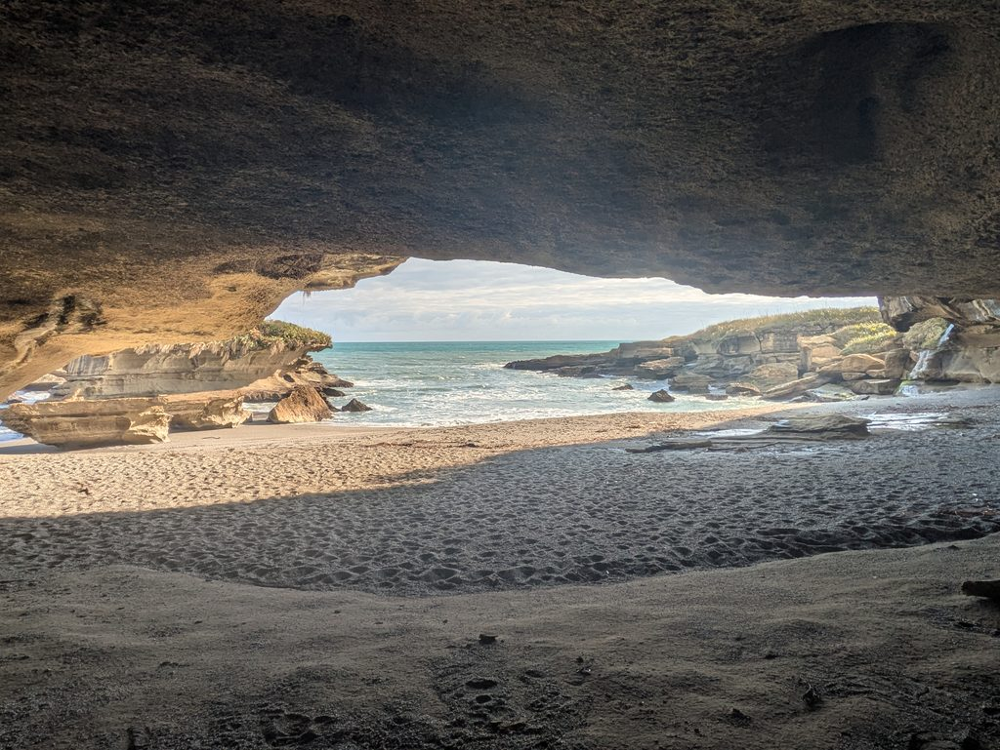
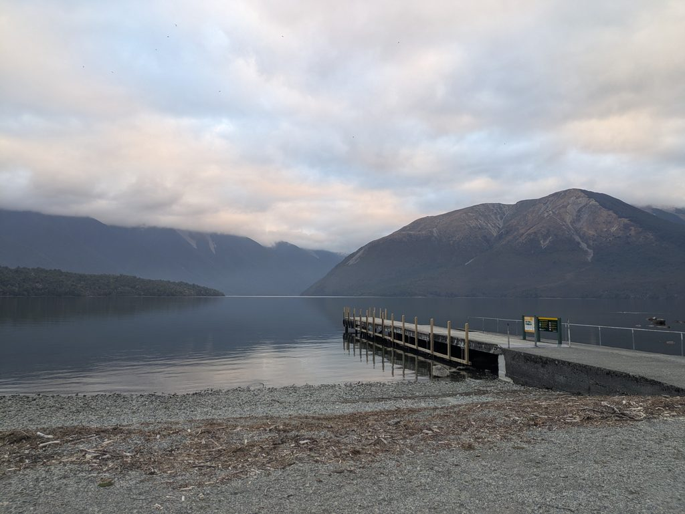

## English\_Practice

I wrote the article which was by Okarito so I am going to do from Okarito to Picton. I will finish writing my roadtrip in South Island.

### Hokitika Gorge

Firstly, this is Hokitika Gorge where I saw a blue river and gorge. I walked around there. It was nice to see it with each angles.

### Lake Kaniere

This is the lake near Hokitika Gorge. It took for few minutes to arrive there from parking area. It was very beautiful and clear.

### Pancake Rocks

I saw some piling rocks. If I use near parking area, I need to pay fee so I parked a little far. I walked for ten minutes.

There is trecking road which I went around. There is rural area but there were many tuorists.

### Truman Track

There was tracking course above Pancake Rocks. It was seashore after walking for 10 minutes from parking area.

If the tide was not coming in, I saw the sea with my relaxing. I would like to stay more.

### Lake Rotoiti

Finally, this was the Lake Rotoiti which is near the camp site. It was so majestic when I saw it on the bridge.

I explored around each sightseeing. There are many point and activities. If I have time, I would like to go to Stuart Island and whole watching in Kaikora. See you later.

## 日本語版

前回Okaritoまで書いたので今回はそこからPictonまでを書いていこうと思います。これで私の南島でのロードトリップは終了になります。

### Hokitika Gorge

まずはHokitika Gorgeです。ここは青く綺麗な川と峡谷の景色を見ることができます。ここはぐるっと一周することができます。いろんな角度から見れ自然の中を歩けるのでとてもよいですね。

### Lake Kaniere

ここはHokitika gorgeから上の方に行ったすぐ近くに湖ですね。駐車場から少し歩くと湖のすぐそばまで行くことができます。透き通っててすごくきれいでした。

### Pancake Rocks

ここは連なった岩場を見ることができます。近場の駐車場は料金を払う必要があるので私は少し離れたところの駐車場から歩いていきました。大体10分くらいかかりました。

ここは1周ぐるっとすることができる歩道があります。そこの外側の方でこの景色を見ることができます。場所的にはへき地だと思いますが、割と観光客は多かったですね。

### Truman Track

Pancake Rocksから上へ少し進んだところにトラッキングコースががあります。写真の場所は駐車場からトラッキングコースを10分ほど歩いて海岸におりた場所でした。

潮が満ちていなければいい場所でまったりと海を眺めることができるので、時間があればもう少しいたかったですね。

### Lake Rotoiti

最後にRotoiti湖です。少し山に入った場所で、キャンプ場の近くにあります。桟橋から見られる山と湖の景色はとても雄大だなと思いました。

といった感じで各観光スポットを巡ってきました。他にもまだまだめぐるポイントはいっぱいありますし、やれていないアクティビティもいっぱいありました。もし機会があればスチュアートアイランドやKaikoraのクジラウォッチングもやってみたいと思います。ではでは。

## AI採点

IELTSの観点で見ると、現状は**おおよそ Band 5.0 前後**です。意味はかなり伝わっていますが、冠詞・単複・前置詞・時制・語法・コロケーションの誤りが頻繁にあり、Band 6以上を阻んでいます。

なお、今回は旅行ブログ文なので、IELTS Writing Task 1/2の **Task Response** は正式には採点できません。そこで「原文の意味を正確かつ自然に英語で表現できているか」を代わりに評価します。

| 項目 | 推定Band | 主な理由 |
| --- | --- | --- |
| Task Response / 翻訳精度 | 5.0 | 大意は伝わるが、意味の省略・変化が複数ある |
| Coherence & Cohesion | 5.5 | 順序は明確だが、`This is... / There is...` が多く単調 |
| Lexical Resource | 4.5 | 不自然な語の組み合わせやスペルミスが多い |
| Grammar Range & Accuracy | 4.5 | 冠詞、単複、時制、前置詞、文型の誤りが頻繁 |
| **総合目安** | **5.0** | 意味は理解できるが、誤りが目立つ |

Band 8では、**大部分の文が文法的に正しく、語彙の選択も自然かつ正確**である必要があります。

* * *

## 1\. 導入部分

### ❌ I wrote the article which was by Okarito

かなり不自然です。

`by Okarito` は「Okaritoによって書かれた」のようにも読めます。

原文は、

> 前回Okaritoまで書いた

なので、

**In my previous post, I wrote about my trip up to Okarito.**

が自然です。

`article` より旅行ブログなら `post` のほうが適切です。

* * *

### ❌ so I am going to do from Okarito to Picton.

`do from A to B` とは言いません。

✅

**so this time, I am going to cover the journey from Okarito to Picton.**

`cover` は記事などで「〜について扱う」という非常に便利な表現です。

* * *

### ❌ I will finish writing my roadtrip in South Island.

いくつか問題があります。

- `roadtrip` → **road trip**

- `in South Island` → **on the South Island**

- 「書くことを終了」ではなく「ロードトリップの記事が今回で最後」

したがって、

**This will also be the final part of my South Island road trip.**

が自然です。

* * *

# 2\. Hokitika Gorge

### △ Firstly, this is Hokitika Gorge

文法的には可能ですが、ブログでは少し不自然です。

✅

**My first stop was Hokitika Gorge.**

のほうが自然です。

* * *

### △ where I saw a blue river and gorge.

意味は分かりますが、

`a blue river and gorge`

だと「青い川と峡谷を見た」だけになり、原文の

> 青く綺麗な川と峡谷の景色

が十分表現されていません。

✅

**where you can enjoy beautiful views of the vivid blue river and surrounding gorge.**

* * *

### △ I walked around there.

非常に曖昧です。

原文は「ぐるっと一周できる」なので、

✅

**There is a loop track that takes you around the area.**

のほうが正確です。

* * *

### ❌ It was nice to see it with each angles.

ここは明確な文法ミスがあります。

### each + 単数

❌ each angles  
✅ each angle

ただしこの場合は `each angle` ではなく、

✅ **from different angles**

です。

また `with angles` ではなく **from angles**。

✅

**It was nice to see the scenery from different angles while walking through the forest.**

* * *

# 3\. Lake Kaniere

### △ This is the lake near Hokitika Gorge.

文法的には大きな問題はありませんが、

`the lake`

より、

**Lake Kaniere is located not far from Hokitika Gorge.**

のほうが自然です。

* * *

### ❌ It took for few minutes to arrive there from parking area.

かなり重要な文法ミスです。

### take の文型

❌ It took for few minutes  
✅ It took **a few minutes**

さらに「私が歩いた」なら、

**It took me a few minutes to walk...**

### 冠詞

❌ few minutes  
✅ **a few minutes**

`few` と `a few` は意味が違います。

- few = ほとんどない

- a few = 数分・いくつかある

IELTSではこの違いは重要です。

### parking area

❌ from parking area  
✅ from **the** parking area

特定の駐車場なので `the` が必要です。

より自然なら、

✅

**It only took a few minutes to walk from the car park to the lakeshore.**

* * *

### △ It was very beautiful and clear.

何が `clear` なのか不明瞭です。

✅

**The water was incredibly clear, and the lake was beautiful.**

または Band 8を狙うなら、

**The water was crystal clear, which made the lake particularly beautiful.**

* * *

# 4\. Pancake Rocks

### ❌ I saw some piling rocks.

`piling rocks` は不自然です。

`pile` は「積み上げる」という動作。

Pancake Rocksの場合、

- layered rock formations

- stacked rock formations

などが自然です。

✅

**You can see a series of unusual layered rock formations here.**

* * *

### ❌ If I use near parking area

複数の問題があります。

❌ use near parking area  
✅ use **the nearby car park**

`near` はここでは形容詞として使えません。

- near the car park

- the nearby car park

になります。

* * *

### ❌ I need to pay fee

冠詞が必要です。

❌ pay fee  
✅ pay **a fee**

`fee` は可算名詞です。

また過去の旅行なので、

❌ I need  
✅ I would have needed / you have to

原文を自然にすると、

**The car park closest to the attraction charges a fee, so I parked a little farther away instead.**

* * *

### ❌ I parked a little far.

`far` はこの使い方では不自然です。

✅

**I parked a little farther away.**

`farther away` = より離れた場所に

* * *

### △ I walked for ten minutes.

文法的にはOKです。

ただし目的地まで歩いたので、

**It took me about ten minutes to walk there.**

のほうが自然です。

* * *

### ❌ There is trecking road which I went around.

まずスペルミスです。

❌ trecking  
✅ **trekking**

ただしニュージーランドでは、このような道には普通

**walking track**

を使います。

`road` は車道という意味が強いです。

また、

❌ which I went around

も不自然。

✅

**There is a loop track that takes you around the area.**

* * *

### ❌ There is rural area

冠詞が必要です。

❌ There is rural area  
✅ It is **a rural area**

しかし原文の「へき地」は `rural` より、

**remote**

のほうが適切です。

`rural` = 田舎  
`remote` = 人里離れた場所

✅

**Although it is quite a remote area, there were surprisingly many tourists.**

* * *

### ❌ tuorists

スペルミスです。

❌ tuorists  
✅ **tourists**

IELTS WritingではスペルもLexical Resourceの減点対象になります。

* * *

# 5\. Truman Track

### ❌ There was tracking course

`tracking` は「追跡」です。

❌ tracking  
✅ trekking

ただし、ここでも普通は

✅ **walking track**

です。

また冠詞も必要です。

❌ tracking course  
✅ **a walking track**

* * *

### ❌ above Pancake Rocks

`above` は「上方に」という位置関係なので、地図上で北へ進む意味には不自然です。

✅

**a little farther north of Pancake Rocks**

あるいは

**a short drive farther up the road from Pancake Rocks**

が自然です。

* * *

### ❌ It was seashore after walking for 10 minutes from parking area.

文型自体が不自然です。

`It was seashore` ではなく、

**I reached the beach...**

にします。

また、

❌ from parking area  
✅ from **the** car park

✅

**After walking along the track for about ten minutes from the car park, I reached the beach shown in the photo.**

* * *

### ❌ If the tide was not coming in

原文は、

> 潮が満ちていなければ

なので「潮が入ってきていなければ」ではなく、

**if the tide is low**

または

**when the tide is out**

が自然です。

* * *

### ❌ I saw the sea with my relaxing.

これは英語として成立していません。

`relaxing` はこのように名詞として使えません。

✅

**I could relax and enjoy the view of the sea.**

さらに自然なら、

**It was a great place to sit back, relax, and enjoy the ocean view.**

* * *

### ❌ I would like to stay more.

ここは重要です。

旅行はすでに終わっていて、

> もっといたかった

という**過去の実現しなかった願望**なので、

❌ I would like to stay more.  
✅ **I would have liked to stay longer.**

IELTSではこのような完了形を正しく使えるとGrammar Rangeの評価が上がります。

* * *

# 6\. Lake Rotoiti

### ❌ this was the Lake Rotoiti

通常、湖の固有名詞には `the` を付けません。

❌ the Lake Rotoiti  
✅ **Lake Rotoiti**

例：

- Lake Tekapo

- Lake Wanaka

- Lake Rotoiti

* * *

### ❌ near the camp site

`campsite` は通常1語です。

✅ **campsite**

また特定していないなら、

✅ near **a** campsite

です。

* * *

### ❌ It was so majestic when I saw it on the bridge.

原文と意味が変わっています。

日本語は、

> 桟橋から見られる山と湖の景色

です。

`bridge` = 橋  
`jetty / pier` = 桟橋

なので `bridge` は誤訳です。

さらに `it` が何を指すか曖昧です。

✅

**The view of the mountains and lake from the jetty was truly majestic.**

これはかなり自然です。

* * *

# 7\. 最後の段落

### ❌ I explored around each sightseeing.

`sightseeing` は「観光すること」という不可算名詞です。

❌ a sightseeing  
❌ each sightseeing

とは基本的に言いません。

使うなら、

- sightseeing spot

- tourist attraction

- place

です。

✅

**That was my journey through these sightseeing spots.**

または、

**That pretty much wraps up my visits to these places.**

* * *

### ❌ There are many point and activities.

`many` の後ろは複数形です。

❌ many point  
✅ many **points**

ただし `point` も不自然なので、

✅

**There are still plenty of places I haven't visited and activities I haven't tried.**

が原文にかなり近いです。

* * *

### △ If I have time

原文は「機会があれば」なので、

`time` より、

✅ **If I get the chance**

が正確です。

* * *

### ❌ Stuart Island

ニュージーランドの島は、

❌ Stuart Island  
✅ **Stewart Island**

です。

* * *

### ❌ whole watching

これはスペルによって完全に意味が変わります。

- whole = 全体

- whale = クジラ

❌ whole watching  
✅ **whale watching**

* * *

### ❌ Kaikora

正式には、

✅ **Kaikōura**

です。

英語表記でマクロンを省略して **Kaikoura** とすることもあります。

* * *

# 特に減点が大きいポイント

今回、Bandを下げている最大の原因はこの5点です。

1. **冠詞**
    - `pay fee` → `pay a fee`
    
    - `from parking area` → `from the car park`
    
    - `tracking course` → `a walking track`

3. **単数・複数**
    - `each angles` → `each angle`
    
    - `many point` → `many points`

5. **不自然なコロケーション**
    - `piling rocks`
    
    - `see the sea with my relaxing`
    
    - `do from Okarito to Picton`
    
    - `each sightseeing`

7. **時制**
    - `I would like to stay more`  
        → `I would have liked to stay longer`

9. **日本語を単語単位で英語に置き換えている部分**
    - トラッキングコース → tracking course
    
    - 上へ進む → above
    
    - 桟橋 → bridge

IELTS 7〜8を目指す場合、\*\*「日本語の単語→英単語」ではなく、「その状況なら英語ではどう表現するか」\*\*を考えることが非常に重要です。

In my previous post, I wrote about my journey as far as Okarito, so this time I will cover the final stretch from Okarito to Picton. This will also be the last part of my South Island road trip.

### Hokitika Gorge

My first stop was Hokitika Gorge, where you can enjoy beautiful views of the vivid blue river and the surrounding gorge. There is a loop track that allows you to walk around the area and see the scenery from a variety of angles. It was a great place to spend some time walking through nature.

### Lake Kaniere

Lake Kaniere is located not far from Hokitika Gorge. After parking, it only takes a short walk to reach the lakeshore. The water was crystal clear, and the lake itself was absolutely beautiful.

### Pancake Rocks

At Pancake Rocks, you can see a series of unusual layered rock formations. The car park closest to the attraction charges a fee, so I decided to park a little farther away and walk instead. It took me about ten minutes to get there.

There is a loop track around the area, and some of the best views can be seen from the outer section of the walkway. Although the location felt quite remote, there were surprisingly many tourists.

### Truman Track

A short drive farther north from Pancake Rocks is the Truman Track. After walking along the track for about ten minutes from the car park, I reached the beach shown in the photo.

When the tide is low, it is a lovely place to sit back, relax, and enjoy the ocean view. If I had had more time, I would have liked to stay there a little longer.

### Lake Rotoiti

My final stop was Lake Rotoiti. It is located slightly inland in a mountainous area, close to a campsite. The view of the lake and surrounding mountains from the jetty was truly majestic.

And with that, I reached the end of my journey through these sightseeing spots. There are still plenty of places I have yet to visit and activities I did not get the chance to try. If I ever have the opportunity, I would also love to visit Stewart Island and go whale watching in Kaikōura.

That's all for now.

この文章で特に覚えてほしい表現は、**`a variety of angles`、`farther away`、`crystal clear`、`Although ...`、`If I had had more time, I would have liked to ...`、`If I ever have the opportunity`** あたりです。このレベルの表現を自力で安定して使えるようになると、IELTS Writing 7.0〜8.0にかなり近づきます
