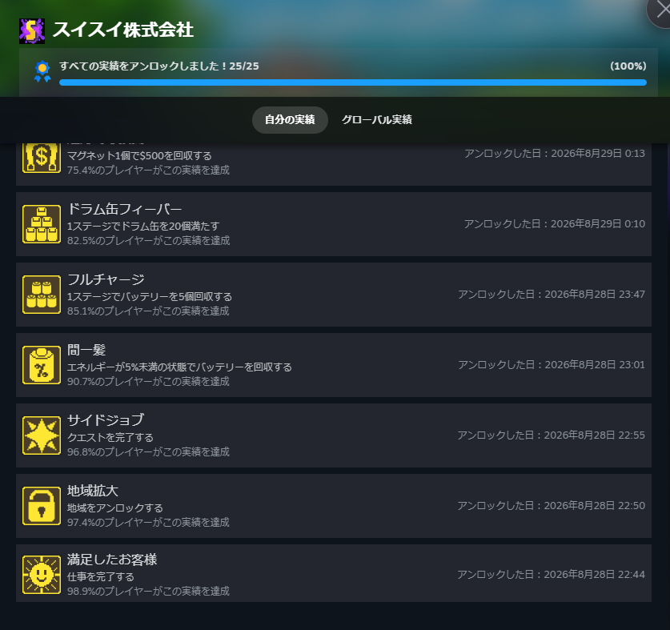
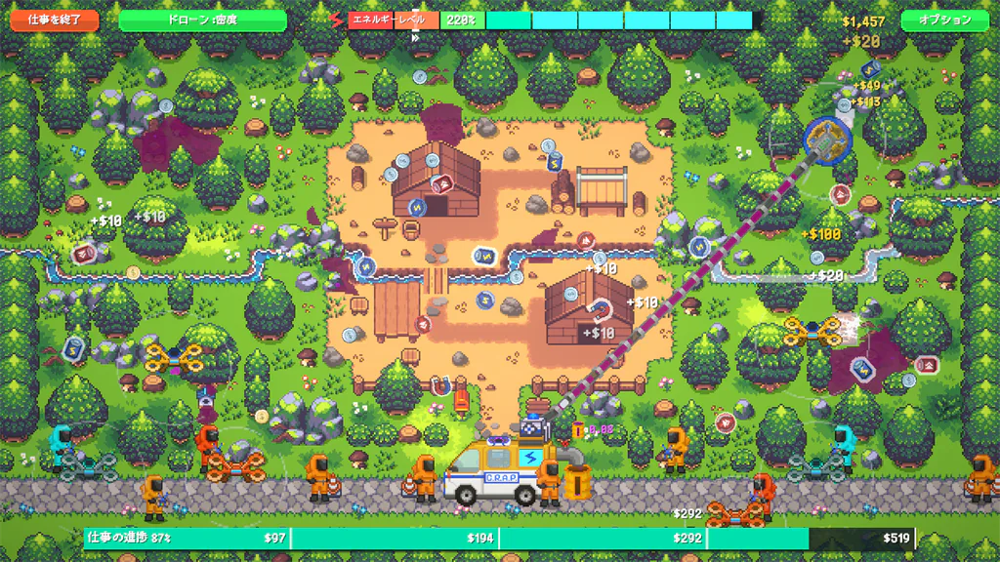
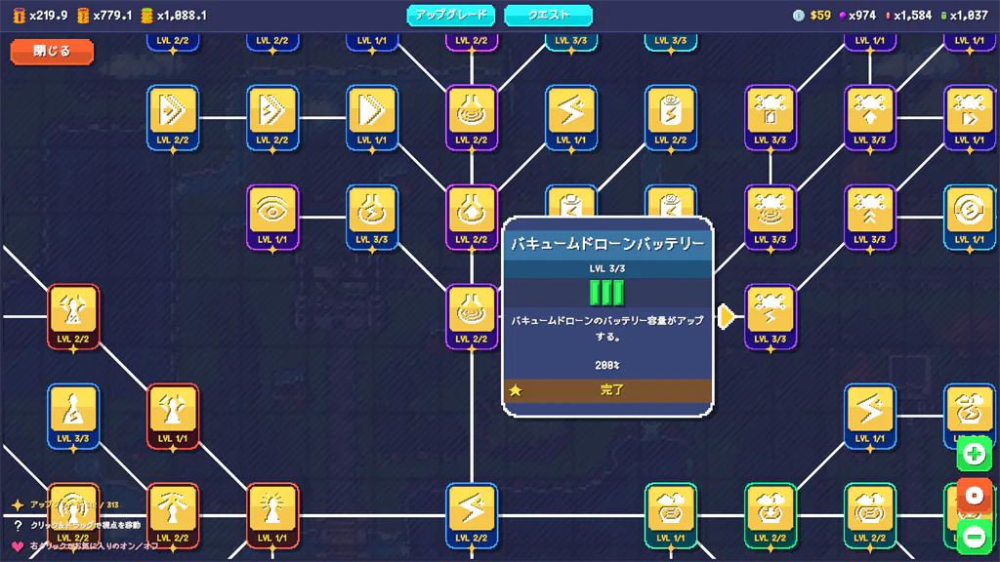
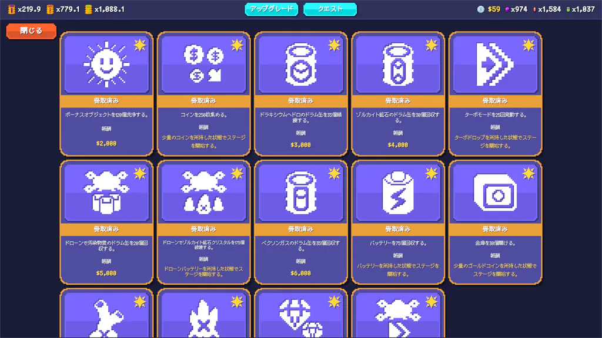

最近いろいろなゲームを探している中で、Steamで配信されている[スイスイ株式会社](https://store.steampowered.com/app/4073860/_/?l=japanese)というゲームを遊びました。

このゲームは吸引車を操作してヘドロや廃棄物を回収し、それを資源やお金に変えながら設備を強化していくインクリメントゲームです。

掃除によってマップがきれいになっていく気持ちよさと、少しずつ作業効率が上がっていく成長要素が心地よいゲームです。複雑な操作を覚える必要もなく、マウスだけで出来るのでゲームが苦手な人でも楽しめます。

また、最後まで遊んでSteam実績も25個すべて解除し、無事に実績コンプできました。

実績には、クエストの完了や地域のアンロックなどゲームを進める中で解除できるものだけでなく、バッテリーの回収など特定の行動が条件になっているものもあります。解除自体は簡単なのでサクッと終わらせられると思います。

### スイスイ株式会社はどんなゲーム？

スイスイ株式会社では、吸引車に乗って田舎や山林、建設現場などを走り回り、地面に広がった汚染物質や廃棄物を回収していきます。

回収したものはそのまま捨てるのではなく、工場へ持ち帰って加工・精製します。そこで得たお金や資源を使って車両や設備をアップグレードすることができます。。

基本的な流れは以下の繰り返しです。

1. マップを走ってヘドロや廃棄物を回収する
2. 集めたものを工場で加工する
3. お金や資源を受け取る
4. 車両・工場・スキルを強化する
5. 新しいエリアや依頼を解放する

最初はすべて回収できないようになってます。しかし、強化をすることで少しずつ効率が上がり、以前は苦労した場所もスイスイ掃除できるようになります。この変化が分かりやすいところは、インクリメントゲームらしい魅力ですね。

### 基本画面と掃除の進め方

基本画面は見下ろし型の2Dマップになっていて、ポンプを動かしながら掃除する場所を探します。カラフルなドット絵で情報も確認しやすく、最初に簡単な操作を覚えれば迷うことはそれほどありません。

掃除中は、闇雲にすべてを吸い取ろうとするよりも、現在の装備で回収しやすい場所から進める方が効率的です。資源やお金が貯まったら工場へ戻り、アップグレードしてから再び同じ場所へ向かうと、成長を実感しやすいと思います。

また、マップには通常の掃除以外にクエストや金庫があり、クエストクリアで掃除を有利に進めたり金庫でお金を増やすことができます。

掃除のポイントとしては強化するとターボやバッテリーがドロップするようになります。また、強化には"25%からターボモードの発動"もあります。バッテリーを取る際は残電力が少ない状態で取る方がおすすめです。その分電力が0%にならないよう注意する必要がありますが。

### スキル画面では何を優先する？

本作にはツリー形式のスキル画面があり、獲得した資源を使ってさまざまな能力を解放できます。主な強化の方向性は、回収速度、工場での加工効率、資源の売却価格などです。

序盤は吸引装置の性能やバッテリーなど、普段の回収作業に直接影響する能力を伸ばすと遊びやすくなります。回収できる量や活動時間が増えると工場へ戻る回数を減らせるため、結果的にお金や資源も集めやすくなります。

一方で、工場の加工や売却に関する能力を伸ばすと、集めた資源から得られる利益が増えていきます。どの強化が正解というよりも、掃除そのものを楽にしたいのか、工場の生産効率を高めたいのかによって選び方が変わります。

個人的には、いちいち工場に廃棄物を送るのが面倒なので、新しい廃棄物が出たら自動化を優先的に撮ってました。それ以外だと吸引力や破壊力、ターボ系を取ってました。

### 掃除と成長が目に見えるのが面白い

このゲームで一番分かりやすい魅力は、自分の作業によって汚れていた土地が少しずつきれいになることです。数字が増えていくだけのインクリメントゲームとは違い、掃除した結果がマップの見た目にも表れます。

さらに、アップグレード前は時間がかかっていたヘドロを短時間で回収できるようになると、数字だけでなく操作感でも成長を実感できます。また、どれを優先的に強化するか自身のプレイスタイルが見えるのも面白いポイントだと思います。

資源を集めて工場へ持ち帰り、設備を強化してまた出発するという流れもテンポが良く、短時間でも区切りをつけやすいです。

### 気になったポイント

工場の行き来は面倒でしたが自動化してしまえば特に気になるところはなかったですね。強化に必要な素材がグンと増えるわけではないので、区切りをつけにくい部分はあると思います。止め時がわからないのはインクリメントゲームととしては正しいと思いますが。
<!-- 実際にプレイして気になった点があれば、この2段落を具体的な内容に置き換えてください。 -->

### スイスイ株式会社はこんな人におすすめ

スイスイ株式会社は、以下のような人におすすめです。

- インクリメントゲームや放置・クリッカー系の成長要素が好きな人
- 掃除ゲームのきれいになっていく感覚が好きな人
- 資源を集めて設備を強化するゲームが好きな人
- 難しい操作や厳しいペナルティのないゲームを探している人
- ドット絵のカジュアルなゲームを自分のペースで遊びたい人

吸い取る、加工する、強化するという仕組みはシンプルですが、それぞれがつながっているため自然と次の目標が見えてきます。掃除の爽快感と、会社が少しずつ大きくなる達成感の両方を楽しめるゲームでした。

黙々と作業をしながら数字や効率が伸びていくゲームが好きなら、かなり相性が良いと思います。気になった人はぜひ遊んでみてください。ではでは。
