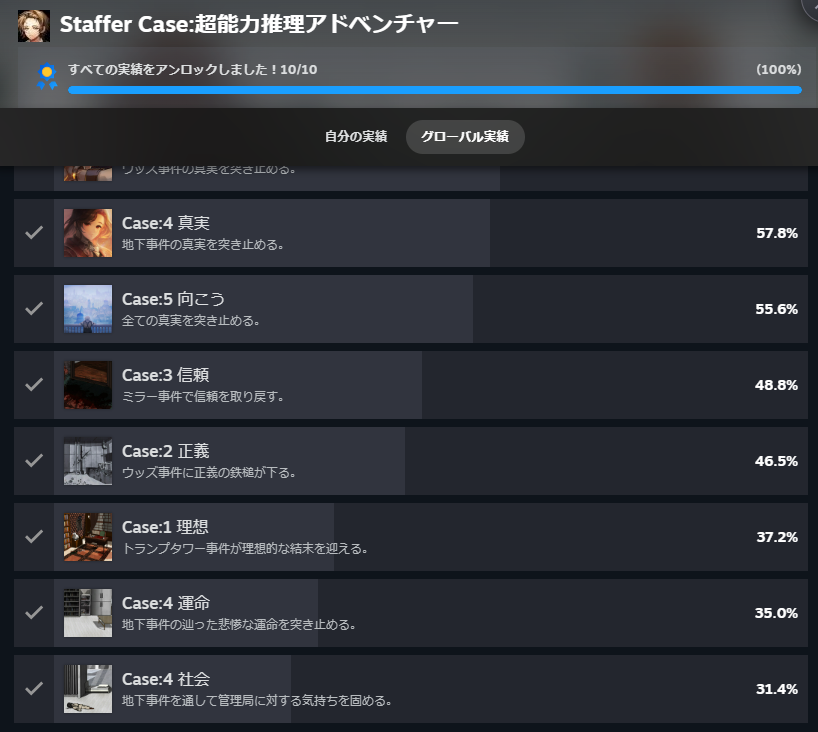
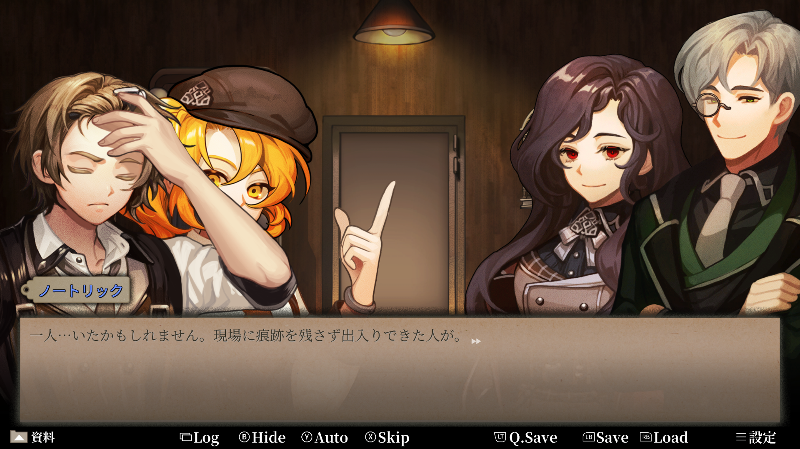
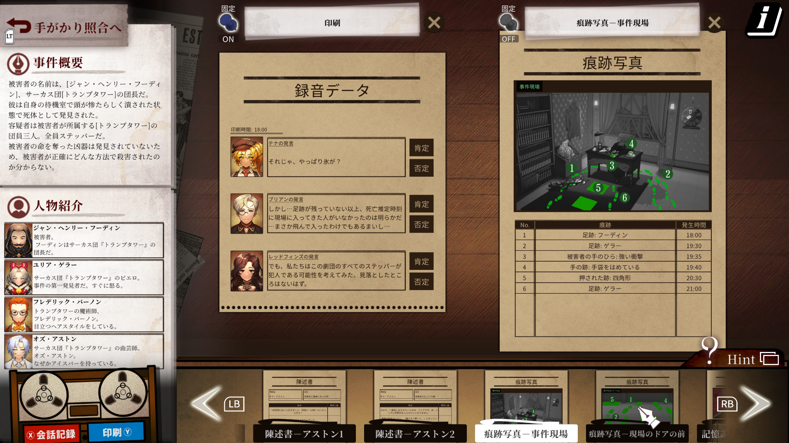
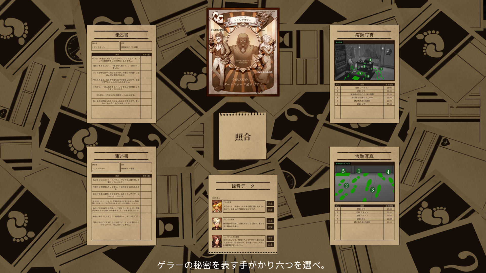
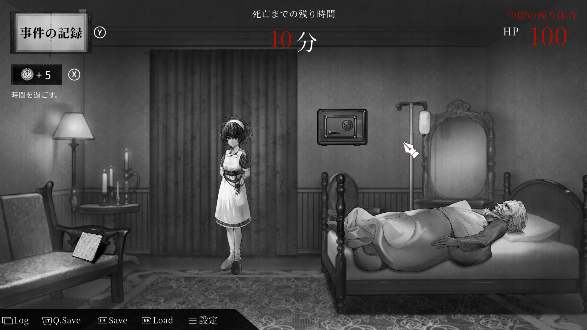

今回は、[Staffer Case:超能力推理アドベンチャー](https://store.steampowered.com/app/2128480/?l=japanese)という推理ゲームを紹介します。

以前記事にした[Staffer Retro]()と同じシリーズの作品で前作に当たります。こちらでは超能力者が関わる事件を調査し、集めた資料の矛盾を見つけながら真相に近づいていきます。

超能力と言っても制限があったり使用範囲があるのは変わらないので、この辺りを手掛かりに進めていきます。現実とは違うルールを理解して、証拠と照らし合わせていくのが特徴ですね。

今回は犯人や事件の結末には触れず、ゲームの基本的な流れを紹介していきます。

<!-- 体験追記：遊び始めたきっかけや、Staffer Retroとのプレイ順をここに追加。 -->
きっかけはStaffer Retroをやった後に前作があることを知りました。そこで今セールになってるので購入しました。Retroと同じようにボイスがついてるのいいポイントですね。Staffer rebornもあるので是非一緒に購入してみてください。

### Staffer Caseはどんなゲーム？

舞台は1960年代の架空のロンドン。超能力を持つ「ステッパー」と呼ばれる人々が暮らす世界で、プレイヤーは新人捜査官のノートリックとして事件を追います。

主人公自身は超能力を持っていませんが、一緒に捜査する仲間たちはそれぞれ能力を持っています。その力を使って得られた情報を読み解き、推理につなげていく役割ですね。

能力は犯罪のトリックだけでなく、捜査の方法にも関わってきます。普通なら残らないような情報まで手がかりになるので、資料を見るときにもこの世界ならではの考え方が必要になります。

設定やゲームの概要は[Steamの公式ストアページ](https://store.steampowered.com/app/2128480/?l=japanese)でも確認できます。

### 基本画面では会話と調査で情報を集める

基本的には登場人物との会話を読み進めながら、現場を調べたり証言を集めたりしていきます。物語の状況を把握する時間と、集まった情報から考える時間がつながっているゲームです。

捜査で手に入るのは、目で見たものや聞いた話だけではありません。仲間の能力によって、物に残った記憶や、痕跡が残された時間なども資料として扱えます。

こうした捜査の例は[任天堂の紹介記事](https://www.nintendo.com/jp/topics/article/1f45e897-004a-4d1d-acbd-404acdda42a1)でも紹介されています。

<!-- 体験追記：会話の読みやすさ、気になったキャラクター、調査中の印象などを追加。 -->
Staffer Retroで関わったキャラクターも出てくるので、この作品を遊んだ後でRetroを遊ぶとより楽しめたのかなと思います。そうでなくともRetroは面白かったです。

### ロジック画面では資料を照らし合わせて矛盾を探す

推理の中心になるのが、集めた資料を比較して矛盾を見つける部分です。証言と現場の情報、能力の説明などを照らし合わせて、つじつまが合わないところを探します。

資料を並べて内容を確認し、手がかりの照合画面で関連するものを選んでいきます。

考えるときには、「誰が怪しいか」だけでなく、「その説明で、この証拠まで説明できるか」を意識すると整理しやすいと思います。人物の印象から考える推理と、資料から確かめる推理は少し違いますね。

資料を読み返す際は、次のような点に注目すると考える方向を絞れそうです。

- 証言と痕跡で、時間や場所が食い違っていないか
- 能力について書かれた条件を見落としていないか
- 分かっている事実に、自分の思い込みを足していないか

超能力という特殊な要素があっても、手元の情報を一つずつ確認する作業は地道です。資料同士のつながりを自分で見つけたい人には、気になる仕組みではないでしょうか。

推理自体は難しくなく話の流れと要点がわかっていれば大体わかると思います。ただ、一部が飛びぬけて難しい部分があるのでそこだけ苦戦しました。

### 超能力と人間ドラマの両方に注目したい

この設定で気になるのは、能力がトリックだけでなく、登場人物の立場や人間関係にも関わるところです。能力を持つ人と持たない人が同じ社会で暮らし、主人公も仲間たちと向き合いながら捜査を進めます。

事件の仕組みを解くことに加えて、その世界で暮らす人たちの事情を追っていけるのも、物語のある推理ゲームらしい部分ですね。

話の最後になぜレッドフィンズがあそこにいたのか？ブリアンが次回で別の場所を操作していたのはなぜか？などわかるのでそのあたりを楽しみにしながらプレイしていくと良いと思います。

### じっくり資料を読む推理が好きな人向け

Staffer Caseは、証言や資料を読み比べて「ここがおかしい」と考えるのが好きな人に向いていそうです。超能力のルールも含めて推理するため、少し変わった設定のミステリーを探している人にも気になる作品だと思います。

一方で、文章を読んで情報を整理することが遊びの中心になるので、テンポよく操作するゲームを遊びたい気分のときとは好みが分かれそうですね。

大体25時間あれば全て網羅できると思います。このゲームでは話ごとにエンド分岐があるので。前作をやって違う点で言えばテキストとボイスが微妙に違う部分がある箇所があります。そこまで気にするほどではないですが。それから効果音が多く入ってました。何かに気づいたりするたび音が出るので、そこは少し煩わしさがありました。次回作ではなかったのですが。

それからStaffer rebornという外伝のゲームもあります。こちらは本編と次回作とはそこまで関係ないので、気になったら買うで良いと思います。謎も簡単ですし、レッドフィンズがチームを出て行った後の話なので。

超能力によって増えた手がかりをどう解釈するか、どの資料と結びつけるか。そんな推理に興味がある人は、ストアページも見てみてください。ではでは。
